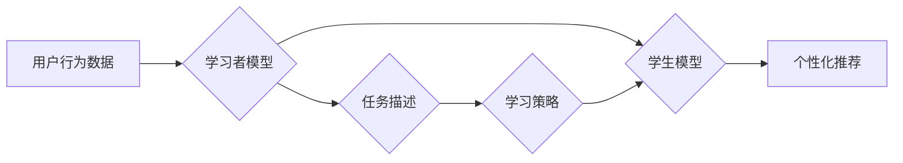

                 

## 基于元学习的快速适应推荐算法

> 关键词：元学习、推荐算法、快速适应、个性化推荐、迁移学习

## 1. 背景介绍

推荐系统作为信息过滤和个性化内容呈现的重要工具，在电商、社交媒体、视频平台等领域发挥着越来越重要的作用。传统的推荐算法通常依赖于大量历史数据进行训练，但随着用户行为的多样性和动态性不断增加，这些算法在面对新用户、新商品或快速变化的市场趋势时往往表现出适应性不足。

元学习（Meta-Learning）作为一种机器学习的新范式，旨在学习如何学习，从而能够快速适应新的任务和环境。它通过训练一个“学习者模型”，使其能够从少量数据中快速学习新的模型，从而克服了传统机器学习算法数据依赖性的问题。

将元学习应用于推荐系统，可以有效提升其快速适应能力，使其能够更灵活地应对用户行为和市场变化。

## 2. 核心概念与联系

### 2.1 元学习的概念

元学习的核心思想是学习如何学习，而不是直接学习特定任务。它通过训练一个“学习者模型”，使其能够从少量数据中快速学习新的模型，从而实现快速适应新任务的能力。

元学习的训练过程可以看作是一个“学习如何学习”的过程，它包含两个阶段：

* **内循环：** 在给定特定任务的数据集上训练一个模型，称为“学生模型”。
* **外循环：** 使用多个任务的数据集训练“学习者模型”，使其能够学习到通用的学习策略，从而能够在新的任务上快速训练出有效的“学生模型”。

### 2.2 元学习与推荐系统的联系

元学习可以应用于推荐系统，帮助其快速适应新用户、新商品或变化的市场趋势。

* **快速适应新用户：** 新用户通常没有历史数据，传统的推荐算法难以对其进行个性化推荐。元学习可以利用已有的用户数据训练一个“学习者模型”，使其能够从少量新用户的行为数据中快速学习出其个性化偏好，从而进行推荐。
* **快速适应新商品：** 新商品的推荐需要大量的用户反馈数据进行训练。元学习可以利用已有的商品数据训练一个“学习者模型”，使其能够从少量新商品的特征数据中快速学习出其潜在的受欢迎程度，从而进行推荐。
* **快速适应变化的市场趋势：** 用户行为和市场趋势不断变化，传统的推荐算法需要重新训练才能适应这些变化。元学习可以利用已有的历史数据训练一个“学习者模型”，使其能够学习到用户行为和市场趋势的演变规律，从而快速适应新的变化。

### 2.3 元学习推荐算法架构



**图 2.1 元学习推荐算法架构**

## 3. 核心算法原理 & 具体操作步骤

### 3.1 算法原理概述

基于元学习的推荐算法的核心思想是利用元学习的“学习如何学习”能力，训练一个“学习者模型”，使其能够从少量数据中快速学习出新的推荐模型。

具体来说，该算法可以分为以下几个步骤：

1. **预训练阶段：** 使用大量的历史用户行为数据预训练一个“学习者模型”，使其能够学习到通用的学习策略。
2. **适应阶段：** 当遇到新的用户、新商品或变化的市场趋势时，使用少量相关数据进行微调，训练一个新的“学生模型”。
3. **推荐阶段：** 使用训练好的“学生模型”进行个性化推荐。

### 3.2 算法步骤详解

1. **数据预处理：** 将用户行为数据进行清洗、转换和特征提取，构建训练数据。
2. **学习者模型训练：** 使用预处理后的数据训练一个“学习者模型”，例如基于强化学习的元学习算法，如MAML（Model-Agnostic Meta-Learning）。
3. **任务描述构建：** 将新的用户、新商品或变化的市场趋势描述为一个任务，并构建相应的任务描述数据。
4. **学生模型训练：** 使用“学习者模型”和任务描述数据进行微调，训练一个新的“学生模型”。
5. **推荐结果输出：** 使用训练好的“学生模型”进行个性化推荐，并根据用户反馈进行模型更新和优化。

### 3.3 算法优缺点

**优点：**

* **快速适应性：** 可以快速适应新的用户、新商品或变化的市场趋势。
* **数据效率：** 可以从少量数据中学习，降低对大量数据训练的需求。
* **泛化能力强：** 可以推广到新的任务和领域。

**缺点：**

* **训练复杂度高：** 元学习算法的训练过程相对复杂，需要更多的计算资源和时间。
* **模型解释性差：** 元学习模型的内部机制相对复杂，难以解释其推荐结果。

### 3.4 算法应用领域

基于元学习的推荐算法可以应用于以下领域：

* **电商推荐：** 个性化商品推荐、新品推荐、跨界推荐等。
* **社交媒体推荐：** 朋友推荐、内容推荐、兴趣推荐等。
* **视频平台推荐：** 视频内容推荐、用户兴趣推荐、个性化播放列表等。
* **新闻推荐：** 个性化新闻推荐、热点新闻推荐、定制化新闻订阅等。

## 4. 数学模型和公式 & 详细讲解 & 举例说明

### 4.1 数学模型构建

元学习推荐算法的核心是学习一个“学习者模型”，该模型能够从少量数据中学习出新的推荐模型。

假设我们有一个包含N个用户和M个商品的推荐系统，每个用户对每个商品都有一个评分。我们的目标是学习一个“学习者模型”，使其能够从少量用户-商品评分数据中学习出新的推荐模型，并对新的用户-商品评分进行预测。

我们可以使用一个神经网络作为“学习者模型”，其输入是用户-商品评分数据，输出是新的推荐模型的参数。

### 4.2 公式推导过程

元学习算法的训练过程可以看作是一个优化问题，目标是找到一个最优的“学习者模型”，使其能够在新的任务上取得最佳的性能。

我们可以使用梯度下降算法来优化“学习者模型”的参数。

梯度下降算法的基本思想是：

1. 计算“学习者模型”在当前参数下的损失函数值。
2. 计算损失函数对“学习者模型”参数的梯度。
3. 根据梯度更新“学习者模型”的参数，使其朝着损失函数值减小的方向移动。

### 4.3 案例分析与讲解

假设我们有一个包含100个用户和100个商品的推荐系统，我们想使用元学习算法来学习一个新的推荐模型。

我们可以将用户-商品评分数据划分为训练集、验证集和测试集。

在训练阶段，我们使用训练集数据来训练“学习者模型”。在验证阶段，我们使用验证集数据来评估“学习者模型”的性能，并根据性能调整模型参数。

在测试阶段，我们使用测试集数据来评估最终训练好的“学习者模型”的性能。

## 5. 项目实践：代码实例和详细解释说明

### 5.1 开发环境搭建

为了实现基于元学习的推荐算法，我们需要搭建一个合适的开发环境。

推荐使用Python语言和相关的机器学习库，例如TensorFlow或PyTorch。

此外，还需要安装一些必要的工具，例如Git、Docker等。

### 5.2 源代码详细实现

以下是一个基于TensorFlow的元学习推荐算法的简单代码示例：

```python
import tensorflow as tf

# 定义学习者模型
class MetaLearner(tf.keras.Model):
    def __init__(self, input_dim, hidden_dim):
        super(MetaLearner, self).__init__()
        self.dense1 = tf.keras.layers.Dense(hidden_dim, activation='relu')
        self.dense2 = tf.keras.layers.Dense(1)

    def call(self, inputs):
        x = self.dense1(inputs)
        return self.dense2(x)

# 定义学生模型
class StudentModel(tf.keras.Model):
    def __init__(self, input_dim, hidden_dim):
        super(StudentModel, self).__init__()
        self.dense1 = tf.keras.layers.Dense(hidden_dim, activation='relu')
        self.dense2 = tf.keras.layers.Dense(1)

    def call(self, inputs):
        x = self.dense1(inputs)
        return self.dense2(x)

# 训练学习者模型
meta_learner = MetaLearner(input_dim=10, hidden_dim=64)
optimizer = tf.keras.optimizers.Adam(learning_rate=0.001)

# 训练循环
for epoch in range(100):
    # 随机选择一些任务数据进行训练
    for task_data in task_datasets:
        # 训练学生模型
        student_model = StudentModel(input_dim=10, hidden_dim=64)
        student_model.compile(optimizer=optimizer, loss='mse')
        student_model.fit(task_data['train'], task_data['train_labels'], epochs=1)

        # 更新学习者模型
        meta_learner.train_on_batch(task_data['train'], task_data['train_labels'])

# 使用训练好的学习者模型进行预测
new_user_data = ...
new_user_predictions = meta_learner.predict(new_user_data)
```

### 5.3 代码解读与分析

这段代码展示了如何使用TensorFlow实现一个简单的基于元学习的推荐算法。

* **MetaLearner类：** 定义了学习者模型，其输入是用户-商品评分数据，输出是新的推荐模型的参数。
* **StudentModel类：** 定义了学生模型，其输入是用户-商品评分数据，输出是新的用户-商品评分预测。
* **训练循环：** 随机选择一些任务数据进行训练，训练学生模型，并根据学生模型的性能更新学习者模型。
* **预测：** 使用训练好的学习者模型对新的用户数据进行预测。

### 5.4 运行结果展示

运行这段代码后，可以得到新的用户-商品评分预测结果。

## 6. 实际应用场景

### 6.1 个性化推荐

基于元学习的推荐算法可以根据用户的历史行为数据，学习用户的个性化偏好，并推荐更符合用户兴趣的商品或内容。

例如，电商平台可以利用元学习算法，根据用户的浏览历史、购买记录、评价等数据，推荐更符合用户需求的商品。

### 6.2 新商品推荐

新商品的推荐需要大量的用户反馈数据进行训练。元学习算法可以利用已有的商品数据，训练一个“学习者模型”，使其能够从少量新商品的特征数据中快速学习出其潜在的受欢迎程度，从而进行推荐。

例如，视频平台可以利用元学习算法，根据新视频的标题、描述、封面等特征数据，预测其潜在的受欢迎程度，并推荐给用户。

### 6.3 动态趋势推荐

用户行为和市场趋势不断变化，传统的推荐算法需要重新训练才能适应这些变化。元学习算法可以利用已有的历史数据，训练一个“学习者模型”，使其能够学习到用户行为和市场趋势的演变规律，从而快速适应新的变化。

例如，新闻平台可以利用元学习算法，根据用户的阅读历史、新闻的主题、时效性等数据，学习到用户兴趣和新闻趋势的变化，并推荐更符合用户需求的新闻。

### 6.4 未来应用展望

随着元学习技术的不断发展，其在推荐系统领域的应用前景十分广阔。

未来，元学习算法可以应用于更复杂的推荐场景，例如：

* **跨领域推荐：** 将不同领域的知识和数据融合，进行跨领域推荐。
* **多模态推荐：** 利用文本、图像、视频等多模态数据进行推荐。
* **个性化解释推荐：** 为用户提供个性化推荐解释，提高用户对推荐结果的理解和信任。

## 7. 工具和资源推荐

### 7.1 学习资源推荐

* **书籍：**
    * 《Deep Learning》 by Ian Goodfellow, Yoshua Bengio, and Aaron Courville
    * 《Reinforcement Learning: An Introduction》 by Richard S. Sutton and Andrew G. Barto
* **在线课程：**
    * Coursera: Machine Learning by Andrew Ng
    * Udacity: Deep Learning Nanodegree
* **博客和网站：**
    * OpenAI Blog
    * DeepMind Blog
    * Towards Data Science

### 7.2 开发工具推荐

* **TensorFlow:** https://www.tensorflow.org/
* **PyTorch:** https://pytorch.org/
* **Keras:** https://keras.io/

### 7.3 相关论文推荐

* **MAML: Model-Agnostic Meta-Learning** by Finn et al. (2017)
* **Prototypical Networks for Few-Shot Learning** by Snell et al. (2017)
* **Matching Networks for One Shot Learning** by Vinyals et al. (2016)

## 8. 总结：未来发展趋势与挑战

### 8.1 研究成果总结

基于元学习的推荐算法取得了显著的成果，能够有效提升推荐系统的快速适应能力，并降低对大量数据训练的需求。

### 8.2 未来发展趋势

未来，基于元学习的推荐算法将朝着以下几个方向发展：

* **更强大的元学习算法：** 研究更有效的元学习算法，提高其学习效率和泛化能力。
* **更复杂的推荐场景：** 将元学习算法应用于更复杂的推荐场景，例如跨领域推荐、多模态推荐等。
* **更个性化的推荐解释：** 为用户提供更个性化、更易理解的推荐解释，提高用户对推荐结果的信任。

### 8.3 面临的挑战

基于元学习的推荐算法也面临一些挑战：

* **训练复杂度高：** 元学习算法的训练过程相对复杂，需要更多的计算资源和时间。
* **模型解释性差：** 元学习模型的内部机制相对复杂，难以解释其推荐结果。
* **数据稀疏性：** 在一些场景下，数据可能存在稀疏性问题，这会影响元学习算法的性能。

### 8.4 研究展望

未来，我们需要继续研究和探索基于元学习的推荐算法，克服其面临的挑战，并将其应用于更广泛的场景，为用户提供更个性化、更智能的推荐体验。

## 9. 附录：常见问题与解答

### 9.1 什么是元学习？

元学习是一种机器学习的新范式，旨在学习如何学习。它通过训练一个“学习者模型”，使其能够从少量数据中快速学习新的模型，从而实现快速适应新任务的能力。

### 9.2 元学习与传统机器学习有什么区别？

传统机器学习算法需要大量的训练数据才能取得较好的性能，而元学习算法可以从少量数据中学习，并快速适应新的任务。

### 9.3 元学习算法有哪些？

常见的元学习算法包括MAML、Prototypical Networks、Matching Networks等。

### 9.4 元学习算法有哪些应用场景？

元学习算法可以应用于推荐系统、图像识别、自然语言处理等多个领域。


作者：禅与计算机程序设计艺术 / Zen and the Art of Computer Programming<end_of_turn>

