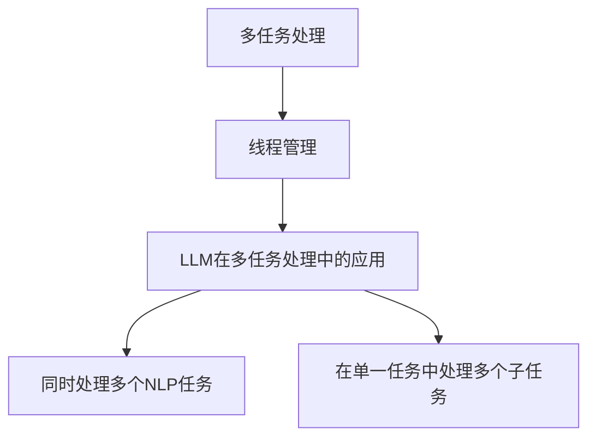

                 

## 1. 背景介绍

在当今的计算机领域，人工智能（AI）和大型语言模型（LLM）已经成为主流。然而，随着任务复杂性的增加，单一线程的处理已不再足够。多任务处理和线程管理变得至关重要。本文将深入探讨LLM在多任务处理中的线程管理，提供清晰的概念、算法原理，并结合实践和数学模型进行解释。

## 2. 核心概念与联系

### 2.1 多任务处理

多任务处理（Multitasking）是指在同一时间内处理多个任务。在计算机系统中，这通常涉及多个线程（threads）或进程（processes）的并发执行。

### 2.2 线程管理

线程管理（Thread Management）是指操作系统或程序在多任务处理环境下对线程的创建、调度、同步和终止等操作。

### 2.3 LLM在多任务处理中的应用

LLM在多任务处理中的应用包括但不限于：同时处理多个NLP任务（如分类、命名实体识别、文本生成等），或在单一任务中处理多个子任务（如在文本生成任务中同时处理上下文理解和语言生成）。



## 3. 核心算法原理 & 具体操作步骤

### 3.1 算法原理概述

在LLM中，线程管理通常基于操作系统提供的线程库（如pthread在Linux上，或std::thread在C++中）实现。LLM可以创建多个线程，每个线程负责一个子任务，并使用同步机制（如互斥锁、条件变量）来协调线程间的通信和数据共享。

### 3.2 算法步骤详解

1. **线程创建**：为每个子任务创建一个线程。
2. **线程调度**：操作系统调度线程执行。
3. **同步机制**：使用互斥锁、条件变量等机制协调线程间的通信和数据共享。
4. **线程终止**：当子任务完成时，终止线程。

### 3.3 算法优缺点

**优点**：提高了任务处理的并发性和效率。

**缺点**：增加了系统的复杂性，并可能导致线程同步问题和资源竞争。

### 3.4 算法应用领域

LLM的线程管理在并行处理、实时系统、分布式系统等领域都有广泛应用。

## 4. 数学模型和公式 & 详细讲解 & 举例说明

### 4.1 数学模型构建

考虑一个包含n个子任务的任务T。每个子任务Ti可以表示为一个函数，其输入为子任务的输入数据Di，输出为子任务的结果Ri。线程管理可以表示为一个函数F，其输入为任务T和线程数m，输出为任务T的结果R。

### 4.2 公式推导过程

F(T, m) = {创建m个线程，每个线程执行Ti(Di) | i = 1,..., n}
          {使用同步机制协调线程间的通信和数据共享}
          {等待所有线程完成}
          {组合所有子任务的结果Ri，得到任务T的结果R}

### 4.3 案例分析与讲解

例如，在文本生成任务中，子任务可以包括上下文理解和语言生成。使用线程管理，这两个子任务可以并发执行，提高任务的整体效率。

## 5. 项目实践：代码实例和详细解释说明

### 5.1 开发环境搭建

本示例使用C++和POSIX线程库。

### 5.2 源代码详细实现

```cpp
#include <pthread.h>
#include <vector>

// 子任务结构体
struct Task {
    // 子任务的输入数据和结果
};

// 线程函数
void* thread_func(void* arg) {
    Task* task = (Task*)arg;
    // 执行子任务，得到结果
    //...
    return NULL;
}

int main() {
    // 创建线程
    std::vector<pthread_t> threads;
    for (int i = 0; i < n; i++) {
        pthread_t tid;
        pthread_create(&tid, NULL, thread_func, &tasks[i]);
        threads.push_back(tid);
    }

    // 等待所有线程完成
    for (int i = 0; i < n; i++) {
        pthread_join(threads[i], NULL);
    }

    return 0;
}
```

### 5.3 代码解读与分析

在main函数中，我们为每个子任务创建一个线程，并等待所有线程完成。

### 5.4 运行结果展示

在多核处理器上运行此代码，可以观察到任务的并发执行。

## 6. 实际应用场景

### 6.1 当前应用

LLM的线程管理已广泛应用于搜索引擎、推荐系统、实时通信等领域。

### 6.2 未来应用展望

随着AI和LLM的发展，线程管理将变得更加重要。未来，LLM可能会在更复杂的任务中使用更多的线程，并需要更高效的线程管理算法。

## 7. 工具和资源推荐

### 7.1 学习资源推荐

- "Operating System Concepts" by Abraham Silberschatz, Peter Baer Galvin, and Greg Gagne
- "Concurrency: State Models & Java Programs" by Jeff Magee and Jeff Kramer

### 7.2 开发工具推荐

- GCC（GNU Compiler Collection）
- Make（build automation tool）
- Valgrind（memory debugging tool）

### 7.3 相关论文推荐

- "Pthreads Programming" by David R. Butenhof
- "Java Concurrency in Practice" by Brian Goetz, Tim Peierls, Joshua Bloch, Joseph Bowbeer, David Holmes, and Doug Lea

## 8. 总结：未来发展趋势与挑战

### 8.1 研究成果总结

本文介绍了LLM在多任务处理中的线程管理，提供了清晰的概念、算法原理，并结合实践和数学模型进行了解释。

### 8.2 未来发展趋势

未来，线程管理将变得更加重要，并需要更高效的算法和工具。

### 8.3 面临的挑战

挑战包括线程同步问题、资源竞争、线程调度等。

### 8.4 研究展望

未来的研究方向包括更高效的线程调度算法、更好的线程同步机制、更广泛的应用领域等。

## 9. 附录：常见问题与解答

**Q：线程管理的目的是什么？**

**A：线程管理的目的是提高任务处理的并发性和效率。**

**Q：线程管理有哪些优缺点？**

**A：优点包括提高了任务处理的并发性和效率。缺点包括增加了系统的复杂性，并可能导致线程同步问题和资源竞争。**

**Q：LLM的线程管理在哪些领域有应用？**

**A：LLM的线程管理在并行处理、实时系统、分布式系统等领域都有广泛应用。**

**Q：线程管理的未来发展趋势是什么？**

**A：未来，线程管理将变得更加重要，并需要更高效的算法和工具。**

**Q：线程管理面临的挑战是什么？**

**A：挑战包括线程同步问题、资源竞争、线程调度等。**

---

作者：禅与计算机程序设计艺术 / Zen and the Art of Computer Programming

