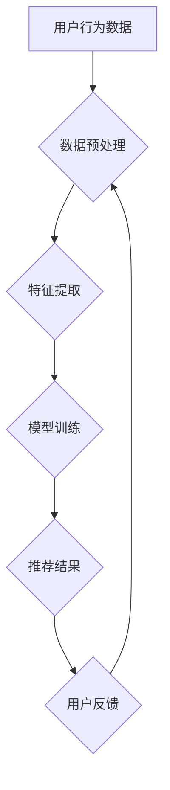

                 

## 大数据时代的电商平台转型：搜索推荐系统是核心，AI 模型融合是关键

> 关键词：电商平台、搜索推荐系统、AI模型融合、大数据、个性化推荐、机器学习、深度学习、自然语言处理

## 1. 背景介绍

随着互联网技术的飞速发展和移动互联网的普及，电商平台已成为人们购物的主要方式之一。然而，随着用户数量的激增和商品种类繁多，电商平台面临着新的挑战：如何有效地帮助用户找到心仪的商品，提升用户体验，并提高平台的商业价值。

传统电商平台主要依靠商品分类和关键词搜索来帮助用户查找商品，但这种方式存在着局限性。一方面，用户搜索习惯多样，关键词搜索难以满足用户的个性化需求；另一方面，商品种类繁多，用户难以从海量商品中找到合适的商品。

大数据时代，电商平台拥有海量用户数据、商品数据和交易数据，这些数据蕴含着丰富的用户行为和商品特征信息。如何有效地挖掘和利用这些数据，为用户提供更精准、更个性化的商品推荐，成为电商平台转型升级的关键。

## 2. 核心概念与联系

**2.1 搜索推荐系统**

搜索推荐系统是电商平台的核心功能之一，它通过分析用户行为、商品特征等数据，为用户提供个性化的商品推荐，帮助用户快速找到心仪的商品。

**2.2 AI 模型融合**

AI 模型融合是指将不同的 AI 模型组合在一起，发挥各自的优势，构建更强大的推荐系统。例如，可以将基于内容的推荐模型、基于协同过滤的推荐模型、基于深度学习的推荐模型等组合在一起，形成一个多模态的推荐系统。

**2.3 大数据**

大数据是指海量、高速度、高多样性的数据。电商平台拥有海量用户数据、商品数据和交易数据，这些数据可以用于训练和优化推荐系统。

**2.4 个性化推荐**

个性化推荐是指根据用户的兴趣、偏好、行为等信息，为用户提供个性化的商品推荐。个性化推荐可以提高用户体验，并提升平台的商业价值。

**2.5 机器学习**

机器学习是人工智能的一种重要分支，它通过算法学习数据，并从中发现规律，从而实现自动化的决策和预测。机器学习算法可以用于训练推荐系统，并不断优化推荐效果。

**2.6 深度学习**

深度学习是机器学习的一种高级形式，它使用多层神经网络来模拟人类大脑的学习过程。深度学习算法可以学习更复杂的特征，并实现更精准的推荐。

**2.7 自然语言处理**

自然语言处理是指计算机理解和处理人类语言的技术。自然语言处理技术可以用于分析用户评论、搜索词等文本数据，并从中提取用户意图和商品特征信息，从而提高推荐系统的精准度。

**2.8 Mermaid 流程图**



## 3. 核心算法原理 & 具体操作步骤

### 3.1 算法原理概述

电商平台的搜索推荐系统通常采用基于内容的推荐、基于协同过滤的推荐和基于深度学习的推荐等多种算法。

* **基于内容的推荐:** 这种方法根据用户的历史浏览记录、购买记录等数据，分析用户的兴趣偏好，并推荐与用户兴趣相符的商品。
* **基于协同过滤的推荐:** 这种方法根据用户的行为相似度，推荐与相似用户购买过的商品。
* **基于深度学习的推荐:** 这种方法使用深度神经网络来学习用户和商品的复杂特征，并进行个性化的推荐。

### 3.2 算法步骤详解

**基于内容的推荐算法步骤:**

1. **数据收集:** 收集用户浏览记录、购买记录、收藏记录等数据。
2. **数据预处理:** 对数据进行清洗、转换、编码等处理。
3. **特征提取:** 从用户和商品数据中提取特征，例如用户年龄、性别、购买历史、商品类别、价格等。
4. **模型训练:** 使用机器学习算法，例如朴素贝叶斯、支持向量机等，训练推荐模型。
5. **推荐结果生成:** 根据用户的特征，预测用户对商品的兴趣，并生成推荐结果。

**基于协同过滤的推荐算法步骤:**

1. **数据收集:** 收集用户行为数据，例如用户对商品的评分、购买记录等。
2. **数据预处理:** 对数据进行清洗、转换、缺失值处理等处理。
3. **相似度计算:** 计算用户之间的相似度或商品之间的相似度。
4. **推荐结果生成:** 根据用户的相似用户或商品的相似商品，生成推荐结果。

**基于深度学习的推荐算法步骤:**

1. **数据收集:** 收集用户行为数据、商品特征数据等。
2. **数据预处理:** 对数据进行清洗、转换、编码等处理。
3. **模型构建:** 使用深度神经网络，例如多层感知机、卷积神经网络等，构建推荐模型。
4. **模型训练:** 使用深度学习算法，例如梯度下降、反向传播等，训练推荐模型。
5. **推荐结果生成:** 根据用户的特征，预测用户对商品的兴趣，并生成推荐结果。

### 3.3 算法优缺点

| 算法类型 | 优点 | 缺点 |
|---|---|---|
| 基于内容的推荐 | 能够根据用户的兴趣偏好进行个性化推荐，推荐结果更精准 | 需要大量的用户数据和商品数据进行训练，对新用户和新商品的推荐效果较差 |
| 基于协同过滤的推荐 | 能够发现用户之间的隐性关系，推荐出用户可能感兴趣但未曾接触过的商品 | 容易受到数据稀疏性的影响，对新用户和新商品的推荐效果较差 |
| 基于深度学习的推荐 | 能够学习用户和商品的复杂特征，推荐效果更精准 | 需要大量的计算资源和数据进行训练，模型训练时间较长 |

### 3.4 算法应用领域

搜索推荐算法广泛应用于电商平台、社交媒体、视频网站、音乐平台等领域，例如：

* **商品推荐:** 为用户推荐相关的商品。
* **内容推荐:** 为用户推荐相关的文章、视频、音乐等内容。
* **广告推荐:** 为用户推荐相关的广告。
* **用户画像:** 建立用户的兴趣画像，用于个性化营销。

## 4. 数学模型和公式 & 详细讲解 & 举例说明

### 4.1 数学模型构建

**协同过滤推荐算法的数学模型:**

假设用户集合为 U，商品集合为 I，用户对商品的评分矩阵为 R，其中 R(u, i) 表示用户 u 对商品 i 的评分。

协同过滤推荐算法的目标是预测用户 u 对商品 i 的评分 R(u, i)。

**基于用户相似度的协同过滤推荐算法:**

1. 计算用户之间的相似度，例如余弦相似度。
2. 找到与用户 u 相似度最高的 k 个用户。
3. 计算这些相似用户对商品 i 的平均评分。
4. 预测用户 u 对商品 i 的评分为这些相似用户对商品 i 的平均评分加权平均。

**基于商品相似度的协同过滤推荐算法:**

1. 计算商品之间的相似度，例如余弦相似度。
2. 找到与商品 i 相似度最高的 k 个商品。
3. 计算这些相似商品的用户对商品 i 的平均评分。
4. 预测用户 u 对商品 i 的评分为这些相似商品的用户对商品 i 的平均评分加权平均。

**基于深度学习的推荐算法的数学模型:**

深度学习推荐算法通常使用多层神经网络，例如多层感知机、卷积神经网络等。

网络的输入层接收用户和商品的特征向量，输出层预测用户对商品的评分或点击概率。

网络的中间层使用激活函数将输入特征进行非线性变换，学习用户和商品之间的复杂关系。

### 4.2 公式推导过程

**余弦相似度公式:**

```latex
sim(u, v) = \frac{u \cdot v}{||u|| ||v||}
```

其中，u 和 v 是两个向量的表示，u · v 是两个向量的点积，||u|| 和 ||v|| 是两个向量的模长。

**基于用户相似度的协同过滤推荐算法的预测公式:**

```latex
\hat{R}(u, i) = \frac{\sum_{v \in N(u)} sim(u, v) * R(v, i)}{\sum_{v \in N(u)} sim(u, v)}
```

其中，N(u) 是与用户 u 相似度最高的 k 个用户的集合。

### 4.3 案例分析与讲解

**案例:**

假设有一个电商平台，用户集合为 U = {u1, u2, u3, u4, u5}，商品集合为 I = {i1, i2, i3, i4, i5}，用户对商品的评分矩阵为 R。

**基于用户相似度的协同过滤推荐算法:**

1. 计算用户之间的相似度，例如余弦相似度。
2. 找到与用户 u1 相似度最高的 2 个用户，即 N(u1) = {u2, u3}。
3. 计算用户 u2 和 u3 对商品 i1 的平均评分，例如 R(u2, i1) + R(u3, i1) / 2。
4. 预测用户 u1 对商品 i1 的评分为这些相似用户对商品 i1 的平均评分加权平均。

**结果:**

预测用户 u1 对商品 i1 的评分为 (R(u2, i1) + R(u3, i1)) / 2。

## 5. 项目实践：代码实例和详细解释说明

### 5.1 开发环境搭建

* **操作系统:** Linux 或 macOS
* **编程语言:** Python
* **深度学习框架:** TensorFlow 或 PyTorch
* **数据处理库:** Pandas
* **机器学习库:** Scikit-learn

### 5.2 源代码详细实现

```python
# 基于协同过滤的推荐算法

import pandas as pd
from sklearn.metrics.pairwise import cosine_similarity

# 加载用户评分数据
ratings = pd.read_csv('ratings.csv')

# 计算用户之间的余弦相似度
user_similarity = cosine_similarity(ratings)

# 找到与用户 u1 相似度最高的 2 个用户
similar_users = user_similarity[0].argsort()[-2:][::-1]

# 计算这些相似用户对商品 i1 的平均评分
average_rating = (ratings.iloc[similar_users, ratings.columns.get_loc('i1')]).mean()

# 预测用户 u1 对商品 i1 的评分
predicted_rating = average_rating

print(f'预测用户 u1 对商品 i1 的评分: {predicted_rating}')
```

### 5.3 代码解读与分析

* **数据加载:** 使用 Pandas 库加载用户评分数据。
* **相似度计算:** 使用 Scikit-learn 库的 `cosine_similarity` 函数计算用户之间的余弦相似度。
* **相似用户查找:** 根据用户相似度矩阵，找到与用户 u1 相似度最高的 2 个用户。
* **平均评分计算:** 计算这些相似用户对商品 i1 的平均评分。
* **评分预测:** 预测用户 u1 对商品 i1 的评分为这些相似用户对商品 i1 的平均评分。

### 5.4 运行结果展示

运行上述代码，可以得到用户 u1 对商品 i1 的预测评分。

## 6. 实际应用场景

**6.1 个性化商品推荐:**

电商平台可以根据用户的浏览历史、购买记录、收藏记录等数据，使用搜索推荐算法为用户推荐个性化的商品。

**6.2 内容推荐:**

视频网站、音乐平台、新闻网站等平台可以根据用户的观看历史、播放记录、点赞记录等数据，使用搜索推荐算法为用户推荐个性化的内容。

**6.3 广告推荐:**

广告平台可以根据用户的兴趣爱好、浏览习惯、购买行为等数据，使用搜索推荐算法为用户推荐个性化的广告。

**6.4 用户画像:**

电商平台可以根据用户的行为数据，使用搜索推荐算法建立用户的兴趣画像，用于个性化营销。

**6.5 未来应用展望:**

随着人工智能技术的不断发展，搜索推荐系统将更加智能化、个性化。

例如，可以利用自然语言处理技术，理解用户的意图和需求，并提供更精准的推荐；可以利用深度学习技术，学习用户和商品之间的复杂关系，并提供更个性化的推荐；可以利用增强现实技术，为用户提供更沉浸式的购物体验。

## 7. 工具和资源推荐

### 7.1 学习资源推荐

* **书籍:**
    * 《推荐系统实践》
    * 《深度学习》
    * 《机器学习》
* **在线课程:**
    * Coursera 上的推荐系统课程
    * edX 上的深度学习课程
    * Udacity 上的机器学习工程师课程

### 7.2 开发工具推荐

* **Python:** 
    * Pandas
    * Scikit-learn
    * TensorFlow
    * PyTorch
* **数据库:**
    * MySQL
    * PostgreSQL
    * MongoDB

### 7.3 相关论文推荐

* **协同过滤推荐算法:**
    * "Collaborative Filtering for Implicit Feedback Datasets"
    * "Matrix Factorization Techniques for Recommender Systems"
* **深度学习推荐算法:**
    * "Deep Learning Recommendations for Personalization"
    * "Neural Collaborative Filtering"

## 8. 总结：未来发展趋势与挑战

### 8.1 研究成果总结

搜索推荐系统已经取得了显著的成果，能够为用户提供个性化的商品推荐，提升用户体验，并提高平台的商业价值。

### 8.2 未来发展趋势

* **更智能化:** 利用自然语言处理、深度学习等技术，理解用户的意图和需求，提供更精准的推荐。
* **更个性化:** 结合用户的多方面数据，例如用户画像、行为数据、偏好数据等，提供更个性化的推荐。
* **更交互式:** 利用增强现实、虚拟现实等技术，为用户提供更沉浸式的购物体验。

### 8.3 面临的挑战

* **数据稀疏性:** 用户行为数据和商品特征数据往往是稀疏的，如何有效地处理数据稀疏性是推荐系统面临的挑战。
* **冷启动问题:** 新用户和新商品的推荐效果较差，如何解决冷启动问题是推荐系统面临的挑战。
* **用户隐私保护:** 用户数据隐私保护是推荐系统面临的重要挑战。

### 8.4 研究展望

未来，搜索推荐系统将朝着更智能化、更个性化、更交互式的方向发展。

研究者将继续探索新的算法、新的技术，以解决推荐系统面临的挑战，为用户提供更优质的推荐服务。

## 9. 附录：常见问题与解答

**Q1: 如何解决数据稀疏性问题？**

**A1:** 

* 使用矩阵分解技术，将用户评分矩阵分解成低维的用户特征向量和商品特征向量。
* 使用协同过滤算法，从用户之间的相似度中挖掘隐性关系。
* 使用深度学习算法，学习用户和商品之间的复杂特征。

**Q2: 如何解决冷启动问题？**

**A2:** 

* 利用用户提供的基本信息，例如用户年龄、性别、兴趣爱好等，进行初始推荐。
* 利用商品的类别、描述、属性等信息，进行初始推荐。
* 利用其他平台的用户数据，进行跨平台推荐。

**Q3: 如何保护用户隐私？**

**A3:** 

* 使用差分隐私技术，对用户数据进行匿名化处理。
* 使用联邦学习技术，在不共享用户数据的情况下，训练推荐模型。
* 获得用户的明确同意，才能使用用户的个人信息进行推荐。


作者：禅与计算机程序设计艺术 / Zen and the Art of Computer Programming<end_of_turn>

