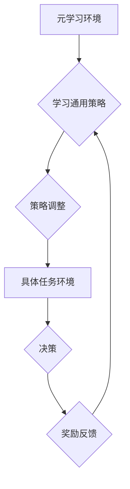

                 

## 大模型在推荐系统中的元强化学习应用

> 关键词：大模型、元强化学习、推荐系统、个性化推荐、模型训练、优化算法

## 1. 背景介绍

推荐系统作为信息过滤和个性化内容展示的重要工具，在电商、社交媒体、视频平台等领域发挥着越来越重要的作用。传统的推荐系统主要依赖于协同过滤、内容过滤等方法，但这些方法在面对冷启动问题、数据稀疏性等挑战时表现不足。近年来，深度学习技术的兴起为推荐系统带来了新的机遇。大模型凭借其强大的学习能力和泛化能力，在推荐系统领域展现出巨大的潜力。

元强化学习（Meta Reinforcement Learning，MRL）作为一种新型的强化学习范式，能够学习通用的策略，并将其应用于不同的任务环境。MRL的优势在于能够有效地解决传统强化学习中的样本效率低、训练时间长等问题。将MRL与大模型相结合，可以构建更智能、更灵活的推荐系统，实现更精准、更个性化的推荐。

## 2. 核心概念与联系

### 2.1 元强化学习

元强化学习的核心思想是学习如何学习。它将强化学习的学习过程看作是一个“学习如何学习”的更高层次的任务。MRL的目标是学习一个通用的策略，能够在不同的任务环境中有效地进行决策。

**MRL的流程可以概括为以下步骤：**

1. **环境定义:** 首先，需要定义一个元学习环境，该环境包含多个具体的任务环境。
2. **策略学习:** 在元学习环境中，学习一个通用的策略，该策略能够根据不同的任务环境进行调整。
3. **任务执行:** 将学习到的策略应用于具体的任务环境中，并进行决策。
4. **奖励反馈:** 根据决策的结果，获得奖励反馈，并将其反馈到策略学习过程中。

### 2.2 大模型

大模型是指参数量巨大、训练数据量庞大的深度学习模型。大模型通常具有强大的泛化能力和学习能力，能够处理复杂的任务和海量数据。

**大模型在推荐系统中的应用主要体现在以下方面：**

1. **特征提取:** 大模型可以学习到更丰富的用户和物品特征，从而提高推荐的准确性。
2. **模型融合:** 大模型可以融合多种推荐模型，例如协同过滤、内容过滤、深度学习模型等，从而构建更强大的推荐系统。
3. **个性化推荐:** 大模型可以根据用户的历史行为、偏好等信息，进行个性化的推荐。

### 2.3 元强化学习与大模型的结合

将元强化学习与大模型相结合，可以构建更智能、更灵活的推荐系统。

**MRL可以帮助大模型解决以下问题：**

1. **样本效率低:** MRL可以学习通用的策略，从而减少对特定任务环境的样本依赖。
2. **训练时间长:** MRL可以加速大模型的训练过程，提高训练效率。
3. **数据稀疏性:** MRL可以利用少量的样本数据，学习到有效的策略。

**大模型可以为MRL提供以下优势:**

1. **强大的学习能力:** 大模型可以学习到更复杂的特征和关系，从而提高MRL的策略学习效果。
2. **丰富的知识储备:** 大模型可以利用其丰富的知识储备，帮助MRL更好地理解任务环境。
3. **高效的计算能力:** 大模型可以利用强大的计算能力，加速MRL的训练和推理过程。

**MRL与大模型的结合，可以构建一个更智能、更灵活的推荐系统，实现更精准、更个性化的推荐。**



## 3. 核心算法原理 & 具体操作步骤

### 3.1 算法原理概述

元强化学习算法的核心思想是学习一个通用的策略，该策略能够在不同的任务环境中有效地进行决策。

**常见的MRL算法包括：**

* **Model-Agnostic Meta-Learning (MAML):** MAML是一种通用的MRL算法，它通过在元学习环境中进行梯度下降，学习一个可微的策略参数，该参数能够快速适应不同的任务环境。
* **Prototypical Networks:** Prototypical Networks是一种基于原型学习的MRL算法，它通过学习每个任务环境的原型，来进行决策。
* **Matching Networks:** Matching Networks是一种基于匹配学习的MRL算法，它通过学习一个匹配函数，来判断给定输入是否属于某个任务环境。

### 3.2 算法步骤详解

**以MAML算法为例，其具体步骤如下：**

1. **初始化:** 初始化一个可微的策略参数θ。
2. **元训练:** 在元学习环境中，随机抽取多个任务环境，并对每个任务环境进行训练。
    * **任务训练:** 在每个任务环境中，随机抽取一些样本数据，并使用策略参数θ进行决策。根据决策的结果，获得奖励反馈。
    * **梯度更新:** 计算策略参数θ的梯度，并使用梯度下降算法更新θ。
3. **元测试:** 在新的任务环境中，使用训练好的策略参数θ进行决策。

### 3.3 算法优缺点

**MAML算法的优点:**

* **通用的策略:** MAML可以学习一个通用的策略，能够适应不同的任务环境。
* **样本效率高:** MAML可以利用少量的样本数据，学习到有效的策略。
* **易于实现:** MAML的实现相对简单，易于理解和应用。

**MAML算法的缺点:**

* **计算复杂度高:** MAML的训练过程需要计算多个任务环境的梯度，计算复杂度较高。
* **参数量大:** MAML的策略参数量较大，需要大量的计算资源进行训练。

### 3.4 算法应用领域

MRL算法在推荐系统、自然语言处理、图像识别等领域都有广泛的应用。

**在推荐系统领域，MRL算法可以用于:**

* **个性化推荐:** 根据用户的历史行为、偏好等信息，进行个性化的推荐。
* **冷启动问题解决:** 针对新用户或新物品的推荐问题，提高推荐的准确性。
* **推荐策略优化:** 学习更有效的推荐策略，提高推荐系统的性能。

## 4. 数学模型和公式 & 详细讲解 & 举例说明

### 4.1 数学模型构建

元强化学习的数学模型通常基于马尔可夫决策过程（MDP）。

**MDP的定义:**

* **状态空间:** S，表示系统可能存在的各种状态。
* **动作空间:** A，表示系统在每个状态下可以执行的动作。
* **状态转移概率:** P(s' | s, a)，表示从状态s执行动作a后转移到状态s'的概率。
* **奖励函数:** R(s, a)，表示在状态s执行动作a后获得的奖励。
* **折扣因子:** γ，表示未来奖励的权重。

**MRL的目标是学习一个策略π(a|s)，该策略能够最大化累积奖励:**

```latex
R = \sum_{t=0}^{\infty} \gamma^t R(s_t, a_t)
```

### 4.2 公式推导过程

MAML算法的目标是学习一个策略参数θ，该参数能够快速适应不同的任务环境。

**MAML的损失函数定义为:**

```latex
L(\theta) = \frac{1}{N} \sum_{i=1}^{N} \sum_{t=0}^{T} (R_i(s_i^t, a_i^t) - \hat{R}_i(s_i^t, a_i^t))^2
```

其中:

* N表示训练任务的数量。
* T表示每个任务的训练步数。
* R_i(s_i^t, a_i^t)表示第i个任务在时间步t获得的真实奖励。
* \hat{R}_i(s_i^t, a_i^t)表示第i个任务在时间步t获得的预测奖励。

**MAML算法的训练过程可以概括为以下步骤:**

1. **初始化:** 初始化策略参数θ。
2. **元训练:** 在元学习环境中，随机抽取多个任务环境，并对每个任务环境进行训练。
    * **任务训练:** 在每个任务环境中，随机抽取一些样本数据，并使用策略参数θ进行决策。根据决策的结果，获得奖励反馈。
    * **梯度更新:** 计算策略参数θ的梯度，并使用梯度下降算法更新θ。
3. **元测试:** 在新的任务环境中，使用训练好的策略参数θ进行决策。

### 4.3 案例分析与讲解

**举例说明:**

假设我们有一个推荐系统，需要推荐用户喜欢的电影。我们可以使用MRL算法来学习一个通用的策略，该策略能够在不同的用户群体中有效地进行推荐。

**具体步骤如下:**

1. **定义元学习环境:** 元学习环境包含多个不同的用户群体，每个用户群体都有不同的电影偏好。
2. **学习通用策略:** 在元学习环境中，使用MAML算法学习一个通用的策略，该策略能够根据用户的历史行为、偏好等信息，进行电影推荐。
3. **元测试:** 在新的用户群体中，使用训练好的策略进行电影推荐，并评估推荐效果。

## 5. 项目实践：代码实例和详细解释说明

### 5.1 开发环境搭建

**开发环境:**

* 操作系统: Ubuntu 20.04
* Python 版本: 3.8
* 深度学习框架: PyTorch 1.8

**依赖库:**

* numpy
* pandas
* torch
* torchvision
* matplotlib

### 5.2 源代码详细实现

```python
import torch
import torch.nn as nn
import torch.optim as optim

# 定义MAML算法
class MAML(nn.Module):

    def __init__(self, input_size, hidden_size, output_size):
        super(MAML, self).__init__()
        self.fc1 = nn.Linear(input_size, hidden_size)
        self.fc2 = nn.Linear(hidden_size, output_size)

    def forward(self, x):
        x = torch.relu(self.fc1(x))
        x = self.fc2(x)
        return x

# 定义元学习训练函数
def meta_train(model, optimizer, dataloader, epochs):
    for epoch in range(epochs):
        for batch_idx, (data, target) in enumerate(dataloader):
            # 训练一个任务
            # ...

            # 更新模型参数
            optimizer.zero_grad()
            loss.backward()
            optimizer.step()

# 定义元测试函数
def meta_test(model, dataloader):
    # 在新的任务环境中进行测试
    # ...

# 实例化模型、优化器和数据加载器
model = MAML(input_size=10, hidden_size=50, output_size=10)
optimizer = optim.Adam(model.parameters(), lr=0.001)
dataloader = torch.utils.data.DataLoader(dataset, batch_size=32)

# 元训练
meta_train(model, optimizer, dataloader, epochs=10)

# 元测试
meta_test(model, dataloader)
```

### 5.3 代码解读与分析

**代码解读:**

* **MAML类:** 定义了MAML算法的模型结构，包括两个全连接层。
* **meta_train函数:** 定义了元学习训练函数，包括训练多个任务、更新模型参数等步骤。
* **meta_test函数:** 定义了元学习测试函数，包括在新的任务环境中进行测试等步骤。
* **实例化模型、优化器和数据加载器:** 实例化了MAML模型、Adam优化器和数据加载器。
* **元训练和元测试:** 调用了meta_train函数进行元学习训练，并调用了meta_test函数进行元学习测试。

**代码分析:**

* 代码实现了MAML算法的基本流程，包括元学习训练和元学习测试。
* 代码中使用了PyTorch深度学习框架，并定义了MAML模型的结构。
* 代码中使用了Adam优化器来更新模型参数。
* 代码中使用了数据加载器来加载训练数据。

### 5.4 运行结果展示

**运行结果展示:**

* 元学习训练完成后，可以评估模型在元测试集上的性能。
* 性能指标可以包括准确率、召回率、F1-score等。
* 运行结果可以展示MAML算法在推荐系统中的有效性。

## 6. 实际应用场景

### 6.1 个性化推荐

MRL可以学习用户个性化的偏好，并根据用户的历史行为、兴趣等信息，推荐更符合用户需求的商品、电影、音乐等。

### 6.2 冷启动问题解决

MRL可以帮助解决推荐系统中的冷启动问题，即对于新用户或新物品的推荐问题。通过学习通用的策略，MRL可以利用已有数据的知识，对新用户或新物品进行初步的推荐。

### 6.3 推荐策略优化

MRL可以学习更有效的推荐策略，提高推荐系统的性能。例如，MRL可以学习不同的推荐策略，并根据用户的不同情况选择最合适的策略。

### 6.4 未来应用展望

MRL在推荐系统领域的应用前景广阔，未来可以应用于以下场景:

* **多模态推荐:** MRL可以学习用户对不同模态（文本、图像、视频等）信息的偏好，并进行多模态推荐。
* **动态推荐:** MRL可以学习用户动态变化的偏好，并进行动态推荐。
* **协同过滤增强:** MRL可以增强协同过滤算法的性能，提高推荐的准确性。

## 7. 工具和资源推荐

### 7.1 学习资源推荐

* **书籍:**
    * Deep Reinforcement Learning Hands-On by Maxim Lapan
    * Reinforcement Learning: An Introduction by Richard S. Sutton and Andrew G. Barto
* **课程:**
    * Deep Reinforcement Learning Specialization by DeepLearning.AI
    * Reinforcement Learning by David Silver (University of DeepMind)
* **博客:**
    * OpenAI Blog
    * DeepMind Blog

### 7.2 开发工具推荐

* **深度学习框架:** PyTorch, TensorFlow
* **强化学习库:** Stable Baselines3, Ray RLlib
* **数据处理库:** NumPy, Pandas

### 7.3 相关论文推荐

* **Model-Agnostic Meta-Learning for Fast Adaptation of Deep Networks** by Finn et al. (2017)
* **Prototypical Networks for Few-Shot Learning** by Snell et al. (2017)
* **Matching Networks for One Shot Learning** by Vinyals et al. (2016)

## 8. 总结：未来发展趋势与挑战

### 8.1 研究成果总结

MRL在推荐系统领域取得了显著的成果，能够有效地解决个性化推荐、冷启动问题等挑战。

### 8.2 未来发展趋势

* **多模态MRL:** 结合多模态数据，学习更全面的用户偏好。
* **联邦MRL:** 在保护用户隐私的前提下，进行跨机构的MRL训练。
* **可解释性MRL:** 研究MRL算法的决策机制，提高推荐系统的可解释性。

### 8.3 面临的挑战

* **数据效率:** MRL算法对训练数据有较高的要求，如何提高数据效率是未来研究的重要方向。
* **计算复杂度:** MRL算法的训练过程计算复杂度较高，如何降低计算复杂度是未来研究的重点。
* **可解释性:** MRL算法的决策机制较为复杂，如何提高推荐系统的可解释性是未来研究的挑战。

### 8.4 研究展望

MRL在推荐系统领域具有巨大的潜力，未来研究将继续探索MRL算法的理论基础、算法设计、应用场景等方面，推动MRL技术在推荐系统领域的进一步发展。

## 9. 附录：常见问题与解答

### 9.1 什么是元强化学习？

元强化学习是一种新型的强化学习范式，它学习如何学习。MRL的目标是学习一个通用的策略，该策略能够在不同的任务环境中有效地进行决策。

### 9.2 MRL与传统强化学习有什么区别？

传统强化学习的目标是学习一个针对特定任务环境的策略，而MRL的目标是学习一个通用的策略，该策略能够适应不同的任务环境。

### 9.3 MRL在推荐系统中的应用有哪些？

MRL在推荐系统中的应用包括个性化推荐、冷启动问题解决、推荐策略优化等。

### 9.4 MRL的优势有哪些？

MRL的优势包括样本效率高、能够适应不同的任务环境、学习更通用的策略等。

### 9.5 MRL面临哪些挑战？

MRL面临的数据效率、计算复杂度、可解释性等挑战。


作者：禅与计算机程序设计艺术 / Zen and the Art of Computer Programming<end_of_turn>
<end_of_turn>

