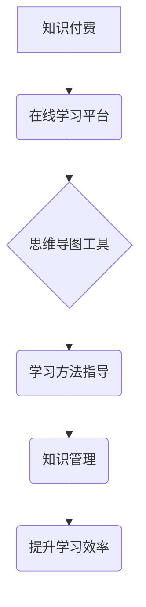

                 

## 如何利用知识付费实现在线思维导图与学习方法指导？

> 关键词：知识付费、思维导图、在线学习、学习方法、知识管理、信息架构、知识图谱、可视化学习

## 1. 背景介绍

在当今信息爆炸的时代，高效地获取、存储和利用知识已成为个人和组织发展的重要驱动力。传统学习模式面临着信息过载、学习效率低下等挑战。而思维导图作为一种直观、高效的知识组织和学习工具，逐渐受到越来越多的关注。

知识付费作为一种新型的商业模式，通过提供优质的知识产权和服务，满足用户对知识的需求。在线思维导图与学习方法指导，将知识付费与思维导图的优势相结合，为用户提供了一种全新的学习体验。

## 2. 核心概念与联系

**2.1 思维导图**

思维导图是一种以中心主题为核心的放射状图，通过分支、关键词、图像等元素，将知识点以层次结构的方式进行组织和连接。它能够帮助用户：

* **清晰地理解知识结构:** 通过层次结构和分支，将复杂的信息分解成易于理解的片段。
* **加强记忆:** 将知识点与图像、关键词等元素关联，提高记忆效率。
* **促进创意思考:** 通过自由地连接和扩展分支，激发新的想法和灵感。

**2.2 在线学习**

在线学习是指利用互联网技术，通过网络平台提供学习资源和服务，实现远程教育的一种模式。它具有以下特点：

* **时间和地点的灵活性:** 用户可以根据自己的时间安排和学习需求，随时随地进行学习。
* **丰富的学习资源:** 在线学习平台提供各种类型的学习资源，包括视频课程、文本资料、互动练习等。
* **个性化的学习体验:** 在线学习平台可以根据用户的学习进度和需求，提供个性化的学习建议和辅导。

**2.3 知识付费**

知识付费是指通过提供优质的知识产权和服务，向用户收取费用的一种商业模式。它可以帮助知识创作者：

* **获得收益:** 通过知识付费，知识创作者可以获得稳定的收入来源。
* **提升品牌影响力:** 提供优质的知识内容，可以提升知识创作者的品牌影响力和知名度。
* **建立用户粘性:** 通过提供持续更新的知识内容和服务，可以建立用户粘性，形成稳定的用户群体。

**2.4 核心概念联系**

在线思维导图与学习方法指导，将上述三个核心概念有机结合，形成一个完整的知识体系。



## 3. 核心算法原理 & 具体操作步骤

**3.1 算法原理概述**

在线思维导图与学习方法指导的核心算法原理是基于知识图谱和信息架构的构建。

* **知识图谱:** 将知识点以节点和关系的形式表示，构建一个知识网络。
* **信息架构:** 根据用户学习需求和知识结构，对知识点进行分类、组织和排序，构建一个清晰、易懂的信息体系。

**3.2 算法步骤详解**

1. **知识点提取:** 从学习资源中提取关键知识点，并进行分类和标签化。
2. **知识关系建模:** 根据知识点之间的逻辑关系，构建知识图谱。
3. **信息架构设计:** 根据用户学习需求和知识结构，设计一个合理的知识体系结构。
4. **思维导图生成:** 将知识点和关系信息转化为思维导图，并提供交互式操作功能。
5. **学习方法指导:** 根据用户学习进度和知识掌握情况，提供个性化的学习建议和辅导。

**3.3 算法优缺点**

* **优点:**
    * **直观易懂:** 思维导图能够直观地展示知识结构，帮助用户理解和记忆知识。
    * **个性化学习:** 根据用户学习需求和知识掌握情况，提供个性化的学习建议和辅导。
    * **高效学习:** 通过知识图谱和信息架构的构建，提高学习效率。
* **缺点:**
    * **知识点提取难度:** 从海量学习资源中提取关键知识点，并进行分类和标签化，是一项复杂的任务。
    * **知识关系建模复杂:** 建立准确的知识关系模型，需要对知识领域有深入的理解。
    * **算法迭代优化:** 算法需要不断迭代优化，才能更好地满足用户的学习需求。

**3.4 算法应用领域**

在线思维导图与学习方法指导的算法应用领域广泛，包括：

* **教育培训:** 为学生提供个性化的学习指导和辅导。
* **企业培训:** 为员工提供专业技能培训和知识更新。
* **个人学习:** 为个人提供高效的学习方法和知识管理工具。

## 4. 数学模型和公式 & 详细讲解 & 举例说明

**4.1 数学模型构建**

在线思维导图与学习方法指导的数学模型可以基于图论和信息检索理论构建。

* **图论:** 将知识点和关系信息表示为图结构，可以使用图论算法进行知识挖掘和分析。
* **信息检索理论:** 利用信息检索算法，根据用户的查询需求，从知识图谱中检索相关知识点。

**4.2 公式推导过程**

* **知识相似度计算:** 可以使用余弦相似度等算法，计算知识点之间的相似度。
* **知识推荐算法:** 可以使用协同过滤等算法，推荐用户可能感兴趣的知识点。

**4.3 案例分析与讲解**

假设有一个关于编程的知识图谱，包含了编程语言、编程概念、编程技巧等知识点。

* **知识相似度计算:** 可以计算 Python 和 Java 编程语言之间的相似度，因为它们都是面向对象的编程语言。
* **知识推荐算法:** 如果用户对 Python 编程语言感兴趣，可以推荐用户学习 Python 的相关概念和技巧。

## 5. 项目实践：代码实例和详细解释说明

**5.1 开发环境搭建**

* **编程语言:** Python
* **框架:** Flask 或 Django
* **数据库:** MongoDB 或 PostgreSQL
* **思维导图工具:** Mermaid 或 Graphviz

**5.2 源代码详细实现**

```python
# 使用 Flask 框架构建在线思维导图平台

from flask import Flask, render_template, request

app = Flask(__name__)

@app.route('/')
def index():
    return render_template('index.html')

@app.route('/create_mindmap', methods=['POST'])
def create_mindmap():
    # 从前端获取思维导图数据
    mindmap_data = request.form.get('mindmap_data')
    # 将思维导图数据存储到数据库
    # ...
    return 'Mindmap created successfully!'

if __name__ == '__main__':
    app.run(debug=True)
```

**5.3 代码解读与分析**

* **index.html:** 负责展示用户界面，包括思维导图编辑器和学习方法指导模块。
* **create_mindmap():** 处理用户创建思维导图的请求，将思维导图数据存储到数据库。

**5.4 运行结果展示**

运行上述代码，可以启动一个简单的在线思维导图平台。用户可以通过网页界面创建和编辑思维导图，并获得学习方法指导。

## 6. 实际应用场景

**6.1 教育培训**

在线思维导图与学习方法指导可以应用于各种教育培训场景，例如：

* **大学课程:** 学生可以利用思维导图整理课程笔记，并根据学习进度获得个性化的学习建议。
* **职业技能培训:** 员工可以利用思维导图学习新的技能，并通过练习和评估来巩固知识。

**6.2 企业知识管理**

在线思维导图与学习方法指导可以帮助企业构建知识库，并提高知识共享和利用效率。

* **产品开发:** 团队成员可以利用思维导图进行产品设计和需求分析，并共享知识和经验。
* **项目管理:** 项目经理可以利用思维导图规划项目进度和任务分配，并跟踪项目进展。

**6.3 个人学习**

在线思维导图与学习方法指导可以帮助个人高效地学习和管理知识。

* **读书笔记:** 个人可以利用思维导图整理读书笔记，并进行知识提取和总结。
* **技能提升:** 个人可以利用思维导图学习新的技能，并跟踪学习进度和成果。

**6.4 未来应用展望**

随着人工智能技术的不断发展，在线思维导图与学习方法指导将拥有更广阔的应用前景。

* **智能化学习建议:** 基于用户学习行为和知识掌握情况，提供更精准的学习建议。
* **个性化学习路径:** 根据用户的学习目标和兴趣，构建个性化的学习路径。
* **沉浸式学习体验:** 利用虚拟现实和增强现实技术，打造沉浸式的学习体验。

## 7. 工具和资源推荐

**7.1 学习资源推荐**

* **思维导图工具:** XMind, MindManager, FreeMind
* **在线学习平台:** Coursera, edX, Udemy
* **知识管理工具:** Notion, Evernote, Obsidian

**7.2 开发工具推荐**

* **编程语言:** Python, JavaScript
* **框架:** Flask, Django, React
* **数据库:** MongoDB, PostgreSQL

**7.3 相关论文推荐**

* **Mind Mapping for Learning:** A Systematic Review
* **The Impact of Mind Mapping on Learning and Memory**
* **Knowledge Graph Embedding for Recommender Systems**

## 8. 总结：未来发展趋势与挑战

**8.1 研究成果总结**

在线思维导图与学习方法指导的研究成果表明，它是一种有效的学习工具和方法，能够提高学习效率和知识掌握程度。

**8.2 未来发展趋势**

未来，在线思维导图与学习方法指导将朝着以下方向发展：

* **智能化:** 利用人工智能技术，提供更智能化的学习建议和个性化学习路径。
* **沉浸式:** 利用虚拟现实和增强现实技术，打造更沉浸式的学习体验。
* **协作:** 支持多人协同创作和学习，促进知识共享和共同学习。

**8.3 面临的挑战**

在线思维导图与学习方法指导也面临着一些挑战：

* **知识点提取和关系建模的复杂性:** 从海量学习资源中提取关键知识点，并建立准确的知识关系模型，是一项技术难题。
* **算法迭代优化:** 算法需要不断迭代优化，才能更好地满足用户的学习需求。
* **数据隐私和安全:** 在线学习平台需要保障用户数据隐私和安全。

**8.4 研究展望**

未来，我们将继续深入研究在线思维导图与学习方法指导，探索更智能、更个性化、更沉浸式的学习体验。


## 9. 附录：常见问题与解答

**9.1 如何创建思维导图？**

可以使用思维导图工具，例如 XMind, MindManager, FreeMind 等，创建思维导图。

**9.2 如何获得学习方法指导？**

在线思维导图平台会根据用户的学习进度和知识掌握情况，提供个性化的学习建议和辅导。

**9.3 在线思维导图与学习方法指导的收费标准？**

不同的在线平台和服务提供商，收费标准会有所不同。

**9.4 在线思维导图与学习方法指导的安全性？**

正规的在线平台会采取相应的安全措施，保障用户数据隐私和安全。


作者：禅与计算机程序设计艺术 / Zen and the Art of Computer Programming 
<end_of_turn>

