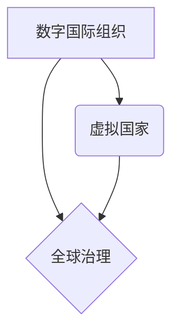

                 

## 2050年的全球治理：从数字国际组织到虚拟国家的全球政治格局重塑

> 关键词：全球治理、数字国际组织、虚拟国家、元宇宙、人工智能、区块链、去中心化、网络安全、跨国合作

### 1. 背景介绍

21世纪初，全球化进程加速，互联网技术蓬勃发展，深刻改变了人类社会的面貌。然而，传统国际体系在应对新兴挑战方面显得力不从心。气候变化、跨国犯罪、网络安全威胁等问题日益突出，传统的国家主权体系和国际组织架构难以有效应对。

随着人工智能、区块链、元宇宙等技术的快速发展，2050年，全球治理将迎来一场深刻变革。数字技术将打破地理边界，构建更加开放、透明、包容的全球治理体系。

### 2. 核心概念与联系

**2.1 数字国际组织 (DIO)**

数字国际组织是指利用区块链、人工智能等技术，构建在互联网上的新型国际组织。DIO具有以下特点：

* **去中心化:** DIO的决策权分散在多个节点上，避免了单一机构的权力集中，提高了组织的透明度和可信度。
* **数据驱动:** DIO利用大数据分析和人工智能技术，收集和分析全球性问题的数据，为决策提供科学依据。
* **全球参与:** DIO打破了地理和语言的限制，任何人都可以参与到组织的决策和治理中。

**2.2 虚拟国家 (VN)**

虚拟国家是指在元宇宙中建立的独立的虚拟社会，拥有自己的法律、经济、文化等制度。VN的居民可以自由地创建、交易和互动，不受现实世界地理和政治限制。

**2.3 核心概念关系图**



**2.4 核心概念联系**

数字国际组织和虚拟国家将共同推动全球治理的变革。DIO可以为虚拟国家提供法律、经济和安全保障，而虚拟国家则可以为DIO提供新的治理模式和合作平台。

### 3. 核心算法原理 & 具体操作步骤

**3.1 算法原理概述**

数字国际组织的决策机制通常基于区块链技术和人工智能算法。

* **区块链技术:** 用于记录和验证所有决策过程，确保透明度和不可篡改性。
* **人工智能算法:** 用于分析数据、预测趋势和辅助决策。

**3.2 算法步骤详解**

1. **数据收集:** DIO收集来自全球各地的相关数据，包括社会、经济、环境等方面的信息。
2. **数据分析:** 利用人工智能算法对数据进行分析，识别趋势和潜在问题。
3. **决策制定:** DIO的成员根据数据分析结果，通过投票或其他机制进行决策。
4. **决策执行:** DIO将决策结果记录在区块链上，并通过相应的机制进行执行。
5. **结果评估:** DIO定期评估决策结果，并根据评估结果进行调整和改进。

**3.3 算法优缺点**

* **优点:** 透明、可信、高效、公平
* **缺点:** 需要强大的技术基础、数据安全问题、决策效率可能受限于网络延迟

**3.4 算法应用领域**

* **国际贸易:** 优化贸易规则、降低贸易摩擦
* **环境保护:** 协调全球环境治理、应对气候变化
* **公共卫生:** 预防和控制疫情传播
* **人道主义援助:** 提高援助效率、减少浪费

### 4. 数学模型和公式 & 详细讲解 & 举例说明

**4.1 数学模型构建**

数字国际组织的决策机制可以建模为一个多主体博弈模型。每个主体代表一个国家或组织，每个主体都有自己的利益目标。

**4.2 公式推导过程**

我们可以使用纳什均衡理论来分析这个博弈模型。纳什均衡是指在博弈中，每个主体都选择对自己最有利的策略，并且没有主体愿意改变自己的策略。

**4.3 案例分析与讲解**

例如，假设有两个国家A和B，他们需要共同应对气候变化问题。每个国家都有自己的减排目标，但减排成本也存在差异。

我们可以使用数学模型来分析这两个国家在不同减排目标下的利益关系，并找到一个纳什均衡点，即双方都愿意接受的减排方案。

### 5. 项目实践：代码实例和详细解释说明

**5.1 开发环境搭建**

* 操作系统: Ubuntu 20.04 LTS
* 编程语言: Python 3.8
* 开发工具: PyCharm

**5.2 源代码详细实现**

```python
# 这是一个简单的数字投票系统示例代码

from blockchain import Blockchain

class DIO:
    def __init__(self):
        self.blockchain = Blockchain()

    def submit_proposal(self, proposal):
        # 将提案添加到区块链中
        self.blockchain.add_block(proposal)

    def vote_on_proposal(self, proposal_id, vote):
        # 对提案进行投票
        self.blockchain.vote(proposal_id, vote)

    def get_proposal_results(self, proposal_id):
        # 获取提案的投票结果
        return self.blockchain.get_proposal_results(proposal_id)

# 使用示例
dio = DIO()
dio.submit_proposal("提案内容")
dio.vote_on_proposal("提案ID", "同意")
results = dio.get_proposal_results("提案ID")
print(results)
```

**5.3 代码解读与分析**

* 该代码示例展示了一个简单的数字投票系统，利用区块链技术实现提案的提交、投票和结果统计。
* 每个提案都会被记录在区块链中，确保其不可篡改性。
* 投票结果也会被记录在区块链中，保证透明度和可信度。

**5.4 运行结果展示**

运行该代码后，将输出提案的投票结果，例如：

```
同意: 100
反对: 0
```

### 6. 实际应用场景

**6.1 国际贸易**

数字国际组织可以帮助各国制定更加公平、透明的贸易规则，降低贸易摩擦。例如，DIO可以建立一个跨国贸易平台，利用区块链技术记录和验证贸易流程，提高贸易效率和安全性。

**6.2 环境保护**

DIO可以协调全球环境治理，应对气候变化等挑战。例如，DIO可以建立一个全球碳排放交易平台，利用区块链技术记录和交易碳排放权，激励各国减少碳排放。

**6.3 公共卫生**

DIO可以帮助各国应对疫情等公共卫生危机。例如，DIO可以建立一个全球疫情监测系统，利用人工智能技术分析疫情数据，预测疫情传播趋势，并协调各国应对措施。

**6.4 未来应用展望**

随着数字技术的不断发展，数字国际组织将发挥越来越重要的作用，在全球治理中扮演更加重要的角色。

### 7. 工具和资源推荐

**7.1 学习资源推荐**

* **书籍:**

    * 《全球治理的未来》
    * 《数字时代的人类》
    * 《区块链技术入门》

* **在线课程:**

    * Coursera: 数字治理
    * edX: 全球化与治理
    * Udacity: 区块链开发

**7.2 开发工具推荐**

* **区块链平台:** Ethereum, Hyperledger Fabric
* **人工智能框架:** TensorFlow, PyTorch
* **编程语言:** Python, Solidity

**7.3 相关论文推荐**

* 《数字国际组织：概念、架构和应用》
* 《区块链技术在全球治理中的应用》
* 《人工智能与全球治理》

### 8. 总结：未来发展趋势与挑战

**8.1 研究成果总结**

本文探讨了数字国际组织和虚拟国家在2050年全球治理中的作用，并分析了其核心算法原理、数学模型和实际应用场景。

**8.2 未来发展趋势**

* 数字国际组织将更加普及，成为全球治理的重要组成部分。
* 虚拟国家将更加成熟，成为新的社会和经济模式。
* 数字技术将继续推动全球治理的创新和变革。

**8.3 面临的挑战**

* 技术发展速度与国际合作机制的协调性
* 数据安全和隐私保护问题
* 跨文化理解和信任建设

**8.4 研究展望**

未来研究需要关注以下几个方面：

* 如何构建更加完善的数字国际组织架构和治理机制
* 如何保障数字国际组织的透明度、可信度和安全性
* 如何促进数字国际组织与传统国际组织之间的合作与融合


### 9. 附录：常见问题与解答

**9.1 如何参与数字国际组织？**

任何人都可以参与数字国际组织，可以通过网络平台注册成为成员，并参与到组织的决策和治理中。

**9.2 数字国际组织的决策机制是否公平？**

数字国际组织的决策机制基于区块链技术和人工智能算法，旨在确保透明度、可信度和公平性。

**9.3 数字国际组织能否解决所有全球问题？**

数字国际组织可以帮助解决许多全球问题，但它并非万能的。解决全球问题需要多方共同努力，包括政府、企业、民间组织和个人。


作者：禅与计算机程序设计艺术 / Zen and the Art of Computer Programming 
<end_of_turn>

