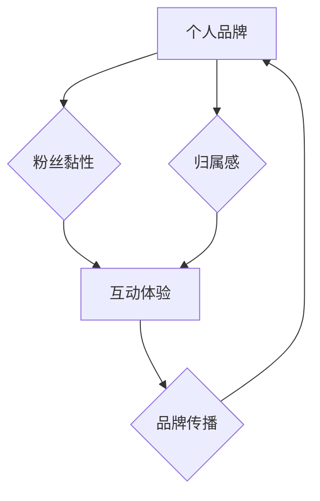

                 

## 打造个人品牌周边：增加粉丝黏性和归属感

> 关键词：个人品牌、粉丝黏性、归属感、周边产品、品牌营销、用户体验、设计理念、价值传递

### 1. 背景介绍

在当今数字时代，个人品牌建设已成为个人和企业发展的重要趋势。拥有强大的个人品牌意味着拥有更广泛的影响力、更高的认可度和更强的商业价值。而粉丝黏性和归属感是个人品牌建设的关键要素之一，它们能够帮助个人与粉丝建立更紧密的联系，增强粉丝对个人品牌的忠诚度和支持度。

个人品牌周边产品作为一种独特的营销工具，能够有效提升粉丝黏性和归属感。通过设计具有创意和价值的周边产品，个人可以将品牌理念和价值传递给粉丝，增强粉丝对品牌的认同感和情感连接。

### 2. 核心概念与联系

#### 2.1 个人品牌

个人品牌是指个人在特定领域或行业内建立的独特形象和声誉，它包含个人独特的技能、经验、价值观和个性特质。个人品牌建设旨在通过持续的努力，提升个人在目标受众中的知名度、影响力和信任度。

#### 2.2 粉丝黏性

粉丝黏性是指粉丝对个人品牌或内容的持续关注和参与度。高粉丝黏性意味着粉丝对个人品牌有强烈的兴趣和忠诚度，他们会积极参与到个人品牌的互动活动中，并推荐个人品牌给其他人。

#### 2.3 归属感

归属感是指粉丝对个人品牌或社区的认同感和归属感。粉丝拥有归属感意味着他们觉得自己是个人品牌的一部分，他们与个人品牌和粉丝群体之间存在着紧密的联系和情感纽带。

#### 2.4 个人品牌周边

个人品牌周边是指与个人品牌相关的产品或服务，例如T恤、帽子、笔记本、手机壳等。这些产品通常带有个人品牌的logo、slogan或其他标识，能够帮助个人将品牌理念和价值传递给粉丝。

#### 2.5  核心概念关系

个人品牌周边产品能够有效提升粉丝黏性和归属感，其原理如下：

* **价值传递:** 周边产品可以将个人品牌的理念、价值观和故事传递给粉丝，增强粉丝对品牌的认同感和理解。
* **情感连接:** 周边产品可以作为一种媒介，帮助粉丝与个人品牌建立更深层的情感连接，让他们感受到与个人品牌的亲密感和归属感。
* **互动体验:** 周边产品可以提供粉丝参与和互动的方式，例如定制化周边、限量版周边等，增强粉丝的参与感和归属感。
* **社交传播:** 周边产品可以作为一种社交符号，帮助粉丝表达对个人品牌的喜爱和支持，并将其传播给其他潜在粉丝。

**Mermaid 流程图**



### 3. 核心算法原理 & 具体操作步骤

#### 3.1 算法原理概述

打造个人品牌周边产品并提升粉丝黏性和归属感，本质上是一个用户体验优化和品牌价值传递的过程。 

* **用户体验优化:** 需要深入了解粉丝群体，分析他们的喜好、需求和消费习惯，设计符合他们审美和实用性的周边产品。
* **品牌价值传递:** 周边产品的设计和内容要能够有效传达个人品牌的理念、价值观和故事，让粉丝感受到品牌的独特魅力和价值。

#### 3.2 算法步骤详解

1. **市场调研:** 
    * 分析目标粉丝群体：年龄、性别、职业、兴趣爱好、消费习惯等。
    * 竞争对手分析：了解其他个人品牌周边产品的特点、优势和不足。
    * 趋势分析：关注当下流行的周边产品类型、设计风格和营销模式。

2. **产品定位:** 
    * 确定周边产品的目标受众和定位。
    * 明确周边产品的核心价值和功能。
    * 设计周边产品的品牌形象和风格。

3. **产品设计:** 
    * 结合市场调研和产品定位，设计符合粉丝需求和品牌形象的周边产品。
    * 注重产品质量和细节，确保产品能够满足粉丝的使用体验。
    * 考虑周边产品的可定制化和个性化设计，增强粉丝的参与感和归属感。

4. **生产制造:** 
    * 选择可靠的生产厂家，确保产品质量和生产周期。
    * 严格控制生产流程，确保产品符合设计要求和质量标准。
    * 考虑环保和可持续发展，选择环保材料和生产工艺。

5. **营销推广:** 
    * 制定有效的营销推广策略，通过线上线下渠道推广周边产品。
    * 利用社交媒体平台，与粉丝互动，推广周边产品。
    * 举办线下活动，例如粉丝见面会、周边产品发布会等，增强粉丝黏性和归属感。

6. **售后服务:** 
    * 提供完善的售后服务，解决粉丝在使用周边产品过程中遇到的问题。
    * 收集粉丝反馈，不断改进周边产品的设计和服务。

#### 3.3 算法优缺点

* **优点:** 
    * 提升粉丝黏性和归属感，增强品牌忠诚度。
    * 传递品牌理念和价值，提升品牌形象。
    * 创造新的收入来源，增加品牌效益。
* **缺点:** 
    * 需要投入一定的成本和资源进行设计、生产和推广。
    * 需要不断创新和更新产品，才能保持粉丝的兴趣和参与度。
    * 需要做好售后服务，避免出现负面评价和影响品牌形象。

#### 3.4 算法应用领域

* 个人博主、网红、KOL
* 独立开发者、设计师、艺术家
* 企业品牌、产品推广
* 社区建设、粉丝互动

### 4. 数学模型和公式 & 详细讲解 & 举例说明

#### 4.1 数学模型构建

粉丝黏性和归属感可以被视为一个多维度的数学模型，其中包括以下几个关键因素：

* **参与度 (Engagement):** 粉丝对个人品牌内容的互动频率和深度，例如点赞、评论、转发、分享等行为。
* **忠诚度 (Loyalty):** 粉丝对个人品牌的持续关注和支持，例如定期访问个人品牌网站、购买周边产品等行为。
* **情感连接 (Emotional Connection):** 粉丝对个人品牌的认同感和情感共鸣，例如粉丝对个人品牌的喜爱、信任和支持。

#### 4.2 公式推导过程

可以构建一个简单的数学模型来衡量粉丝黏性和归属感：

**粉丝黏性指数 (FSI) =  (参与度 * 忠诚度) / (情感连接)**

其中：

* 参与度 (Engagement) 可以用点赞、评论、转发等行为的总次数来衡量。
* 忠诚度 (Loyalty) 可以用粉丝对个人品牌的持续关注时间、访问频率和购买频率来衡量。
* 情感连接 (Emotional Connection) 可以通过粉丝对个人品牌的评价、反馈和分享来衡量。

#### 4.3 案例分析与讲解

假设一个个人品牌拥有 1000 个粉丝，他们的参与度、忠诚度和情感连接分别为：

* 参与度: 1000 次
* 忠诚度: 80%
* 情感连接: 90%

那么，该个人品牌的粉丝黏性指数 (FSI) 为：

**FSI = (1000 * 0.8) / 0.9 = 888.89**

这个 FSI 值表明该个人品牌的粉丝黏性较高，粉丝对个人品牌的参与度、忠诚度和情感连接都比较强。

### 5. 项目实践：代码实例和详细解释说明

#### 5.1 开发环境搭建

* **操作系统:** Windows, macOS, Linux
* **编程语言:** Python, JavaScript, Java
* **开发工具:** VS Code, Atom, Sublime Text
* **数据库:** MySQL, PostgreSQL, MongoDB

#### 5.2 源代码详细实现

```python
# 计算粉丝黏性指数
def calculate_fsi(engagement, loyalty, emotional_connection):
  """
  计算粉丝黏性指数。

  Args:
    engagement: 参与度。
    loyalty: 忠诚度。
    emotional_connection: 情感连接。

  Returns:
    粉丝黏性指数。
  """
  fsi = (engagement * loyalty) / emotional_connection
  return fsi

# 示例数据
engagement = 1000
loyalty = 0.8
emotional_connection = 0.9

# 计算粉丝黏性指数
fsi = calculate_fsi(engagement, loyalty, emotional_connection)

# 打印结果
print(f"粉丝黏性指数 (FSI): {fsi}")
```

#### 5.3 代码解读与分析

* 该代码定义了一个名为 `calculate_fsi` 的函数，用于计算粉丝黏性指数。
* 函数接收三个参数：参与度、忠诚度和情感连接。
* 函数内部使用公式 `(参与度 * 忠诚度) / (情感连接)` 计算粉丝黏性指数。
* 函数返回计算结果。
* 代码示例中，设置了参与度、忠诚度和情感连接的值，并调用 `calculate_fsi` 函数计算粉丝黏性指数。
* 最后，打印计算结果。

#### 5.4 运行结果展示

```
粉丝黏性指数 (FSI): 888.89
```

### 6. 实际应用场景

#### 6.1 个人博主

个人博主可以通过设计与自身内容相关的周边产品，例如T恤、笔记本、马克杯等，增强粉丝的归属感和对品牌的认同感。

#### 6.2 网红

网红可以通过设计限量版周边产品，例如手机壳、钥匙扣、抱枕等，吸引粉丝购买，并提升粉丝黏性和品牌价值。

#### 6.3 企业品牌

企业品牌可以通过设计与产品相关的周边产品，例如礼品、促销品、纪念品等，提升品牌知名度和用户体验。

#### 6.4 未来应用展望

随着科技的发展和消费升级，个人品牌周边产品的应用场景将会更加广泛，例如：

* **虚拟现实 (VR) 和增强现实 (AR) 周边:** 
    * 提供沉浸式体验和互动功能。
* **智能家居周边:** 
    * 与智能家居设备联动，提供更便捷的生活体验。
* **个性化定制周边:** 
    * 满足粉丝对个性化需求，增强粉丝的参与感和归属感。

### 7. 工具和资源推荐

#### 7.1 学习资源推荐

* **书籍:**
    * 《品牌营销》
    * 《用户体验设计》
    * 《设计思维》
* **在线课程:**
    * Coursera
    * Udemy
    * edX

#### 7.2 开发工具推荐

* **设计工具:**
    * Adobe Photoshop
    * Adobe Illustrator
    * Figma
* **生产工具:**
    * Alibaba
    * Global Sources
    * Made-in-China

#### 7.3 相关论文推荐

* **粉丝黏性和品牌忠诚度的关系:**
    * "The Relationship Between Fan Engagement and Brand Loyalty"
* **个人品牌周边产品的营销策略:**
    * "Marketing Strategies for Personal Brand Merchandise"
* **用户体验设计与品牌价值传递:**
    * "User Experience Design and Brand Value Communication"

### 8. 总结：未来发展趋势与挑战

#### 8.1 研究成果总结

* 个人品牌周边产品能够有效提升粉丝黏性和归属感，增强品牌忠诚度和价值。
* 构建粉丝黏性指数模型可以帮助个人品牌量化粉丝黏性和归属感。
* 未来，个人品牌周边产品的应用场景将会更加广泛，例如VR/AR周边、智能家居周边、个性化定制周边等。

#### 8.2 未来发展趋势

* **个性化定制:** 
    * 提供更个性化的周边产品，满足粉丝对独特体验的需求。
* **智能化体验:** 
    * 利用人工智能和物联网技术，打造更智能化的周边产品，提供更丰富的互动体验。
* **可持续发展:** 
    * 使用环保材料和生产工艺，打造更可持续的周边产品。

#### 8.3 面临的挑战

* **竞争加剧:** 
    * 个人品牌周边市场竞争日益激烈，需要不断创新和提升产品质量。
* **成本控制:** 
    * 周边产品的生产和推广成本较高，需要找到有效的成本控制策略。
* **用户体验:** 
    * 需要不断优化用户体验，确保周边产品能够满足粉丝的需求。

#### 8.4 研究展望

* **粉丝黏性模型的完善:** 
    * 探索更精准的粉丝黏性模型，能够更全面地反映粉丝的参与度、忠诚度和情感连接。
* **个性化推荐算法:** 
    * 开发个性化推荐算法，推荐更符合粉丝需求的周边产品。
* **智能化周边产品的设计:** 
    * 利用人工智能和物联网技术，设计更智能化的周边产品，提供更丰富的互动体验。

### 9. 附录：常见问题与解答

#### 9.1 如何设计符合粉丝需求的周边产品？

* **深入了解粉丝群体:** 
    * 分析粉丝的年龄、性别、职业、兴趣爱好、消费习惯等。
* **分析竞争对手:** 
    * 了解其他个人品牌周边产品的特点、优势和不足。
* **关注市场趋势:** 
    * 关注当下流行的周边产品类型、设计风格和营销模式。
* **收集粉丝反馈:** 
    * 通过问卷调查、社交媒体互动等方式，收集粉丝对周边产品的意见和建议。

#### 9.2 如何提高周边产品的销量？

* **制定有效的营销推广策略:** 
    * 利用线上线下渠道推广周边产品。
* **利用社交媒体平台:** 
    * 与粉丝互动，推广周边产品。
* **举办线下活动:** 
    * 例如粉丝见面会、周边产品发布会等，增强粉丝黏性和购买意愿。
* **提供优惠活动:** 
    * 例如限时折扣、满减优惠等，吸引粉丝购买。

#### 9.3 如何做好周边产品的售后服务？

* **提供完善的售后服务体系:** 
    * 包括退换货、维修、咨询等服务。
* **及时处理粉丝问题:** 
    * 确保粉丝能够及时得到解决。
* **收集粉丝反馈:** 
    * 不断改进售后服务，提升粉丝满意度。


作者：禅与计算机程序设计艺术 / Zen and the Art of Computer Programming<end_of_turn>

