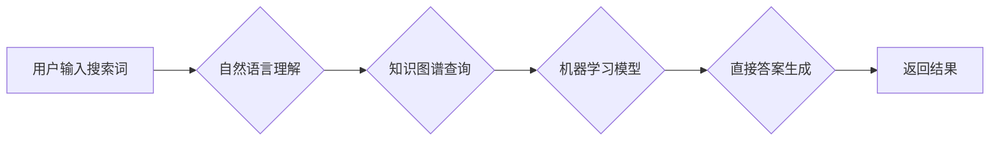

                 

## 搜索引擎革命：从链接到直接答案

> 关键词：搜索引擎、自然语言理解、知识图谱、直接答案、机器学习、深度学习

### 1. 背景介绍

搜索引擎，作为信息时代的基石，经历了从简单的关键词匹配到如今复杂的多维分析的演进。早期搜索引擎如 AltaVista 和 Yahoo! 主要依靠关键词匹配算法，将用户输入的关键词与网页内容进行比较，并根据匹配度排序结果。然而，随着互联网信息的爆炸式增长和用户需求的不断变化，单纯依靠关键词匹配已难以满足用户的搜索需求。

用户不再仅仅寻求包含特定关键词的网页，而是希望获得更精准、更直接的答案。例如，用户搜索“北京的天气”并不仅仅希望看到包含“北京”和“天气”关键词的网页，而是希望直接看到北京当天的天气预报。

这种转变催生了搜索引擎的新方向：从链接到直接答案。

### 2. 核心概念与联系

**2.1 链接分析与排名**

传统的搜索引擎依靠 PageRank 算法来评估网页的重要性。PageRank 算法基于网页之间的链接关系，认为被更多高质量网页链接到的网页更具权威性。

**2.2 自然语言理解 (NLU)**

NLU 旨在使计算机能够理解人类语言的含义。它涉及多种技术，包括词义消歧、句法分析、语义角色标注等。NLU 对于理解用户搜索意图至关重要。

**2.3 知识图谱 (KG)**

知识图谱是一种结构化的知识表示形式，将实体和关系以图的形式表示。它可以存储和推理丰富的知识，为搜索引擎提供更深层的语义理解。

**2.4 直接答案**

直接答案是指搜索引擎能够直接从其知识库中提取并返回给用户的答案，而不是仅仅提供包含相关信息的网页链接。

**2.5 机器学习与深度学习**

机器学习和深度学习算法可以用于训练搜索引擎，使其能够更好地理解用户搜索意图、识别知识图谱中的关系，并生成更精准的直接答案。

**Mermaid 流程图**



### 3. 核心算法原理 & 具体操作步骤

**3.1 算法原理概述**

直接答案生成算法的核心是将用户搜索意图与知识图谱中的知识进行匹配。

**3.2 算法步骤详解**

1. **用户搜索词分析:** 使用自然语言理解技术分析用户输入的搜索词，识别关键词、实体和关系。
2. **知识图谱查询:** 根据分析结果，从知识图谱中查询相关实体和关系。
3. **答案候选集生成:** 基于查询结果，生成候选答案集。
4. **答案排序:** 使用机器学习模型对候选答案进行排序，选择最符合用户搜索意图的答案。
5. **答案格式化:** 将排序后的答案格式化输出，例如文本、列表、图表等。

**3.3 算法优缺点**

**优点:**

* 能够直接提供用户所需的答案，提高搜索效率。
* 能够理解用户的复杂搜索意图，提供更精准的结果。
* 能够利用知识图谱中的丰富知识，提供更全面的信息。

**缺点:**

* 需要构建和维护庞大的知识图谱，成本较高。
* 对于复杂的用户搜索意图，算法可能难以理解。
* 答案的准确性依赖于知识图谱的质量。

**3.4 算法应用领域**

* **问答系统:** 提供直接答案的智能问答系统。
* **搜索引擎:** 增强搜索引擎的功能，提供更精准的直接答案。
* **语音助手:** 帮助语音助手理解用户指令并提供直接答案。
* **教育领域:** 提供个性化的学习辅导和知识查询。

### 4. 数学模型和公式 & 详细讲解 & 举例说明

**4.1 数学模型构建**

直接答案生成算法可以建模为一个分类问题。

* **输入:** 用户搜索词的向量表示、知识图谱中相关实体和关系的向量表示。
* **输出:** 答案类别，例如“时间”、“地点”、“人物”等。

**4.2 公式推导过程**

可以使用深度学习模型，例如卷积神经网络 (CNN) 或循环神经网络 (RNN)，来学习用户搜索词和知识图谱之间的关系，并预测答案类别。

损失函数可以采用交叉熵损失函数，用于衡量模型预测结果与真实答案之间的差异。

**4.3 案例分析与讲解**

假设用户搜索词为“北京的首都是什么？”，知识图谱中包含以下信息：

* 实体：北京、中国
* 关系：首都

模型可以将用户搜索词和知识图谱中的实体和关系向量化，并通过深度学习模型进行训练。

训练完成后，模型可以预测答案类别为“地点”，并返回答案“北京”。

### 5. 项目实践：代码实例和详细解释说明

**5.1 开发环境搭建**

* Python 3.x
* TensorFlow 或 PyTorch 深度学习框架
* NLTK 自然语言处理库
* SpaCy 词向量库

**5.2 源代码详细实现**

```python
import tensorflow as tf

# 定义模型结构
model = tf.keras.Sequential([
    tf.keras.layers.Embedding(input_dim=vocab_size, output_dim=embedding_dim),
    tf.keras.layers.LSTM(units=128),
    tf.keras.layers.Dense(units=num_classes, activation='softmax')
])

# 编译模型
model.compile(optimizer='adam',
              loss='sparse_categorical_crossentropy',
              metrics=['accuracy'])

# 训练模型
model.fit(x_train, y_train, epochs=10)

# 预测答案
prediction = model.predict(x_test)
```

**5.3 代码解读与分析**

* 代码首先定义了一个深度学习模型，使用 Embedding 层将用户搜索词向量化，使用 LSTM 层学习时间序列信息，最后使用 Dense 层进行分类。
* 模型使用 Adam 优化器、交叉熵损失函数和准确率作为评估指标。
* 训练模型后，可以使用模型预测新的用户搜索词的答案类别。

**5.4 运行结果展示**

训练完成后，可以评估模型的准确率，并使用模型预测新的用户搜索词的答案类别。

### 6. 实际应用场景

**6.1 问答系统**

直接答案生成算法可以用于构建智能问答系统，例如聊天机器人、虚拟助手等。

**6.2 搜索引擎增强**

搜索引擎可以利用直接答案生成算法，在搜索结果中直接显示答案，提高用户体验。

**6.3 个性化学习**

教育领域可以利用直接答案生成算法，提供个性化的学习辅导和知识查询。

**6.4 未来应用展望**

随着人工智能技术的不断发展，直接答案生成算法将有更广泛的应用场景，例如：

* **医疗诊断:** 提供基于知识图谱的医疗诊断建议。
* **法律咨询:** 提供基于法律知识图谱的法律咨询服务。
* **金融分析:** 提供基于金融知识图谱的金融分析报告。

### 7. 工具和资源推荐

**7.1 学习资源推荐**

* **书籍:**

    * 《深度学习》 by Ian Goodfellow, Yoshua Bengio, and Aaron Courville
    * 《自然语言处理》 by Dan Jurafsky and James H. Martin

* **在线课程:**

    * Coursera: Deep Learning Specialization
    * Udacity: Natural Language Processing Nanodegree

**7.2 开发工具推荐**

* **TensorFlow:** https://www.tensorflow.org/
* **PyTorch:** https://pytorch.org/
* **NLTK:** https://www.nltk.org/
* **SpaCy:** https://spacy.io/

**7.3 相关论文推荐**

* **BERT: Pre-training of Deep Bidirectional Transformers for Language Understanding**
* **Knowledge Graph Embedding: A Survey**
* **Direct Answer Extraction from Knowledge Bases: A Survey**

### 8. 总结：未来发展趋势与挑战

**8.1 研究成果总结**

直接答案生成算法取得了显著的进展，能够有效地理解用户搜索意图并提供精准的答案。

**8.2 未来发展趋势**

* **更强大的模型:** 使用更先进的深度学习模型，例如 Transformer，提高模型的性能。
* **更丰富的知识图谱:** 构建更全面的知识图谱，涵盖更多领域和知识。
* **个性化答案:** 根据用户的历史搜索记录和偏好，提供个性化的答案。

**8.3 面临的挑战**

* **复杂搜索意图:** 对于复杂的用户搜索意图，算法可能难以理解。
* **知识图谱的维护:** 知识图谱需要不断更新和维护，以确保其准确性和完整性。
* **数据安全和隐私:** 使用用户数据进行训练和预测，需要考虑数据安全和隐私问题。

**8.4 研究展望**

未来研究将继续探索更有效的直接答案生成算法，并将其应用于更多领域，为用户提供更智能、更便捷的搜索体验。

### 9. 附录：常见问题与解答

**9.1 如何构建知识图谱？**

构建知识图谱需要多种技术，包括数据挖掘、自然语言处理、知识表示等。

**9.2 如何评估直接答案生成算法的性能？**

可以使用准确率、召回率、F1-score 等指标来评估直接答案生成算法的性能。

**9.3 如何解决复杂搜索意图的问题？**

可以使用更先进的深度学习模型，例如 Transformer，以及多模态信息融合技术，来解决复杂搜索意图的问题。


作者：禅与计算机程序设计艺术 / Zen and the Art of Computer Programming 
<end_of_turn>

