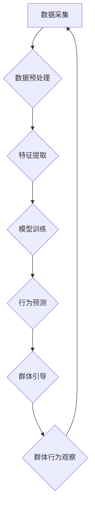

                 

## 欲望的社会化：AI驱动的群体动力学

> 关键词：人工智能、群体动力学、社会化、算法、网络效应、行为预测、数据驱动、伦理

## 1. 背景介绍

人类社会自古以来就充满了各种各样的群体行为，从简单的部落组织到复杂的国家体系，从宗教信仰到政治运动，无不体现着群体动力学的奥妙。而随着人工智能技术的飞速发展，AI开始深刻地影响着群体行为的产生、演变和结果。

传统的群体动力学研究主要关注人类社会学、心理学等领域，而AI驱动的群体动力学则将人工智能技术引入到群体行为的分析和预测中，试图揭示群体行为背后的复杂机制，并利用AI技术更好地理解和引导群体行为。

## 2. 核心概念与联系

**2.1 核心概念**

* **群体动力学:** 研究群体行为的规律和机制，包括群体形成、群体决策、群体冲突等。
* **人工智能 (AI):**  模拟人类智能的计算机系统，包括机器学习、深度学习、自然语言处理等技术。
* **社会化:**  指个体在社会环境中逐渐形成和发展自身的价值观、行为规范和社会角色的过程。

**2.2 AI与群体动力学的联系**

AI技术可以从多个方面影响群体动力学：

* **数据驱动:** AI可以利用海量数据分析群体行为的模式，识别群体趋势和潜在风险。
* **行为预测:** AI可以根据个体和群体的历史行为数据，预测未来的群体行为，为决策提供参考。
* **群体引导:** AI可以利用个性化推荐、信息推送等方式，引导群体行为朝着预期的方向发展。

**2.3  AI驱动的群体动力学架构**



## 3. 核心算法原理 & 具体操作步骤

**3.1 算法原理概述**

AI驱动的群体动力学研究中，常用的算法包括：

* **机器学习:**  通过训练模型，从数据中学习群体行为的规律。
* **深度学习:**  利用多层神经网络，对复杂的数据进行更深入的分析。
* **自然语言处理:**  分析群体成员的语言表达，理解他们的意图和情感。

**3.2 算法步骤详解**

1. **数据采集:** 收集群体成员的行为数据，例如社交媒体帖子、论坛讨论、投票结果等。
2. **数据预处理:** 清洗和转换数据，使其适合模型训练。
3. **特征提取:** 从数据中提取有价值的特征，例如用户属性、话题标签、情感倾向等。
4. **模型训练:** 利用机器学习算法，训练模型以预测群体行为。
5. **行为预测:** 将新数据输入到训练好的模型中，预测未来的群体行为。
6. **群体引导:** 根据预测结果，采取相应的措施引导群体行为，例如推送相关信息、调整推荐算法等。

**3.3 算法优缺点**

* **优点:** 
    * 数据驱动，能够发现人类难以察觉的群体行为模式。
    * 预测能力强，可以提前预警群体行为的潜在风险。
    * 可引导群体行为，实现预期的社会目标。
* **缺点:** 
    * 数据依赖性强，需要大量高质量的数据进行训练。
    * 算法本身存在偏差，可能导致预测结果不准确。
    * 伦理风险高，可能被用于操纵群体行为，侵犯个人隐私。

**3.4 算法应用领域**

* **社会科学研究:**  分析群体行为的规律，理解社会现象。
* **市场营销:**  预测消费者行为，精准推送广告。
* **政治传播:**  分析舆情趋势，引导公众舆论。
* **公共安全:**  预警群体事件，维护社会稳定。

## 4. 数学模型和公式 & 详细讲解 & 举例说明

**4.1 数学模型构建**

我们可以用图论模型来表示群体结构，其中节点代表群体成员，边代表成员之间的关系。

**4.2 公式推导过程**

我们可以利用图论中的度数、聚类系数等指标来衡量群体结构的复杂度和凝聚力。

例如，度数可以表示一个节点与其他节点的连接数，聚类系数可以表示一个节点与其邻居节点之间的连接程度。

**4.3 案例分析与讲解**

我们可以通过分析社交网络平台的用户关系图，计算用户的度数和聚类系数，从而了解用户的社交圈大小和凝聚力。

例如，一个拥有高度数和高聚类系数的用户，可能代表着一个社交影响力较大的用户，其观点和行为更容易影响周围的用户。

## 5. 项目实践：代码实例和详细解释说明

**5.1 开发环境搭建**

* Python 3.x
* Jupyter Notebook
* NetworkX 图论库
* Scikit-learn 机器学习库

**5.2 源代码详细实现**

```python
import networkx as nx
from sklearn.cluster import KMeans

# 加载社交网络数据
graph = nx.read_edgelist("social_network.txt")

# 计算节点度数
degree_centrality = nx.degree_centrality(graph)

# 计算节点聚类系数
clustering_coefficient = nx.clustering(graph)

# 使用KMeans算法进行聚类
kmeans = KMeans(n_clusters=5)
features = [degree_centrality[node] for node in graph.nodes()]
kmeans.fit(features)

# 将节点分配到不同的聚类
clusters = kmeans.labels_

# 打印聚类结果
for node, cluster in zip(graph.nodes(), clusters):
    print(f"Node {node} belongs to cluster {cluster}")
```

**5.3 代码解读与分析**

* 该代码首先加载社交网络数据，并使用NetworkX库计算节点度数和聚类系数。
* 然后，使用Scikit-learn库中的KMeans算法对节点进行聚类，将节点分配到不同的群组。
* 最后，打印每个节点所属的群组信息。

**5.4 运行结果展示**

运行该代码后，会输出每个节点所属的群组信息，我们可以根据群组的特征，分析不同群组的社交结构和行为模式。

## 6. 实际应用场景

**6.1 市场营销**

AI驱动的群体动力学可以帮助企业精准定位目标客户，设计有效的营销策略。例如，通过分析用户的社交网络行为，可以识别潜在的购买者，并推送个性化的广告信息。

**6.2 政治传播**

AI可以帮助政党和候选人分析舆情趋势，引导公众舆论。例如，可以通过分析社交媒体上的讨论内容，了解公众对特定政策的看法，并针对性地进行宣传。

**6.3 公共安全**

AI驱动的群体动力学可以帮助政府预警群体事件，维护社会稳定。例如，可以通过分析社交媒体上的信息，识别潜在的群体冲突，并采取相应的措施进行干预。

**6.4 未来应用展望**

随着人工智能技术的不断发展，AI驱动的群体动力学将在更多领域得到应用，例如：

* **教育:**  个性化学习推荐，促进学生学习兴趣和效率。
* **医疗:**  预测疾病流行趋势，提高医疗资源配置效率。
* **环境保护:**  分析公众对环境问题的关注度，引导环保行为。

## 7. 工具和资源推荐

**7.1 学习资源推荐**

* **书籍:**
    * 《网络社会学》
    * 《群体心理学》
    * 《人工智能导论》
* **在线课程:**
    * Coursera: 人工智能
    * edX: 数据科学
    * Udacity: 深度学习

**7.2 开发工具推荐**

* **Python:**  Python是一种广泛使用的编程语言，拥有丰富的机器学习和数据分析库。
* **NetworkX:**  NetworkX是一个用于构建和分析图论模型的Python库。
* **Scikit-learn:**  Scikit-learn是一个用于机器学习的Python库，提供各种算法和工具。

**7.3 相关论文推荐**

* **"Social Network Analysis: Methods and Applications"**
* **"Predicting Social Behavior with Machine Learning"**
* **"The Ethics of Artificial Intelligence in Social Science Research"**

## 8. 总结：未来发展趋势与挑战

**8.1 研究成果总结**

AI驱动的群体动力学研究取得了显著进展，能够有效地分析和预测群体行为，并为社会治理、市场营销、公共安全等领域提供新的解决方案。

**8.2 未来发展趋势**

* **更精准的预测:**  利用更先进的机器学习算法和更丰富的社会数据，提高群体行为预测的准确性。
* **更个性化的引导:**  根据个体差异，设计更个性化的群体引导策略，提高引导效果。
* **更全面的伦理考量:**  深入研究AI驱动的群体动力学带来的伦理风险，制定相应的规范和制度。

**8.3 面临的挑战**

* **数据隐私保护:**  如何平衡群体行为分析的需求和个体隐私保护的需要。
* **算法公平性:**  如何避免算法本身的偏差导致群体行为的歧视和不公平。
* **社会信任:**  如何建立公众对AI驱动的群体动力学的信任，避免其被滥用。

**8.4 研究展望**

未来，AI驱动的群体动力学研究将继续深入发展，为更好地理解和引导群体行为提供更强大的工具和方法。


## 9. 附录：常见问题与解答

* **Q1: AI驱动的群体动力学是否会侵犯个人隐私？**

* **A1:**  AI驱动的群体动力学研究确实会涉及到个人数据，因此需要采取措施保护个人隐私，例如匿名化数据处理、数据加密等。

* **Q2: AI驱动的群体动力学是否会操纵群体行为？**

* **A2:**  AI驱动的群体动力学技术本身并没有操纵群体行为的意图，但其应用需要谨慎，避免被用于操纵公众舆论或影响个人决策。

* **Q3: AI驱动的群体动力学是否会加剧社会分化？**

* **A3:**  AI驱动的群体动力学技术本身并不会加剧社会分化，但其应用需要考虑社会公平性问题，避免算法本身的偏差导致群体行为的歧视和不公平。


作者：禅与计算机程序设计艺术 / Zen and the Art of Computer Programming 
<end_of_turn>

