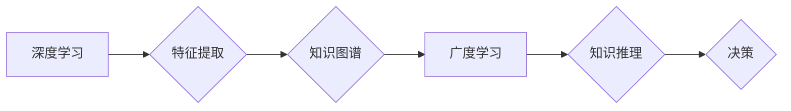

                 

## 深度学习vs广度学习：知识积累的策略

> 关键词：深度学习、广度学习、知识积累、机器学习、人工智能、神经网络、数据挖掘、学习策略

## 1. 背景介绍

在当今数据爆炸的时代，人工智能（AI）正以惊人的速度发展，深度学习作为其重要组成部分，在图像识别、自然语言处理、语音识别等领域取得了突破性进展。然而，深度学习的训练需要海量数据和强大的计算资源，这对于许多应用场景来说仍然是一个挑战。与此同时，广度学习作为一种相对新兴的学习策略，以其更灵活、更易于解释的特点，逐渐受到关注。

深度学习和广度学习，它们是两种不同的知识积累策略，各自拥有独特的优势和局限性。本文将深入探讨这两种学习策略的核心概念、算法原理、数学模型以及实际应用场景，并分析其各自的优缺点，帮助读者更好地理解它们之间的关系，并为选择合适的学习策略提供参考。

## 2. 核心概念与联系

### 2.1 深度学习

深度学习是一种基于人工神经网络的机器学习方法，其核心在于构建多层神经网络，通过层层叠加的非线性变换，学习数据的复杂特征表示。深度学习模型能够自动从数据中提取特征，无需人工特征工程，这使其在处理复杂数据模式方面具有强大的能力。

### 2.2 广度学习

广度学习是一种基于知识图谱和规则的机器学习方法，其核心在于构建一个包含大量知识和规则的知识图谱，并利用规则引擎进行推理和决策。广度学习模型能够利用已有的知识和规则，对新数据进行解释和预测，并能够更好地解释其决策过程。

### 2.3 深度学习与广度学习的联系

深度学习和广度学习并非完全独立的，它们之间存在着相互补充的关系。深度学习能够从海量数据中学习到丰富的特征表示，而广度学习能够利用这些特征表示进行更深入的知识推理和决策。

**Mermaid 流程图**



## 3. 核心算法原理 & 具体操作步骤

### 3.1  算法原理概述

深度学习的核心算法是反向传播算法，它通过不断调整神经网络权重，使模型的预测结果与真实值之间的误差最小化。广度学习的核心算法是规则引擎，它根据知识图谱中的规则，对输入数据进行推理和决策。

### 3.2  算法步骤详解

#### 3.2.1 深度学习算法步骤

1. **数据预处理:** 对输入数据进行清洗、转换和归一化，使其适合深度学习模型的训练。
2. **网络结构设计:** 根据任务需求，设计合适的深度神经网络结构，包括层数、节点数和激活函数等。
3. **参数初始化:** 为神经网络中的权重和偏置赋予初始值。
4. **前向传播:** 将输入数据通过神经网络层层传递，最终得到预测结果。
5. **损失函数计算:** 计算预测结果与真实值的误差，即损失函数的值。
6. **反向传播:** 根据损失函数的梯度，反向传播误差信息，更新神经网络权重和偏置。
7. **迭代训练:** 重复步骤4-6，直到模型的损失函数达到预设阈值。

#### 3.2.2 广度学习算法步骤

1. **知识图谱构建:** 收集和整理相关领域知识，构建一个包含实体、关系和规则的知识图谱。
2. **规则引擎配置:** 根据知识图谱中的规则，配置规则引擎，使其能够进行推理和决策。
3. **数据输入:** 将输入数据转换为知识图谱中的实体和关系。
4. **规则推理:** 利用规则引擎，根据知识图谱中的规则，对输入数据进行推理，得到推理结果。
5. **决策输出:** 根据推理结果，做出最终的决策。

### 3.3  算法优缺点

#### 3.3.1 深度学习算法

**优点:**

* 能够自动学习数据中的复杂特征表示。
* 在处理海量数据方面具有强大的能力。
* 在图像识别、自然语言处理等领域取得了突破性进展。

**缺点:**

* 训练需要海量数据和强大的计算资源。
* 模型的解释性较差，难以理解其决策过程。
* 对数据噪声和异常值较为敏感。

#### 3.3.2 广度学习算法

**优点:**

* 能够利用已有的知识和规则，提高决策的准确性和可靠性。
* 模型的解释性强，能够清晰地解释其决策过程。
* 对数据噪声和异常值较为鲁棒。

**缺点:**

* 知识图谱的构建需要大量人工投入。
* 难以处理复杂、动态变化的数据模式。
* 缺乏深度学习的自动特征学习能力。

### 3.4  算法应用领域

#### 3.4.1 深度学习算法

* 图像识别、物体检测、图像分类
* 自然语言处理、机器翻译、文本摘要
* 语音识别、语音合成、语音助手
* 医疗诊断、药物研发、基因组分析
* 金融风险评估、欺诈检测、投资预测

#### 3.4.2 广度学习算法

* 知识问答、推理系统、智能问答
* 医疗诊断辅助、疾病知识推理
* 法律文本分析、法律推理
* 财务报表分析、财务风险评估
* 供应链管理、物流优化

## 4. 数学模型和公式 & 详细讲解 & 举例说明

### 4.1  数学模型构建

#### 4.1.1 深度学习模型

深度学习模型通常采用多层感知机（MLP）或卷积神经网络（CNN）等结构。

* **多层感知机（MLP）:** MLP由多个全连接层组成，每一层都包含多个神经元。每个神经元接收上一层的输出作为输入，并通过激活函数进行非线性变换，输出到下一层。

* **卷积神经网络（CNN）:** CNN主要用于处理图像数据，其结构包含卷积层、池化层和全连接层。卷积层通过卷积核对输入图像进行特征提取，池化层对特征图进行降维，全连接层将提取的特征进行分类或回归。

#### 4.1.2 广度学习模型

广度学习模型通常采用知识图谱和规则引擎进行构建。

* **知识图谱:** 知识图谱是一个包含实体、关系和属性的图结构，用于表示知识。

* **规则引擎:** 规则引擎根据知识图谱中的规则，对输入数据进行推理和决策。

### 4.2  公式推导过程

#### 4.2.1 深度学习模型

深度学习模型的训练过程基于反向传播算法，其核心公式包括：

* **损失函数:** 用于衡量模型预测结果与真实值的误差。常见的损失函数包括均方误差（MSE）、交叉熵损失（Cross-Entropy Loss）等。

* **梯度下降:** 用于更新模型参数，使其朝着最小化损失函数的方向进行调整。

#### 4.2.2 广度学习模型

广度学习模型的推理过程基于规则引擎，其核心公式包括：

* **规则匹配:** 将输入数据与知识图谱中的规则进行匹配，找到满足条件的规则。
* **规则推理:** 根据匹配到的规则，进行逻辑推理，推导出新的知识或结论。

### 4.3  案例分析与讲解

#### 4.3.1 深度学习模型案例

* **图像识别:** 使用CNN模型对图像进行分类，例如识别猫、狗、鸟等物体。

* **机器翻译:** 使用RNN模型对文本进行翻译，例如将英文翻译成中文。

#### 4.3.2 广度学习模型案例

* **知识问答:** 使用规则引擎和知识图谱，回答用户提出的问题，例如“中国首都在哪里？”

* **医疗诊断辅助:** 使用规则引擎和医学知识图谱，辅助医生进行疾病诊断。

## 5. 项目实践：代码实例和详细解释说明

### 5.1  开发环境搭建

* Python 3.x
* TensorFlow 或 PyTorch 深度学习框架
* NetworkX 图数据库库

### 5.2  源代码详细实现

#### 5.2.1 深度学习模型代码示例（使用 TensorFlow）

```python
import tensorflow as tf

# 定义模型结构
model = tf.keras.models.Sequential([
    tf.keras.layers.Conv2D(32, (3, 3), activation='relu', input_shape=(28, 28, 1)),
    tf.keras.layers.MaxPooling2D((2, 2)),
    tf.keras.layers.Conv2D(64, (3, 3), activation='relu'),
    tf.keras.layers.MaxPooling2D((2, 2)),
    tf.keras.layers.Flatten(),
    tf.keras.layers.Dense(10, activation='softmax')
])

# 编译模型
model.compile(optimizer='adam',
              loss='sparse_categorical_crossentropy',
              metrics=['accuracy'])

# 训练模型
model.fit(x_train, y_train, epochs=5)
```

#### 5.2.2 广度学习模型代码示例（使用 NetworkX）

```python
import networkx as nx

# 创建知识图谱
graph = nx.DiGraph()
graph.add_node('实体1')
graph.add_node('实体2')
graph.add_edge('实体1', '实体2', relation='关系1')

# 定义规则
rules = [
    ('实体1', '关系1', '实体2')
]

# 推理
for rule in rules:
    if nx.has_path(graph, *rule):
        print(f"规则匹配成功: {rule}")
```

### 5.3  代码解读与分析

#### 5.3.1 深度学习模型代码解读

* 该代码示例使用 TensorFlow 框架构建了一个简单的 CNN 模型，用于图像分类任务。
* 模型结构包括卷积层、池化层和全连接层，用于提取图像特征和进行分类。
* 模型使用 Adam 优化器、均方误差损失函数和准确率指标进行训练。

#### 5.3.2 广度学习模型代码解读

* 该代码示例使用 NetworkX 库构建了一个简单的知识图谱，并定义了一些规则。
* 规则引擎根据知识图谱中的规则，对输入数据进行推理，并输出匹配结果。

### 5.4  运行结果展示

* 深度学习模型的运行结果包括训练精度和测试精度，可以评估模型的性能。
* 广度学习模型的运行结果包括匹配到的规则和推理出的结论，可以评估模型的推理能力。

## 6. 实际应用场景

### 6.1 深度学习应用场景

* **医疗诊断:** 深度学习模型可以分析医学图像，辅助医生诊断疾病，例如癌症、心血管疾病等。
* **金融风险评估:** 深度学习模型可以分析金融数据，识别欺诈交易、预测风险等。
* **自动驾驶:** 深度学习模型可以处理摄像头、雷达等传感器数据，帮助车辆感知周围环境，实现自动驾驶功能。

### 6.2 广度学习应用场景

* **智能客服:** 广度学习模型可以构建知识图谱，并利用规则引擎进行问答，提供智能客服服务。
* **法律文本分析:** 广度学习模型可以分析法律文本，识别法律条款、进行法律推理等。
* **知识管理:** 广度学习模型可以构建知识图谱，帮助企业管理知识资产，提高知识共享效率。

### 6.4 未来应用展望

* **深度学习:** 随着计算资源的不断提升，深度学习模型将能够处理更复杂的数据模式，在更多领域发挥作用。例如，在药物研发、材料科学等领域，深度学习模型将能够加速创新。
* **广度学习:** 随着知识图谱的不断完善，广度学习模型将能够提供更准确、更可靠的知识推理和决策支持。例如，在医疗诊断、法律判决等领域，广度学习模型将能够发挥更大的作用。

## 7. 工具和资源推荐

### 7.1 学习资源推荐

* **书籍:**
    * 《深度学习》 - Ian Goodfellow, Yoshua Bengio, Aaron Courville
    * 《人工智能：现代方法》 - Stuart Russell, Peter Norvig
* **在线课程:**
    * Coursera: 深度学习 Specialization
    * edX: Artificial Intelligence
* **博客和网站:**
    * TensorFlow Blog
    * PyTorch Blog
    * Towards Data Science

### 7.2 开发工具推荐

* **深度学习框架:** TensorFlow, PyTorch, Keras
* **数据处理工具:** Pandas, NumPy
* **可视化工具:** Matplotlib, Seaborn

### 7.3 相关论文推荐

* **深度学习:**
    * AlexNet: ImageNet Classification with Deep Convolutional Neural Networks
    * ResNet: Deep Residual Learning for Image Recognition
* **广度学习:**
    * Knowledge Graph Embedding: A Survey
    * TransE: Embedding Entities and Relations for Learning and Inference in Knowledge Bases

## 8. 总结：未来发展趋势与挑战

### 8.1 研究成果总结

深度学习和广度学习是人工智能领域的两大重要研究方向，它们各自拥有独特的优势和局限性。深度学习在处理复杂数据模式方面具有强大的能力，而广度学习能够利用已有的知识和规则，提高决策的准确性和可靠性。

### 8.2 未来发展趋势

* **深度学习:**
    * 模型规模和复杂度将继续提升，例如Transformer模型的出现。
    * 探索新的深度学习算法和架构，例如自监督学习、联邦学习等。
    * 深度学习模型的解释性和可解释性将受到更多关注。
* **广度学习:**
    * 知识图谱的规模和质量将不断提升，例如通过知识图谱融合和自动构建。
    * 探索新的广度学习算法和方法，例如基于图神经网络的知识推理。
    * 将深度学习和广度学习相结合，构建更强大的智能系统。

### 8.3 面临的挑战

* **数据获取和标注:** 深度学习模型需要海量数据进行训练，而数据获取和标注成本较高。
* **模型解释性和可解释性:** 深度学习模型的决策过程较为复杂，难以解释，这限制了其在一些领域应用的推广。
* **知识图谱构建和维护:** 知识图谱的构建和维护需要大量的人工投入，且知识图谱的准确性和完整性难以保证。

### 8.4 研究展望

未来，深度学习和广度学习将继续发展，并相互融合，共同推动人工智能的发展。研究者将致力于解决上述挑战，构建更强大、更智能、更可解释的人工智能系统，为人类社会带来更多福祉。

## 9. 附录：常见问题与解答

### 9.1 深度学习和广度学习的区别是什么？

深度学习主要通过神经网络自动学习数据特征，而广度学习则依赖于人工构建的知识图谱和规则进行推理。

### 9.2 深度学习和广度学习哪个更好？

没有绝对的好坏之分，两种学习策略各有优缺点，选择哪种策略取决于具体应用场景。

### 9.3 如何选择合适的学习策略？

需要根据应用场景的需求，考虑数据量、知识可用性、模型解释性等因素进行选择。

### 9.4 深度学习和广度学习的未来发展趋势是什么？

深度学习将朝着模型规模更大、更复杂的方向发展，广度学习将更加注重知识图谱的规模和质量，并与深度学习相结合，构建更强大的智能系统。


作者：禅与计算机程序设计艺术 / Zen and the Art of Computer Programming<end_of_turn>

