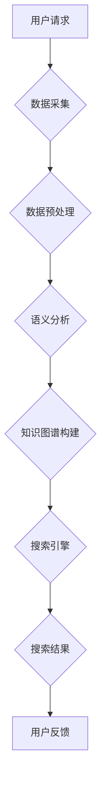

                 

## 物联网搜索：AI的新领域

> 关键词：物联网、搜索引擎、人工智能、机器学习、数据分析、边缘计算、语义理解、知识图谱

### 1. 背景介绍

物联网（IoT）的蓬勃发展正在深刻地改变着我们的生活和工作方式。数以亿计的智能设备连接在一起，产生海量的实时数据，为我们提供了前所未有的机遇。然而，这些数据也带来了新的挑战，其中之一就是如何有效地搜索和分析这些数据。传统的搜索引擎在处理海量、结构化和实时数据方面存在局限性，因此迫切需要新的搜索解决方案来应对物联网时代的挑战。

物联网搜索是指在物联网环境中，针对物联网设备产生的数据进行搜索和分析的技术。它不仅需要处理海量数据，还需要理解数据的语义，并能够根据用户的意图进行精准的搜索。

### 2. 核心概念与联系

物联网搜索的核心概念包括：

* **数据来源多样化**: 物联网数据来自各种各样的设备和传感器，包括智能家居设备、工业传感器、医疗设备等，数据类型也多种多样，例如文本、图像、音频、视频等。
* **数据实时性**: 物联网数据通常是实时产生的，需要实时处理和分析。
* **数据分布式**: 物联网数据通常分布在多个设备和服务器上，需要进行分布式搜索和分析。
* **语义理解**: 物联网数据往往包含丰富的语义信息，需要进行语义理解和分析，才能准确地理解用户的意图。

**核心架构**



### 3. 核心算法原理 & 具体操作步骤

#### 3.1  算法原理概述

物联网搜索算法需要考虑数据的多样性、实时性、分布式性和语义理解等特点。一些常用的算法包括：

* **基于关键词的搜索**: 传统的搜索引擎主要基于关键词匹配进行搜索，但对于物联网数据来说，关键词匹配往往不够精准。
* **基于机器学习的搜索**: 利用机器学习算法，例如文本分类、聚类、推荐系统等，对物联网数据进行分析和分类，提高搜索的精准度。
* **基于知识图谱的搜索**: 建立知识图谱，将物联网数据中的实体和关系进行表示，可以进行更深入的语义搜索。

#### 3.2  算法步骤详解

以基于机器学习的搜索为例，其具体操作步骤如下：

1. **数据采集**: 从物联网设备收集数据，包括文本、图像、音频、视频等多种类型的数据。
2. **数据预处理**: 对收集到的数据进行清洗、格式化、转换等预处理操作，使其能够被机器学习算法处理。
3. **特征提取**: 从预处理后的数据中提取特征，例如文本中的关键词、图像中的物体、音频中的声音等。
4. **模型训练**: 利用机器学习算法，例如深度学习、支持向量机等，对提取的特征进行训练，建立搜索模型。
5. **搜索**: 当用户提出搜索请求时，将请求转换为特征，输入到训练好的搜索模型中，模型根据特征进行匹配和排序，返回搜索结果。

#### 3.3  算法优缺点

**优点**:

* 精准度高: 基于机器学习的搜索算法可以根据用户的搜索历史、偏好等信息，进行个性化的搜索，提高搜索的精准度。
* 可扩展性强: 可以根据需要扩展不同的机器学习算法，适应不同的搜索场景。

**缺点**:

* 训练成本高: 需要大量的训练数据和计算资源，训练成本较高。
* 黑盒效应: 一些机器学习算法的决策过程比较复杂，难以解释，存在黑盒效应。

#### 3.4  算法应用领域

* **智能家居**: 用户可以通过语音或文字搜索控制智能家居设备，例如灯光、空调、电视等。
* **工业物联网**: 工业企业可以通过搜索分析设备数据，进行故障诊断、生产优化等。
* **医疗物联网**: 医生可以通过搜索分析患者数据，进行诊断、治疗等。

### 4. 数学模型和公式 & 详细讲解 & 举例说明

#### 4.1  数学模型构建

在物联网搜索中，可以使用数学模型来表示数据的语义关系，例如知识图谱。知识图谱可以表示为一个三元组的集合，每个三元组包含一个实体、一个关系和另一个实体。

例如，一个关于“苹果”的知识图谱三元组可以表示为：

(苹果, 种类, 水果)

#### 4.2  公式推导过程

可以使用图论算法来进行知识图谱的推理和查询。例如，可以使用路径查找算法来找到两个实体之间的关系路径。

#### 4.3  案例分析与讲解

假设我们有一个关于水果的知识图谱，其中包含了以下三元组：

* (苹果, 种类, 水果)
* (香蕉, 种类, 水果)
* (苹果, 颜色, 红色)
* (香蕉, 颜色, 黄色)

如果用户查询“红色的水果是什么”，可以使用路径查找算法找到 (苹果, 颜色, 红色) 三元组，从而返回“苹果”作为搜索结果。

### 5. 项目实践：代码实例和详细解释说明

#### 5.1  开发环境搭建

* 操作系统: Ubuntu 20.04
* Python 版本: 3.8
* 必要的库: numpy, pandas, scikit-learn, tensorflow

#### 5.2  源代码详细实现

```python
# 数据预处理
import pandas as pd
data = pd.read_csv("iot_data.csv")
data['text'] = data['text'].str.lower()
data['text'] = data['text'].str.replace('[^a-zA-Z0-9\s]', '', regex=True)

# 特征提取
from sklearn.feature_extraction.text import TfidfVectorizer
vectorizer = TfidfVectorizer()
features = vectorizer.fit_transform(data['text'])

# 模型训练
from sklearn.linear_model import LogisticRegression
model = LogisticRegression()
model.fit(features, data['label'])

# 搜索
new_text = "智能家居设备"
new_features = vectorizer.transform([new_text])
prediction = model.predict(new_features)
print(prediction)
```

#### 5.3  代码解读与分析

* 数据预处理: 将原始数据转换为机器学习算法可以处理的格式。
* 特征提取: 将文本数据转换为数值向量，以便机器学习算法进行处理。
* 模型训练: 使用机器学习算法对训练数据进行训练，建立搜索模型。
* 搜索: 将用户输入的查询转换为特征向量，输入到训练好的模型中，得到搜索结果。

#### 5.4  运行结果展示

运行代码后，会输出预测结果，例如：

```
[1]
```

表示用户查询的“智能家居设备”属于类别1。

### 6. 实际应用场景

#### 6.1  智能家居

物联网搜索可以帮助用户更方便地控制智能家居设备。例如，用户可以通过语音搜索“打开客厅灯”来控制智能灯泡，或者通过文字搜索“查询冰箱温度”来查看冰箱的温度。

#### 6.2  工业物联网

物联网搜索可以帮助工业企业分析设备数据，进行故障诊断、生产优化等。例如，企业可以通过搜索分析传感器数据，找出设备故障的根源，或者通过搜索分析生产数据，优化生产流程。

#### 6.3  医疗物联网

物联网搜索可以帮助医生分析患者数据，进行诊断、治疗等。例如，医生可以通过搜索分析患者的医疗记录、检查结果等数据，进行更精准的诊断，或者可以通过搜索分析患者的生理数据，进行更有效的治疗。

#### 6.4  未来应用展望

物联网搜索在未来将会有更广泛的应用场景，例如：

* **个性化推荐**: 根据用户的搜索历史和偏好，提供个性化的产品和服务推荐。
* **智能客服**: 利用物联网搜索技术，开发智能客服系统，自动回答用户的常见问题。
* **智慧城市**: 利用物联网搜索技术，分析城市数据，提高城市管理效率。

### 7. 工具和资源推荐

#### 7.1  学习资源推荐

* **书籍**:
    * 《深度学习》
    * 《机器学习实战》
    * 《自然语言处理入门》
* **在线课程**:
    * Coursera: 深度学习
    * edX: 机器学习
    * Udacity: 自然语言处理

#### 7.2  开发工具推荐

* **Python**: 广泛应用于数据分析和机器学习领域。
* **TensorFlow**: 开源深度学习框架。
* **Scikit-learn**: 开源机器学习库。
* **Elasticsearch**: 开源搜索引擎，支持分布式搜索和分析。

#### 7.3  相关论文推荐

* **《BERT: Pre-training of Deep Bidirectional Transformers for Language Understanding》**
* **《Graph Convolutional Networks for Web Knowledge Graph Embedding》**
* **《Knowledge Graph Embedding: A Survey》**

### 8. 总结：未来发展趋势与挑战

#### 8.1  研究成果总结

物联网搜索是一个新兴的领域，近年来取得了显著的进展。机器学习、知识图谱、语义理解等技术为物联网搜索的发展提供了重要的支撑。

#### 8.2  未来发展趋势

* **更精准的搜索**: 利用更先进的机器学习算法和语义理解技术，提高搜索的精准度。
* **更智能的搜索**: 开发能够理解用户意图的智能搜索引擎，提供更个性化的搜索体验。
* **更安全的搜索**: 加强数据安全和隐私保护，确保物联网搜索的安全可靠。

#### 8.3  面临的挑战

* **数据质量**: 物联网数据往往是海量、多样、不完整和不一致的，需要进行有效的清洗和预处理。
* **计算资源**: 物联网搜索算法的训练和推理需要大量的计算资源，如何降低计算成本是一个挑战。
* **隐私安全**: 物联网数据往往包含敏感信息，如何保护用户隐私是一个重要的挑战。

#### 8.4  研究展望

物联网搜索是一个充满机遇和挑战的领域，未来将会有更多的研究和创新。 

### 9. 附录：常见问题与解答

* **Q1: 物联网搜索和传统的搜索引擎有什么区别？**

**A1:** 物联网搜索需要处理海量、实时、分布式和语义丰富的物联网数据，而传统的搜索引擎主要处理结构化文本数据。

* **Q2: 如何提高物联网搜索的精准度？**

**A2:** 可以利用更先进的机器学习算法、语义理解技术、知识图谱等技术提高搜索的精准度。

* **Q3: 如何保护物联网搜索中的用户隐私？**

**A3:** 可以采用数据加密、匿名化、联邦学习等技术保护用户隐私。


作者：禅与计算机程序设计艺术 / Zen and the Art of Computer Programming 
<end_of_turn>

