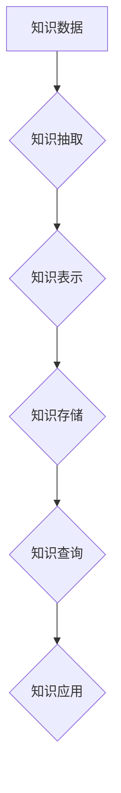

                 

## 知识图谱在知识管理系统中的应用

> 关键词：知识图谱、知识管理系统、知识表示、推理、查询、语义网络、机器学习、人工智能

## 1. 背景介绍

随着信息爆炸时代的到来，海量数据涌现，传统的文本搜索和信息检索方式已难以满足人们对知识的获取和利用需求。知识管理系统 (KMS) 应运而生，旨在帮助组织收集、存储、组织、共享和利用知识资产。然而，传统的 KMS 往往依赖于结构化数据和人工编目，难以处理海量非结构化数据和复杂知识关系。

知识图谱 (Knowledge Graph, KG) 作为一种新型的知识表示形式，以图的形式表示知识，将实体和关系作为节点和边，有效地捕捉和表达知识之间的复杂关联。它为知识管理系统提供了新的思路和技术手段，能够更好地处理海量数据、挖掘隐含知识和支持智能化知识服务。

## 2. 核心概念与联系

### 2.1 知识图谱

知识图谱是一种基于图结构的知识表示形式，它将知识表示为实体和关系的网络。

* **实体 (Entity):**  知识图谱中的基本单元，代表现实世界中的事物或概念，例如人、地点、事件等。
* **关系 (Relation):**  连接实体的桥梁，描述实体之间的各种属性和联系，例如“出生于”、“工作于”、“拥有”等。
* **属性 (Property):**  描述实体的特征，例如姓名、年龄、职位等。

### 2.2 知识管理系统

知识管理系统 (KMS) 是指用于收集、存储、组织、共享和利用知识资产的软件系统。它旨在帮助组织构建和管理知识库，促进知识的创造、传播和应用。

### 2.3 知识图谱与知识管理系统的联系

知识图谱为知识管理系统提供了更强大的知识表示和推理能力，可以有效地解决传统 KMS 面临的挑战，例如：

* **海量数据处理:** 知识图谱可以将海量数据转换为结构化的知识，方便存储和检索。
* **复杂知识关系表达:** 知识图谱可以捕捉和表达实体之间的复杂关系，例如多重关系、层次关系等。
* **知识发现和推理:** 知识图谱可以利用推理算法挖掘隐含知识，例如推断关系、发现模式等。
* **智能化知识服务:** 知识图谱可以为用户提供更智能化的知识服务，例如个性化推荐、智能问答等。

**Mermaid 流程图**



## 3. 核心算法原理 & 具体操作步骤

### 3.1 算法原理概述

知识图谱构建的核心算法主要包括：

* **知识抽取:** 从文本、图像、音频等数据中提取实体和关系。
* **知识表示:** 将提取的实体和关系转换为知识图谱的结构化形式。
* **知识推理:** 利用规则或机器学习模型推断新的知识。
* **知识查询:** 根据用户查询，从知识图谱中检索相关知识。

### 3.2 算法步骤详解

**知识图谱构建步骤:**

1. **数据收集:** 从各种数据源收集相关数据，例如文本、数据库、API等。
2. **数据预处理:** 对收集到的数据进行清洗、格式化和转换，例如去除噪声、标准化实体名称等。
3. **知识抽取:** 利用自然语言处理 (NLP) 技术和机器学习算法从预处理后的数据中提取实体和关系。
4. **知识表示:** 将提取的实体和关系转换为知识图谱的结构化形式，例如 RDF、OWL 等。
5. **知识存储:** 将构建好的知识图谱存储在数据库或知识图谱存储引擎中。
6. **知识推理:** 利用规则或机器学习模型对知识图谱进行推理，推断新的知识。
7. **知识查询:** 提供查询接口，允许用户根据需要查询知识图谱中的信息。

**知识图谱查询步骤:**

1. **用户输入查询:** 用户输入查询语句，例如“查找出生于1980年的中国科学家”。
2. **查询解析:** 将用户输入的查询语句解析为知识图谱查询语言，例如 SPARQL。
3. **查询执行:** 将解析后的查询语句提交给知识图谱存储引擎，执行查询。
4. **结果返回:** 存储引擎返回查询结果，例如符合条件的实体和关系。

### 3.3 算法优缺点

**优点:**

* **表达能力强:** 可以表达复杂的关系和知识结构。
* **可扩展性好:** 可以不断添加新的实体和关系。
* **可推理性强:** 可以利用推理算法挖掘隐含知识。

**缺点:**

* **构建成本高:** 需要大量的数据和人工标注。
* **推理效率低:** 对于大型知识图谱，推理效率可能较低。
* **可解释性差:** 一些推理结果可能难以解释。

### 3.4 算法应用领域

知识图谱的应用领域非常广泛，例如：

* **搜索引擎:** 提升搜索结果的准确性和相关性。
* **问答系统:** 提供更智能化的问答服务。
* **推荐系统:** 提供个性化的商品、内容和服务推荐。
* **医疗诊断:** 辅助医生进行疾病诊断和治疗方案制定。
* **金融风险管理:** 识别和评估金融风险。

## 4. 数学模型和公式 & 详细讲解 & 举例说明

### 4.1 数学模型构建

知识图谱可以抽象为一个三元组 (实体, 关系, 实体) 的集合，其中实体和关系分别用节点和边表示。

* **实体:**  用整数表示，例如实体 A 为 1，实体 B 为 2。
* **关系:** 用整数表示，例如关系 “出生于” 为 1，关系 “工作于” 为 2。

知识图谱可以表示为一个图 G = (V, E)，其中：

* **V:** 实体集合，V = {v1, v2, ..., vn}。
* **E:** 关系集合，E = {(v1, r1, v2), (v2, r2, v3), ..., (vn-1, rn, vn)}。

### 4.2 公式推导过程

**路径查询:**

给定知识图谱 G 和两个实体 v1 和 v2，路径查询问题是找到从 v1 到 v2 的所有路径。

**定义:**

* **路径:**  从一个实体到另一个实体的一条边序列。
* **路径长度:**  路径中边的数量。

**算法:**

可以使用深度优先搜索 (DFS) 或广度优先搜索 (BFS) 算法进行路径查询。

**举例:**

假设知识图谱 G 中包含以下三元组:

* (张三, 出生于, 北京)
* (李四, 工作于, 北京)
* (北京, 位于, 中国)

则从张三到李四的路径为:

* (张三, 出生于, 北京) -> (北京, 位于, 中国) -> (李四, 工作于, 北京)

### 4.3 案例分析与讲解

**知识图谱在搜索引擎中的应用:**

知识图谱可以帮助搜索引擎更好地理解用户查询意图，并提供更准确和相关的搜索结果。例如，当用户搜索 “苹果公司” 时，搜索引擎可以利用知识图谱中的信息，返回苹果公司的相关信息，例如公司简介、产品列表、创始人等。

**知识图谱在问答系统中的应用:**

知识图谱可以为问答系统提供丰富的知识库，帮助系统更好地理解用户问题并给出准确的答案。例如，当用户问 “中国首都是哪里？” 时，问答系统可以利用知识图谱中的信息，直接回答 “北京”。

## 5. 项目实践：代码实例和详细解释说明

### 5.1 开发环境搭建

* **操作系统:** Ubuntu 20.04 LTS
* **编程语言:** Python 3.8
* **开发工具:** Jupyter Notebook
* **库依赖:**

```python
pip install rdflib networkx
```

### 5.2 源代码详细实现

```python
# 导入必要的库
from rdflib import Graph, Literal, URIRef
from networkx import Graph

# 创建知识图谱
g = Graph()

# 添加实体和关系
g.add((URIRef("http://example.org/person/张三"), Literal("张三"), URIRef("http://example.org/name")))
g.add((URIRef("http://example.org/person/李四"), Literal("李四"), URIRef("http://example.org/name")))
g.add((URIRef("http://example.org/location/北京"), Literal("北京"), URIRef("http://example.org/name")))
g.add((URIRef("http://example.org/relation/出生于"), Literal("出生于"), URIRef("http://example.org/relation")))
g.add((URIRef("http://example.org/person/张三"), URIRef("http://example.org/relation/出生于"), URIRef("http://example.org/location/北京")))

# 将知识图谱转换为网络图
nx_graph = Graph()
for s, p, o in g.triples((None, None, None)):
    nx_graph.add_edge(s, o, relation=p)

# 打印网络图
print(nx_graph.nodes())
print(nx_graph.edges(data=True))
```

### 5.3 代码解读与分析

* **导入库:** 导入 rdflib 和 networkx 库，用于处理知识图谱和网络图。
* **创建知识图谱:** 创建一个 rdflib 的 Graph 对象，用于存储知识图谱。
* **添加实体和关系:** 使用 rdflib 的 add() 方法添加实体和关系到知识图谱中。
* **转换为网络图:** 使用 networkx 的 Graph 对象，将知识图谱转换为网络图。
* **打印网络图:** 打印网络图的节点和边信息。

### 5.4 运行结果展示

运行代码后，将输出知识图谱中的实体和关系，以及它们之间的连接关系。

## 6. 实际应用场景

### 6.1  医疗领域

* **疾病诊断辅助:** 利用知识图谱存储疾病症状、病因、治疗方案等信息，辅助医生进行疾病诊断。
* **个性化医疗:** 根据患者的病史、基因信息等构建个性化的知识图谱，为患者提供个性化的治疗方案。
* **药物研发:** 利用知识图谱分析药物的结构、作用机制、副作用等信息，加速药物研发过程。

### 6.2  金融领域

* **风险管理:** 利用知识图谱分析金融数据的关联关系，识别和评估金融风险。
* **欺诈检测:** 利用知识图谱分析交易行为的异常模式，识别和预防金融欺诈。
* **客户服务:** 利用知识图谱构建客户知识库，为客户提供更智能化的服务。

### 6.3  教育领域

* **知识发现:** 利用知识图谱挖掘教育资源中的隐含知识，例如课程之间的关联关系、学习路径等。
* **个性化学习:** 根据学生的学习情况构建个性化的知识图谱，为学生提供个性化的学习内容和学习路径。
* **智能问答:** 利用知识图谱构建教育领域的智能问答系统，帮助学生解决学习问题。

### 6.4 未来应用展望

随着人工智能技术的发展，知识图谱的应用场景将更加广泛，例如：

* **智能城市:** 利用知识图谱构建城市信息模型，实现城市管理的智能化。
* **智能制造:** 利用知识图谱优化生产流程，提高生产效率。
* **虚拟现实:** 利用知识图谱构建虚拟世界的知识库，为用户提供更沉浸式的体验。

## 7. 工具和资源推荐

### 7.1 学习资源推荐

* **书籍:**
    * 《知识图谱技术》
    * 《图数据库》
* **在线课程:**
    * Coursera: Knowledge Graphs
    * edX: Introduction to Knowledge Graphs

### 7.2 开发工具推荐

* **知识图谱构建工具:**
    * Apache Jena
    * Stardog
* **知识图谱查询工具:**
    * SPARQL
    * Gremlin

### 7.3 相关论文推荐

* **构建知识图谱:**
    * “A Survey on Knowledge Graph Construction”
* **知识图谱推理:**
    * “Knowledge Graph Reasoning: A Survey”
* **知识图谱应用:**
    * “Knowledge Graphs for Artificial Intelligence”

## 8. 总结：未来发展趋势与挑战

### 8.1 研究成果总结

知识图谱技术近年来取得了显著进展，在知识表示、推理、查询等方面取得了突破性进展。

### 8.2 未来发展趋势

* **自动化构建:** 利用机器学习和深度学习技术，自动构建知识图谱。
* **跨语言知识图谱:** 建立跨语言的知识图谱，实现跨语言知识共享。
* **动态更新:** 建立动态更新的知识图谱，能够及时反映知识的变化。

### 8.3 面临的挑战

* **数据质量:** 知识图谱的构建依赖于高质量的数据，数据质量问题是知识图谱构建面临的重大挑战。
* **推理效率:** 对于大型知识图谱，推理效率仍然是一个难题。
* **可解释性:** 一些知识图谱推理结果难以解释，缺乏可解释性。

### 8.4 研究展望

未来，知识图谱技术将继续朝着自动化、智能化、可解释化方向发展，并将在更多领域发挥重要作用。

## 9. 附录：常见问题与解答

**Q1: 知识图谱和数据库有什么区别？**

**A1:** 知识图谱和数据库都是用于存储数据的系统，但它们在数据结构和应用场景上有所不同。数据库通常存储结构化数据，例如表格数据，而知识图谱则存储知识，以实体和关系的形式表示。

**Q2: 如何构建知识图谱？**

**A2:** 构建知识图谱需要以下步骤:

1. 数据收集
2. 数据预处理
3. 知识抽取
4. 知识表示
5. 知识存储
6. 知识推理
7. 知识查询

**Q3: 知识图谱有哪些应用场景？**

**A3:** 知识图谱的应用场景非常广泛，例如:

* 搜索引擎
* 问答系统
* 推荐系统
* 医疗诊断
* 金融风险管理
* 教育领域


作者：禅与计算机程序设计艺术 / Zen and the Art of Computer Programming<end_of_turn>

