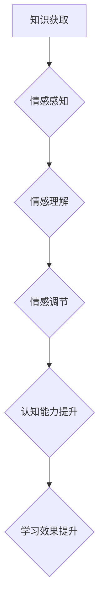

                 

## 知识的情感维度：情感智能在学习中的作用

> 关键词：情感智能、学习、深度学习、自然语言处理、认知科学、教育科技、机器学习、情感识别

## 1. 背景介绍

在信息爆炸的时代，知识的获取变得前所未有便捷，然而，单纯的知识积累并不能保证学习的有效性和深度理解。学习是一个复杂的过程，它不仅涉及认知能力，更与个体的情感体验息息相关。情感智能（Emotional Intelligence，EI）作为一种能够感知、理解和管理情感的能力，在学习过程中扮演着至关重要的角色。

传统的教育模式往往侧重于知识的传递和技能的训练，而忽略了情感因素的影响。然而，越来越多的研究表明，情感能够显著影响学习者的注意力、记忆、理解和创造力等认知过程。当学习者处于积极的情感状态时，他们更容易投入学习，保持专注，并能够更好地理解和记忆知识。反之，负面情绪如焦虑、恐惧和压力，则会阻碍学习者的认知功能，降低学习效率。

## 2. 核心概念与联系

情感智能的核心概念包括自我意识、自我管理、社交意识和关系管理。

* **自我意识:** 理解和识别自己的情感，以及这些情感对自己的影响。
* **自我管理:**  有效地管理自己的情绪，并将其转化为积极的行为。
* **社交意识:**  理解他人的情感，并能够准确地解读他们的情绪表达。
* **关系管理:**  建立和维护良好的人际关系，并能够有效地与他人沟通和合作。

**情感智能与学习的关系**


**Mermaid 流程图:**



## 3. 核心算法原理 & 具体操作步骤

### 3.1  算法原理概述

情感智能算法的核心是利用机器学习技术，从文本、语音、图像等数据中识别和分析情感信息。常见的算法包括：

* **情感分类算法:**  将文本或语音数据分类为不同的情感类别，如正面、负面、中性等。
* **情感强度分析算法:**  量化情感的强度，例如，判断一个评论是“非常高兴”还是“稍微高兴”。
* **情感细粒度分类算法:**  识别更细致的情感类别，例如，快乐、悲伤、愤怒、恐惧等。

### 3.2  算法步骤详解

1. **数据收集:** 收集包含情感信息的文本、语音、图像等数据。
2. **数据预处理:** 对数据进行清洗、格式化和转换，例如，去除停用词、标点符号，并将文本转换为向量表示。
3. **特征提取:** 从数据中提取情感相关的特征，例如，词语的语义、词频、语气等。
4. **模型训练:** 利用机器学习算法，训练情感识别模型。
5. **模型评估:**  使用测试数据评估模型的性能，例如，准确率、召回率、F1-score等。
6. **模型部署:** 将训练好的模型部署到实际应用场景中。

### 3.3  算法优缺点

**优点:**

* 能够自动识别和分析情感信息，提高效率。
* 可以处理大量的数据，发现隐藏的情感模式。
* 可以应用于各种场景，例如，社交媒体监控、客户服务、教育评估等。

**缺点:**

* 算法的准确性依赖于训练数据的质量。
* 情感识别是一个复杂的任务，算法仍然存在一定的局限性。
* 需要考虑伦理问题，例如，数据隐私和算法偏见。

### 3.4  算法应用领域

* **教育科技:**  根据学生的学习情绪，提供个性化的学习建议和支持。
* **心理健康:**  识别抑郁、焦虑等情绪问题，并提供相应的干预措施。
* **市场营销:**  分析客户的情感反馈，改进产品和服务。
* **人机交互:**  开发更加人性化的智能系统，能够理解和响应用户的情感需求。

## 4. 数学模型和公式 & 详细讲解 & 举例说明

### 4.1  数学模型构建

情感识别算法通常基于深度学习模型，例如，循环神经网络（RNN）和卷积神经网络（CNN）。这些模型能够学习文本或语音数据的复杂特征，并将其映射到情感类别。

### 4.2  公式推导过程

深度学习模型的训练过程涉及到大量的数学公式，例如，损失函数、梯度下降算法等。这些公式的推导过程较为复杂，需要一定的数学基础。

### 4.3  案例分析与讲解

例如，可以使用BERT模型进行情感分类。BERT模型是一个基于Transformer架构的预训练语言模型，能够捕捉文本中的长距离依赖关系。

在情感分类任务中，BERT模型可以将文本序列映射到一个情感嵌入空间，然后使用一个分类器将情感嵌入分类为不同的情感类别。

## 5. 项目实践：代码实例和详细解释说明

### 5.1  开发环境搭建

可以使用Python语言和相关的深度学习框架，例如TensorFlow或PyTorch，搭建情感识别项目。

### 5.2  源代码详细实现

```python
import tensorflow as tf

# 定义模型结构
model = tf.keras.Sequential([
    tf.keras.layers.Embedding(input_dim=vocab_size, output_dim=embedding_dim),
    tf.keras.layers.LSTM(units=128),
    tf.keras.layers.Dense(units=num_classes, activation='softmax')
])

# 编译模型
model.compile(optimizer='adam',
              loss='sparse_categorical_crossentropy',
              metrics=['accuracy'])

# 训练模型
model.fit(x_train, y_train, epochs=10)

# 评估模型
loss, accuracy = model.evaluate(x_test, y_test)
print('Loss:', loss)
print('Accuracy:', accuracy)
```

### 5.3  代码解读与分析

这段代码定义了一个基于LSTM神经网络的情感分类模型。

* Embedding层将文本单词映射到一个低维向量空间。
* LSTM层能够捕捉文本序列中的长距离依赖关系。
* Dense层是一个全连接层，用于将情感嵌入分类为不同的情感类别。

### 5.4  运行结果展示

训练完成后，可以使用测试数据评估模型的性能，例如，计算准确率和损失值。

## 6. 实际应用场景

### 6.1  教育领域

* **个性化学习:** 根据学生的学习情绪，提供个性化的学习建议和支持。
* **课堂互动:**  识别学生的课堂参与度和情绪状态，帮助老师及时调整教学策略。
* **在线学习平台:**  为在线学习平台提供情感反馈机制，帮助学生更好地理解和掌握知识。

### 6.2  心理健康领域

* **情绪监测:**  识别抑郁、焦虑等情绪问题，并提供相应的干预措施。
* **心理咨询:**  开发基于情感智能的聊天机器人，为用户提供心理咨询服务。
* **精神疾病诊断:**  辅助医生诊断精神疾病，并提供个性化的治疗方案。

### 6.3  市场营销领域

* **客户服务:**  分析客户的情感反馈，改进产品和服务。
* **广告投放:**  根据用户的兴趣和情绪，进行精准的广告投放。
* **市场调研:**  分析用户对产品的评价和反馈，帮助企业了解市场需求。

### 6.4  未来应用展望

随着人工智能技术的不断发展，情感智能在学习中的应用将更加广泛和深入。未来，我们可以期待：

* **更加智能化的学习助手:**  能够根据学生的学习进度和情绪状态，提供更加个性化和有效的学习支持。
* **更加人性化的教育环境:**  能够营造更加积极和鼓励的学习氛围，帮助学生更好地发挥潜能。
* **更加精准的学习评估:**  能够更加准确地评估学生的学习成果，并提供针对性的改进建议。

## 7. 工具和资源推荐

### 7.1  学习资源推荐

* **书籍:**
    * 《情感智能》（Daniel Goleman）
    * 《深度学习》（Ian Goodfellow, Yoshua Bengio, Aaron Courville）
* **在线课程:**
    * Coursera:  深度学习
    * edX:  情感智能

### 7.2  开发工具推荐

* **Python:**  一个常用的编程语言，广泛应用于人工智能领域。
* **TensorFlow:**  一个开源的深度学习框架，提供丰富的工具和资源。
* **PyTorch:**  另一个开源的深度学习框架，以其灵活性和易用性而闻名。

### 7.3  相关论文推荐

* **BERT: Pre-training of Deep Bidirectional Transformers for Language Understanding**
* **Attention Is All You Need**
* **Recurrent Neural Networks for Sequence Learning**

## 8. 总结：未来发展趋势与挑战

### 8.1  研究成果总结

情感智能在学习中的应用取得了显著的进展，例如，能够识别学生的学习情绪、提供个性化的学习建议、评估学生的学习成果等。

### 8.2  未来发展趋势

未来，情感智能在学习中的应用将更加智能化、个性化和深入。

* **更加精准的情感识别:**  开发更加精准的情感识别算法，能够识别更加细致的情感类别。
* **更加个性化的学习支持:**  根据学生的学习情绪和需求，提供更加个性化的学习建议和支持。
* **更加智能化的学习环境:**  开发更加智能化的学习环境，能够根据学生的学习状态，自动调整教学策略和学习内容。

### 8.3  面临的挑战

* **数据隐私和安全:**  情感识别算法需要处理大量的个人数据，因此需要确保数据隐私和安全。
* **算法偏见:**  情感识别算法可能存在算法偏见，例如，对不同性别、种族或文化背景的个体进行不公平的识别。
* **伦理问题:**  情感智能在学习中的应用可能引发一些伦理问题，例如，是否应该使用情感数据来评估学生的学习能力。

### 8.4  研究展望

未来，需要进一步研究情感智能在学习中的应用，解决上述挑战，并探索其在教育领域的更多可能性。


## 9. 附录：常见问题与解答

**Q1: 情感智能算法的准确性如何？**

A1: 情感识别算法的准确性取决于训练数据的质量、算法模型的复杂度和评估指标的选择。目前，情感识别算法的准确率已经取得了显著的进步，但仍然存在一定的局限性。

**Q2: 情感智能算法会侵犯用户的隐私吗？**

A2: 情感智能算法需要处理用户的个人数据，因此需要采取措施保护用户的隐私和安全。例如，可以使用匿名化技术，加密用户数据，并制定严格的数据使用政策。

**Q3: 情感智能算法会对学生的学习造成负面影响吗？**

A3: 情感智能算法的应用需要谨慎考虑，避免对学生的学习造成负面影响。例如，不应该使用情感数据来评判学生的学习能力，也不应该过度依赖情感智能算法，而忽略了学生的自主学习能力。


作者：禅与计算机程序设计艺术 / Zen and the Art of Computer Programming 
<end_of_turn>

