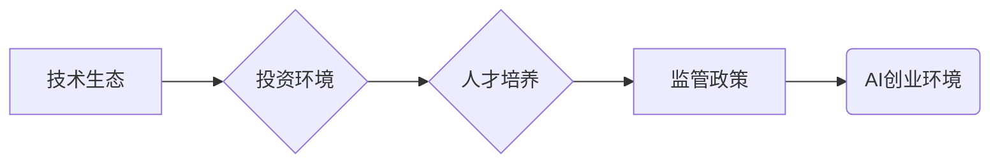

                 

## 硅谷vs中国：AI创业环境的对比

> 关键词：人工智能、AI创业、硅谷、中国、技术生态、投资环境、人才培养、监管政策

### 1. 背景介绍

人工智能（AI）正以惊人的速度发展，其应用领域不断拓展，对全球经济和社会产生深远影响。作为AI技术发展前沿阵地，硅谷和中国都涌现出众多AI创业公司，并取得了显著成就。然而，这两个地区在AI创业环境方面存在着显著差异，这些差异影响着AI技术的创新和发展。本文将从技术生态、投资环境、人才培养、监管政策等方面，对硅谷和中国AI创业环境进行深入对比分析，探讨其各自的优势和劣势，并展望未来发展趋势。

### 2. 核心概念与联系

#### 2.1 AI创业环境概述

AI创业环境是指一个地区或国家为AI创业公司提供支持和发展的整体环境，包括但不限于以下要素：

* **技术生态**: 指AI相关技术、基础设施、工具和平台的成熟度和普及程度。
* **投资环境**: 指AI创业公司获得资金支持的便利程度，包括风险投资、天使投资、政府扶持等。
* **人才培养**: 指AI领域人才的储备量、技能水平和流动性。
* **监管政策**: 指政府对AI技术的研发、应用和伦理问题的监管政策。

#### 2.2  AI创业环境的Mermaid流程图



### 3. 核心算法原理 & 具体操作步骤

#### 3.1  算法原理概述

深度学习是AI领域的核心算法之一，其原理是通过多层神经网络模拟人类大脑的学习过程，从海量数据中提取特征和知识。深度学习算法的应用范围广泛，包括图像识别、自然语言处理、语音识别等。

#### 3.2  算法步骤详解

1. **数据预处理**: 将原始数据进行清洗、转换和格式化，使其适合深度学习算法的训练。
2. **网络结构设计**: 根据具体任务选择合适的深度学习网络结构，例如卷积神经网络（CNN）、循环神经网络（RNN）等。
3. **模型训练**: 使用训练数据训练深度学习模型，通过调整模型参数，使模型的预测结果与真实值尽可能接近。
4. **模型评估**: 使用测试数据评估模型的性能，例如准确率、召回率、F1-score等。
5. **模型部署**: 将训练好的模型部署到实际应用场景中，用于进行预测或决策。

#### 3.3  算法优缺点

**优点**:

* 能够从海量数据中自动提取特征，无需人工特征工程。
* 性能优异，在许多任务中取得了人类水平甚至超越人类水平的成果。

**缺点**:

* 训练数据量大，对计算资源要求高。
* 模型解释性差，难以理解模型的决策过程。
* 容易受到数据偏差的影响，导致模型存在偏见。

#### 3.4  算法应用领域

* **图像识别**: 人脸识别、物体检测、图像分类等。
* **自然语言处理**: 机器翻译、文本摘要、情感分析等。
* **语音识别**: 语音转文本、语音助手等。
* **推荐系统**: 商品推荐、内容推荐等。
* **医疗诊断**: 影像分析、疾病预测等。

### 4. 数学模型和公式 & 详细讲解 & 举例说明

#### 4.1  数学模型构建

深度学习模型通常采用多层神经网络结构，每个神经元接收多个输入信号，并通过激活函数进行处理，输出一个信号。神经网络的训练过程是通过调整神经元权重和偏置，使模型的输出与真实值尽可能接近。

#### 4.2  公式推导过程

深度学习模型的训练过程通常使用反向传播算法，该算法通过计算误差梯度，逐步调整神经元权重和偏置。

**损失函数**: 用于衡量模型预测结果与真实值的差距。常见的损失函数包括均方误差（MSE）、交叉熵损失（Cross-Entropy Loss）等。

**梯度下降**: 用于更新神经元权重和偏置的优化算法。

#### 4.3  案例分析与讲解

例如，在图像分类任务中，可以使用卷积神经网络（CNN）作为深度学习模型。CNN的结构包含多个卷积层、池化层和全连接层。卷积层用于提取图像特征，池化层用于降低特征维度，全连接层用于分类。

训练CNN模型时，需要使用大量的图像数据，并通过反向传播算法调整模型参数，使模型能够准确地识别图像中的物体类别。

### 5. 项目实践：代码实例和详细解释说明

#### 5.1  开发环境搭建

使用Python语言开发深度学习项目，需要安装以下软件包：

* TensorFlow 或 PyTorch：深度学习框架。
* NumPy：数值计算库。
* Matplotlib 或 Seaborn：数据可视化库。

#### 5.2  源代码详细实现

以下是一个简单的图像分类示例代码，使用TensorFlow框架实现：

```python
import tensorflow as tf

# 定义模型结构
model = tf.keras.models.Sequential([
    tf.keras.layers.Conv2D(32, (3, 3), activation='relu', input_shape=(28, 28, 1)),
    tf.keras.layers.MaxPooling2D((2, 2)),
    tf.keras.layers.Conv2D(64, (3, 3), activation='relu'),
    tf.keras.layers.MaxPooling2D((2, 2)),
    tf.keras.layers.Flatten(),
    tf.keras.layers.Dense(10, activation='softmax')
])

# 编译模型
model.compile(optimizer='adam',
              loss='sparse_categorical_crossentropy',
              metrics=['accuracy'])

# 训练模型
model.fit(x_train, y_train, epochs=5)

# 评估模型
loss, accuracy = model.evaluate(x_test, y_test)
print('Test loss:', loss)
print('Test accuracy:', accuracy)
```

#### 5.3  代码解读与分析

这段代码定义了一个简单的卷积神经网络模型，用于图像分类任务。模型包含两个卷积层、两个池化层、一个全连接层和一个输出层。

* `tf.keras.models.Sequential`：定义一个顺序模型，层级结构清晰。
* `tf.keras.layers.Conv2D`：卷积层，用于提取图像特征。
* `tf.keras.layers.MaxPooling2D`：池化层，用于降低特征维度。
* `tf.keras.layers.Flatten`：将多维特征转换为一维向量。
* `tf.keras.layers.Dense`：全连接层，用于分类。
* `tf.keras.optimizers.Adam`：优化算法，用于调整模型参数。
* `tf.keras.losses.sparse_categorical_crossentropy`：损失函数，用于衡量模型预测结果与真实值的差距。
* `model.fit`：训练模型。
* `model.evaluate`：评估模型。

#### 5.4  运行结果展示

训练完成后，可以使用测试数据评估模型的性能，例如准确率。

### 6. 实际应用场景

#### 6.1  医疗诊断

AI技术在医疗诊断领域应用广泛，例如：

* **影像分析**: 使用深度学习算法分析X光片、CT扫描和MRI图像，辅助医生诊断疾病。
* **疾病预测**: 基于患者的医疗历史、基因信息和生活习惯等数据，预测患者患病风险。

#### 6.2  金融服务

AI技术在金融服务领域应用也越来越广泛，例如：

* **欺诈检测**: 使用机器学习算法分析交易数据，识别异常交易行为，防止欺诈。
* **风险管理**: 基于客户数据和市场数据，评估投资风险，制定风险管理策略。

#### 6.3  智能制造

AI技术在智能制造领域应用可以提高生产效率和产品质量，例如：

* **设备故障预测**: 使用传感器数据分析设备运行状态，预测设备故障，进行及时维护。
* **质量控制**: 使用计算机视觉技术对产品进行检测，识别缺陷，提高产品质量。

#### 6.4  未来应用展望

随着AI技术的不断发展，其应用场景将更加广泛，例如：

* **个性化教育**: 根据学生的学习情况，提供个性化的学习内容和教学方法。
* **自动驾驶**: 使用深度学习算法训练自动驾驶系统，实现无人驾驶汽车。
* **虚拟助手**: 开发更加智能的虚拟助手，能够理解自然语言，并提供更精准的帮助。

### 7. 工具和资源推荐

#### 7.1  学习资源推荐

* **在线课程**: Coursera、edX、Udacity等平台提供丰富的AI课程。
* **书籍**: 《深度学习》、《机器学习实战》等书籍是AI学习的经典教材。
* **开源项目**: TensorFlow、PyTorch等开源项目提供了丰富的代码示例和学习资源。

#### 7.2  开发工具推荐

* **深度学习框架**: TensorFlow、PyTorch、Keras等框架提供了丰富的工具和API，方便开发AI应用。
* **数据处理工具**: Pandas、NumPy等工具方便处理和分析数据。
* **可视化工具**: Matplotlib、Seaborn等工具方便可视化数据和模型结果。

#### 7.3  相关论文推荐

* **《ImageNet Classification with Deep Convolutional Neural Networks》**: 
介绍了AlexNet模型，标志着深度学习在图像识别领域的突破。
* **《Attention Is All You Need》**: 
提出了Transformer模型，在自然语言处理领域取得了重大进展。
* **《Generative Adversarial Networks》**: 
介绍了生成对抗网络（GAN）的思想，在图像生成、文本生成等领域具有广泛应用。

### 8. 总结：未来发展趋势与挑战

#### 8.1  研究成果总结

近年来，AI技术取得了显著进展，在图像识别、自然语言处理、语音识别等领域取得了人类水平甚至超越人类水平的成果。深度学习算法成为AI领域的核心算法，并被广泛应用于各个领域。

#### 8.2  未来发展趋势

* **模型规模和能力的提升**: 未来AI模型将更加庞大，拥有更强的学习能力和推理能力。
* **跨模态学习**: AI模型将能够处理多种模态数据，例如文本、图像、音频等，实现更全面的理解和交互。
* **边缘计算**: AI模型将部署到边缘设备，实现更快速的响应和更低的延迟。
* **可解释性**: 研究如何提高AI模型的可解释性，使其决策过程更加透明和可理解。

#### 8.3  面临的挑战

* **数据获取和隐私保护**: AI模型的训练需要海量数据，如何获取高质量数据并保护用户隐私是一个重要挑战。
* **算法偏见**: AI模型容易受到训练数据中的偏见影响，导致模型存在偏见，需要研究如何解决算法偏见问题。
* **伦理问题**: AI技术的应用引发了伦理问题，例如算法透明度、责任归属等，需要制定相应的伦理规范和法律法规。

#### 8.4  研究展望

未来AI研究将更加注重模型的安全性、可靠性和可解释性，并探索AI与人类更加紧密协作的模式。


### 9. 附录：常见问题与解答

#### 9.1  Q1: 深度学习算法的训练需要多少数据？

**A1**: 深度学习算法的训练数据量取决于模型的复杂度和任务的难度。一般来说，需要至少几千到几百万个样本才能训练出一个有效的模型。

#### 9.2  Q2: 如何解决AI模型的算法偏见问题？

**A2**: 解决AI模型的算法偏见问题需要从多个方面入手，例如：

* 使用更加多样化的训练数据，减少数据中的偏见。
* 在模型设计和训练过程中，加入公平性约束，例如限制模型对某些特征的依赖。
* 对模型的输出进行评估和监控，及时发现和解决偏见问题。

#### 9.3  Q3: AI技术对未来社会有哪些影响？

**A3**: AI技术对未来社会的影响是多方面的，既有积极的一面，也有潜在的风险。

**积极影响**:

* 提高生产效率，创造新的就业机会。
* 改善医疗保健、教育和生活质量。
* 推动科学技术进步，解决人类面临的重大挑战。

**潜在风险**:

* 加剧社会不平等，导致失业问题。
* 侵犯个人隐私，引发伦理问题。
* 被用于恶意目的，例如制造假新闻、进行网络攻击。

因此，我们需要积极应对AI技术的挑战，确保其安全、可持续地发展，造福人类社会。


作者：禅与计算机程序设计艺术 / Zen and the Art of Computer Programming 
<end_of_turn>

