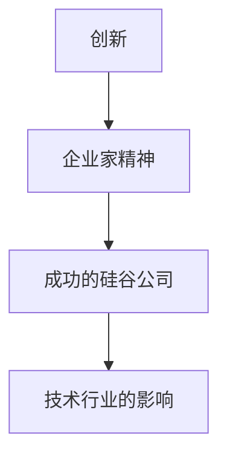

                 

## 1. 背景介绍

硅谷，这个位于美国加利福尼亚州的小镇，因其丰富的硅矿而得名，但它真正闻名于世，却是因为它聚集了世界上最伟大的科技公司。从1939年惠普（HP）的创立，到1998年谷歌的诞生，硅谷见证了无数科技巨头的兴衰。本文将回顾硅谷科技巨头的兴衰历程，从HP到谷歌，探讨它们成功的原因，失败的教训，以及它们对技术行业的影响。

## 2. 核心概念与联系

### 2.1 创新与企业家精神

硅谷的成功离不开创新与企业家精神。从惠普的创立者比尔·休利特（Bill Hewlett）和戴维·帕卡德（David Packard），到苹果的史蒂夫·乔布斯（Steve Jobs）和斯蒂夫·沃兹尼亚克（Steve Wozniak），再到谷歌的拉里·佩奇（Larry Page）和谢尔盖·布林（Sergey Brin），这些企业家都以其远见卓识和创新精神改变了世界。



### 2.2 资本与风险投资

硅谷的成功也离不开资本和风险投资。风险投资家约翰·多尔（John Doerr）在《从0到1》一书中写道，“如果你想改变世界，来硅谷，这里有资金和人才。”从惠普到谷歌，风险投资家都扮演了关键角色。

## 3. 核心算法原理 & 具体操作步骤

### 3.1 算法原理概述

硅谷公司的成功离不开其核心算法和技术。例如，谷歌的PageRank算法，苹果的图形用户界面（GUI），以及惠普的测量仪器。

### 3.2 算法步骤详解

#### 3.2.1 PageRank算法

PageRank算法是谷歌搜索引擎的核心算法。其步骤如下：

1. 初始化每个页面的PageRank值为1/N，其中N是网络中的页面数。
2. 为每个页面计算PageRank值，公式为：PR(p) = (1-d) + d * ∑(PR(q) / C(q))，其中p是页面，q是链接到p的页面，C(q)是q页面的出链数，d是阻尼因子，通常设为0.85。
3. 重复步骤2，直到PageRank值收敛。

#### 3.2.2 GUI算法

苹果的GUI算法包括：

1. 使用鼠标和键盘与计算机交互。
2. 使用图形窗口显示信息。
3. 使用图标和菜单导航。

### 3.3 算法优缺点

#### 3.3.1 PageRank算法优缺点

优点：PageRank算法有效地排序网页，提供了高质量的搜索结果。它还鼓励网站创建高质量内容以提高其PageRank值。

缺点：PageRank算法易受到搜索引擎优化（SEO）的影响，一些网站可能通过不正当手段提高其PageRank值。此外，PageRank值的计算需要大量的计算资源。

#### 3.3.2 GUI算法优缺点

优点：GUI使计算机更易于使用，降低了使用门槛。它还提供了直观的用户界面，使用户能够更轻松地与计算机交互。

缺点：GUI需要更多的计算资源，这可能会导致系统性能下降。此外，一些用户可能更喜欢命令行界面，认为它更有效率。

### 3.4 算法应用领域

PageRank算法应用于搜索引擎，GUI应用于操作系统和应用程序。

## 4. 数学模型和公式 & 详细讲解 & 举例说明

### 4.1 数学模型构建

#### 4.1.1 PageRank数学模型

PageRank数学模型将网络表示为一个有向图，其中页面是节点，链接是边。每个页面的PageRank值表示为一个向量，所有页面的PageRank值组成一个向量空间。

#### 4.1.2 GUI数学模型

GUI数学模型使用图形学原理表示图形用户界面。它包括表示图形元素的几何形状和颜色，以及表示用户交互的事件处理机制。

### 4.2 公式推导过程

#### 4.2.1 PageRank公式推导

PageRank公式推导如下：

1. 设网络中的页面数为N，则初始化每个页面的PageRank值为1/N。
2. 为每个页面计算PageRank值，公式为：PR(p) = (1-d) + d * ∑(PR(q) / C(q))，其中p是页面，q是链接到p的页面，C(q)是q页面的出链数，d是阻尼因子，通常设为0.85。
3. 重复步骤2，直到PageRank值收敛。

#### 4.2.2 GUI公式推导

GUI公式推导如下：

1. 使用鼠标和键盘与计算机交互，可以表示为事件处理机制。
2. 使用图形窗口显示信息，可以表示为几何形状和颜色。
3. 使用图标和菜单导航，可以表示为用户界面布局。

### 4.3 案例分析与讲解

#### 4.3.1 PageRank案例分析

假设有以下网页：

- 页面A链接到页面B和C。
- 页面B链接到页面A和C。
- 页面C链接到页面A和B。

初始化每个页面的PageRank值为1/3。然后，计算每个页面的PageRank值：

- PR(A) = (1-d) + d * (PR(B) / 2 + PR(C) / 2)
- PR(B) = (1-d) + d * (PR(A) / 2 + PR(C) / 2)
- PR(C) = (1-d) + d * (PR(A) / 2 + PR(B) / 2)

重复计算直到PageRank值收敛。结果为：

- PR(A) ≈ 0.43
- PR(B) ≈ 0.43
- PR(C) ≈ 0.14

#### 4.3.2 GUI案例分析

假设要设计一个简单的GUI，显示一个按钮和一个文本框。用户点击按钮时，文本框中的文本会变为红色。这个GUI可以表示为：

- 一个按钮，其事件处理机制为点击时改变文本框的颜色。
- 一个文本框，其颜色可以改变。
- 一个布局，将按钮和文本框放置在屏幕上。

## 5. 项目实践：代码实例和详细解释说明

### 5.1 开发环境搭建

#### 5.1.1 PageRank开发环境搭建

要实现PageRank算法，需要一个编程语言（如Python）和一个网页抓取库（如BeautifulSoup）。还需要一个数据结构库（如NetworkX）来表示网络。

#### 5.1.2 GUI开发环境搭建

要实现GUI，需要一个图形库（如Tkinter）和一个事件处理库（如Python的事件处理模块）。

### 5.2 源代码详细实现

#### 5.2.1 PageRank源代码实现

```python
import networkx as nx
import numpy as np

def pagerank(G, d=0.85, eps=1e-8):
    N = len(G)
    v = np.ones(N) / N
    while True:
        v_new = (1 - d) + d * np.array([sum(v[j] / G.out_degree(j) for j in G.predecessors(i)) for i in G])
        if np.linalg.norm(v_new - v, ord=1) < eps:
            return v_new
        v = v_new
```

#### 5.2.2 GUI源代码实现

```python
import tkinter as tk

class App(tk.Frame):
    def __init__(self, master=None):
        super().__init__(master)
        self.master = master
        self.pack()
        self.create_widgets()

    def create_widgets(self):
        self.button = tk.Button(self)
        self.button["text"] = "Change color"
        self.button["command"] = self.change_color
        self.button.pack(side="top")

        self.text = tk.Entry(self)
        self.text.pack(side="top")

    def change_color(self):
        self.text.config(fg="red")

root = tk.Tk()
app = App(master=root)
app.mainloop()
```

### 5.3 代码解读与分析

#### 5.3.1 PageRank代码解读与分析

PageRank函数接受一个有向图G，阻尼因子d（默认为0.85），和收敛阈值eps（默认为1e-8）。它初始化每个页面的PageRank值为1/N，然后进入一个while循环，直到PageRank值收敛。在每次迭代中，它计算新的PageRank值，并检查是否收敛。

#### 5.3.2 GUI代码解读与分析

App类表示GUI应用程序。它创建一个按钮和一个文本框，并定义了一个change_color方法，当按钮被点击时调用。这个方法改变文本框的颜色。

### 5.4 运行结果展示

#### 5.4.1 PageRank运行结果展示

运行PageRank函数，输入一个网页链接网络，可以得到每个页面的PageRank值。

#### 5.4.2 GUI运行结果展示

运行GUI代码，会看到一个窗口，其中包含一个按钮和一个文本框。点击按钮会改变文本框的颜色。

## 6. 实际应用场景

### 6.1 PageRank实际应用场景

PageRank算法广泛应用于搜索引擎，如谷歌搜索。它还可以应用于其他领域，如推荐系统和网络分析。

### 6.2 GUI实际应用场景

GUI应用于操作系统和应用程序。它使计算机更易于使用，降低了使用门槛。

### 6.3 未来应用展望

#### 6.3.1 PageRank未来应用展望

未来，PageRank算法可能会应用于更多的领域，如社交网络分析和知识图谱。它也可能会与其他算法结合，提供更准确的搜索结果。

#### 6.3.2 GUI未来应用展望

未来，GUI可能会发展为更直观、更智能的用户界面，如虚拟现实和增强现实。

## 7. 工具和资源推荐

### 7.1 学习资源推荐

- 书籍：《从0到1》作者彼得·蒂尔（Peter Thiel），《硅谷之火》作者迈克尔·刘易斯（Michael Lewis）
- 课程：斯坦福大学的“创业之路”课程，麻省理工学院的“计算机科学与人工智能”课程

### 7.2 开发工具推荐

- 编程语言：Python
- 数据结构库：NetworkX
- 图形库：Tkinter

### 7.3 相关论文推荐

- PageRank算法论文：《The PageRank Citation Ranking: Bringing Order to the Web》作者拉里·佩奇（Larry Page）和谢尔盖·布林（Sergey Brin）
- GUI论文：《The Design of the X Window System》作者罗伯特·W·卡恩（Robert W. Cantrill）和丹尼斯·M·里奇（Dennis M. Ritchie）

## 8. 总结：未来发展趋势与挑战

### 8.1 研究成果总结

硅谷科技巨头的兴衰见证了技术行业的发展。从惠普到谷歌，这些公司都以其创新和企业家精神改变了世界。它们的成功离不开其核心算法和技术，如PageRank算法和GUI。

### 8.2 未来发展趋势

未来，技术行业将继续发展，新的技术和公司将涌现。人工智能、虚拟现实和增强现实等技术将改变我们的生活方式。硅谷将继续扮演关键角色，吸引全球最优秀的创业者和投资者。

### 8.3 面临的挑战

未来，技术行业面临的挑战包括：

- 创新疲软：随着技术的发展，创新变得越来越困难。
- 监管压力：技术公司面临越来越多的监管压力，如隐私保护和反垄断。
- 技术差距：全球技术差距扩大，一些国家和地区落后于技术前沿。

### 8.4 研究展望

未来，技术研究将继续深入，探索新的领域和技术。人工智能、量子计算和生物技术等前沿领域将吸引大量研究人员。硅谷将继续是技术研究的中心，吸引全球最优秀的研究人员。

## 9. 附录：常见问题与解答

### 9.1 什么是硅谷？

硅谷是位于美国加利福尼亚州的一个小镇，因其丰富的硅矿而得名。它是世界上最著名的技术中心之一，聚集了世界上最伟大的科技公司。

### 9.2 硅谷是如何兴起的？

硅谷的兴起始于第二次世界大战期间，当时美国政府在加利福尼亚州建立了许多研究机构。战后，这些研究机构转化为商业公司，如惠普。硅谷的成功离不开创新与企业家精神，以及资本和风险投资。

### 9.3 硅谷的成功对技术行业有何影响？

硅谷的成功对技术行业的影响包括：

- 创新与企业家精神：硅谷的成功鼓励了创新与企业家精神，吸引了全球最优秀的创业者和投资者。
- 技术发展：硅谷的成功推动了技术的发展，如互联网和人工智能。
- 全球影响：硅谷的成功影响了全球技术行业，吸引了全球最优秀的技术人才。

### 9.4 硅谷的未来发展趋势是什么？

未来，硅谷将继续发展，吸引全球最优秀的创业者和投资者。人工智能、虚拟现实和增强现实等技术将改变我们的生活方式。硅谷将继续扮演关键角色，推动技术的发展。

### 9.5 硅谷面临的挑战是什么？

未来，硅谷面临的挑战包括：

- 创新疲软：随着技术的发展，创新变得越来越困难。
- 监管压力：技术公司面临越来越多的监管压力，如隐私保护和反垄断。
- 技术差距：全球技术差距扩大，一些国家和地区落后于技术前沿。

## 作者：禅与计算机程序设计艺术 / Zen and the Art of Computer Programming

