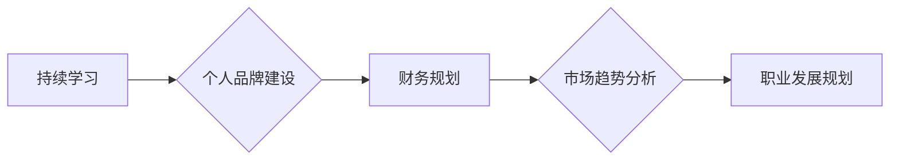

                 

## 程序员如何应对行业薪资波动

> 关键词：薪资波动、程序员职业发展、技术技能提升、个人品牌建设、财务规划、市场趋势分析、职业转型

## 1. 背景介绍

近年来，科技行业经历了快速发展，程序员作为核心人才，薪资水平也随之大幅提升。然而，行业发展并非一帆风顺，市场需求、经济环境、技术迭代等因素都会导致薪资水平出现波动。对于程序员来说，如何应对行业薪资波动，保障自身职业发展和经济稳定，成为一个重要的课题。

### 1.1 行业薪资波动的成因

* **市场需求变化:**  不同技术领域的需求量差异很大，热门技术人才薪资高，而冷门技术人才薪资相对较低。市场需求的波动会导致不同技术领域薪资水平的差异化。
* **经济环境:**  经济衰退、通货膨胀等宏观经济因素会影响企业招聘和薪资水平。
* **技术迭代:**  新技术不断涌现，旧技术逐渐被淘汰，技术技能的更新迭代对程序员的薪资水平有直接影响。
* **公司规模和盈利能力:**  大型企业和盈利能力强的公司通常能提供更高的薪资水平。

### 1.2 薪资波动的对程序员的影响

* **职业焦虑:**  薪资波动会导致程序员产生职业焦虑，担心自身技能过时、无法获得高薪。
* **生活压力:**  薪资下降会影响程序员的生活质量，增加经济压力。
* **职业发展规划:**  薪资波动会影响程序员的职业发展规划，需要不断调整学习方向和职业目标。

## 2. 核心概念与联系

程序员应对行业薪资波动需要从以下几个核心概念入手：

* **持续学习:**  技术技能是程序员的核心竞争力，需要不断学习新技术，提升自身价值。
* **个人品牌建设:**  打造个人品牌，提升自身知名度和影响力，有利于获得更好的职业机会和薪资待遇。
* **财务规划:**  合理规划个人财务，建立储蓄和投资体系，应对薪资波动的风险。
* **市场趋势分析:**  关注行业发展趋势，了解市场需求变化，及时调整职业方向和技能方向。

**Mermaid 流程图:**



## 3. 核心算法原理 & 具体操作步骤

### 3.1 算法原理概述

应对行业薪资波动，本质上是一种“风险管理”和“自我提升”的算法。

* **风险管理:**  通过财务规划、储蓄和投资，降低薪资波动对个人经济的影响。
* **自我提升:**  通过持续学习、技术技能提升和个人品牌建设，提高自身价值，应对市场需求变化。

### 3.2 算法步骤详解

1. **自我评估:**  评估自身技术技能、职业经验、个人品牌等，了解自身优势和劣势。
2. **市场调研:**  关注行业发展趋势、市场需求变化、薪资水平等，了解行业现状和未来发展方向。
3. **技能提升:**  根据市场需求和自身优势，制定技能提升计划，学习新技术、提升现有技能。
4. **个人品牌建设:**  打造个人品牌，提升自身知名度和影响力，可以通过博客写作、开源项目贡献、技术分享等方式。
5. **财务规划:**  制定合理的财务规划，建立储蓄和投资体系，应对薪资波动风险。
6. **职业发展规划:**  根据市场需求和自身发展目标，制定职业发展规划，选择合适的职业方向和发展路径。
7. **持续迭代:**  不断学习、提升、调整，适应行业变化，保持自身竞争力。

### 3.3 算法优缺点

* **优点:**  能够有效降低薪资波动对个人经济的影响，提高自身职业竞争力。
* **缺点:**  需要持续投入时间和精力，学习新技术、提升技能、打造个人品牌都需要付出努力。

### 3.4 算法应用领域

该算法适用于所有程序员，无论经验丰富还是刚入行的程序员，都需要不断学习、提升和适应行业变化。

## 4. 数学模型和公式 & 详细讲解 & 举例说明

### 4.1 数学模型构建

我们可以用一个简单的数学模型来描述程序员的薪资波动风险：

**风险 = (薪资波动幅度) * (个人储蓄比例)**

其中：

* 薪资波动幅度：指薪资水平的上下波动幅度。
* 个人储蓄比例：指个人收入中用于储蓄的比例。

### 4.2 公式推导过程

该公式的推导过程如下：

* 薪资波动幅度越大，风险越高。
* 个人储蓄比例越高，风险越低。

### 4.3 案例分析与讲解

假设程序员A的年薪为10万元，薪资波动幅度为10%，个人储蓄比例为20%。

根据公式，程序员A的薪资波动风险为：

风险 = 0.1 * 100,000 * 0.2 = 2,000 元

如果程序员A的薪资波动幅度为20%，个人储蓄比例为30%，则风险为：

风险 = 0.2 * 100,000 * 0.3 = 6,000 元

从案例分析可以看出，提高个人储蓄比例可以有效降低薪资波动风险。

## 5. 项目实践：代码实例和详细解释说明

### 5.1 开发环境搭建

* 操作系统：Windows/macOS/Linux
* 编程语言：Python
* 工具：Jupyter Notebook

### 5.2 源代码详细实现

```python
# 薪资波动风险计算器

def calculate_risk(salary, fluctuation_rate, savings_rate):
  """
  计算程序员的薪资波动风险。

  Args:
    salary: 年薪
    fluctuation_rate: 薪资波动幅度
    savings_rate: 个人储蓄比例

  Returns:
    薪资波动风险
  """
  risk = fluctuation_rate * salary * savings_rate
  return risk

# 示例数据
salary = 100000
fluctuation_rate = 0.1
savings_rate = 0.2

# 计算风险
risk = calculate_risk(salary, fluctuation_rate, savings_rate)

# 输出结果
print(f"薪资波动风险: {risk} 元")
```

### 5.3 代码解读与分析

该代码实现了一个简单的薪资波动风险计算器。

* `calculate_risk()` 函数接收年薪、薪资波动幅度和个人储蓄比例作为输入参数，并根据公式计算风险值。
* 示例数据设置了年薪为10万元、薪资波动幅度为10%、个人储蓄比例为20%。
* 代码调用 `calculate_risk()` 函数计算风险值，并输出结果。

### 5.4 运行结果展示

```
薪资波动风险: 2000 元
```

## 6. 实际应用场景

程序员应对行业薪资波动需要结合自身情况，制定个性化的策略。

### 6.1 刚入行的程序员

刚入行的程序员应注重基础技能的学习和积累，选择热门技术领域，提升自身竞争力。同时，应积极参与开源项目、技术社区，建立人脉关系，为未来职业发展打下基础。

### 6.2 中高级程序员

中高级程序员应关注技术趋势，不断学习新技术，提升自身价值。可以考虑参与技术分享、博客写作等活动，打造个人品牌，提升知名度和影响力。

### 6.3 资深程序员

资深程序员应发挥自身经验优势，承担更重要的技术责任，例如架构设计、技术领导等。可以考虑创业、投资等方式，拓展职业发展方向。

## 7. 工具和资源推荐

### 7.1 学习资源推荐

* **在线学习平台:**  Coursera、edX、Udemy 等
* **技术博客:**  Hacker News、Medium、GitHub Blog 等
* **技术社区:**  Stack Overflow、Reddit、GitHub 等

### 7.2 开发工具推荐

* **代码编辑器:**  VS Code、Sublime Text、Atom 等
* **版本控制系统:**  Git、GitHub 等
* **云平台:**  AWS、Azure、GCP 等

### 7.3 相关论文推荐

* **《程序员职业发展趋势》**
* **《技术技能的持续学习与提升》**
* **《个人品牌建设与职业发展》**

## 8. 总结：未来发展趋势与挑战

### 8.1 研究成果总结

程序员应对行业薪资波动需要从持续学习、个人品牌建设、财务规划、市场趋势分析等多个方面入手，通过制定个性化的策略，降低风险，提升自身竞争力。

### 8.2 未来发展趋势

* **人工智能、大数据等新兴技术将成为未来程序员的热门技能。**
* **远程工作、自由职业等新型工作模式将更加普及。**
* **程序员需要具备更强的跨领域合作能力和沟通能力。**

### 8.3 面临的挑战

* **技术迭代速度加快，程序员需要不断学习新技术，适应行业变化。**
* **全球化竞争加剧，程序员需要提升自身竞争力，才能获得更好的职业机会。**
* **薪资波动风险仍然存在，程序员需要做好财务规划，应对风险。**

### 8.4 研究展望

未来研究可以进一步探讨：

* 如何更有效地评估程序员的技能水平和职业发展潜力。
* 如何帮助程序员更好地进行职业规划和转型。
* 如何构建更完善的程序员职业发展生态系统。

## 9. 附录：常见问题与解答

### 9.1 如何提高个人储蓄比例？

* 制定合理的预算，控制支出。
* 寻找额外的收入来源，例如兼职、投资等。
* 利用自动化工具，例如定期定额投资，自动进行储蓄。

### 9.2 如何打造个人品牌？

* 积极参与技术社区，分享技术经验。
* 写博客、撰写技术文章，展示自身专业能力。
* 参与开源项目，积累项目经验。

### 9.3 如何应对技术迭代带来的挑战？

* 保持学习热情，不断学习新技术。
* 关注行业发展趋势，了解市场需求变化。
* 提升自身适应能力，勇于尝试新事物。


作者：禅与计算机程序设计艺术 / Zen and the Art of Computer Programming 
<end_of_turn>

