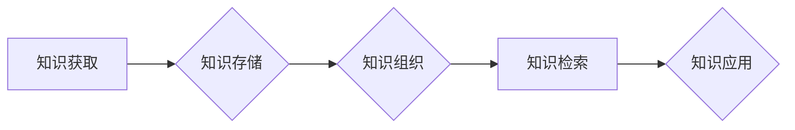

                 

## 程序员如何构建个人知识管理系统(PKM)

> 关键词：个人知识管理系统 (PKM)、知识存储、知识检索、知识组织、笔记软件、知识图谱、机器学习、深度学习

## 1. 背景介绍

在当今信息爆炸的时代，程序员们每天都会接触到大量的技术文档、代码示例、学习资料等信息。如何有效地存储、组织和检索这些知识，成为了程序员提升效率和专业能力的关键问题。个人知识管理系统 (PKM) 正是解决这一问题的有效途径。

PKM 是一种用于个人知识存储、组织和检索的系统，它可以帮助程序员：

* **高效地存储知识**: 将学习到的知识、工作经验、代码片段等信息进行数字化存储，避免信息遗失和重复学习。
* **灵活地组织知识**: 根据自己的学习习惯和工作需求，将知识进行分类、标签和关联，方便快速检索。
* **智能地检索知识**: 利用搜索引擎、知识图谱等技术，快速找到所需的信息，提高工作效率。
* **深度地理解知识**: 通过对知识进行整理、分析和总结，加深对知识的理解和应用。

## 2. 核心概念与联系

PKM 系统的核心概念包括：

* **知识**: 包括程序员学习到的技术知识、工作经验、代码片段等各种信息。
* **存储**: 将知识以数字化形式存储，例如文本文件、图片、视频等。
* **组织**: 将知识进行分类、标签和关联，方便检索和理解。
* **检索**: 利用搜索引擎、知识图谱等技术，快速找到所需的信息。

PKM 系统的架构可以概括为以下流程：



**知识获取**: 程序员可以通过阅读书籍、文章、博客、参加培训等方式获取知识。

**知识存储**: 将获取到的知识以数字化形式存储，例如使用笔记软件、文档管理系统等工具。

**知识组织**: 将存储的知识进行分类、标签和关联，例如使用笔记软件的标签功能、建立知识图谱等。

**知识检索**: 利用搜索引擎、知识图谱等技术，快速找到所需的信息。

**知识应用**: 将检索到的知识应用到实际工作中，例如解决问题、编写代码、进行学习等。

## 3. 核心算法原理 & 具体操作步骤

### 3.1  算法原理概述

PKM 系统的核心算法主要包括：

* **文本分析算法**: 用于对文本进行分词、词性标注、命名实体识别等处理，提取文本中的关键信息。
* **知识图谱构建算法**: 用于将知识点进行关联，构建知识图谱，方便知识的理解和检索。
* **推荐算法**: 用于根据用户的知识兴趣和行为，推荐相关的知识资源。

### 3.2  算法步骤详解

**文本分析算法**:

1. **分词**: 将文本分割成一个个独立的词语或短语。
2. **词性标注**: 对每个词语进行词性标注，例如名词、动词、形容词等。
3. **命名实体识别**: 识别文本中的关键实体，例如人名、地名、机构名等。
4. **语义分析**: 分析词语之间的语义关系，例如同义词、反义词、因果关系等。

**知识图谱构建算法**:

1. **知识抽取**: 从文本中抽取知识点，例如概念、关系、事件等。
2. **实体识别**: 识别知识图谱中的实体，例如概念、人名、地名等。
3. **关系建模**: 建立实体之间的关系，例如“人”与“工作”的关系，“城市”与“国家”的关系等。
4. **图谱存储**: 将构建的知识图谱存储到数据库中。

**推荐算法**:

1. **用户行为分析**: 分析用户的知识访问记录、收藏记录、评论记录等行为数据。
2. **知识相似度计算**: 计算知识点之间的相似度，例如基于内容相似度、基于用户行为相似度等。
3. **推荐策略**: 根据用户的兴趣和行为，推荐相关的知识资源。

### 3.3  算法优缺点

**文本分析算法**:

* **优点**: 可以有效地提取文本中的关键信息，为知识组织和检索提供基础。
* **缺点**: 对于复杂文本的理解能力有限，容易出现误判。

**知识图谱构建算法**:

* **优点**: 可以将知识点进行关联，构建更加清晰的知识结构，方便知识的理解和检索。
* **缺点**: 构建知识图谱需要大量的语料和人工标注，成本较高。

**推荐算法**:

* **优点**: 可以根据用户的兴趣和行为，推荐相关的知识资源，提高用户的学习效率。
* **缺点**: 需要大量的用户数据进行训练，容易出现推荐偏差。

### 3.4  算法应用领域

* **程序员知识管理**: 帮助程序员存储、组织和检索技术知识，提高工作效率。
* **教育领域**: 用于构建知识图谱，辅助学生学习和理解知识。
* **科研领域**: 用于知识发现和推理，促进科研成果的积累和传播。

## 4. 数学模型和公式 & 详细讲解 & 举例说明

### 4.1  数学模型构建

知识图谱可以表示为一个三元组的集合，每个三元组由一个实体、一个关系和另一个实体组成。

例如，一个关于程序员的知识图谱可以包含以下三元组：

* (程序员1, 工作于, 公司A)
* (程序员1, 擅长, Java)
* (公司A, 位于, 北京)

我们可以用数学模型来表示知识图谱：

```
G = (E, R, T)
```

其中：

* **E**: 实体集合
* **R**: 关系集合
* **T**: 三元组集合

### 4.2  公式推导过程

知识图谱的相似度计算可以利用余弦相似度公式：

```
sim(A, B) = (A · B) / (||A|| * ||B||)
```

其中：

* **A**: 实体A的特征向量
* **B**: 实体B的特征向量
* **·**: 点积运算
* **||A||**: 实体A的特征向量长度

### 4.3  案例分析与讲解

假设我们有两个程序员的知识图谱：

* **程序员1**: (程序员1, 工作于, 公司A), (程序员1, 擅长, Java)
* **程序员2**: (程序员2, 工作于, 公司B), (程序员2, 擅长, Python)

我们可以将这两个程序员的知识图谱转换为特征向量，例如：

* **程序员1**: [1, 1, 0, 0]
* **程序员2**: [0, 0, 1, 1]

其中，每个维度代表一个知识点，例如“工作于公司A”、“擅长Java”等。

利用余弦相似度公式，我们可以计算这两个程序员的知识相似度：

```
sim(程序员1, 程序员2) = (1*0 + 1*0 + 0*1 + 0*1) / (sqrt(1^2 + 1^2 + 0^2 + 0^2) * sqrt(0^2 + 0^2 + 1^2 + 1^2)) = 0
```

结果表明，这两个程序员的知识相似度为0，说明他们的知识结构完全不同。

## 5. 项目实践：代码实例和详细解释说明

### 5.1  开发环境搭建

* **操作系统**: Windows/macOS/Linux
* **编程语言**: Python
* **开发工具**: VS Code/Atom/Sublime Text
* **库依赖**:

```
pip install requests beautifulsoup4 networkx
```

### 5.2  源代码详细实现

```python
import requests
from bs4 import BeautifulSoup
import networkx as nx

def extract_knowledge(url):
    response = requests.get(url)
    response.raise_for_status()
    soup = BeautifulSoup(response.content, 'html.parser')
    # 提取文本内容
    text = soup.get_text()
    # ... (文本分析算法)
    return knowledge_points

def build_knowledge_graph(knowledge_points):
    graph = nx.Graph()
    # ... (知识图谱构建算法)
    return graph

def recommend_knowledge(user_profile, knowledge_graph):
    # ... (推荐算法)
    return recommended_knowledge

# 示例代码
url = 'https://www.example.com/article'
knowledge_points = extract_knowledge(url)
knowledge_graph = build_knowledge_graph(knowledge_points)
recommended_knowledge = recommend_knowledge(user_profile, knowledge_graph)
print(recommended_knowledge)
```

### 5.3  代码解读与分析

* **extract_knowledge() 函数**: 从给定的 URL 中提取知识点。
* **build_knowledge_graph() 函数**: 将提取到的知识点构建成知识图谱。
* **recommend_knowledge() 函数**: 根据用户的知识兴趣和行为，推荐相关的知识资源。

### 5.4  运行结果展示

运行上述代码后，将输出推荐的知识资源列表。

## 6. 实际应用场景

PKM 系统可以应用于各种场景，例如：

* **程序员学习**: 记录学习笔记、整理代码片段、构建知识图谱，帮助程序员快速掌握新技术。
* **项目开发**: 记录项目需求、设计文档、代码注释等，方便团队成员协作和知识共享。
* **技术文档管理**: 收集整理技术文档、构建知识库，方便查找和使用。

### 6.4  未来应用展望

随着人工智能技术的不断发展，PKM 系统将更加智能化和个性化。未来，PKM 系统可能具备以下功能：

* **自动知识提取**: 利用机器学习算法自动提取文本中的知识点。
* **智能知识推荐**: 根据用户的学习习惯和行为，智能推荐相关的知识资源。
* **个性化知识组织**: 根据用户的知识结构和学习风格，自动组织和分类知识。

## 7. 工具和资源推荐

### 7.1  学习资源推荐

* **书籍**:
    * 《Don't Make Me Think》 by Steve Krug
    * 《The Pragmatic Programmer》 by Andrew Hunt and David Thomas
* **博客**:
    * https://www.oreilly.com/
    * https://www.smashingmagazine.com/

### 7.2  开发工具推荐

* **笔记软件**:
    * Obsidian
    * Notion
    * Evernote
* **知识图谱工具**:
    * Neo4j
    * GraphDB

### 7.3  相关论文推荐

* **Knowledge Graph Embedding**: https://arxiv.org/abs/1701.01314
* **Knowledge Graph Construction**: https://arxiv.org/abs/1903.07354

## 8. 总结：未来发展趋势与挑战

### 8.1  研究成果总结

PKM 系统已经取得了显著的成果，例如：

* **知识存储和组织**: 各种笔记软件和知识管理工具可以帮助程序员高效地存储和组织知识。
* **知识检索**: 搜索引擎和知识图谱技术可以帮助程序员快速找到所需的信息。
* **知识推荐**: 基于机器学习的推荐算法可以帮助程序员发现新的知识资源。

### 8.2  未来发展趋势

PKM 系统的未来发展趋势包括：

* **更加智能化**: 利用人工智能技术，实现自动知识提取、智能知识推荐和个性化知识组织。
* **更加协作化**: 支持多人协作，共享知识和经验。
* **更加融合化**: 与其他工具和平台进行整合，形成更加完整的知识管理生态系统。

### 8.3  面临的挑战

PKM 系统也面临一些挑战，例如：

* **知识质量**: 确保知识的准确性和可靠性。
* **知识可解释性**: 使知识图谱更加易于理解和解释。
* **数据隐私**: 保护用户的知识数据隐私。

### 8.4  研究展望

未来，我们需要继续研究以下问题：

* 如何提高知识提取和组织的自动化程度？
* 如何构建更加智能和可解释的知识图谱？
* 如何解决知识管理中的数据隐私问题？


## 9. 附录：常见问题与解答

* **如何选择合适的 PKM 系统？**

选择 PKM 系统需要根据自己的需求和习惯进行选择。一些常用的 PKM 系统包括 Obsidian、Notion、Evernote 等。建议先尝试使用一些免费的 PKM 系统，然后根据自己的实际情况选择合适的付费系统。

* **如何有效地组织知识？**

知识的组织方法有很多种，例如使用标签、分类、笔记链接等。建议根据自己的学习习惯和工作需求，选择适合自己的组织方法。

* **如何保持知识的更新？**

知识是不断更新的，需要定期回顾和更新自己的知识库。建议定期阅读相关书籍和文章，参加培训课程，与其他程序员交流学习。


作者：禅与计算机程序设计艺术 / Zen and the Art of Computer Programming 
<end_of_turn>

