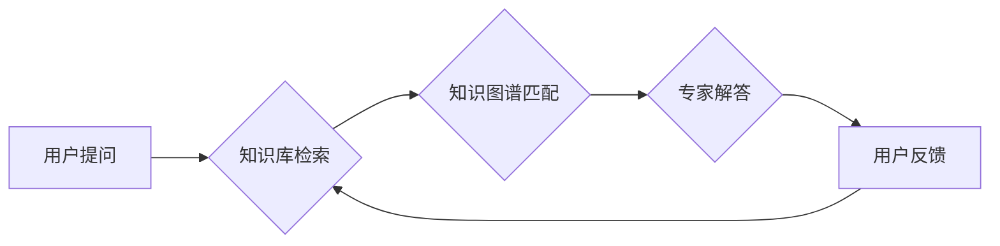

                 

## 程序员知识付费：打造问答式教学

> 关键词：程序员知识付费、问答式教学、在线教育、人工智能、知识图谱、知识体系构建、学习路径规划、个性化学习

### 1. 背景介绍

随着互联网技术的飞速发展，在线教育平台蓬勃兴起，知识付费市场也随之快速扩张。程序员作为高需求的职业群体，其知识付费需求日益增长。传统的课程模式往往以视频讲座、文档资料为主，缺乏互动性和针对性，难以满足程序员个性化的学习需求。

问答式教学模式，以问题为导向，通过用户提问和专家解答的方式，实现知识的传递和理解。这种模式能够有效激发用户学习兴趣，促进知识的深度理解和应用。

### 2. 核心概念与联系

**2.1 问答式教学模式**

问答式教学模式的核心是用户提问和专家解答的交互过程。用户可以通过文字、语音或视频等方式提出问题，专家则根据问题内容提供准确、详细的解答。

**2.2 程序员知识付费**

程序员知识付费是指程序员通过付费的方式获取技术知识、技能培训和职业发展指导等服务。

**2.3 知识图谱**

知识图谱是一种基于知识表示的数据库，能够将知识点以图谱的形式进行组织和连接，实现知识的结构化存储和推理。

**2.4 知识体系构建**

知识体系构建是指将程序员所需的知识点按照逻辑关系进行分类和组织，形成一个完整的知识体系。

**2.5 学习路径规划**

学习路径规划是指根据用户的学习目标和水平，制定个性化的学习路线，引导用户高效地学习和掌握知识。

**Mermaid 流程图**



### 3. 核心算法原理 & 具体操作步骤

**3.1 算法原理概述**

问答式教学平台的核心算法主要包括：

* **自然语言处理 (NLP)**：用于理解用户的问题，提取关键信息，并生成自然流畅的解答。
* **知识图谱检索**：根据用户的问题，从知识图谱中检索相关知识点，并构建知识链条。
* **专家系统**：根据知识图谱和用户问题，调用专家规则进行推理和解答。

**3.2 算法步骤详解**

1. **用户提问**: 用户通过平台输入问题，例如“如何实现一个简单的网页动画？”。
2. **文本预处理**: 系统对用户问题进行文本预处理，包括分词、词性标注、去除停用词等，提取关键信息。
3. **知识图谱检索**: 系统将预处理后的问题与知识图谱进行匹配，检索相关知识点，例如“网页动画”、“CSS动画”、“JavaScript动画”。
4. **知识链条构建**: 系统根据检索到的知识点，构建知识链条，形成一个逻辑清晰的知识结构。
5. **专家系统推理**: 系统调用专家规则，根据知识链条和用户问题，生成符合逻辑的解答。
6. **解答生成**: 系统将解答生成为自然语言文本，并返回给用户。

**3.3 算法优缺点**

**优点**:

* **个性化学习**: 根据用户问题提供针对性的解答，满足个性化学习需求。
* **互动性强**: 用户可以实时提问和互动，提高学习兴趣和效率。
* **知识体系构建**: 通过问答交互，不断完善知识图谱，构建完整的程序员知识体系。

**缺点**:

* **数据依赖**: 需要大量的知识数据和专家规则支持。
* **算法复杂度**: 自然语言处理和知识图谱检索算法复杂度较高，需要强大的计算能力。
* **解答质量**: 算法生成的解答可能存在不准确或不完整的情况，需要人工审核和改进。

**3.4 算法应用领域**

问答式教学模式在程序员知识付费领域具有广泛的应用前景，例如：

* **在线编程课程**: 通过问答交互，帮助用户理解编程概念和解决编程问题。
* **技术文档搜索**: 提供更精准的技術文档搜索功能，帮助用户快速找到所需信息。
* **代码调试**: 根据用户的问题，提供代码调试建议和解决方案。
* **职业发展咨询**: 为程序员提供职业规划和技能提升建议。

### 4. 数学模型和公式 & 详细讲解 & 举例说明

**4.1 数学模型构建**

问答式教学平台的数学模型可以基于信息检索和自然语言处理的理论，构建一个用户-问题-知识-解答的知识图谱模型。

**4.2 公式推导过程**

* **相似度计算**: 使用余弦相似度或TF-IDF等算法计算用户问题与知识点之间的相似度。
* **知识链条构建**: 使用路径搜索算法或图论算法构建知识链条，连接相关知识点。
* **解答生成**: 使用概率模型或神经网络模型生成符合逻辑的解答。

**4.3 案例分析与讲解**

假设用户提问“如何使用Python编写一个简单的爬虫程序？”，系统可以根据以下步骤进行解答：

1. **文本预处理**: 将问题转换为“Python爬虫程序编写”。
2. **知识图谱检索**: 检索与“Python爬虫程序编写”相关的知识点，例如“Python库requests”、“爬虫协议HTTP”、“网页解析HTML”。
3. **知识链条构建**: 构建知识链条：Python库requests -> 爬虫协议HTTP -> 网页解析HTML -> 爬虫程序编写。
4. **解答生成**: 根据知识链条，生成以下解答：

> “使用Python编写爬虫程序，可以使用requests库发送HTTP请求获取网页内容，然后使用HTML解析库解析网页结构，提取所需信息。以下是一个简单的爬虫程序示例：

```python
import requests
from bs4 import BeautifulSoup

url = 'https://www.example.com'
response = requests.get(url)
soup = BeautifulSoup(response.content, 'html.parser')

# 提取网页标题
title = soup.find('title').text
print(title)
```

> 

### 5. 项目实践：代码实例和详细解释说明

**5.1 开发环境搭建**

* **操作系统**: Linux/macOS/Windows
* **编程语言**: Python
* **框架**: Flask/Django
* **数据库**: MySQL/PostgreSQL
* **工具**: Git、Docker

**5.2 源代码详细实现**

```python
# app.py
from flask import Flask, request, jsonify
from knowledge_graph import get_answer

app = Flask(__name__)

@app.route('/api/ask', methods=['POST'])
def ask():
    question = request.json.get('question')
    answer = get_answer(question)
    return jsonify({'answer': answer})

if __name__ == '__main__':
    app.run(debug=True)
```

```python
# knowledge_graph.py
import spacy
from spacy.matcher import Matcher

nlp = spacy.load("en_core_web_sm")
matcher = Matcher(nlp.vocab)

# 添加知识规则
matcher.add("PYTHON_爬虫", [{"LOWER": "python"}, {"LOWER": "爬虫"}])

def get_answer(question):
    doc = nlp(question)
    matches = matcher(doc)
    if matches:
        # 根据知识规则，返回相关解答
        return "可以使用Python库requests编写爬虫程序。"
    else:
        return "抱歉，我无法理解您的问题。"
```

**5.3 代码解读与分析**

* `app.py`: Flask应用，提供`/api/ask`接口，接收用户问题，调用`get_answer`函数获取解答。
* `knowledge_graph.py`: 使用SpaCy进行自然语言处理，添加知识规则，根据用户问题返回相关解答。

**5.4 运行结果展示**

用户通过POST请求发送问题到`/api/ask`接口，服务器会返回相应的解答。

### 6. 实际应用场景

问答式教学平台可以应用于以下场景：

* **在线编程社区**: 提供用户提问和解答功能，构建一个知识共享平台。
* **企业内部培训**: 为员工提供个性化的技术培训，提升员工技能水平。
* **技术文档辅助**: 在技术文档中嵌入问答功能，帮助用户快速理解和解决问题。

**6.4 未来应用展望**

* **人工智能增强**: 利用人工智能技术，例如对话系统和机器学习，提升解答质量和智能化程度。
* **虚拟现实/增强现实**: 将问答式教学融入虚拟现实或增强现实环境，提供更沉浸式的学习体验。
* **跨语言支持**: 支持多语言问答，打破语言障碍，实现全球化的知识共享。

### 7. 工具和资源推荐

**7.1 学习资源推荐**

* **在线课程**: Coursera、edX、Udemy
* **书籍**: 《Python编程：从入门到实践》、《自然语言处理入门》
* **开源项目**: SpaCy、NLTK

**7.2 开发工具推荐**

* **IDE**: PyCharm、VS Code
* **框架**: Flask、Django
* **数据库**: MySQL、PostgreSQL

**7.3 相关论文推荐**

* **BERT**: Devlin et al. (2018)
* **GPT-3**: Brown et al. (2020)
* **Knowledge Graph Embedding**: Wang et al. (2014)

### 8. 总结：未来发展趋势与挑战

**8.1 研究成果总结**

问答式教学模式在程序员知识付费领域取得了显著成果，能够有效提升学习效率和用户体验。

**8.2 未来发展趋势**

* **人工智能驱动**: 利用人工智能技术，实现更智能、更个性化的问答服务。
* **知识图谱融合**: 将知识图谱与问答系统深度融合，构建更完整的知识体系。
* **多模态交互**: 支持文本、语音、图像等多模态交互，提供更丰富的学习体验。

**8.3 面临的挑战**

* **数据质量**: 需要高质量的知识数据和专家规则支持。
* **算法复杂度**: 自然语言处理和知识图谱检索算法复杂度较高，需要不断优化和改进。
* **解答质量**: 算法生成的解答可能存在不准确或不完整的情况，需要不断提高算法精度和可靠性。

**8.4 研究展望**

未来，问答式教学模式将继续发展，朝着更智能、更个性化、更全面的方向发展。

### 9. 附录：常见问题与解答

**9.1 如何构建知识图谱？**

知识图谱的构建需要以下步骤：

1. **数据收集**: 收集相关领域的知识数据，例如文本、文档、数据库等。
2. **数据清洗**: 对收集到的数据进行清洗和预处理，去除噪声和重复信息。
3. **知识抽取**: 使用自然语言处理技术，从数据中抽取知识点，例如实体、关系、事件等。
4. **知识表示**: 将抽取的知识点以图谱的形式进行表示，构建知识图谱模型。

**9.2 如何提高解答质量？**

提高解答质量可以通过以下方式：

1. **丰富知识库**: 持续补充和更新知识库，确保知识库的完整性和准确性。
2. **优化算法**: 优化自然语言处理和知识图谱检索算法，提高算法的精度和可靠性。
3. **人工审核**: 对算法生成的解答进行人工审核，纠正错误和完善内容。


作者：禅与计算机程序设计艺术 / Zen and the Art of Computer Programming 
<end_of_turn>

