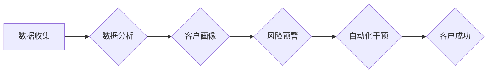

                 

## 自动化创业中的客户成功管理

> 关键词：客户成功管理、自动化、人工智能、机器学习、数据分析、创业、流程优化、客户体验

## 1. 背景介绍

在当今快速发展的科技时代，创业者面临着前所未有的挑战和机遇。如何快速获得用户，并将其转化为忠诚的客户，成为创业成功的关键因素之一。客户成功管理 (Customer Success Management, CSM) 正是在这种背景下应运而生，它旨在通过一系列策略和流程，帮助企业提升客户满意度、延长客户生命周期，最终实现商业目标。

传统的客户成功管理模式往往依赖于人工干预，例如定期客户访谈、邮件沟通等，效率低下，难以应对规模化发展的需求。随着人工智能 (AI) 和自动化技术的快速发展，自动化客户成功管理 (Automated Customer Success Management) 应运而生，它利用数据分析、机器学习等技术，实现客户成功管理流程的自动化和智能化，为创业企业提供了一种更有效、更可持续的客户成功解决方案。

## 2. 核心概念与联系

自动化客户成功管理的核心概念是利用数据驱动决策，通过自动化流程和智能工具，提升客户体验，并最终实现客户成功。

**2.1  核心概念**

* **客户成功 (Customer Success):** 指客户在使用产品或服务过程中获得预期价值，并持续保持使用和满意。
* **自动化 (Automation):** 通过技术手段，将重复性、规则性的任务自动化，提高效率和准确性。
* **人工智能 (AI):**  模拟人类智能的计算机系统，能够学习、推理和决策。
* **机器学习 (Machine Learning):**  一种人工智能技术，通过算法从数据中学习，不断提升预测和决策能力。
* **数据分析 (Data Analysis):**  通过收集、整理和分析数据，发现隐藏的模式和趋势，为决策提供依据。

**2.2  架构流程图**



## 3. 核心算法原理 & 具体操作步骤

**3.1  算法原理概述**

自动化客户成功管理的核心算法原理是基于机器学习和数据分析，通过以下步骤实现：

1. **数据收集:** 收集客户使用产品或服务的相关数据，例如用户行为、产品使用频率、客户反馈等。
2. **数据清洗和预处理:** 对收集到的数据进行清洗和预处理，去除噪声数据，并将其转换为机器学习算法可以理解的格式。
3. **特征工程:** 从原始数据中提取关键特征，例如用户活跃度、客户生命周期价值等，这些特征能够反映客户的成功程度和潜在风险。
4. **模型训练:** 利用机器学习算法，对提取的特征进行训练，建立客户成功预测模型。
5. **模型评估和优化:** 对训练好的模型进行评估，并根据评估结果进行优化，提高模型的预测精度。
6. **自动化干预:** 根据模型预测结果，对客户进行个性化的自动化干预，例如发送提醒邮件、提供使用指导、推荐相关资源等。

**3.2  算法步骤详解**

1. **数据收集:** 可以通过以下方式收集客户数据：
    * **产品使用日志:** 记录用户在使用产品或服务时的行为数据，例如访问页面、点击按钮、完成任务等。
    * **客户关系管理 (CRM) 系统:** 收集客户的基本信息、购买历史、服务记录等。
    * **客户反馈:** 收集客户通过邮件、电话、在线调查等方式反馈的信息。
2. **数据清洗和预处理:** 
    * **缺失值处理:** 对缺失值进行填充或删除。
    * **异常值处理:** 对异常值进行修正或删除。
    * **数据标准化:** 将数据转换为统一的格式，方便机器学习算法处理。
3. **特征工程:** 
    * **用户行为特征:** 用户活跃度、使用频率、停留时间等。
    * **客户属性特征:** 行业、公司规模、职位等。
    * **产品使用特征:** 产品功能使用情况、购买历史等。
4. **模型训练:** 
    * **分类算法:** 用于预测客户是否会 churn (流失)。
    * **回归算法:** 用于预测客户的未来价值。
    * **聚类算法:** 用于将客户进行分组，以便进行个性化营销。
5. **模型评估和优化:** 
    * **准确率:** 模型预测正确的比例。
    * **召回率:** 模型预测出所有正例的比例。
    * **F1-score:** 综合考虑准确率和召回率的指标。
6. **自动化干预:** 
    * **发送个性化邮件:** 根据客户的特征和行为，发送相关的邮件提醒、建议或优惠。
    * **提供在线帮助:** 通过聊天机器人或知识库，为客户提供即时的帮助和支持。
    * **推荐相关资源:** 根据客户的兴趣和需求，推荐相关的产品、服务或文章。

**3.3  算法优缺点**

**优点:**

* **提高效率:** 自动化流程可以解放人力资源，提高客户成功团队的效率。
* **个性化体验:** 基于数据分析和机器学习，可以为每个客户提供个性化的服务和支持。
* **降低成本:** 自动化可以降低人工成本，提高客户成功管理的经济效益。
* **数据驱动决策:** 通过数据分析，可以更好地了解客户的需求和行为，为决策提供依据。

**缺点:**

* **数据依赖:** 自动化客户成功管理需要大量的数据支持，如果数据质量不高，模型的预测精度会受到影响。
* **技术门槛:** 建立和维护自动化客户成功管理系统需要一定的技术能力。
* **伦理问题:**  自动化决策可能会带来伦理问题，例如算法偏见、数据隐私等。

**3.4  算法应用领域**

自动化客户成功管理的应用领域非常广泛，例如：

* **SaaS 产品:**  帮助 SaaS 产品公司提高客户留存率、提升客户生命周期价值。
* **电商平台:**  帮助电商平台提高客户转化率、提升客户复购率。
* **金融服务:**  帮助金融服务公司降低客户流失率、提升客户满意度。
* **教育行业:**  帮助教育机构提高学生学习效果、提升学生满意度。

## 4. 数学模型和公式 & 详细讲解 & 举例说明

**4.1  数学模型构建**

在自动化客户成功管理中，常用的数学模型包括：

* **客户生命周期价值 (CLTV) 模型:** 用于预测客户在整个生命周期内为企业带来的价值。
* **客户流失预测模型:** 用于预测客户是否会流失。
* **客户分层模型:** 用于将客户进行分组，以便进行个性化营销。

**4.2  公式推导过程**

**CLTV 模型:**

CLTV = 平均购买金额 * 平均购买频率 * 平均客户生命周期

其中：

* 平均购买金额: 客户在平均一次购买中花费的金额。
* 平均购买频率: 客户在平均时间内进行的购买次数。
* 平均客户生命周期: 客户与企业保持业务关系的平均时间。

**客户流失预测模型:**

可以使用逻辑回归、支持向量机等算法构建客户流失预测模型。模型的输出是一个概率值，表示客户流失的可能性。

**4.3  案例分析与讲解**

假设一家 SaaS 产品公司想要预测客户是否会流失，可以使用以下步骤构建客户流失预测模型：

1. 收集客户使用产品的数据，例如用户活跃度、使用频率、产品功能使用情况等。
2. 将数据进行清洗和预处理，提取关键特征。
3. 使用逻辑回归算法训练模型，将客户分为流失组和非流失组。
4. 对模型进行评估，例如计算准确率、召回率等指标。
5. 根据模型预测结果，对高风险客户进行个性化干预，例如发送提醒邮件、提供使用指导等。

## 5. 项目实践：代码实例和详细解释说明

**5.1  开发环境搭建**

* Python 3.x
* Jupyter Notebook
* scikit-learn
* pandas
* matplotlib

**5.2  源代码详细实现**

```python
import pandas as pd
from sklearn.model_selection import train_test_split
from sklearn.linear_model import LogisticRegression
from sklearn.metrics import accuracy_score

# 加载数据
data = pd.read_csv('customer_data.csv')

# 提取特征和目标变量
features = ['user_active_days', 'product_usage_frequency']
target = 'churn'

# 将数据进行训练集和测试集划分
X_train, X_test, y_train, y_test = train_test_split(data[features], data[target], test_size=0.2, random_state=42)

# 训练逻辑回归模型
model = LogisticRegression()
model.fit(X_train, y_train)

# 对测试集进行预测
y_pred = model.predict(X_test)

# 计算模型准确率
accuracy = accuracy_score(y_test, y_pred)
print('模型准确率:', accuracy)
```

**5.3  代码解读与分析**

* 代码首先加载客户数据，并提取特征和目标变量。
* 然后将数据进行训练集和测试集划分，用于训练和评估模型。
* 使用逻辑回归算法训练模型，并对测试集进行预测。
* 最后计算模型的准确率，评估模型的性能。

**5.4  运行结果展示**

运行代码后，会输出模型的准确率，例如：

```
模型准确率: 0.85
```

这表示模型能够准确预测客户流失的可能性达到 85%。

## 6. 实际应用场景

自动化客户成功管理在各个行业都有广泛的应用场景，例如：

* **SaaS 产品:**  通过分析用户行为数据，预测用户是否会流失，并针对不同用户群体的需求，提供个性化的服务和支持。
* **电商平台:**  根据用户的购买历史和浏览记录，推荐相关商品，提高用户转化率和复购率。
* **金融服务:**  通过分析客户的财务状况和风险偏好，提供个性化的理财建议，提升客户满意度和忠诚度。

**6.4  未来应用展望**

随着人工智能和自动化技术的不断发展，自动化客户成功管理将更加智能化和个性化。未来，我们可以期待以下应用场景：

* **基于预见性的客户成功管理:**  利用机器学习算法，预测客户未来的需求和行为，提前提供解决方案，提升客户体验。
* **多渠道自动化客户成功管理:**  将自动化流程整合到多个渠道，例如邮件、短信、社交媒体等，提供更加全面的客户服务。
* **客户成功协作平台:**  构建一个客户成功协作平台，让客户成功团队成员能够更好地协作，提升客户成功管理效率。

## 7. 工具和资源推荐

**7.1  学习资源推荐**

* **书籍:**
    * 《The Lean Startup》 by Eric Ries
    * 《Crossing the Chasm》 by Geoffrey Moore
    * 《Customer Success: How Innovative Companies Are Reducing Churn and Driving Growth》 by Nick Mehta
* **在线课程:**
    * Coursera: Customer Success Management Specialization
    * Udemy: Customer Success Management Masterclass

**7.2  开发工具推荐**

* **CRM 系统:** Salesforce, HubSpot, Zoho CRM
* **自动化营销平台:** Marketo, Pardot, Mailchimp
* **数据分析工具:** Tableau, Power BI, Google Analytics

**7.3  相关论文推荐**

* **Customer Success Management: A Literature Review** by David Skok
* **The Impact of Customer Success Management on Business Performance** by Harvard Business Review
* **Predicting Customer Churn Using Machine Learning** by McKinsey & Company

## 8. 总结：未来发展趋势与挑战

**8.1  研究成果总结**

自动化客户成功管理已经取得了显著的成果，能够帮助企业提高客户留存率、提升客户生命周期价值，并降低客户成功管理成本。

**8.2  未来发展趋势**

未来，自动化客户成功管理将更加智能化、个性化和协作化。

* **人工智能驱动的客户成功管理:**  利用人工智能技术，实现更精准的客户画像、更有效的客户预测和更个性化的客户服务。
* **数据驱动的客户成功管理:**  更加注重数据分析和洞察，为客户成功决策提供更可靠的依据。
* **协作式客户成功管理:**  构建一个客户成功协作平台，让客户成功团队成员能够更好地协作，提升客户成功管理效率。

**8.3  面临的挑战**

自动化客户成功管理也面临着一些挑战：

* **数据质量问题:**  自动化客户成功管理需要大量的数据支持，如果数据质量不高，模型的预测精度会受到影响。
* **技术门槛问题:**  建立和维护自动化客户成功管理系统需要一定的技术能力。
* **伦理问题:**  自动化决策可能会带来伦理问题，例如算法偏见、数据隐私等。

**8.4  研究展望**

未来，需要进一步研究以下问题：

* 如何提高自动化客户成功管理系统的鲁棒性和可靠性。
* 如何解决自动化客户成功管理中的伦理问题。
* 如何将自动化客户成功管理与其他业务流程进行整合，实现更全面的业务优化。

## 9. 附录：常见问题与解答

**常见问题:**

* 自动化客户成功管理是否会取代人工客户成功管理？
* 自动化客户成功管理的成本如何？
* 如何选择合适的自动化客户成功管理工具？

**解答:**

* 自动化客户成功管理不会完全取代人工客户成功管理，而是会与人工客户成功管理相结合，形成一个更加高效、更加智能的客户成功管理体系。
* 自动化客户成功管理的成本取决于具体的工具和方案，一般来说，自动化客户成功管理可以降低人工成本，提高客户成功管理的经济效益。
* 选择合适的自动化客户成功管理工具需要根据企业的具体需求和预算进行选择，可以参考行业评价和案例分析。


作者：禅与计算机程序设计艺术 / Zen and the Art of Computer Programming<end_of_turn>

