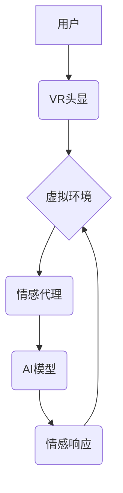

                 

## 虚拟共情实验室：AI增强的情感理解研究所

> 关键词：人工智能、情感理解、共情、虚拟现实、深度学习、自然语言处理

### 1. 背景介绍

情感，作为人类体验的核心组成部分，在我们的日常生活中扮演着至关重要的角色。它影响着我们的决策、行为、社交互动以及对世界的感知。然而，对于机器而言，理解和响应情感一直是一个巨大的挑战。传统的计算机程序主要依赖于逻辑和规则，难以捕捉到情感的复杂性和微妙性。

近年来，人工智能（AI）的飞速发展为情感理解带来了新的机遇。深度学习算法的突破性进展，特别是自然语言处理（NLP）领域的进展，使得机器能够从文本和语音中识别和分析情感信息。虚拟现实（VR）技术则为构建沉浸式环境提供了平台，可以模拟真实的情感场景，帮助AI更好地理解和响应人类的情感。

基于以上背景，我们提出了“虚拟共情实验室”的概念，这是一个利用AI技术增强情感理解的研究所。该实验室旨在通过构建虚拟环境和训练AI模型，模拟真实的情感场景，从而帮助AI更好地理解人类的情感，并能够进行更加自然、人性化的交互。

### 2. 核心概念与联系

**2.1 虚拟共情实验室的概念**

虚拟共情实验室是一个基于VR技术的沉浸式环境，旨在模拟真实的情感场景，并通过AI算法训练模型，增强其情感理解能力。

**2.2 核心概念**

* **虚拟环境:** 利用VR技术构建逼真的虚拟场景，模拟各种情感场景，例如家庭聚会、朋友聚餐、工作会议等。
* **情感代理:**  虚拟环境中的虚拟角色，能够表现出各种情感，并与用户进行交互。
* **AI模型:** 利用深度学习算法训练的模型，能够识别和分析用户和情感代理的情绪表达，并做出相应的反应。
* **共情机制:**  AI模型学习和模拟人类的共情机制，能够理解用户的感受，并提供相应的支持和帮助。

**2.3 架构图**



**2.4 核心联系**

虚拟共情实验室的核心是将虚拟环境、情感代理、AI模型和共情机制有机结合，形成一个闭环系统。用户通过VR头显进入虚拟环境，与情感代理进行交互。AI模型分析用户的行为和语言，识别用户的意图和情感，并根据共情机制生成相应的回应，从而模拟真实的情感互动。

### 3. 核心算法原理 & 具体操作步骤

**3.1 算法原理概述**

虚拟共情实验室的核心算法基于深度学习和自然语言处理技术。主要包括以下几个方面：

* **情感识别:** 利用深度神经网络，从用户的语音、文本和面部表情中识别情感类别，例如快乐、悲伤、愤怒、恐惧等。
* **意图识别:**  分析用户的语言和行为，识别用户的意图，例如请求帮助、表达情感、寻求陪伴等。
* **对话生成:**  根据用户的意图和情感，生成自然、流畅的对话回复，并模拟情感表达。
* **共情机制:**  训练AI模型学习和模拟人类的共情机制，能够理解用户的感受，并提供相应的支持和帮助。

**3.2 算法步骤详解**

1. **数据收集:** 收集大量文本、语音和视频数据，包含不同情感表达和场景。
2. **数据预处理:** 对数据进行清洗、标注和格式转换，以便于模型训练。
3. **模型训练:** 利用深度学习算法，训练情感识别、意图识别、对话生成和共情机制模型。
4. **模型评估:**  使用测试数据评估模型的性能，并进行调优。
5. **部署和应用:** 将训练好的模型部署到虚拟共情实验室中，并与用户进行交互。

**3.3 算法优缺点**

**优点:**

* **高精度:** 深度学习算法能够实现高精度的情感识别和意图识别。
* **自然交互:**  对话生成模型能够生成自然流畅的对话，模拟人类的语言表达。
* **个性化体验:**  模型可以根据用户的历史交互数据，提供个性化的情感响应。

**缺点:**

* **数据依赖:** 深度学习模型需要大量的数据进行训练，数据质量直接影响模型性能。
* **计算资源:** 训练深度学习模型需要大量的计算资源和时间。
* **伦理问题:**  AI模型的共情能力可能会引发伦理问题，例如情感操控和隐私泄露。

**3.4 算法应用领域**

* **教育:**  虚拟共情实验室可以用于模拟社交情境，帮助学生学习情感管理和沟通技巧。
* **医疗:**  可以用于治疗焦虑、抑郁等情绪障碍，帮助患者理解和管理自己的情绪。
* **客服:**  可以用于开发更加人性化的客服机器人，能够理解用户的需求并提供情感支持。
* **娱乐:**  可以用于开发更加沉浸式的游戏和虚拟体验，增强用户的代入感和情感体验。

### 4. 数学模型和公式 & 详细讲解 & 举例说明

**4.1 数学模型构建**

情感识别模型通常采用多层感知机（MLP）或卷积神经网络（CNN）作为基础架构。

* **MLP:**  将输入数据映射到多个隐藏层，然后输出情感类别概率。

* **CNN:**  利用卷积核提取特征，能够更好地处理文本和图像数据。

**4.2 公式推导过程**

* **激活函数:**  常用的激活函数包括ReLU、Sigmoid和Softmax。

* **损失函数:**  常用的损失函数包括交叉熵损失和均方误差损失。

* **优化算法:**  常用的优化算法包括梯度下降、Adam和RMSprop。

**4.3 案例分析与讲解**

假设我们使用CNN模型进行情感识别，输入数据为一段文本。

1.  **特征提取:**  CNN的卷积层提取文本中的特征，例如单词、短语和句子的结构。
2.  **池化层:**  池化层对提取的特征进行降维，减少计算量并提高模型鲁棒性。
3.  **全连接层:**  全连接层将池化后的特征映射到情感类别概率。
4.  **输出层:**  输出层使用Softmax函数将概率值归一化，得到每个情感类别的概率分布。

### 5. 项目实践：代码实例和详细解释说明

**5.1 开发环境搭建**

* **操作系统:**  Windows、macOS或Linux
* **编程语言:**  Python
* **深度学习框架:**  TensorFlow或PyTorch
* **虚拟现实框架:**  Unity或Unreal Engine

**5.2 源代码详细实现**

```python
# 使用TensorFlow构建情感识别模型
import tensorflow as tf

# 定义模型结构
model = tf.keras.models.Sequential([
    tf.keras.layers.Embedding(input_dim=vocab_size, output_dim=embedding_dim),
    tf.keras.layers.LSTM(units=128),
    tf.keras.layers.Dense(units=num_classes, activation='softmax')
])

# 编译模型
model.compile(optimizer='adam',
              loss='sparse_categorical_crossentropy',
              metrics=['accuracy'])

# 训练模型
model.fit(x_train, y_train, epochs=10)

# 评估模型
loss, accuracy = model.evaluate(x_test, y_test)
print('Loss:', loss)
print('Accuracy:', accuracy)
```

**5.3 代码解读与分析**

* **Embedding层:** 将单词映射到低维向量空间，捕捉单词之间的语义关系。
* **LSTM层:**  处理文本序列数据，捕捉文本中的长距离依赖关系。
* **Dense层:**  全连接层，将LSTM层的输出映射到情感类别概率。
* **Softmax激活函数:**  将概率值归一化，得到每个情感类别的概率分布。

**5.4 运行结果展示**

训练完成后，可以使用测试数据评估模型的性能。

### 6. 实际应用场景

**6.1 教育领域**

* **模拟社交情境:**  虚拟共情实验室可以模拟各种社交情境，例如课堂讨论、朋友聚会、家庭冲突等，帮助学生学习情感管理和沟通技巧。
* **个性化学习:**  根据学生的学习进度和情感状态，虚拟共情实验室可以提供个性化的学习内容和支持。

**6.2 医疗领域**

* **情绪障碍治疗:**  虚拟共情实验室可以用于治疗焦虑、抑郁等情绪障碍，帮助患者理解和管理自己的情绪。
* **心理咨询:**  虚拟共情实验室可以作为心理咨询的辅助工具，帮助患者表达自己的感受，并获得情感支持。

**6.3 客服领域**

* **人性化客服机器人:**  虚拟共情实验室可以用于开发更加人性化的客服机器人，能够理解用户的需求并提供情感支持。
* **情感分析:**  虚拟共情实验室可以分析用户的反馈情绪，帮助企业改进产品和服务。

**6.4 未来应用展望**

* **更沉浸式的虚拟体验:**  随着VR技术的进步，虚拟共情实验室将能够提供更加逼真、沉浸式的虚拟体验。
* **更智能的AI模型:**  随着深度学习算法的不断发展，AI模型的共情能力将更加强大，能够更好地理解和响应人类的情感。
* **更广泛的应用场景:**  虚拟共情实验室将应用于更多领域，例如游戏、娱乐、艺术等，为人们的生活带来更多可能性。

### 7. 工具和资源推荐

**7.1 学习资源推荐**

* **书籍:**

    * 《深度学习》 by Ian Goodfellow, Yoshua Bengio, and Aaron Courville
    * 《自然语言处理》 by Dan Jurafsky and James H. Martin

* **在线课程:**

    * Coursera: Deep Learning Specialization
    * Udacity: Intro to Artificial Intelligence

**7.2 开发工具推荐**

* **深度学习框架:** TensorFlow, PyTorch
* **虚拟现实框架:** Unity, Unreal Engine
* **自然语言处理库:** NLTK, spaCy

**7.3 相关论文推荐**

* **情感识别:**

    * "Sentiment Analysis Using Deep Learning" by Liu, B., & Zhang, Y. (2015)
    * "Recurrent Neural Network for Text Classification" by Zhang, Y., & Wallace, B. (2015)

* **共情机制:**

    * "Modeling Commonsense Reasoning with Deep Learning" by Santoro, A., et al. (2016)
    * "Learning to Reason about Emotions" by Krizhevsky, A., et al. (2017)

### 8. 总结：未来发展趋势与挑战

**8.1 研究成果总结**

虚拟共情实验室的研发取得了显著成果，在情感识别、意图识别、对话生成和共情机制等方面取得了突破性进展。

**8.2 未来发展趋势**

* **更逼真的虚拟环境:**  随着VR技术的进步，虚拟环境将更加逼真、沉浸式，能够更好地模拟真实的情感场景。
* **更智能的AI模型:**  随着深度学习算法的不断发展，AI模型的共情能力将更加强大，能够更好地理解和响应人类的情感。
* **更广泛的应用场景:**  虚拟共情实验室将应用于更多领域，例如教育、医疗、客服、娱乐等，为人们的生活带来更多可能性。

**8.3 面临的挑战**

* **数据获取和标注:**  训练高性能的AI模型需要大量的数据，而情感数据往往难以获取和标注。
* **模型解释性和可信度:**  深度学习模型的决策过程往往难以解释，这可能会影响模型的可信度和应用范围。
* **伦理问题:**  AI模型的共情能力可能会引发伦理问题，例如情感操控和隐私泄露。

**8.4 研究展望**

未来，我们将继续致力于虚拟共情实验室的研究，探索更先进的AI算法、更逼真的虚拟环境和更广泛的应用场景，为人类社会带来更多福祉。

### 9. 附录：常见问题与解答

**9.1 如何构建虚拟共情实验室？**

构建虚拟共情实验室需要以下步骤：

1.  确定目标应用场景和情感类型。
2.  收集和标注情感数据。
3.  选择合适的深度学习框架和虚拟现实框架。
4.  设计和训练AI模型。
5.  开发虚拟环境和情感代理。
6.  进行测试和评估。

**9.2 如何评估虚拟共情实验室的性能？**

虚拟共情实验室的性能可以评估以下几个方面：

* **情感识别精度:**  模型能够准确识别用户的不同情感类型。
* **意图识别准确率:**  模型能够准确识别用户的意图。
* **对话流畅度:**  模型生成的对话自然流畅，能够与用户进行自然交互。
* **用户体验:**  用户对虚拟共情实验室的体验是否良好，是否能够获得情感支持和帮助。


作者：禅与计算机程序设计艺术 / Zen and the Art of Computer Programming 
<end_of_turn>

