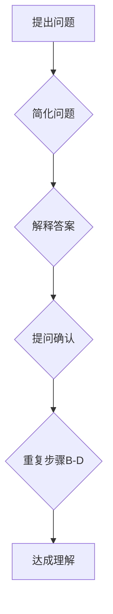

                 

## 费曼提问法在团队沟通中的应用

> 关键词：费曼提问法、团队沟通、知识传递、问题解决、清晰表达、深度理解

### 1. 背景介绍

在现代软件开发领域，团队合作是至关重要的。高效的团队沟通能够加速开发进度，提高软件质量，并促进团队成员的成长。然而，在实际工作中，团队沟通常常面临着各种挑战，例如信息传递不畅、理解偏差、表达不清等。如何有效地进行团队沟通，是每个软件开发团队都需要思考的问题。

费曼提问法，是一种以物理学家理查德·费曼命名的提问技巧，它强调通过不断地提问和解释，来深入理解和传达知识。这种方法不仅适用于科学研究，也能够有效地应用于团队沟通中。

### 2. 核心概念与联系

费曼提问法的核心在于，将复杂的概念分解成一系列简单易懂的问题，并通过反复提问和解释，逐步引导对方理解。其流程图如下：



**费曼提问法与团队沟通的联系：**

* **促进深度理解：** 通过反复提问，可以帮助团队成员深入思考问题，并从不同的角度理解概念。
* **消除理解偏差：** 

通过明确的问题和解释，可以帮助团队成员消除理解偏差，确保信息传递的准确性。
* **提升表达能力：** 

需要用简单易懂的语言解释问题，可以帮助团队成员提升表达能力，并更好地传达自己的想法。
* **增强团队协作：** 

费曼提问法鼓励团队成员积极参与讨论，并共同探索解决方案，从而增强团队协作。

### 3. 核心算法原理 & 具体操作步骤

#### 3.1 算法原理概述

费曼提问法本身并非一种算法，而是一种沟通技巧。其核心原理在于通过循序渐进的提问和解释，引导对方理解复杂的概念。

#### 3.2 算法步骤详解

1. **提出问题：** 首先，需要明确要传达的概念或问题。
2. **简化问题：** 将复杂的问题分解成一系列简单易懂的问题。
3. **解释答案：** 对每个问题进行解释，并使用清晰易懂的语言描述答案。
4. **提问确认：** 询问对方是否理解了你的解释，并根据对方的回答进行调整。
5. **重复步骤B-D：**  重复以上步骤，直到对方完全理解了概念。

#### 3.3 算法优缺点

**优点：**

* 能够有效地促进深度理解。
* 能够消除理解偏差，确保信息传递的准确性。
* 能够提升表达能力，帮助团队成员更好地传达自己的想法。
* 能够增强团队协作，促进共同学习和成长。

**缺点：**

* 需要花费较多的时间和精力。
* 需要团队成员具备良好的沟通能力和耐心。
* 对于一些过于抽象的概念，可能难以用费曼提问法完全解释清楚。

#### 3.4 算法应用领域

费曼提问法可以应用于各种团队沟通场景，例如：

* **技术讨论：** 帮助团队成员更好地理解技术文档、代码和设计方案。
* **项目规划：** 帮助团队成员明确项目目标、任务和职责。
* **问题解决：** 帮助团队成员分析问题、寻找解决方案和制定行动计划。
* **知识分享：** 帮助团队成员将知识传授给其他人，并促进团队知识的积累和共享。

### 4. 数学模型和公式 & 详细讲解 & 举例说明

费曼提问法本身并不依赖于特定的数学模型或公式。其核心在于逻辑推理和语言表达。

然而，在一些特定的技术领域，例如机器学习和数据分析，费曼提问法可以与数学模型相结合，以更深入地理解和解释复杂的概念。

例如，在机器学习领域，我们可以使用费曼提问法来理解模型的训练过程、评估指标和泛化能力。

#### 4.1 数学模型构建

在机器学习领域，我们可以使用以下数学模型来描述模型的训练过程：

* **损失函数：** 用于衡量模型预测结果与真实值的差异。
* **优化算法：** 用于更新模型参数，以最小化损失函数的值。

#### 4.2 公式推导过程

损失函数的最小化过程通常使用梯度下降算法进行。梯度下降算法的核心思想是，沿着损失函数的梯度方向进行参数更新，直到找到损失函数的最小值。

#### 4.3 案例分析与讲解

假设我们有一个分类模型，其损失函数为交叉熵损失函数。我们可以使用费曼提问法来理解交叉熵损失函数的含义和计算过程：

1. **提出问题：** 什么是交叉熵损失函数？
2. **简化问题：** 交叉熵损失函数用于衡量模型预测结果与真实值的差异。
3. **解释答案：** 交叉熵损失函数计算的是模型预测概率分布与真实概率分布之间的距离。
4. **提问确认：** 你理解交叉熵损失函数的含义了吗？
5. **重复步骤B-D：**  根据对方的回答，进一步解释交叉熵损失函数的计算过程。

### 5. 项目实践：代码实例和详细解释说明

#### 5.1 开发环境搭建

为了演示费曼提问法在团队沟通中的应用，我们可以创建一个简单的代码示例。

假设我们有一个团队需要开发一个简单的计算器应用程序。

#### 5.2 源代码详细实现

```python
def add(x, y):
  """
  This function adds two numbers.

  Args:
    x: The first number.
    y: The second number.

  Returns:
    The sum of x and y.
  """
  return x + y

def subtract(x, y):
  """
  This function subtracts two numbers.

  Args:
    x: The first number.
    y: The second number.

  Returns:
    The difference between x and y.
  """
  return x - y

def multiply(x, y):
  """
  This function multiplies two numbers.

  Args:
    x: The first number.
    y: The second number.

  Returns:
    The product of x and y.
  """
  return x * y

def divide(x, y):
  """
  This function divides two numbers.

  Args:
    x: The numerator.
    y: The denominator.

  Returns:
    The quotient of x and y.
  """
  if y == 0:
    raise ZeroDivisionError("Cannot divide by zero.")
  return x / y
```

#### 5.3 代码解读与分析

这段代码定义了四个基本的数学运算函数：加法、减法、乘法和除法。

每个函数都包含了详细的文档字符串，说明了函数的用途、参数和返回值。

#### 5.4 运行结果展示

我们可以使用 Python 的交互式解释器来运行这段代码，并测试其功能。

```python
>>> add(2, 3)
5
>>> subtract(5, 2)
3
>>> multiply(4, 6)
24
>>> divide(10, 2)
5
```

### 6. 实际应用场景

费曼提问法在软件开发团队中有着广泛的应用场景：

#### 6.1 代码审查

在代码审查过程中，可以使用费曼提问法来帮助团队成员更好地理解代码逻辑和设计思想。

例如，当一个团队成员提交了一段代码时，其他成员可以使用费曼提问法来询问代码的实现细节、边界条件和潜在问题。

#### 6.2 技术讨论

在技术讨论中，可以使用费曼提问法来引导团队成员深入思考问题，并从不同的角度理解解决方案。

例如，当团队需要选择一种新的技术方案时，可以使用费曼提问法来讨论不同方案的优缺点、适用场景和潜在风险。

#### 6.3 项目规划

在项目规划阶段，可以使用费曼提问法来帮助团队成员明确项目目标、任务和职责。

例如，当团队需要制定一个新的项目计划时，可以使用费曼提问法来讨论项目目标、任务分解、时间安排和资源分配。

#### 6.4 知识分享

在知识分享过程中，可以使用费曼提问法来帮助团队成员将知识传授给其他人，并促进团队知识的积累和共享。

例如，当一个团队成员掌握了新的技术技能时，可以使用费曼提问法来向其他团队成员讲解该技能的应用场景和使用方法。

#### 6.5 未来应用展望

随着人工智能技术的不断发展，费曼提问法在团队沟通中的应用场景将会更加广泛。

例如，我们可以利用人工智能技术来辅助团队成员进行费曼提问，并自动生成相应的解释和答案。

### 7. 工具和资源推荐

#### 7.1 学习资源推荐

* **费曼传记：** 《费曼的物理学》
* **费曼讲座视频：**  https://www.youtube.com/playlist?list=PL8dPuuaLjXtPHzzYuWy6fYEaX9mQQ8oGr

#### 7.2 开发工具推荐

* **Python:** https://www.python.org/
* **Jupyter Notebook:** https://jupyter.org/

#### 7.3 相关论文推荐

* **The Feynman Technique: A Powerful Tool for Learning and Understanding**
* **How to Learn Anything: The Feynman Technique**

### 8. 总结：未来发展趋势与挑战

#### 8.1 研究成果总结

费曼提问法是一种简单而有效的沟通技巧，能够帮助团队成员更好地理解和传达复杂的概念。

在软件开发领域，费曼提问法可以应用于代码审查、技术讨论、项目规划和知识分享等场景。

#### 8.2 未来发展趋势

随着人工智能技术的不断发展，费曼提问法将会更加智能化和自动化。

例如，我们可以利用人工智能技术来辅助团队成员进行费曼提问，并自动生成相应的解释和答案。

#### 8.3 面临的挑战

费曼提问法需要团队成员具备良好的沟通能力和耐心。

在实际应用中，团队成员可能会遇到一些挑战，例如：

* 难以用简单易懂的语言解释复杂的概念。
* 对方可能无法理解你的提问或解释。
* 需要花费较多的时间和精力进行费曼提问。

#### 8.4 研究展望

未来，我们可以进一步研究费曼提问法的应用场景和效果，并开发更智能化的工具来辅助团队成员进行费曼提问。

### 9. 附录：常见问题与解答

**Q1：费曼提问法适用于哪些场景？**

**A1：** 费曼提问法适用于各种需要深入理解和传达复杂概念的场景，例如代码审查、技术讨论、项目规划和知识分享。

**Q2：如何进行费曼提问？**

**A2：** 费曼提问的关键在于，将复杂的问题分解成一系列简单易懂的问题，并用清晰易懂的语言解释答案。

**Q3：费曼提问法有什么缺点？**

**A3：** 费曼提问法需要团队成员具备良好的沟通能力和耐心，并且可能需要花费较多的时间和精力。

**Q4：有哪些工具可以辅助费曼提问？**

**A4：** 一些在线工具和软件可以帮助团队成员进行费曼提问，例如思维导图工具和知识管理平台。


作者：禅与计算机程序设计艺术 / Zen and the Art of Computer Programming 
<end_of_turn>

