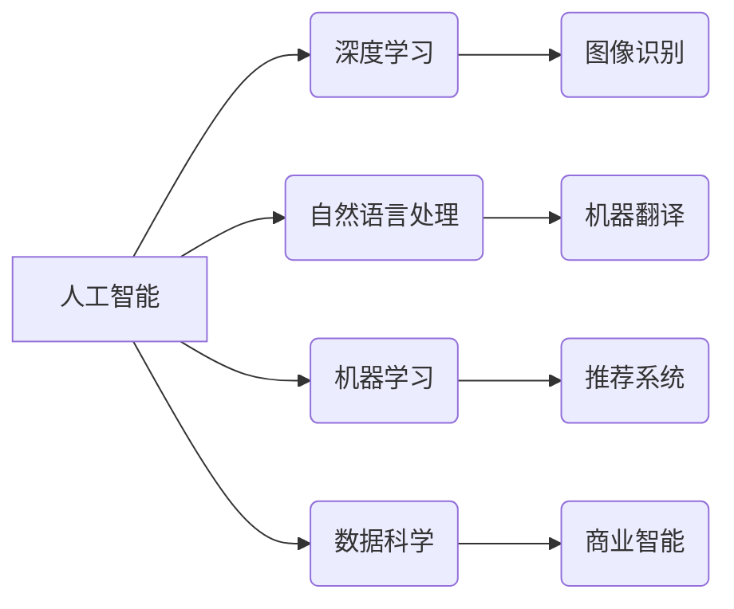

                 

## 赋能人类：释放个体潜能，创造无限可能

> 关键词：人工智能、深度学习、自然语言处理、机器学习、数据科学、自动化、赋能

### 1. 背景介绍

人类文明的进步离不开对工具的不断革新和利用。从石器时代到信息时代，每一次技术革命都深刻地改变了人类的生活方式和社会结构。如今，人工智能（AI）正以其强大的计算能力和学习能力，成为推动未来发展的新引擎，并以其独特的魅力吸引着越来越多的学者和企业家。

然而，AI技术的发展也引发了人们对未来走向的思考。AI是否会取代人类？AI将如何影响我们的工作和生活？这些问题迫切需要我们认真探讨。

笔者认为，AI技术的发展应该以“赋能人类”为核心目标。AI应被视为一种工具，帮助人类释放潜能，创造无限可能。

### 2. 核心概念与联系

**2.1 核心概念**

* **人工智能 (AI):**  指模拟或超越人类智能的计算机系统。
* **深度学习 (Deep Learning):**  一种机器学习的子领域，利用多层神经网络来学习数据特征。
* **自然语言处理 (NLP):**  使计算机能够理解、解释和生成人类语言的技术。
* **机器学习 (Machine Learning):**  使计算机能够从数据中学习并改进性能的技术。
* **数据科学:**  利用统计学、计算机科学和领域知识来提取数据中的价值。

**2.2 核心概念联系**



**2.3 赋能人类的意义**

AI技术能够帮助人类在以下方面释放潜能：

* **提高效率:**  自动化重复性任务，解放人力资源，提高工作效率。
* **增强创造力:**  提供新的工具和视角，激发人类的创造力，推动创新发展。
* **拓展认知:**  帮助人类更深入地理解世界，探索未知领域。
* **改善生活:**  解决社会问题，提升生活质量，创造更美好的未来。

### 3. 核心算法原理 & 具体操作步骤

**3.1 算法原理概述**

深度学习算法的核心是多层神经网络。神经网络模仿了人脑的神经元结构，通过连接和权重来学习数据特征。深度学习算法通过大量的训练数据，不断调整神经网络的权重，最终能够实现对数据的准确识别和预测。

**3.2 算法步骤详解**

1. **数据预处理:**  收集和清洗数据，将其转换为深度学习算法可以理解的格式。
2. **网络结构设计:**  根据任务需求设计神经网络的结构，包括层数、节点数、激活函数等。
3. **参数初始化:**  为神经网络的参数进行随机初始化。
4. **前向传播:**  将输入数据通过神经网络传递，得到输出结果。
5. **反向传播:**  计算输出结果与真实值的误差，并根据误差调整神经网络的参数。
6. **优化算法:**  使用优化算法，例如梯度下降，来更新神经网络的参数。
7. **模型评估:**  使用测试数据评估模型的性能，并根据评估结果调整模型参数。

**3.3 算法优缺点**

**优点:**

* **高准确率:**  深度学习算法能够学习到数据的复杂特征，实现高准确率的识别和预测。
* **自动化学习:**  深度学习算法能够自动学习数据特征，无需人工特征工程。
* **泛化能力强:**  深度学习算法能够将学习到的知识应用到新的数据上。

**缺点:**

* **数据依赖:**  深度学习算法需要大量的训练数据才能达到较高的性能。
* **计算资源消耗大:**  训练深度学习模型需要大量的计算资源。
* **可解释性差:**  深度学习模型的决策过程难以理解。

**3.4 算法应用领域**

* **图像识别:**  人脸识别、物体检测、图像分类等。
* **自然语言处理:**  机器翻译、文本摘要、情感分析等。
* **语音识别:**  语音转文本、语音助手等。
* **推荐系统:**  商品推荐、内容推荐等。
* **医疗诊断:**  疾病诊断、影像分析等。

### 4. 数学模型和公式 & 详细讲解 & 举例说明

**4.1 数学模型构建**

深度学习模型的核心是神经网络，其数学模型可以表示为一系列的矩阵运算。

* **激活函数:**  激活函数将神经元的输入映射到输出，常用的激活函数包括 sigmoid 函数、ReLU 函数等。

* **损失函数:**  损失函数用于衡量模型预测结果与真实值的差异，常用的损失函数包括均方误差、交叉熵等。

* **优化算法:**  优化算法用于更新神经网络的参数，使其能够最小化损失函数。常用的优化算法包括梯度下降、Adam 等。

**4.2 公式推导过程**

* **前向传播:**  神经网络的输出可以表示为输入数据经过一系列的矩阵运算和激活函数处理的结果。

* **反向传播:**  通过链式法则，计算损失函数对每个参数的梯度，并使用梯度下降算法更新参数。

**4.3 案例分析与讲解**

以图像分类为例，假设我们有一个包含猫和狗的图像数据集。我们可以使用深度学习算法训练一个神经网络，使其能够识别猫和狗的图像。

* **输入数据:**  图像数据经过预处理后，转换为一个多维向量。
* **网络结构:**  我们可以设计一个包含多个卷积层、池化层和全连接层的网络结构。
* **训练过程:**  通过前向传播和反向传播，不断调整神经网络的参数，使其能够将猫和狗的图像分类准确。
* **测试结果:**  使用测试数据评估模型的性能，例如准确率、召回率等。

### 5. 项目实践：代码实例和详细解释说明

**5.1 开发环境搭建**

* **操作系统:**  Linux 或 macOS
* **编程语言:**  Python
* **深度学习框架:**  TensorFlow 或 PyTorch
* **其他工具:**  Git、Jupyter Notebook

**5.2 源代码详细实现**

```python
import tensorflow as tf

# 定义模型结构
model = tf.keras.models.Sequential([
    tf.keras.layers.Conv2D(32, (3, 3), activation='relu', input_shape=(28, 28, 1)),
    tf.keras.layers.MaxPooling2D((2, 2)),
    tf.keras.layers.Conv2D(64, (3, 3), activation='relu'),
    tf.keras.layers.MaxPooling2D((2, 2)),
    tf.keras.layers.Flatten(),
    tf.keras.layers.Dense(10, activation='softmax')
])

# 编译模型
model.compile(optimizer='adam',
              loss='sparse_categorical_crossentropy',
              metrics=['accuracy'])

# 训练模型
model.fit(x_train, y_train, epochs=5)

# 评估模型
loss, accuracy = model.evaluate(x_test, y_test)
print('Test loss:', loss)
print('Test accuracy:', accuracy)
```

**5.3 代码解读与分析**

* **模型结构:**  该代码定义了一个简单的卷积神经网络模型，用于图像分类任务。
* **编译模型:**  使用 Adam 优化器、交叉熵损失函数和准确率指标来编译模型。
* **训练模型:**  使用训练数据训练模型，训练 epochs 次。
* **评估模型:**  使用测试数据评估模型的性能。

**5.4 运行结果展示**

训练完成后，可以查看模型的测试准确率，评估模型的性能。

### 6. 实际应用场景

**6.1 医疗诊断**

* **疾病诊断:**  利用深度学习算法分析患者的影像数据，辅助医生诊断疾病。
* **药物研发:**  加速药物研发过程，预测药物的疗效和安全性。

**6.2 金融领域**

* **欺诈检测:**  识别金融交易中的异常行为，防止欺诈活动。
* **风险评估:**  评估客户的信用风险，帮助金融机构做出更明智的决策。

**6.3 自动驾驶**

* **物体识别:**  识别道路上的车辆、行人、交通信号灯等物体。
* **路径规划:**  规划车辆行驶路径，避免碰撞事故。

**6.4 其他应用场景**

* **教育:**  个性化学习推荐、智能答疑系统。
* **零售:**  商品推荐、库存管理。
* **制造业:**  设备故障预测、质量控制。

**6.5 未来应用展望**

随着 AI 技术的不断发展，其应用场景将更加广泛，例如：

* **个性化医疗:**  根据患者的基因信息和生活习惯，提供个性化的医疗方案。
* **智能城市:**  利用 AI 技术提高城市管理效率，改善城市生活质量。
* **人类增强:**  开发 AI 辅助工具，帮助人类完成更复杂的任务。

### 7. 工具和资源推荐

**7.1 学习资源推荐**

* **在线课程:**  Coursera、edX、Udacity 等平台提供丰富的 AI 课程。
* **书籍:**  《深度学习》、《机器学习实战》等书籍。
* **开源项目:**  TensorFlow、PyTorch 等开源深度学习框架。

**7.2 开发工具推荐**

* **编程语言:**  Python
* **深度学习框架:**  TensorFlow、PyTorch
* **数据可视化工具:**  Matplotlib、Seaborn

**7.3 相关论文推荐**

* **ImageNet Classification with Deep Convolutional Neural Networks**
* **Attention Is All You Need**
* **BERT: Pre-training of Deep Bidirectional Transformers for Language Understanding**

### 8. 总结：未来发展趋势与挑战

**8.1 研究成果总结**

近年来，AI 技术取得了长足的进步，在图像识别、自然语言处理、语音识别等领域取得了突破性进展。深度学习算法成为 AI 技术的核心，并推动了 AI 技术的广泛应用。

**8.2 未来发展趋势**

* **模型规模和能力的提升:**  未来 AI 模型将更加强大，能够处理更复杂的任务。
* **算法的创新:**  新的 AI 算法将不断涌现，提升 AI 技术的性能和效率。
* **边缘计算的应用:**  AI 模型将部署到边缘设备上，实现更实时、更智能的应用。
* **AI 的伦理和安全问题:**  随着 AI 技术的应用越来越广泛，其伦理和安全问题也越来越重要。

**8.3 面临的挑战**

* **数据获取和隐私保护:**  深度学习算法需要大量的训练数据，如何获取高质量的数据并保护用户隐私是一个挑战。
* **算法的可解释性和透明度:**  深度学习模型的决策过程难以理解，如何提高算法的可解释性和透明度是一个重要问题。
* **算法的公平性和偏见:**  AI 算法可能存在公平性和偏见问题，需要进行充分的测试和评估。

**8.4 研究展望**

未来 AI 研究将更加注重以下方面:

* **开发更安全、更可靠的 AI 算法。**
* **提高 AI 算法的可解释性和透明度。**
* **解决 AI 算法的公平性和偏见问题。**
* **探索 AI 技术与人类合作的未来。**

### 9. 附录：常见问题与解答

**9.1 如何选择合适的深度学习框架？**

选择深度学习框架需要根据具体项目需求和个人偏好。TensorFlow 和 PyTorch 是两个主流的深度学习框架，各有优缺点。

* **TensorFlow:**  更适合于生产环境部署，拥有更完善的生态系统。
* **PyTorch:**  更灵活易用，更适合于科研和快速原型开发。

**9.2 如何获取高质量的训练数据？**

高质量的训练数据是深度学习模型成功的关键。可以从以下途径获取训练数据:

* **公开数据集:**  Kaggle、UCI Machine Learning Repository 等平台提供大量的公开数据集。
* **数据标注服务:**  一些公司提供数据标注服务，可以帮助您标注自己的数据。
* **数据采集:**  您可以自己收集数据，但需要确保数据的质量和代表性。


作者：禅与计算机程序设计艺术 / Zen and the Art of Computer Programming 
<end_of_turn>

