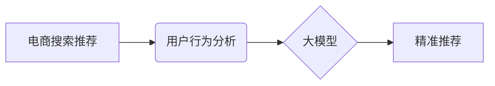

                 

## AI 大模型在电商搜索推荐中的用户行为分析：理解用户需求与购买偏好

> 关键词：电商搜索推荐、用户行为分析、大模型、深度学习、推荐系统、自然语言处理、个性化推荐

## 1. 背景介绍

在当今数据爆炸的时代，电商平台面临着巨大的挑战：如何精准地理解用户的需求，并推荐最符合其偏好的商品。传统的搜索推荐系统主要依赖于基于规则的匹配和协同过滤等方法，但这些方法难以捕捉用户行为的复杂性和多样性。

近年来，大模型技术在自然语言处理、计算机视觉等领域取得了突破性进展，为电商搜索推荐带来了新的机遇。大模型能够学习海量用户行为数据，并从中提取出隐藏的模式和特征，从而实现更精准、更个性化的推荐。

## 2. 核心概念与联系

### 2.1  电商搜索推荐

电商搜索推荐是指在电商平台上，根据用户的搜索词、浏览历史、购买记录等行为数据，推荐与用户需求相匹配的商品。其目标是提高用户体验，促进商品销售。

### 2.2  用户行为分析

用户行为分析是指通过收集和分析用户在电商平台上的行为数据，例如点击、浏览、购买、评价等，以了解用户的兴趣、偏好、购买习惯等，从而为电商平台提供决策支持。

### 2.3  大模型

大模型是指参数规模庞大、训练数据海量的人工智能模型。大模型能够学习复杂的模式和关系，并应用于各种自然语言处理、计算机视觉等任务。

**核心概念与联系流程图**



## 3. 核心算法原理 & 具体操作步骤

### 3.1  算法原理概述

大模型在电商搜索推荐中的核心算法主要包括：

* **深度学习**: 利用多层神经网络学习用户行为数据中的复杂模式和特征。
* **自然语言处理**: 对用户搜索词进行理解和分析，提取关键词和语义信息。
* **推荐算法**: 根据用户行为数据和商品特征，预测用户对商品的兴趣和购买意愿。

### 3.2  算法步骤详解

1. **数据收集**: 收集用户行为数据，包括搜索词、浏览历史、购买记录、评价等。
2. **数据预处理**: 对收集到的数据进行清洗、转换和特征提取。
3. **模型训练**: 利用深度学习算法训练大模型，学习用户行为数据中的模式和特征。
4. **推荐生成**: 根据用户的行为数据和模型的预测结果，生成个性化的商品推荐列表。
5. **效果评估**: 对推荐系统的效果进行评估，并根据评估结果进行模型优化和调整。

### 3.3  算法优缺点

**优点**:

* **精准度高**: 大模型能够学习用户行为数据中的复杂模式，实现更精准的推荐。
* **个性化强**: 大模型可以根据用户的不同行为特征，生成个性化的推荐列表。
* **可扩展性强**: 大模型可以轻松扩展到新的数据和场景。

**缺点**:

* **训练成本高**: 大模型的训练需要大量的计算资源和时间。
* **数据依赖性强**: 大模型的性能取决于训练数据的质量和数量。
* **解释性差**: 大模型的决策过程较为复杂，难以解释其推荐结果。

### 3.4  算法应用领域

大模型在电商搜索推荐领域的应用不仅限于商品推荐，还可以应用于：

* **搜索结果排序**: 根据用户的搜索意图，对搜索结果进行排序。
* **商品分类**: 自动识别商品的类别和属性。
* **个性化营销**: 根据用户的行为数据，进行个性化的营销推广。

## 4. 数学模型和公式 & 详细讲解 & 举例说明

### 4.1  数学模型构建

在电商搜索推荐中，常用的数学模型包括协同过滤模型、基于内容的推荐模型和混合推荐模型。

* **协同过滤模型**: 基于用户的历史行为数据，预测用户对商品的兴趣。
* **基于内容的推荐模型**: 基于商品的特征信息，推荐与用户兴趣相匹配的商品。
* **混合推荐模型**: 将协同过滤模型和基于内容的推荐模型相结合，提高推荐的精准度。

### 4.2  公式推导过程

协同过滤模型中常用的公式包括：

* **用户-商品评分预测**:

$$
\hat{r}_{u,i} = \mu + b_u + b_i + \sigma \cdot \frac{\sum_{j \in N(u)} (r_{u,j} - \mu - b_u - b_j) \cdot (r_{j,i} - \mu - b_j - b_i)}{\sum_{j \in N(u)} (r_{u,j} - \mu - b_u - b_j)^2}
$$

其中：

* $\hat{r}_{u,i}$: 用户 $u$ 对商品 $i$ 的预测评分
* $\mu$: 全局平均评分
* $b_u$: 用户 $u$ 的偏差
* $b_i$: 商品 $i$ 的偏差
* $N(u)$: 用户 $u$ 评分过的商品集合
* $r_{u,j}$: 用户 $u$ 对商品 $j$ 的实际评分
* $\sigma$: 评分标准差

### 4.3  案例分析与讲解

假设用户 $A$ 评分过商品 $1$ 和 $2$，评分分别为 $4$ 和 $5$。商品 $1$ 和 $2$ 的偏差分别为 $0.5$ 和 $-0.2$。全局平均评分为 $3.5$。根据上述公式，可以预测用户 $A$ 对商品 $3$ 的评分。

## 5. 项目实践：代码实例和详细解释说明

### 5.1  开发环境搭建

* Python 3.6+
* TensorFlow/PyTorch
* Jupyter Notebook

### 5.2  源代码详细实现

```python
# 导入必要的库
import tensorflow as tf

# 定义模型结构
class RecommenderModel(tf.keras.Model):
    def __init__(self, embedding_dim, num_users, num_items):
        super(RecommenderModel, self).__init__()
        self.user_embedding = tf.keras.layers.Embedding(num_users, embedding_dim)
        self.item_embedding = tf.keras.layers.Embedding(num_items, embedding_dim)
        self.dense = tf.keras.layers.Dense(1)

    def call(self, user_ids, item_ids):
        user_embeddings = self.user_embedding(user_ids)
        item_embeddings = self.item_embedding(item_ids)
        combined_embeddings = user_embeddings * item_embeddings
        predictions = self.dense(combined_embeddings)
        return predictions

# 训练模型
model = RecommenderModel(embedding_dim=64, num_users=1000, num_items=10000)
model.compile(optimizer='adam', loss='mse')
model.fit(x=[user_ids, item_ids], y=ratings, epochs=10)

# 生成推荐列表
user_id = 123
item_ids = model.predict(user_id)
top_k_items = tf.argsort(item_ids, direction='DESC')[:10]
```

### 5.3  代码解读与分析

* **模型结构**: 该代码实现了一个简单的基于深度学习的推荐模型，包含用户嵌入层、商品嵌入层和全连接层。
* **训练过程**: 模型使用 Adam 优化器和均方误差损失函数进行训练。
* **推荐生成**: 模型预测用户对商品的评分，并根据评分排序生成推荐列表。

### 5.4  运行结果展示

运行代码后，可以得到用户 $123$ 的推荐商品列表，列表中包含用户可能感兴趣的商品。

## 6. 实际应用场景

大模型在电商搜索推荐中的应用场景非常广泛，例如：

* **个性化商品推荐**: 根据用户的浏览历史、购买记录等数据，推荐个性化的商品。
* **搜索结果优化**: 根据用户的搜索词和行为数据，优化搜索结果的排序和展示。
* **新品推荐**: 根据用户的兴趣偏好，推荐新品和爆款商品。
* **跨界推荐**: 根据用户的兴趣爱好，推荐跨界商品，例如推荐喜欢运动的用户购买运动服饰和运动鞋。

### 6.4  未来应用展望

未来，大模型在电商搜索推荐领域的应用将更加智能化和个性化。例如：

* **多模态推荐**: 将文本、图像、视频等多模态数据融合，实现更精准的推荐。
* **实时推荐**: 基于用户的实时行为数据，进行动态的推荐更新。
* **场景化推荐**: 根据用户的场景和需求，提供个性化的场景化推荐。

## 7. 工具和资源推荐

### 7.1  学习资源推荐

* **书籍**:
    * 《深度学习》
    * 《推荐系统实践》
* **在线课程**:
    * Coursera: 深度学习
    * Udacity: 自然语言处理
* **博客**:
    * TensorFlow Blog
    * PyTorch Blog

### 7.2  开发工具推荐

* **TensorFlow**: 开源深度学习框架
* **PyTorch**: 开源深度学习框架
* **Scikit-learn**: 机器学习库

### 7.3  相关论文推荐

* **BERT**: Pre-training of Deep Bidirectional Transformers for Language Understanding
* **GPT-3**: Language Models are Few-Shot Learners
* **AlphaFold**: Highly accurate protein structure prediction with AlphaFold

## 8. 总结：未来发展趋势与挑战

### 8.1  研究成果总结

大模型在电商搜索推荐领域取得了显著的成果，能够实现更精准、更个性化的推荐，提升用户体验和商业价值。

### 8.2  未来发展趋势

未来，大模型在电商搜索推荐领域将朝着以下方向发展：

* **多模态推荐**: 融合文本、图像、视频等多模态数据，实现更全面的用户理解和推荐。
* **实时推荐**: 基于用户的实时行为数据，进行动态的推荐更新，提供更及时和精准的推荐。
* **场景化推荐**: 根据用户的场景和需求，提供个性化的场景化推荐，例如旅行、购物、娱乐等场景。

### 8.3  面临的挑战

大模型在电商搜索推荐领域也面临一些挑战：

* **数据隐私**: 大模型的训练需要海量用户数据，如何保护用户隐私是一个重要问题。
* **模型可解释性**: 大模型的决策过程较为复杂，难以解释其推荐结果，这可能会导致用户对推荐结果的信任度降低。
* **模型公平性**: 大模型可能会存在偏见，导致推荐结果不公平，例如性别、种族、地域等方面的偏见。

### 8.4  研究展望

未来，需要进一步研究大模型在电商搜索推荐领域的应用，解决数据隐私、模型可解释性和模型公平性等问题，使其能够更好地服务于用户和商家。

## 9. 附录：常见问题与解答

* **Q1: 大模型的训练成本很高吗？**

A1: 确实，大模型的训练需要大量的计算资源和时间，成本较高。但随着计算技术的进步和开源框架的普及，大模型的训练成本正在逐渐降低。

* **Q2: 如何评估大模型的推荐效果？**

A2: 大模型的推荐效果可以通过多种指标进行评估，例如点击率、转化率、用户满意度等。

* **Q3: 大模型的推荐结果是否会存在偏见？**

A3: 大模型可能会存在偏见，这取决于训练数据的质量和模型的设计。需要采取措施来缓解模型的偏见，例如数据清洗、模型调优等。


作者：禅与计算机程序设计艺术 / Zen and the Art of Computer Programming 
<end_of_turn>

