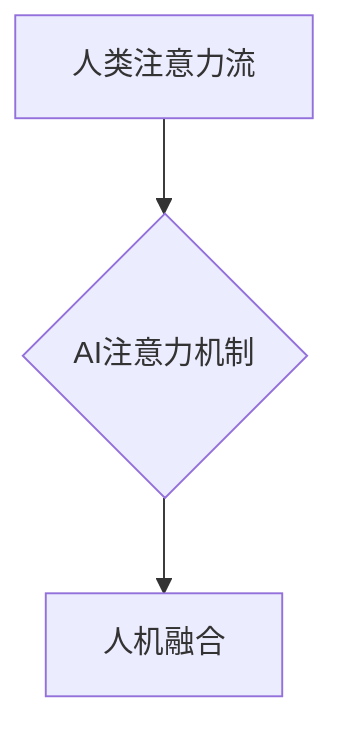

                 

## AI与人类注意力流：打造人机融合的未来

> 关键词：人工智能、注意力机制、人类注意力流、人机交互、深度学习、认知科学

### 1. 背景介绍

在信息爆炸的时代，人类面临着前所未有的信息过载挑战。我们每天需要处理海量的数字信息，从电子邮件、社交媒体到新闻报道，信息无处不在，却难以集中注意力。与此同时，人工智能（AI）技术飞速发展，其强大的计算能力和学习能力正在改变着我们生活的方方面面。

如何让AI更好地理解和适应人类的注意力机制，从而打造更自然、更智能的人机交互体验，成为一个重要的研究方向。

### 2. 核心概念与联系

**2.1 人类注意力流**

人类注意力流是一个复杂的心理过程，它涉及到感知、认知、情感和行为等多个方面。注意力流是指我们对特定信息或任务的集中和持续关注，它可以被外部刺激、内在动机或两者共同驱动。

注意力流的特性包括：

* **选择性:** 我们只能同时关注有限的信息，需要选择性地过滤和处理信息。
* **可塑性:** 注意力流可以被训练和调节，例如通过冥想、专注练习等。
* **动态性:** 注意力流并非静态的，它会随着时间和环境的变化而波动。

**2.2 AI注意力机制**

AI注意力机制是借鉴人类注意力流的原理，设计的一种机器学习模型结构。它允许模型在处理信息时，根据信息的 relevance 和 importance，赋予不同的权重，从而提高模型的学习效率和准确性。

注意力机制的核心思想是：

* **学习关注:** 模型学习识别和关注输入数据中最重要的部分。
* **权重分配:** 模型为不同输入元素分配不同的权重，从而突出重要信息。
* **上下文建模:** 模型通过注意力机制，更好地理解输入数据的上下文关系。

**2.3 人机融合**

人机融合是指将人类的智慧和能力与人工智能的优势相结合，共同完成复杂的任务。在人机交互领域，AI注意力机制可以帮助构建更智能、更人性化的交互体验。

例如，AI可以根据用户的注意力流，主动提供相关信息，或者调整交互方式，以更好地满足用户的需求。

**Mermaid 流程图**



### 3. 核心算法原理 & 具体操作步骤

**3.1 算法原理概述**

常见的AI注意力机制算法包括：

* **自注意力机制 (Self-Attention):**  用于处理序列数据，例如文本、语音等，可以捕捉序列中不同元素之间的关系。
* **交叉注意力机制 (Cross-Attention):** 用于处理多个序列之间的关系，例如机器翻译、文本摘要等。
* **位置编码 (Positional Encoding):** 用于解决自注意力机制无法区分序列元素位置的问题。

**3.2 算法步骤详解**

以自注意力机制为例，其具体操作步骤如下：

1. **输入嵌入:** 将输入序列中的每个元素转换为向量表示。
2. **查询、键、值计算:** 对每个输入元素计算查询 (Query)、键 (Key) 和值 (Value) 向量。
3. **注意力权重计算:** 计算每个查询向量与所有键向量的相似度，并将其转换为注意力权重。
4. **加权求和:** 将每个值向量与对应的注意力权重相乘，并求和，得到每个查询向量的输出。
5. **输出融合:** 将所有输出向量进行拼接或平均，得到最终的输出。

**3.3 算法优缺点**

**优点:**

* 能够捕捉序列数据中的长距离依赖关系。
* 能够学习到不同元素之间的重要关系。
* 能够提高模型的学习效率和准确性。

**缺点:**

* 计算复杂度较高。
* 训练数据量较大。
* 容易受到噪声数据的影响。

**3.4 算法应用领域**

* **自然语言处理:** 机器翻译、文本摘要、问答系统、情感分析等。
* **计算机视觉:** 图像识别、目标检测、图像 Captioning 等。
* **语音识别:** 语音转文本、语音合成等。

### 4. 数学模型和公式 & 详细讲解 & 举例说明

**4.1 数学模型构建**

假设我们有一个输入序列 X = {x1, x2, ..., xn}，其中每个元素 xi 是一个向量。

自注意力机制的数学模型可以表示为：

```latex
Attention(Q, K, V) = softmax(Q K^T / sqrt(d_k)) V
```

其中：

* Q: 查询矩阵，每个元素为 xi 的查询向量。
* K: 键矩阵，每个元素为 xi 的键向量。
* V: 值矩阵，每个元素为 xi 的值向量。
* d_k: 键向量的维度。
* softmax: 归一化函数，将注意力权重归一化到 [0, 1] 之间。

**4.2 公式推导过程**

注意力权重计算公式的推导过程如下：

1. 计算每个查询向量 qi 与所有键向量 kj 的点积:

```latex
score(qi, kj) = qi kj^T
```

2. 对所有 score 进行归一化，得到注意力权重:

```latex
attention(qi, kj) = softmax(score(qi, kj) / sqrt(d_k))
```

**4.3 案例分析与讲解**

例如，在机器翻译任务中，自注意力机制可以帮助模型捕捉源语言和目标语言之间的对应关系。

当模型处理源语言句子时，它会计算每个单词的查询、键和值向量。然后，模型会计算每个单词的注意力权重，以确定它与其他单词之间的关系。

最终，模型会根据注意力权重，将源语言句子翻译成目标语言句子。

### 5. 项目实践：代码实例和详细解释说明

**5.1 开发环境搭建**

* Python 3.6+
* TensorFlow 或 PyTorch 深度学习框架
* Jupyter Notebook 或 VS Code 开发环境

**5.2 源代码详细实现**

```python
import tensorflow as tf

# 定义自注意力机制层
class SelfAttention(tf.keras.layers.Layer):
    def __init__(self, embed_dim, num_heads):
        super(SelfAttention, self).__init__()
        self.embed_dim = embed_dim
        self.num_heads = num_heads
        self.head_dim = embed_dim // num_heads

        # 计算查询、键、值矩阵
        self.query = tf.keras.layers.Dense(embed_dim)
        self.key = tf.keras.layers.Dense(embed_dim)
        self.value = tf.keras.layers.Dense(embed_dim)

    def call(self, inputs):
        # 获取输入序列
        x = inputs

        # 计算查询、键、值向量
        q = self.query(x)
        k = self.key(x)
        v = self.value(x)

        # 分割向量
        q = tf.reshape(q, shape=(-1, tf.shape(q)[1], self.num_heads, self.head_dim))
        k = tf.reshape(k, shape=(-1, tf.shape(k)[1], self.num_heads, self.head_dim))
        v = tf.reshape(v, shape=(-1, tf.shape(v)[1], self.num_heads, self.head_dim))

        # 计算注意力权重
        attention_scores = tf.matmul(q, k, transpose_b=True) / tf.math.sqrt(tf.cast(self.head_dim, tf.float32))
        attention_weights = tf.nn.softmax(attention_scores, axis=-1)

        # 加权求和
        output = tf.matmul(attention_weights, v)

        # 合并向量
        output = tf.reshape(output, shape=(-1, tf.shape(output)[1], self.embed_dim))

        return output
```

**5.3 代码解读与分析**

* `SelfAttention` 类定义了一个自注意力机制层。
* `__init__` 方法初始化层参数，包括嵌入维度 `embed_dim` 和注意力头数 `num_heads`。
* `call` 方法实现自注意力机制的计算过程，包括计算查询、键、值向量、注意力权重和加权求和。

**5.4 运行结果展示**

运行上述代码，可以将自注意力机制应用于文本序列的处理，例如文本分类、文本摘要等任务。

### 6. 实际应用场景

**6.1 个性化推荐系统**

AI注意力机制可以帮助推荐系统更好地理解用户的兴趣偏好，并推荐更个性化的内容。例如，电商平台可以根据用户的浏览历史、购买记录和评分等信息，计算每个商品的注意力权重，并推荐用户可能感兴趣的商品。

**6.2 智能客服系统**

AI注意力机制可以帮助智能客服系统更好地理解用户的需求，并提供更准确的回复。例如，聊天机器人可以根据用户的聊天记录，计算每个关键词的注意力权重，并根据权重进行回复。

**6.3 教育领域**

AI注意力机制可以帮助教育系统更好地理解学生的学习情况，并提供个性化的学习方案。例如，在线学习平台可以根据学生的学习进度和错误类型，计算每个学习内容的注意力权重，并推荐学生需要重点学习的内容。

**6.4 未来应用展望**

随着AI技术的不断发展，AI注意力机制将在更多领域得到应用，例如：

* **医疗诊断:** 帮助医生更快、更准确地诊断疾病。
* **金融风险控制:** 帮助金融机构识别和控制金融风险。
* **自动驾驶:** 帮助自动驾驶汽车更好地感知周围环境。

### 7. 工具和资源推荐

**7.1 学习资源推荐**

* **论文:** "Attention Is All You Need" (Vaswani et al., 2017)
* **博客:** Jay Alammar's Blog (https://jalammar.github.io/illustrated-transformer/)
* **课程:** Deep Learning Specialization (Andrew Ng)

**7.2 开发工具推荐**

* **TensorFlow:** https://www.tensorflow.org/
* **PyTorch:** https://pytorch.org/

**7.3 相关论文推荐**

* "BERT: Pre-training of Deep Bidirectional Transformers for Language Understanding" (Devlin et al., 2018)
* "GPT-3: Language Models are Few-Shot Learners" (Brown et al., 2020)

### 8. 总结：未来发展趋势与挑战

**8.1 研究成果总结**

AI注意力机制在自然语言处理、计算机视觉等领域取得了显著的成果，显著提高了模型的性能。

**8.2 未来发展趋势**

* **更强大的注意力机制:** 研究更有效的注意力机制，例如可解释性更高的注意力机制、动态注意力机制等。
* **跨模态注意力机制:** 研究跨模态注意力机制，例如将文本、图像、音频等多种模态信息融合在一起。
* **高效的注意力机制:** 研究更高效的注意力机制，例如降低计算复杂度、减少内存消耗的注意力机制。

**8.3 面临的挑战**

* **可解释性:** 目前大多数注意力机制难以解释其决策过程，这限制了其在一些安全关键应用中的应用。
* **数据效率:** 一些注意力机制需要大量的训练数据才能达到最佳性能。
* **计算成本:** 一些注意力机制的计算成本较高，难以在资源有限的设备上运行。

**8.4 研究展望**

未来，AI注意力机制将继续朝着更强大、更智能、更可解释的方向发展，并在更多领域发挥重要作用。


### 9. 附录：常见问题与解答

**9.1 如何理解注意力权重？**

注意力权重表示模型对不同输入元素的关注程度。权重越高，表示模型对该元素的关注程度越高。

**9.2 自注意力机制和交叉注意力机制有什么区别？**

自注意力机制用于处理单个序列的数据，例如文本序列。交叉注意力机制用于处理多个序列之间的关系，例如机器翻译。

**9.3 注意力机制的计算复杂度如何？**

注意力机制的计算复杂度较高，与序列长度和注意力头数成正比。


作者：禅与计算机程序设计艺术 / Zen and the Art of Computer Programming 
<end_of_turn>

