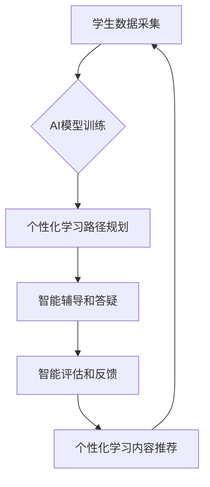

                 

## AI在个性化教育中的作用：适应学生学习曲线

> 关键词：人工智能、个性化教育、学习曲线、机器学习、深度学习、自然语言处理、知识图谱

## 1. 背景介绍

教育一直是人类社会发展的重要基石，而传统的教育模式往往难以满足每个学生个性化的学习需求。随着人工智能技术的飞速发展，AI在教育领域的应用逐渐成为热点，特别是个性化教育，它利用AI技术分析学生的学习情况，定制个性化的学习方案，帮助学生更高效地掌握知识，激发学习兴趣。

传统的教育模式通常采用“一刀切”的教学方法，将所有学生按照相同的标准进行教学，忽略了学生个体差异。这导致一些学生在学习过程中感到枯燥乏味，难以理解，而另一些学生则可能因为学习过快而感到无聊。个性化教育的目标是打破这种“一刀切”的模式，为每个学生提供定制化的学习体验，帮助他们根据自己的学习进度和风格，更有效地掌握知识。

## 2. 核心概念与联系

**2.1 个性化教育的核心概念**

个性化教育是指根据学生的个体差异，如学习风格、兴趣、能力水平等，定制化的教学方案和学习资源，以满足每个学生的独特需求。

**2.2 AI在个性化教育中的作用**

人工智能技术可以帮助实现个性化教育的目标，主要通过以下几个方面：

* **智能学习路径规划:** AI算法可以分析学生的学习数据，例如学习进度、掌握程度、错误类型等，并根据这些数据，为每个学生规划个性化的学习路径，推荐合适的学习资源和练习题。
* **智能辅导和答疑:** AI聊天机器人可以作为学生的虚拟老师，提供个性化的辅导和答疑服务，帮助学生解决学习中的难题。
* **智能评估和反馈:** AI算法可以自动评估学生的学习成果，并提供个性化的反馈，帮助学生了解自己的学习情况，并及时调整学习策略。
* **智能内容推荐:** AI算法可以根据学生的学习兴趣和需求，推荐个性化的学习内容，例如视频、文章、音频等。

**2.3 AI与个性化教育的架构**



## 3. 核心算法原理 & 具体操作步骤

**3.1 算法原理概述**

个性化教育的核心算法主要包括：

* **机器学习算法:** 用于分析学生的学习数据，识别学习模式，并预测学生的学习效果。常见的机器学习算法包括：
    * **监督学习:** 利用标记数据训练模型，例如预测学生的考试成绩。
    * **非监督学习:** 用于发现数据的内在结构，例如学生学习风格的分类。
    * **强化学习:** 通过奖励和惩罚机制，训练模型学习最优的学习策略。
* **深度学习算法:** 用于处理复杂的数据，例如文本、图像、音频等。深度学习算法可以学习更复杂的特征，提高个性化教育的精准度。

**3.2 算法步骤详解**

1. **数据采集:** 收集学生的学习数据，例如学习记录、考试成绩、作业提交情况、学习行为等。
2. **数据预处理:** 对收集到的数据进行清洗、转换、特征提取等操作，使其适合机器学习算法的训练。
3. **模型训练:** 选择合适的机器学习算法，利用预处理后的数据训练模型。
4. **模型评估:** 使用测试数据评估模型的性能，例如准确率、召回率、F1-score等。
5. **模型部署:** 将训练好的模型部署到实际应用场景中，例如个性化学习平台、智能辅导系统等。

**3.3 算法优缺点**

* **优点:**
    * 可以根据学生的个体差异，提供个性化的学习方案。
    * 可以提高学习效率，激发学习兴趣。
    * 可以帮助教师更好地了解学生的学习情况，及时调整教学策略。
* **缺点:**
    * 需要大量的学习数据进行训练，数据质量对模型性能有很大影响。
    * 算法模型的复杂度较高，需要专业的技术人员进行开发和维护。
    * 存在伦理问题，例如数据隐私保护、算法偏见等。

**3.4 算法应用领域**

* **K-12教育:** 个性化学习路径规划、智能辅导系统、智能评估系统。
* **高等教育:** 个性化课程推荐、智能学习助手、在线考试系统。
* **职业教育:** 个性化职业规划、技能培训、在线学习平台。

## 4. 数学模型和公式 & 详细讲解 & 举例说明

**4.1 数学模型构建**

个性化教育的数学模型通常基于机器学习算法，例如推荐系统、分类算法、回归算法等。

* **推荐系统:** 利用协同过滤、内容过滤、混合过滤等算法，根据学生的学习历史、兴趣偏好等信息，推荐个性化的学习资源。
* **分类算法:** 用于识别学生的学习风格、学习能力等类别，例如K-means聚类、决策树分类等。
* **回归算法:** 用于预测学生的学习成绩、学习进度等连续值，例如线性回归、支持向量回归等。

**4.2 公式推导过程**

具体的数学公式推导过程取决于所使用的机器学习算法。例如，协同过滤算法的核心公式是基于用户的相似度或物品的相似度进行推荐。

**4.3 案例分析与讲解**

假设我们使用协同过滤算法构建一个个性化学习资源推荐系统。

* **用户相似度计算:** 使用余弦相似度计算用户之间的相似度，例如两个用户对相同课程的学习记录相似度越高，则用户相似度越高。
* **资源推荐:** 根据用户的相似用户，推荐他们学习过的资源，例如如果用户A和用户B的相似度较高，并且用户B学习过课程X，则推荐课程X给用户A。

## 5. 项目实践：代码实例和详细解释说明

**5.1 开发环境搭建**

* **操作系统:** Linux/macOS/Windows
* **编程语言:** Python
* **机器学习库:** scikit-learn, TensorFlow, PyTorch
* **数据存储:** MySQL, MongoDB

**5.2 源代码详细实现**

```python
# 导入必要的库
import pandas as pd
from sklearn.metrics.pairwise import cosine_similarity

# 加载用户学习数据
data = pd.read_csv('user_learning_data.csv')

# 计算用户之间的余弦相似度
user_similarity = cosine_similarity(data.T)

# 获取用户A的相似用户
user_A_id = 1
similar_users = user_similarity[user_A_id].argsort()[:-6:-1]

# 获取相似用户学习过的课程
recommended_courses = data.iloc[similar_users, :].sum().sort_values(ascending=False)

# 输出推荐课程
print(recommended_courses)
```

**5.3 代码解读与分析**

* 该代码首先加载用户学习数据，然后使用余弦相似度计算用户之间的相似度。
* 接着，根据用户A的ID获取其相似用户，并根据相似用户的学习记录，推荐用户A学习的课程。

**5.4 运行结果展示**

运行该代码后，会输出用户A可能感兴趣的课程列表，这些课程是根据其相似用户的学习记录推荐的。

## 6. 实际应用场景

**6.1 个性化学习路径规划**

AI可以根据学生的学习进度、掌握程度、学习风格等信息，为每个学生规划个性化的学习路径，推荐合适的学习资源和练习题。例如，如果学生在数学方面表现较弱，AI可以推荐一些数学基础知识的学习资源，并根据学生的学习进度，调整学习难度。

**6.2 智能辅导和答疑**

AI聊天机器人可以作为学生的虚拟老师，提供个性化的辅导和答疑服务。学生可以向AI机器人提问学习问题，AI机器人可以根据学生的提问内容，提供相应的解答和指导。例如，学生在解一道数学题时遇到困难，可以向AI机器人提问，AI机器人可以根据学生的解题思路，提供相应的帮助和建议。

**6.3 智能评估和反馈**

AI算法可以自动评估学生的学习成果，并提供个性化的反馈，帮助学生了解自己的学习情况，并及时调整学习策略。例如，AI可以自动批改学生的作业，并根据学生的错误类型，提供相应的指导和建议。

**6.4 未来应用展望**

* **沉浸式学习体验:** 利用虚拟现实、增强现实等技术，为学生提供更加沉浸式的学习体验。
* **个性化学习内容生成:** 利用自然语言处理、机器学习等技术，自动生成个性化的学习内容，例如根据学生的学习兴趣和需求，生成个性化的学习文章、视频等。
* **跨学科学习:** 利用知识图谱等技术，帮助学生建立跨学科的知识体系，促进学生对知识的深度理解。

## 7. 工具和资源推荐

**7.1 学习资源推荐**

* **在线课程:** Coursera, edX, Udacity
* **书籍:**
    * 《深度学习》
    * 《机器学习实战》
    * 《自然语言处理入门》
* **博客:**
    * Towards Data Science
    * Machine Learning Mastery

**7.2 开发工具推荐**

* **编程语言:** Python
* **机器学习库:** scikit-learn, TensorFlow, PyTorch
* **数据存储:** MySQL, MongoDB
* **云平台:** AWS, Azure, Google Cloud

**7.3 相关论文推荐**

* **个性化学习路径规划:**
    * "Personalized Learning Paths: A Survey"
    * "Adaptive Learning Systems: A Survey"
* **智能辅导和答疑:**
    * "Chatbots for Education: A Survey"
    * "AI-Powered Tutoring Systems: A Review"
* **智能评估和反馈:**
    * "Automated Essay Grading: A Survey"
    * "Personalized Feedback in Education: A Review"

## 8. 总结：未来发展趋势与挑战

**8.1 研究成果总结**

AI在个性化教育领域的应用取得了显著的成果，例如个性化学习路径规划、智能辅导和答疑、智能评估和反馈等。这些应用可以帮助学生更高效地掌握知识，激发学习兴趣，并帮助教师更好地了解学生的学习情况，及时调整教学策略。

**8.2 未来发展趋势**

* **更精准的个性化推荐:** 利用更先进的机器学习算法和数据分析技术，为学生提供更精准的个性化推荐。
* **更智能的学习助手:** 开发更智能的学习助手，能够理解学生的学习需求，并提供更有效的帮助和指导。
* **更沉浸式的学习体验:** 利用虚拟现实、增强现实等技术，为学生提供更沉浸式的学习体验。

**8.3 面临的挑战**

* **数据隐私保护:** 个性化教育需要收集大量的学生数据，如何保护学生的隐私安全是一个重要的挑战。
* **算法偏见:** 算法模型可能存在偏见，导致对不同学生的不公平对待。
* **教师的角色转变:** AI技术的应用会改变教师的角色，教师需要学习新的技能，并适应新的教学模式。

**8.4 研究展望**

未来，AI在个性化教育领域的应用将更加广泛和深入，将为学生提供更加个性化、高效、有趣的学习体验。


## 9. 附录：常见问题与解答

**9.1 如何保证数据隐私安全？**

* 使用加密技术保护学生数据。
*  anonymize 学生数据，删除所有可以识别学生的个人信息。
* 获得学生的家长或学生的同意，才能收集和使用他们的数据。

**9.2 如何避免算法偏见？**

* 使用多样化的训练数据，避免算法过度依赖特定类型的学生数据。
* 定期评估算法模型，识别和解决算法偏见问题。
* 邀请来自不同背景的专家参与算法开发和评估。

**9.3 教师如何适应AI技术的应用？**

* 学习新的AI技术和教学方法。
* 关注AI技术的最新发展，并将其应用到教学实践中。
* 与AI技术专家合作，共同探索AI在教育领域的应用。


作者：禅与计算机程序设计艺术 / Zen and the Art of Computer Programming 
<end_of_turn>

