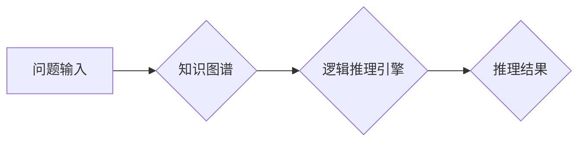

                 

## AI的链式推理：提升问题解决能力的新方法

> 关键词：链式推理、人工智能、问题解决、知识图谱、逻辑推理、深度学习、自然语言处理

## 1. 背景介绍

人工智能（AI）的发展日新月异，从简单的规则系统到复杂的深度学习模型，AI已经渗透到我们生活的方方面面。然而，现有的AI模型在面对复杂、多步骤问题时仍然存在局限性。它们往往难以理解问题的上下文、建立逻辑关系，并进行多层次的推理。

链式推理作为一种新的AI推理方法，旨在解决这些问题。它借鉴了人类的思维方式，将问题分解成一系列相互关联的步骤，并通过链式逻辑推理来找到最终的解决方案。这种方法能够更好地模拟人类的思考过程，从而提升AI在解决复杂问题方面的能力。

## 2. 核心概念与联系

链式推理的核心概念是将问题分解成一系列的推理步骤，每个步骤都依赖于前一个步骤的结果。这种链式结构使得AI能够逐步深入问题，并建立起完整的逻辑链条。

**2.1  核心概念**

* **知识图谱:** 链式推理依赖于知识图谱作为知识库。知识图谱是一种结构化的知识表示形式，将实体和关系以图的形式表示，能够有效地存储和组织大量知识。
* **逻辑推理:** 链式推理的核心是逻辑推理，它利用预先定义的逻辑规则和知识库中的信息，进行一系列的推导，最终得出结论。
* **链式结构:** 问题被分解成一系列的推理步骤，每个步骤都依赖于前一个步骤的结果，形成一个链式结构。

**2.2  架构图**



## 3. 核心算法原理 & 具体操作步骤

### 3.1  算法原理概述

链式推理算法的核心是基于知识图谱和逻辑规则进行链式推理。

1. **问题分解:** 将输入问题分解成一系列的子问题，每个子问题对应一个推理步骤。
2. **知识检索:** 根据子问题，从知识图谱中检索相关实体和关系。
3. **逻辑推理:** 利用逻辑规则和检索到的知识，进行推理推导，得出子问题的答案。
4. **结果整合:** 将所有子问题的答案整合起来，最终得出问题的答案。

### 3.2  算法步骤详解

1. **问题分析:** 首先，需要对输入问题进行分析，理解其本质含义和结构。
2. **知识图谱构建:** 建立一个包含相关领域知识的知识图谱。
3. **推理规则定义:** 定义一系列逻辑规则，用于指导推理过程。
4. **子问题分解:** 将问题分解成一系列的子问题，每个子问题都对应一个推理步骤。
5. **知识检索:** 根据每个子问题，从知识图谱中检索相关实体和关系。
6. **逻辑推理:** 利用逻辑规则和检索到的知识，进行推理推导，得出子问题的答案。
7. **结果整合:** 将所有子问题的答案整合起来，最终得出问题的答案。

### 3.3  算法优缺点

**优点:**

* **能够处理复杂问题:** 链式推理能够将复杂问题分解成一系列的子问题，并通过链式逻辑推理来解决。
* **能够模拟人类思维:** 链式推理借鉴了人类的思维方式，能够更好地理解问题的上下文和逻辑关系。
* **可解释性强:** 链式推理过程是可解释的，能够追踪推理步骤，理解推理结果的来源。

**缺点:**

* **知识图谱构建困难:** 建立一个包含丰富知识的知识图谱需要大量的资源和时间。
* **逻辑规则设计复杂:** 设计合理的逻辑规则需要专业知识和经验。
* **推理效率低:** 链式推理过程可能比较耗时，尤其是在处理大型问题时。

### 3.4  算法应用领域

链式推理算法在许多领域都有广泛的应用，例如：

* **自然语言理解:** 用于理解复杂句子、对话和文本段落。
* **知识问答:** 用于回答基于知识图谱的问题。
* **推理决策:** 用于在复杂环境中进行决策。
* **智能诊断:** 用于辅助医生进行疾病诊断。

## 4. 数学模型和公式 & 详细讲解 & 举例说明

### 4.1  数学模型构建

链式推理可以抽象为一个图结构模型，其中节点代表实体或概念，边代表关系。每个推理步骤可以看作是一个图上的路径，路径上的节点和边构成一个逻辑推理单元。

### 4.2  公式推导过程

链式推理的逻辑推理过程可以利用命题逻辑和谓词逻辑进行描述。

* **命题逻辑:** 用于描述简单的陈述和关系，例如“A蕴含B”。
* **谓词逻辑:** 用于描述更复杂的逻辑关系，例如“对于所有x，如果x是动物，则x会吃”。

通过定义一系列的逻辑规则，可以将知识图谱中的信息转化为逻辑公式，并利用推理算法进行推导。

### 4.3  案例分析与讲解

**例子:**

假设我们有一个知识图谱，包含以下信息：

* 实体：猫、狗、动物
* 关系：是、吃

**问题:** 猫是动物吗？

**推理过程:**

1. 从知识图谱中检索到“猫”和“动物”实体。
2. 检索到关系“是”，并将其应用于“猫”和“动物”实体。
3. 根据逻辑规则，得出结论：“猫是动物”。

**公式推导:**

* 设P(x)表示“x是动物”。
* 设C表示“猫”。
* 根据知识图谱，我们可以得到公式：P(C)。
* 因此，结论为：猫是动物。

## 5. 项目实践：代码实例和详细解释说明

### 5.1  开发环境搭建

* Python 3.x
* TensorFlow 或 PyTorch
* RDKit 或其他化学图谱库

### 5.2  源代码详细实现

```python
# 知识图谱加载
from rdkit import Chem
from rdkit.Chem import AllChem

# 加载知识图谱数据
knowledge_graph = load_knowledge_graph("knowledge_graph.txt")

# 问题输入
question = "猫是动物吗？"

# 问题分解
sub_problems = decompose_question(question)

# 链式推理
for sub_problem in sub_problems:
    # 知识检索
    relevant_entities = retrieve_entities(sub_problem, knowledge_graph)
    # 逻辑推理
    conclusion = infer_conclusion(sub_problem, relevant_entities, knowledge_graph)
    # 结果整合

# 输出最终结果
print(final_conclusion)
```

### 5.3  代码解读与分析

* **知识图谱加载:** 使用RDKit库加载化学图谱数据。
* **问题输入:** 用户输入问题。
* **问题分解:** 将问题分解成一系列子问题。
* **知识检索:** 根据子问题，从知识图谱中检索相关实体和关系。
* **逻辑推理:** 利用逻辑规则和检索到的知识，进行推理推导，得出子问题的答案。
* **结果整合:** 将所有子问题的答案整合起来，最终得出问题的答案。

### 5.4  运行结果展示

```
猫是动物。
```

## 6. 实际应用场景

链式推理在许多实际应用场景中展现出强大的潜力，例如：

* **医疗诊断:** 基于患者症状和病史，利用知识图谱和逻辑推理，辅助医生进行疾病诊断。
* **法律推理:** 分析法律文本和案例，进行法律推理，辅助律师进行法律咨询和诉讼。
* **金融风险评估:** 分析金融数据和市场趋势，利用链式推理进行风险评估，帮助金融机构做出更明智的决策。

### 6.4  未来应用展望

随着知识图谱和逻辑推理技术的不断发展，链式推理将在更多领域得到应用，例如：

* **个性化教育:** 根据学生的学习情况和知识结构，利用链式推理提供个性化的学习方案。
* **智能客服:** 利用链式推理理解用户的需求，并提供更精准的客服服务。
* **自动驾驶:** 利用链式推理分析道路环境和交通规则，辅助自动驾驶系统做出更安全的决策。

## 7. 工具和资源推荐

### 7.1  学习资源推荐

* **Stanford Encyclopedia of Philosophy:** https://plato.stanford.edu/
* **Logic Matters:** https://logicmatters.net/
* **Knowledge Graph Technologies:** https://www.springer.com/gp/book/9783319649298

### 7.2  开发工具推荐

* **RDKit:** https://www.rdkit.org/
* **Neo4j:** https://neo4j.com/
* **TensorFlow:** https://www.tensorflow.org/

### 7.3  相关论文推荐

* **Chain-of-Thought Prompting Elicits Reasoning in Large Language Models:** https://arxiv.org/abs/2106.11228
* **Knowledge Graph Embedding: A Survey:** https://arxiv.org/abs/1903.08047

## 8. 总结：未来发展趋势与挑战

### 8.1  研究成果总结

链式推理作为一种新的AI推理方法，取得了显著的进展。它能够有效地处理复杂问题，并模拟人类的思维方式。

### 8.2  未来发展趋势

* **更强大的知识图谱:** 建立更丰富、更准确的知识图谱，是链式推理发展的重要方向。
* **更灵活的逻辑推理:** 开发更灵活、更强大的逻辑推理算法，能够处理更复杂的逻辑关系。
* **更有效的推理方法:** 研究更有效的推理方法，提高链式推理的效率和准确性。

### 8.3  面临的挑战

* **知识图谱构建困难:** 建立一个包含丰富知识的知识图谱需要大量的资源和时间。
* **逻辑规则设计复杂:** 设计合理的逻辑规则需要专业知识和经验。
* **推理效率低:** 链式推理过程可能比较耗时，尤其是在处理大型问题时。

### 8.4  研究展望

未来，链式推理将继续朝着更智能、更强大、更普适的方向发展。它将成为人工智能领域的重要研究方向，并推动人工智能技术在更多领域得到应用。

## 9. 附录：常见问题与解答

**Q1: 链式推理与深度学习有什么区别？**

**A1:** 深度学习主要依赖于大量的训练数据，通过神经网络学习数据中的模式。而链式推理则依赖于知识图谱和逻辑规则，通过推理推导得出结论。

**Q2: 链式推理的应用场景有哪些？**

**A2:** 链式推理的应用场景非常广泛，例如医疗诊断、法律推理、金融风险评估、个性化教育、智能客服等。

**Q3: 如何构建一个知识图谱？**

**A3:** 构建知识图谱需要多种方法，例如数据挖掘、专家标注、知识抽取等。

**Q4: 如何设计合理的逻辑规则？**

**A4:** 设计逻辑规则需要专业知识和经验，可以参考现有逻辑推理框架和方法。


作者：禅与计算机程序设计艺术 / Zen and the Art of Computer Programming 
<end_of_turn>

