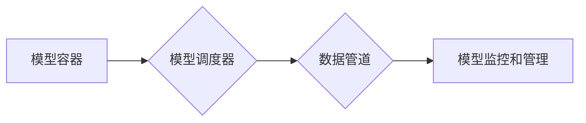

                 

## LLM操作系统设计：挑战与机遇

> 关键词：大型语言模型 (LLM)、操作系统设计、人工智能、软件架构、可扩展性、安全、效率、可解释性

### 1. 背景介绍

大型语言模型 (LLM) 近年来取得了令人瞩目的进展，在自然语言处理、文本生成、代码编写等领域展现出强大的能力。然而，将这些强大的模型部署到实际应用中，并使其能够高效、安全、可扩展地运行，仍然面临着诸多挑战。传统的操作系统设计理念难以满足 LLM 的特殊需求，因此，专门针对 LLM 的操作系统设计成为一个重要的研究方向。

LLM 操作系统 (LLM OS) 的目标是提供一个专门为 LLM 优化的运行环境，解决以下关键问题：

* **高效的内存管理:** LLM 模型通常体积庞大，需要大量的内存资源。LLM OS 需要能够高效地管理内存，并支持模型的动态加载和卸载。
* **并行计算和分布式训练:** LLM 的训练和推理过程通常需要大量的计算资源。LLM OS 需要支持并行计算和分布式训练，以充分利用硬件资源。
* **模型更新和部署:** LLM 模型需要定期更新以保持其性能。LLM OS 需要提供便捷的模型更新和部署机制，以确保模型始终处于最新状态。
* **安全性和隐私保护:** LLM 模型处理大量敏感数据，因此安全性和隐私保护至关重要。LLM OS 需要提供相应的安全机制，防止模型被恶意攻击或数据被泄露。
* **可解释性和可控性:** LLM 模型的决策过程通常难以理解，这可能会导致其应用中的不可控性。LLM OS 需要提供工具和机制，提高模型的可解释性和可控性。

### 2. 核心概念与联系

LLM 操作系统的设计需要结合人工智能、软件工程、系统架构等多学科的知识。其核心概念包括：

* **模型容器:** 用于封装和管理 LLM 模型及其依赖的资源，类似于 Docker 容器。
* **模型调度器:** 负责分配模型运行资源，并协调模型之间的交互。
* **数据管道:** 用于高效地传输模型输入和输出数据。
* **模型监控和管理:** 用于监控模型运行状态，并提供模型更新、部署和管理功能。

**Mermaid 流程图:**



### 3. 核心算法原理 & 具体操作步骤

#### 3.1  算法原理概述

LLM 操作系统的核心算法主要包括：

* **模型加载和卸载算法:** 用于高效地加载和卸载 LLM 模型，并管理模型的内存占用。
* **模型并行化算法:** 用于将 LLM 模型分解成多个子模型，并将其分布在多个计算节点上进行并行计算。
* **数据管道优化算法:** 用于优化数据传输路径，并减少数据传输延迟。
* **模型更新和部署算法:** 用于将更新后的模型部署到运行环境中，并确保模型的可用性。

#### 3.2  算法步骤详解

* **模型加载和卸载算法:**

1. 识别模型文件格式和依赖库。
2. 将模型文件加载到内存中，并进行必要的预处理。
3. 创建模型容器，并将其与模型文件关联。
4. 在需要使用模型时，将模型容器加载到运行环境中。
5. 在不再需要模型时，卸载模型容器，释放内存资源。

* **模型并行化算法:**

1. 将 LLM 模型分解成多个子模型，每个子模型负责处理模型的一部分计算任务。
2. 将子模型分布在多个计算节点上，并协调子模型之间的通信。
3. 使用并行计算框架，例如 TensorFlow 或 PyTorch，实现子模型之间的数据并行和计算并行。

* **数据管道优化算法:**

1. 分析数据传输路径，识别瓶颈和冗余操作。
2. 使用数据压缩、缓存和分片等技术，优化数据传输效率。
3. 使用异步数据传输机制，减少数据传输延迟。

* **模型更新和部署算法:**

1. 收集模型更新信息，例如模型参数和配置。
2. 验证模型更新信息，确保其合法性和完整性。
3. 将模型更新信息部署到运行环境中，并更新模型容器。
4. 重新启动模型容器，使模型生效。

#### 3.3  算法优缺点

* **模型加载和卸载算法:**

    * **优点:** 提高模型的利用率，并减少内存占用。
    * **缺点:** 模型加载和卸载过程可能存在延迟，影响模型的响应时间。

* **模型并行化算法:**

    * **优点:** 显著提高模型的训练和推理速度。
    * **缺点:** 需要复杂的协调机制，并可能增加模型的复杂度。

* **数据管道优化算法:**

    * **优点:** 显著提高数据传输效率，减少模型的延迟。
    * **缺点:** 需要对数据传输路径进行深入分析，并可能需要修改模型的架构。

* **模型更新和部署算法:**

    * **优点:** 确保模型始终处于最新状态，并方便地进行模型更新和部署。
    * **缺点:** 模型更新和部署过程可能存在风险，需要确保其安全性。

#### 3.4  算法应用领域

LLM 操作系统中的核心算法可以应用于以下领域:

* **自然语言处理:** 语义理解、文本生成、机器翻译等。
* **计算机视觉:** 图像识别、物体检测、图像生成等。
* **语音识别:** 语音转文本、语音合成等。
* **代码生成:** 代码自动完成、代码修复等。
* **科学研究:** 数据分析、模型预测等。

### 4. 数学模型和公式 & 详细讲解 & 举例说明

#### 4.1  数学模型构建

LLM 操作系统的核心算法可以抽象为数学模型，例如：

* **模型加载和卸载时间复杂度:** O(M)，其中 M 为模型大小。
* **模型并行化速度提升:** 1/P，其中 P 为并行计算节点数。
* **数据管道传输延迟:** T(D)/B，其中 T(D) 为数据传输时间，B 为数据带宽。

#### 4.2  公式推导过程

* **模型加载和卸载时间复杂度:** 模型加载和卸载的时间主要取决于模型的大小。假设模型的大小为 M，则加载和卸载的时间复杂度为 O(M)。

* **模型并行化速度提升:** 将模型分解成 P 个子模型并行计算，可以将训练和推理时间缩短为原来的 1/P。

* **数据管道传输延迟:** 数据传输延迟取决于数据传输时间 T(D) 和数据带宽 B。数据传输延迟可以表示为 T(D)/B。

#### 4.3  案例分析与讲解

假设一个 LLM 模型大小为 10GB，并将其部署到 4 个计算节点上进行并行计算。

* 模型加载和卸载时间复杂度为 O(10GB)，即 10GB 的数据需要加载和卸载。
* 模型并行化速度提升为 1/4，即训练和推理时间可以缩短为原来的 1/4。
* 假设数据传输时间为 1 秒，数据带宽为 1GB/s，则数据管道传输延迟为 1s / 1GB/s = 1ms。

### 5. 项目实践：代码实例和详细解释说明

#### 5.1  开发环境搭建

LLM 操作系统可以使用 Python 语言开发，并结合 TensorFlow 或 PyTorch 等深度学习框架。开发环境需要包含以下软件：

* Python 3.x
* TensorFlow 或 PyTorch
* Docker 或 Kubernetes
* Git

#### 5.2  源代码详细实现

以下是一个简单的模型容器实现示例，使用 Python 和 Docker：

```python
# Dockerfile
FROM python:3.8

WORKDIR /app

COPY requirements.txt .
RUN pip install --no-cache-dir -r requirements.txt

COPY . .

CMD ["python", "main.py"]
```

```python
# main.py
import tensorflow as tf

# 加载模型
model = tf.keras.models.load_model("model.h5")

# 处理输入数据
input_data = ...

# 进行推理
output = model.predict(input_data)

# 输出结果
print(output)
```

#### 5.3  代码解读与分析

* Dockerfile 定义了模型容器的构建过程，包括 Python 版本、依赖库安装和应用程序启动命令。
* main.py 文件实现了模型加载、数据处理和推理过程。

#### 5.4  运行结果展示

将 Dockerfile 构建成 Docker 镜像，并运行容器，即可完成模型的部署和推理。

### 6. 实际应用场景

LLM 操作系统可以应用于以下实际场景：

* **智能客服:** 提供快速、准确的客户服务，并根据客户需求提供个性化解决方案。
* **内容创作:** 自动生成新闻报道、广告文案、社交媒体内容等。
* **代码开发:** 自动完成代码编写、代码修复、代码测试等任务。
* **教育培训:** 提供个性化的学习辅导、自动批改作业等服务。

### 6.4  未来应用展望

随着 LLM 技术的不断发展，LLM 操作系统将发挥越来越重要的作用，并应用于更多领域，例如：

* **医疗诊断:** 辅助医生进行疾病诊断，并提供个性化的治疗方案。
* **金融分析:** 分析市场趋势，预测股票价格，识别金融风险。
* **科学研究:** 加速科学发现，推动科技创新。

### 7. 工具和资源推荐

#### 7.1  学习资源推荐

* **书籍:**

    * 《深度学习》 by Ian Goodfellow, Yoshua Bengio, and Aaron Courville
    * 《自然语言处理》 by Dan Jurafsky and James H. Martin

* **在线课程:**

    * Coursera: Deep Learning Specialization
    * Udacity: Artificial Intelligence Nanodegree

#### 7.2  开发工具推荐

* **深度学习框架:** TensorFlow, PyTorch, JAX
* **容器化平台:** Docker, Kubernetes
* **代码编辑器:** VS Code, Atom, Sublime Text

#### 7.3  相关论文推荐

* **《Transformer: Attention Is All You Need》:** https://arxiv.org/abs/1706.03762
* **《BERT: Pre-training of Deep Bidirectional Transformers for Language Understanding》:** https://arxiv.org/abs/1810.04805
* **《GPT-3: Language Models are Few-Shot Learners》:** https://arxiv.org/abs/2005.14165

### 8. 总结：未来发展趋势与挑战

#### 8.1  研究成果总结

LLM 操作系统是一个新兴的研究领域，取得了一些重要的进展，例如：

* 模型容器技术的发展，使得模型的部署和管理更加方便。
* 并行计算和数据管道优化算法的改进，提高了模型的训练和推理效率。
* 模型更新和部署机制的完善，确保了模型的可用性和安全性。

#### 8.2  未来发展趋势

LLM 操作系统未来的发展趋势包括：

* **更强大的模型支持:** 支持更大规模、更复杂的 LLM 模型。
* **更智能的资源管理:** 自动分配和调度模型资源，提高资源利用率。
* **更安全的运行环境:** 提供更完善的安全机制，防止模型被恶意攻击。
* **更易于使用的开发平台:** 提供更友好的开发工具和接口，降低开发门槛。

#### 8.3  面临的挑战

LLM 操作系统仍然面临一些挑战，例如：

* **模型规模和复杂度:** 随着模型规模和复杂度的增加，模型的加载、卸载和推理过程会变得更加困难。
* **资源管理和调度:** 如何高效地管理和调度大量的模型资源是一个重要的挑战。
* **安全性和隐私保护:** LLM 模型处理大量敏感数据，需要提供更完善的安全机制。
* **可解释性和可控性:** LLM 模型的决策过程难以理解，需要提高模型的可解释性和可控性。

#### 8.4  研究展望

LLM 操作系统是一个充满机遇和挑战的领域，未来将会有更多的研究和开发工作。

### 9. 附录：常见问题与解答

* **Q: 如何选择合适的 LLM 模型？**

    * A: 选择合适的 LLM 模型需要根据具体的应用场景和需求进行考虑，例如模型大小、性能、训练数据等。

* **Q: 如何部署 LLM 模型到生产环境？**

    * A: 可以使用容器化技术，例如 Docker 或 Kubernetes，将 LLM 模型部署到生产环境中。

* **Q: 如何保证 LLM 模型的安全性？**

    * A: 可以使用安全机制，例如身份验证、授权、数据加密等，保证 LLM 模型的安全性。


作者：禅与计算机程序设计艺术 / Zen and the Art of Computer Programming 
<end_of_turn>

