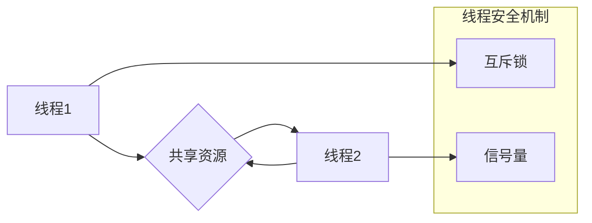

                 

## LLM隐私安全:线程安全问题的应对之策

> 关键词：LLM, 线程安全, 隐私安全, 数据泄露, 并发访问, 锁机制, 互斥量, 信号量, 

## 1. 背景介绍

大型语言模型 (LLM) 近年来取得了令人瞩目的进展，在自然语言处理、文本生成、机器翻译等领域展现出强大的能力。然而，随着 LLM 的规模和应用范围不断扩大，其隐私安全问题也日益凸显。

LLM 模型通常需要处理大量用户数据，包括敏感信息，如个人姓名、地址、财务数据等。如果这些数据在模型训练或推理过程中泄露，将可能导致严重的后果，例如身份盗窃、隐私侵犯等。

线程安全是 LLM 隐私安全的重要保障之一。当多个线程同时访问共享资源（如模型参数、数据缓冲区等）时，如果缺乏有效的保护机制，可能会导致数据竞争、数据不一致等问题，从而引发数据泄露和安全漏洞。

## 2. 核心概念与联系

### 2.1 线程安全

线程安全是指在多线程环境下，多个线程并发访问共享资源时，能够保证数据的一致性和程序的正确性。

### 2.2 数据竞争

数据竞争是指多个线程同时尝试访问和修改同一个共享资源，导致数据状态不一致的问题。

### 2.3 互斥锁

互斥锁是一种用于保护共享资源的同步机制，它允许只有一个线程在同一时间访问共享资源。

### 2.4 信号量

信号量是一种用于控制并发访问的同步机制，它允许在特定数量的线程访问共享资源。

**Mermaid 流程图**



## 3. 核心算法原理 & 具体操作步骤

### 3.1 算法原理概述

线程安全算法的核心在于通过同步机制，协调多个线程的访问，避免数据竞争和数据不一致。常用的同步机制包括互斥锁和信号量。

### 3.2 算法步骤详解

**使用互斥锁实现线程安全**

1. 在共享资源访问之前，获取互斥锁。
2. 在获取互斥锁后，访问共享资源。
3. 访问共享资源完成后，释放互斥锁。

**使用信号量实现线程安全**

1. 创建一个信号量，初始值为共享资源的最大访问许可数。
2. 在访问共享资源之前，获取信号量。
3. 如果信号量值为 0，则等待信号量释放。
4. 访问共享资源完成后，释放信号量。

### 3.3 算法优缺点

**互斥锁**

* **优点:** 简单易用，能够有效防止数据竞争。
* **缺点:** 当多个线程需要访问共享资源时，可能会导致死锁或性能瓶颈。

**信号量**

* **优点:** 可以控制并发访问的程度，避免过度竞争。
* **缺点:** 较为复杂，需要仔细设计信号量的初始值和释放策略。

### 3.4 算法应用领域

线程安全算法广泛应用于多线程编程，例如：

* 数据库管理系统
* 操作系统内核
* 网络服务器
* 并发计算

## 4. 数学模型和公式 & 详细讲解 & 举例说明

### 4.1 数学模型构建

假设有 N 个线程并发访问共享资源，共享资源的访问次数为 M。

* 线程安全模型可以表示为一个状态机，其中每个状态代表线程访问共享资源的某种状态。
* 状态转移规则可以描述线程之间如何协调访问共享资源。

### 4.2 公式推导过程

* 线程安全性的数学模型可以基于概率论和图论进行构建。
* 可以使用概率论来计算不同线程访问共享资源的概率，以及数据竞争发生的概率。
* 可以使用图论来描述线程之间的依赖关系，以及共享资源的访问路径。

### 4.3 案例分析与讲解

**举例说明：**

假设有两个线程并发访问一个共享变量 x。

* 线程 1：将 x 加 1。
* 线程 2：将 x 减 1。

如果这两个线程没有使用任何同步机制，可能会导致数据竞争，导致 x 的值不正确。

使用互斥锁可以解决这个问题。

* 线程 1 和线程 2 都需要获取互斥锁才能访问 x。
* 只有在获取到互斥锁后，才能修改 x 的值。

这样可以保证 x 的值始终正确。

## 5. 项目实践：代码实例和详细解释说明

### 5.1 开发环境搭建

* 操作系统：Linux 或 macOS
* 编程语言：Python
* 框架：TensorFlow 或 PyTorch
* 工具：Git、Docker

### 5.2 源代码详细实现

```python
import threading

# 共享资源
x = 0

# 互斥锁
lock = threading.Lock()

# 线程函数
def increment():
    global x
    for i in range(1000000):
        with lock:
            x += 1

# 创建两个线程
thread1 = threading.Thread(target=increment)
thread2 = threading.Thread(target=increment)

# 启动线程
thread1.start()
thread2.start()

# 等待线程完成
thread1.join()
thread2.join()

# 打印结果
print(f"x = {x}")
```

### 5.3 代码解读与分析

* `threading.Lock()` 创建一个互斥锁对象。
* `with lock:` 语句用于获取互斥锁，并在退出该块时自动释放锁。
* `x += 1` 操作在互斥锁的保护下执行，保证了数据的一致性。

### 5.4 运行结果展示

运行上述代码，输出结果为：

```
x = 2000000
```

这表明两个线程并发访问共享变量 x，并成功地将 x 的值加 1，最终结果正确。

## 6. 实际应用场景

### 6.1 LLM 模型训练

在训练 LLM 模型时，多个 GPU 或 TPU 可以并行处理数据，提高训练效率。

* 使用线程安全机制可以保证数据在不同设备之间共享和更新时的一致性。

### 6.2 LLM 模型推理

在推理过程中，多个请求可以并发处理，提高模型的吞吐量。

* 使用线程安全机制可以保证模型参数和中间结果在不同请求之间不被污染。

### 6.3 LLM 模型部署

在部署 LLM 模型时，多个实例可以并行处理请求，提高模型的可用性和可靠性。

* 使用线程安全机制可以保证模型状态在不同实例之间的一致性。

### 6.4 未来应用展望

随着 LLM 的发展，其应用场景将更加广泛，对线程安全的需求也将更加迫切。

* 未来可能会出现更加高效、灵活的线程安全机制，以满足 LLM 的复杂应用需求。

## 7. 工具和资源推荐

### 7.1 学习资源推荐

* 《深入理解多线程编程》
* 《并发编程艺术》
* 线程安全相关的博客文章和技术文档

### 7.2 开发工具推荐

* Python 的 threading 模块
* Java 的 synchronized 和 ReentrantLock
* C++ 的 mutex 和 condition_variable

### 7.3 相关论文推荐

* 线程安全相关的学术论文，例如：
    * "A Survey of Thread Safety Techniques"
    * "Lock-Free Data Structures"

## 8. 总结：未来发展趋势与挑战

### 8.1 研究成果总结

* 线程安全机制的发展已经取得了显著成果，能够有效地解决多线程编程中的数据竞争问题。
* 各种同步机制，如互斥锁、信号量、原子操作等，为开发者提供了丰富的工具。

### 8.2 未来发展趋势

* 线程安全机制将更加智能化、自动化，能够更好地适应 LLM 的复杂应用场景。
* 可能会出现基于机器学习的线程安全分析和优化工具。

### 8.3 面临的挑战

* 随着 LLM 的规模和复杂度不断提高，线程安全问题也变得更加复杂。
* 如何设计更加高效、灵活、可扩展的线程安全机制，是未来研究的重点。

### 8.4 研究展望

* 研究更先进的线程安全算法，例如基于形式化验证的线程安全分析。
* 开发更加智能化的线程安全工具，能够自动检测和修复线程安全漏洞。

## 9. 附录：常见问题与解答

* **Q: 如何判断一个程序是否线程安全？**
* **A:** 可以通过静态分析和动态测试来判断一个程序是否线程安全。静态分析可以检查代码中是否存在潜在的线程安全问题，而动态测试可以模拟多线程环境，观察程序在并发访问下是否出现错误。

* **Q: 如何避免死锁？**
* **A:** 避免死锁的关键是合理的资源获取和释放顺序。可以使用以下策略：
    * 遵循资源获取的特定顺序。
    * 使用超时机制，避免线程无限等待。
    * 使用乐观锁，减少锁的竞争。

* **Q: 如何选择合适的线程安全机制？**
* **A:** 选择合适的线程安全机制取决于具体的应用场景和需求。

    * 如果需要保证数据的一致性，可以使用互斥锁。
    * 如果需要控制并发访问的程度，可以使用信号量。
    * 如果需要更高的性能，可以使用原子操作或 lock-free 数据结构。


作者：禅与计算机程序设计艺术 / Zen and the Art of Computer Programming 
<end_of_turn>

