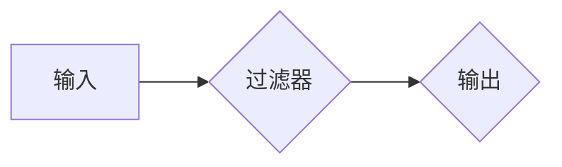

                 

## Logstash日志过滤与转换

> 关键词：Logstash,日志收集,日志过滤,日志转换,Elastic Stack,数据处理,实时分析

## 1. 背景介绍

在当今数据爆炸的时代，企业和组织每天都会产生海量的日志数据。这些日志数据包含着宝贵的应用程序运行状态、系统性能、用户行为等信息，是进行故障诊断、安全分析、性能优化和业务洞察的重要数据源。然而，原始日志数据通常是结构化、冗余、格式不统一，难以直接分析和利用。因此，对日志数据进行有效地过滤、转换和存储至关重要。

Logstash 作为 Elastic Stack 中的核心组件之一，专门用于收集、过滤、转换和发送日志数据。它提供了一个强大的、灵活的管道系统，可以根据需要定制日志处理流程，满足不同场景的需求。

## 2. 核心概念与联系

Logstash 的核心概念是 **管道 (Pipeline)**。管道是一个由多个阶段组成的处理流程，每个阶段负责特定的日志处理任务。

**Logstash 管道架构**



* **输入 (Input)**：负责从各种数据源收集日志数据，例如文件、网络流、数据库等。
* **过滤器 (Filter)**：对收集到的日志数据进行过滤、转换和 enrichment 操作，例如提取特定字段、删除敏感信息、格式化数据等。
* **输出 (Output)**：将经过处理的日志数据发送到目标系统，例如 Elasticsearch、文件系统、数据库等。

Logstash 的强大之处在于其插件化架构，提供了丰富的输入、过滤器和输出插件，可以满足各种复杂的需求。

## 3. 核心算法原理 & 具体操作步骤

### 3.1  算法原理概述

Logstash 的核心算法原理是基于 **流式处理** 的思想。它将日志数据视为一个不断流动的数据流，并通过管道中的各个阶段对数据进行处理。

Logstash 使用 **事件驱动模型** 来处理数据流。每个日志记录都被称为一个事件，事件包含了时间戳、日志级别、消息内容等信息。Logstash 会将事件从输入端接收，并将其传递到管道中的各个阶段进行处理。

### 3.2  算法步骤详解

1. **数据收集**: Logstash 使用输入插件从各种数据源收集日志数据。
2. **数据解析**: Logstash 使用过滤器插件解析日志数据，提取关键信息并将其转换为结构化的格式。
3. **数据过滤**: Logstash 使用过滤器插件根据预定义的规则过滤日志数据，保留需要的数据并丢弃不需要的数据。
4. **数据转换**: Logstash 使用过滤器插件对日志数据进行转换，例如格式化时间戳、转换数据类型、添加新字段等。
5. **数据输出**: Logstash 使用输出插件将经过处理的日志数据发送到目标系统。

### 3.3  算法优缺点

**优点**:

* **灵活**: Logstash 的插件化架构提供了丰富的功能，可以满足各种复杂的需求。
* **可扩展**: Logstash 可以轻松地扩展到处理海量日志数据。
* **实时处理**: Logstash 可以实时处理日志数据，满足对实时分析的需求。

**缺点**:

* **配置复杂**: Logstash 的配置相对复杂，需要一定的学习成本。
* **性能瓶颈**: 如果处理的数据量过大，Logstash 的性能可能会受到瓶颈。

### 3.4  算法应用领域

Logstash 广泛应用于以下领域:

* **IT运维**: 监控应用程序和系统运行状态，收集日志数据进行分析和报警。
* **安全分析**: 收集安全日志数据，进行威胁检测和事件响应。
* **业务洞察**: 收集业务日志数据，进行用户行为分析和业务趋势分析。

## 4. 数学模型和公式 & 详细讲解 & 举例说明

Logstash 的核心算法原理并不依赖于复杂的数学模型和公式。它主要基于流式处理和事件驱动模型，通过插件化的架构实现灵活的日志处理功能。

然而，在 Logstash 的配置和性能优化过程中，一些数学概念和公式可能会被用到，例如：

* **数据量估算**: 使用统计学方法估算日志数据量，以便选择合适的硬件资源和配置参数。
* **吞吐量计算**: 使用公式计算 Logstash 的吞吐量，评估其处理能力。

## 5. 项目实践：代码实例和详细解释说明

### 5.1  开发环境搭建

Logstash 的开发环境搭建相对简单，主要需要安装 Java 环境和 Logstash 软件包。

### 5.2  源代码详细实现

Logstash 的核心配置信息存储在配置文件中，例如 `logstash.conf`。配置文件中定义了输入、过滤器和输出的配置信息。

以下是一个简单的 Logstash 配置示例，用于从文件系统收集日志数据，并将其发送到 Elasticsearch：

```
input {
  file {
    path => "/var/log/myapp.log"
    start_position => "beginning"
  }
}

filter {
  grok {
    match => { "message" => "%{TIMESTAMP_ISO8601:timestamp} %{WORD:level} %{GREEDYDATA:message}" }
  }
  date {
    match => [ "timestamp", "ISO8601" ]
  }
}

output {
  elasticsearch {
    hosts => ["localhost:9200"]
    index => "myapp-logs"
  }
}
```

### 5.3  代码解读与分析

* **输入**: `file` 插件用于从文件系统收集日志数据。
* **过滤器**: `grok` 插件用于解析日志数据，提取时间戳、日志级别和消息内容。`date` 插件用于格式化时间戳。
* **输出**: `elasticsearch` 插件用于将处理后的日志数据发送到 Elasticsearch。

### 5.4  运行结果展示

运行 Logstash 配置文件后，日志数据将被收集、过滤、转换并发送到 Elasticsearch。

## 6. 实际应用场景

Logstash 在实际应用场景中具有广泛的应用价值。

### 6.1  IT运维

Logstash 可以用于收集和分析应用程序和系统运行日志，帮助 IT 运维人员快速定位和解决问题。例如，可以收集 Web 服务器的访问日志，分析用户访问行为，识别异常访问，并进行报警。

### 6.2  安全分析

Logstash 可以用于收集和分析安全日志数据，帮助安全分析人员检测和响应安全威胁。例如，可以收集防火墙日志、入侵检测系统日志、用户身份验证日志等，进行恶意行为分析和威胁情报收集。

### 6.3  业务洞察

Logstash 可以用于收集和分析业务日志数据，帮助企业进行业务洞察和优化。例如，可以收集电商平台的订单日志、用户行为日志、营销活动日志等，分析用户购买行为、产品受欢迎程度、营销活动效果等。

### 6.4  未来应用展望

随着数据量的不断增长和分析需求的不断提升，Logstash 的应用场景将更加广泛。例如，可以用于实时数据分析、机器学习模型训练、数据可视化等领域。

## 7. 工具和资源推荐

### 7.1  学习资源推荐

* **官方文档**: https://www.elastic.co/guide/en/logstash/current/index.html
* **社区论坛**: https://discuss.elastic.co/c/logstash
* **博客文章**: https://www.elastic.co/blog/category/logstash

### 7.2  开发工具推荐

* **Logstash**: https://www.elastic.co/downloads/logstash
* **Elasticsearch**: https://www.elastic.co/downloads/elasticsearch
* **Kibana**: https://www.elastic.co/downloads/kibana

### 7.3  相关论文推荐

* **Logstash: A Scalable and Flexible Log Processing System**
* **Elasticsearch: A Distributed, RESTful Search and Analytics Engine**

## 8. 总结：未来发展趋势与挑战

### 8.1  研究成果总结

Logstash 作为 Elastic Stack 中的核心组件，在日志收集、过滤、转换和分析领域取得了显著的成果。其灵活的插件化架构、强大的处理能力和实时分析功能使其成为企业和组织广泛使用的日志处理工具。

### 8.2  未来发展趋势

Logstash 的未来发展趋势将围绕以下几个方面展开：

* **更强大的数据处理能力**: 随着数据量的不断增长，Logstash 将需要进一步提升其数据处理能力，支持海量数据实时分析。
* **更丰富的功能支持**: Logstash 将会继续开发新的插件和功能，满足更复杂的日志处理需求。
* **更完善的云原生支持**: Logstash 将会更加注重云原生架构，支持在云环境中部署和运行。

### 8.3  面临的挑战

Logstash 也面临着一些挑战，例如：

* **配置复杂度**: Logstash 的配置相对复杂，需要一定的学习成本。
* **性能瓶颈**: 如果处理的数据量过大，Logstash 的性能可能会受到瓶颈。
* **安全风险**: Logstash 处理的日志数据可能包含敏感信息，需要采取相应的安全措施。

### 8.4  研究展望

未来，Logstash 将会继续朝着更强大、更灵活、更安全的方向发展。研究者们将继续探索新的算法和技术，提升 Logstash 的数据处理能力和安全性能。


## 9. 附录：常见问题与解答

### 9.1  Logstash 配置文件语法

Logstash 的配置文件语法基于 YAML 格式。

### 9.2  Logstash 插件安装

Logstash 插件可以通过命令行工具或 Logstash 配置文件进行安装。

### 9.3  Logstash 性能优化

Logstash 的性能优化可以通过调整配置参数、优化数据结构、使用多线程处理等方式实现。


作者：禅与计算机程序设计艺术 / Zen and the Art of Computer Programming 
<end_of_turn>

