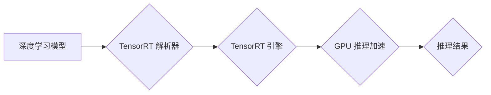

                 

## TensorRT 优化库：加速深度学习推理

> 关键词：TensorRT, 深度学习推理, 优化库, GPU加速, INT8, 模型部署, 性能优化

## 1. 背景介绍

深度学习在图像识别、自然语言处理、语音识别等领域取得了突破性进展，但其推理速度仍然是一个瓶颈。在实际应用中，例如智能手机、嵌入式设备等资源受限的场景，深度学习模型的推理速度往往难以满足实时性要求。为了解决这个问题，NVIDIA 推出了 TensorRT 优化库，它可以显著加速深度学习模型的推理速度，并提高模型的效率。

TensorRT 是一种高性能的深度学习推理优化器，它可以将深度学习模型转换为高效的运行时引擎，并针对不同的硬件平台进行优化。TensorRT 支持多种深度学习框架，例如 TensorFlow、PyTorch 等，并提供丰富的优化策略，例如量化、混合精度计算、并行推理等。

## 2. 核心概念与联系

TensorRT 的核心概念是将深度学习模型转换为 TensorRT 引擎可以理解的格式，并利用 GPU 的并行计算能力进行推理加速。

**TensorRT 架构**

**核心概念解释:**

* **深度学习模型:** 指的是经过训练的深度学习模型，例如 CNN、RNN 等。
* **TensorRT 解析器:** 负责将深度学习模型转换为 TensorRT 引擎可以理解的格式，例如 ONNX、UFF 等。
* **TensorRT 引擎:**  是一个高效的运行时引擎，可以执行优化后的深度学习模型。
* **GPU 推理加速:** 利用 GPU 的并行计算能力进行推理加速，显著提高推理速度。
* **推理结果:**  深度学习模型对输入数据的预测结果。

## 3. 核心算法原理 & 具体操作步骤

### 3.1  算法原理概述

TensorRT 的核心算法原理是基于图优化和算子融合。

* **图优化:** TensorRT 会分析深度学习模型的计算图，并进行一系列优化操作，例如消除冗余节点、合并相邻节点等，以减少计算量和内存占用。
* **算子融合:** TensorRT 会将多个相邻的算子融合成一个新的算子，以减少数据传输和计算开销。

### 3.2  算法步骤详解

TensorRT 优化深度学习模型的具体操作步骤如下：

1. **模型输入:** 将深度学习模型输入到 TensorRT 解析器。
2. **模型解析:** TensorRT 解析器将深度学习模型转换为 TensorRT 引擎可以理解的格式。
3. **模型优化:** TensorRT 引擎会对模型进行图优化和算子融合等优化操作。
4. **模型部署:** 将优化后的模型部署到目标硬件平台，例如 GPU。
5. **推理加速:** TensorRT 引擎利用 GPU 的并行计算能力进行推理加速。

### 3.3  算法优缺点

**优点:**

* **显著加速推理速度:** TensorRT 可以显著提高深度学习模型的推理速度，尤其是在 GPU 平台上。
* **降低内存占用:** TensorRT 的图优化和算子融合可以减少模型的内存占用。
* **支持多种深度学习框架:** TensorRT 支持 TensorFlow、PyTorch 等主流深度学习框架。
* **提供丰富的优化策略:** TensorRT 提供多种优化策略，例如量化、混合精度计算、并行推理等，可以根据实际应用场景进行选择。

**缺点:**

* **学习曲线较陡:** TensorRT 的使用需要一定的学习成本，需要了解其优化策略和部署流程。
* **模型转换过程复杂:** 将深度学习模型转换为 TensorRT 引擎可以理解的格式可能需要一些额外的步骤。

### 3.4  算法应用领域

TensorRT 的应用领域非常广泛，例如：

* **计算机视觉:** 图像识别、目标检测、图像分割等。
* **自然语言处理:** 文本分类、情感分析、机器翻译等。
* **语音识别:** 语音转文本、语音助手等。
* **自动驾驶:** 路标识别、障碍物检测、路径规划等。

## 4. 数学模型和公式 & 详细讲解 & 举例说明

### 4.1  数学模型构建

TensorRT 的核心数学模型是深度学习模型的计算图。计算图是一个表示深度学习模型计算过程的图结构，其中节点代表算子，边代表数据流。

### 4.2  公式推导过程

TensorRT 的优化算法基于图优化和算子融合，其核心公式推导过程涉及到以下几个方面：

* **节点合并:** 将两个相邻的节点合并成一个新的节点，其计算公式为两个节点的计算公式的组合。
* **数据流优化:** 优化数据流的路径，减少数据传输和计算开销。
* **算子选择:** 选择最优的算子实现，以提高计算效率。

### 4.3  案例分析与讲解

例如，在卷积神经网络中，两个相邻的卷积层可以合并成一个新的卷积层，其卷积核大小为两个卷积层的卷积核大小的组合。

## 5. 项目实践：代码实例和详细解释说明

### 5.1  开发环境搭建

TensorRT 的开发环境搭建需要安装 NVIDIA CUDA、cuDNN 和 TensorRT 软件包。

### 5.2  源代码详细实现

TensorRT 的源代码实现涉及到模型解析、图优化、算子融合等多个模块。

### 5.3  代码解读与分析

TensorRT 的代码解读需要对深度学习模型的计算图、算子实现以及优化策略有深入的理解。

### 5.4  运行结果展示

TensorRT 的运行结果展示可以包括推理速度、内存占用以及模型精度等指标。

## 6. 实际应用场景

TensorRT 在实际应用场景中可以显著提高深度学习模型的推理速度和效率。

### 6.4  未来应用展望

TensorRT 的未来应用展望包括：

* **边缘计算:** TensorRT 可以部署到边缘设备上，实现实时推理。
* **云计算:** TensorRT 可以用于云端深度学习服务，提高服务效率。
* **异构计算:** TensorRT 可以支持多种硬件平台，例如 CPU、GPU、FPGA 等。

## 7. 工具和资源推荐

### 7.1  学习资源推荐

* TensorRT 官方文档: https://docs.nvidia.com/deeplearning/tensorrt/index.html
* TensorRT GitHub 仓库: https://github.com/NVIDIA/TensorRT

### 7.2  开发工具推荐

* NVIDIA CUDA Toolkit
* NVIDIA cuDNN

### 7.3  相关论文推荐

* [TensorRT: A High-Performance Inference Optimization Toolkit](https://arxiv.org/abs/1808.09993)

## 8. 总结：未来发展趋势与挑战

### 8.1  研究成果总结

TensorRT 作为一种高效的深度学习推理优化器，取得了显著的研究成果，例如：

* **显著提高推理速度:** TensorRT 可以将深度学习模型的推理速度提高数倍。
* **降低内存占用:** TensorRT 的图优化和算子融合可以减少模型的内存占用。
* **支持多种硬件平台:** TensorRT 可以部署到多种硬件平台，例如 GPU、CPU 等。

### 8.2  未来发展趋势

TensorRT 的未来发展趋势包括：

* **更强大的优化策略:** 开发更强大的优化策略，例如自动算子融合、动态图优化等。
* **更广泛的硬件支持:** 支持更多类型的硬件平台，例如 FPGA、ASIC 等。
* **更易于使用的接口:** 提供更易于使用的接口，方便开发者进行模型部署和优化。

### 8.3  面临的挑战

TensorRT 还面临一些挑战，例如：

* **模型转换复杂度:** 将深度学习模型转换为 TensorRT 引擎可以理解的格式可能需要一些额外的步骤。
* **优化策略选择:** 选择最优的优化策略需要根据实际应用场景进行调整。
* **硬件平台差异:** 不同硬件平台的性能和特性差异较大，需要针对不同的平台进行优化。

### 8.4  研究展望

未来，TensorRT 将继续朝着更高效、更易用、更广泛应用的方向发展。

## 9. 附录：常见问题与解答

**常见问题:**

* 如何将深度学习模型转换为 TensorRT 引擎可以理解的格式？
* 如何选择最优的 TensorRT 优化策略？
* 如何部署 TensorRT 模型到目标硬件平台？

**解答:**

* 可以使用 TensorRT 的模型转换工具将深度学习模型转换为 ONNX、UFF 等格式。
* 可以根据实际应用场景选择不同的 TensorRT 优化策略，例如量化、混合精度计算、并行推理等。
* 可以使用 TensorRT 的部署工具将优化后的模型部署到目标硬件平台。

作者：禅与计算机程序设计艺术 / Zen and the Art of Computer Programming 
<end_of_turn>

