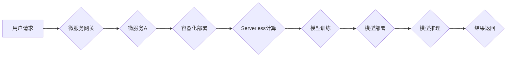

                 

## 云原生AI：Lepton AI的技术理念

> 关键词：云原生、AI、微服务、容器化、Serverless、模型训练、模型部署、可扩展性、弹性、高效性

### 1. 背景介绍

人工智能（AI）技术近年来发展迅速，其应用场景不断拓展，从语音识别、图像处理到自然语言理解等领域取得了突破性进展。然而，传统的AI部署方式面临着诸多挑战，例如资源浪费、部署复杂、可扩展性差等。随着云计算技术的成熟，云原生架构应运而生，为AI的部署和运行提供了新的解决方案。

云原生AI是指将AI应用和服务构建在云原生架构之上，充分利用云计算的弹性、可扩展性和成本效益，实现AI应用的快速部署、高效运行和持续迭代。Lepton AI作为一家致力于云原生AI解决方案的科技公司，基于对云原生架构和AI技术的深入理解，提出了独特的技术理念，旨在构建一个高效、灵活、可扩展的云原生AI平台。

### 2. 核心概念与联系

Lepton AI的核心技术理念围绕着以下几个关键概念：

* **微服务架构:** 将AI应用拆解成一系列独立的服务，每个服务负责特定的功能，并通过轻量级的API进行通信。这种架构使得AI应用更加模块化、可维护和可扩展。
* **容器化技术:** 将每个微服务打包成容器，容器化技术可以确保每个微服务在不同的环境中都能运行一致，并简化了部署和管理过程。
* **Serverless计算:** 将AI模型的运行部署在Serverless平台上，无需用户关心底层的服务器管理，只需关注模型的逻辑和输入输出。Serverless计算可以极大地降低运营成本，并提高资源利用率。
* **自动化部署:** 利用持续集成和持续交付（CI/CD）流程，实现AI模型的自动化部署，缩短部署时间，提高部署效率。
* **联邦学习:** 将模型训练分散到多个数据源上，保护数据隐私，并提高模型的泛化能力。

Lepton AI将这些核心概念有机结合，构建了一个完整的云原生AI平台，其架构如图所示：



### 3. 核心算法原理 & 具体操作步骤

Lepton AI的核心算法原理基于深度学习，并结合了云原生架构的优势，实现高效的模型训练和部署。

#### 3.1  算法原理概述

Lepton AI采用基于Transformer的深度学习模型，例如BERT、GPT等，这些模型在自然语言处理、图像识别等领域取得了优异的性能。Transformer模型的核心在于其自注意力机制，能够捕捉文本或图像中的长距离依赖关系，从而实现更准确的理解和预测。

#### 3.2  算法步骤详解

Lepton AI的模型训练和部署流程如下：

1. **数据预处理:** 收集和清洗训练数据，并将其转换为模型可识别的格式。
2. **模型训练:** 利用云原生平台的强大计算资源，对模型进行训练，并通过梯度下降等优化算法不断调整模型参数，使其能够准确地完成预设的任务。
3. **模型评估:** 在训练完成后，使用测试数据对模型进行评估，并根据评估结果进行模型调优。
4. **模型部署:** 将训练好的模型部署到Serverless平台上，以便用户进行调用。
5. **模型推理:** 用户向模型发送请求，模型根据其训练好的知识进行推理，并返回结果。

#### 3.3  算法优缺点

**优点:**

* **高精度:** Transformer模型在许多任务上表现出优异的精度。
* **高效训练:** 借助云原生平台的强大计算资源，模型训练速度更快。
* **可扩展性强:** 模型可以根据需要进行水平扩展，满足不同规模的应用需求。

**缺点:**

* **模型参数量大:** Transformer模型的参数量较大，需要较大的存储空间和计算资源。
* **训练成本高:** 模型训练需要消耗大量的计算资源，成本较高。

#### 3.4  算法应用领域

Lepton AI的云原生AI平台可以应用于以下领域：

* **自然语言处理:** 文本分类、情感分析、机器翻译、对话系统等。
* **图像识别:** 图像分类、物体检测、图像分割等。
* **语音识别:** 语音转文本、语音合成等。
* **推荐系统:** 商品推荐、内容推荐等。
* **医疗诊断:** 病症诊断、影像分析等。

### 4. 数学模型和公式 & 详细讲解 & 举例说明

Lepton AI的核心算法基于深度学习，其数学模型和公式主要包括以下几个方面：

#### 4.1  数学模型构建

Lepton AI采用多层感知机（MLP）和卷积神经网络（CNN）等深度学习模型，这些模型由多个神经元层组成，每个神经元接收来自上一层的输入，并通过激活函数进行处理，输出到下一层。

#### 4.2  公式推导过程

深度学习模型的训练过程本质上是一个优化问题，目标是找到模型参数，使得模型的预测结果与真实值之间的误差最小。常用的优化算法包括梯度下降法、Adam优化器等。

梯度下降法的核心思想是通过不断调整模型参数，使得损失函数的值逐渐减小。损失函数通常定义为预测结果与真实值之间的差值，例如均方误差（MSE）或交叉熵损失（Cross-Entropy Loss）。

#### 4.3  案例分析与讲解

例如，在图像分类任务中，Lepton AI的模型会将输入图像转换为特征向量，然后将特征向量输入到全连接层进行分类。损失函数可以定义为预测类别与真实类别的交叉熵，模型训练的目标是通过梯度下降法不断调整模型参数，使得交叉熵损失最小化。

### 5. 项目实践：代码实例和详细解释说明

Lepton AI提供了一系列开源工具和SDK，方便开发者快速构建和部署云原生AI应用。以下是一个简单的代码实例，演示如何使用Lepton AI的SDK进行图像分类任务：

#### 5.1  开发环境搭建

Lepton AI支持多种开发环境，例如Python、Java等。开发者需要根据自己的需求选择合适的开发环境，并安装Lepton AI的SDK。

#### 5.2  源代码详细实现

```python
from lepton_ai import ImageClassifier

# 加载预训练模型
model = ImageClassifier.load_model("resnet50")

# 预处理图像
image = Image.open("image.jpg")
image = image.resize((224, 224))
image = image.convert("RGB")

# 进行图像分类
predictions = model.predict(image)

# 打印预测结果
print(predictions)
```

#### 5.3  代码解读与分析

这段代码首先加载了预训练的ResNet50模型，然后对输入图像进行预处理，最后使用模型进行预测，并打印预测结果。

#### 5.4  运行结果展示

运行这段代码后，会输出一个包含预测类别的概率分布的列表。例如，如果模型预测图像中包含一只猫，则列表中对应“猫”类别的概率会较高。

### 6. 实际应用场景

Lepton AI的云原生AI平台已在多个实际应用场景中得到验证，例如：

* **智能客服:** 利用自然语言处理技术，构建智能客服机器人，能够自动回答用户常见问题，提高客户服务效率。
* **精准营销:** 利用用户画像和行为分析，进行精准营销，提高广告投放效果。
* **医疗辅助诊断:** 利用图像识别技术，辅助医生进行病症诊断，提高诊断准确率。

#### 6.4  未来应用展望

Lepton AI将继续致力于云原生AI技术的研发和应用，未来将探索更多新的应用场景，例如：

* **工业自动化:** 利用AI技术，实现工业生产过程的自动化和智能化。
* **城市管理:** 利用AI技术，提高城市管理效率，例如交通管理、环境监测等。
* **教育科技:** 利用AI技术，个性化定制教育方案，提高教育质量。

### 7. 工具和资源推荐

#### 7.1  学习资源推荐

* Lepton AI官方文档：https://docs.lepton.ai/
* 深度学习入门书籍：
    * 《深度学习》
    * 《动手学深度学习》

#### 7.2  开发工具推荐

* Python：https://www.python.org/
* TensorFlow：https://www.tensorflow.org/
* PyTorch：https://pytorch.org/

#### 7.3  相关论文推荐

* Attention Is All You Need: https://arxiv.org/abs/1706.03762
* BERT: Pre-training of Deep Bidirectional Transformers for Language Understanding: https://arxiv.org/abs/1810.04805

### 8. 总结：未来发展趋势与挑战

#### 8.1  研究成果总结

Lepton AI在云原生AI领域取得了一系列重要成果，包括：

* 建立了高效、灵活、可扩展的云原生AI平台。
* 开发了一系列开源工具和SDK，方便开发者快速构建和部署云原生AI应用。
* 在多个实际应用场景中取得了成功案例。

#### 8.2  未来发展趋势

Lepton AI将继续致力于以下几个方面：

* 提升模型的精度和效率。
* 推广云原生AI技术的应用，覆盖更多领域。
* 加强与社区的合作，共同推动云原生AI的发展。

#### 8.3  面临的挑战

Lepton AI也面临着一些挑战，例如：

* 模型训练成本高。
* 数据安全和隐私保护问题。
* 缺乏标准化和规范化。

#### 8.4  研究展望

Lepton AI将继续加大研发投入，攻克技术难题，为用户提供更优质的云原生AI解决方案。

### 9. 附录：常见问题与解答

#### 9.1  常见问题

* 如何部署Lepton AI的模型？
* Lepton AI支持哪些编程语言？
* Lepton AI的收费标准是什么？

#### 9.2  解答

* Lepton AI提供了一系列部署工具和文档，方便用户部署模型。
* Lepton AI支持Python、Java等多种编程语言。
* Lepton AI提供免费试用和付费订阅服务。


作者：禅与计算机程序设计艺术 / Zen and the Art of Computer Programming 
<end_of_turn>

