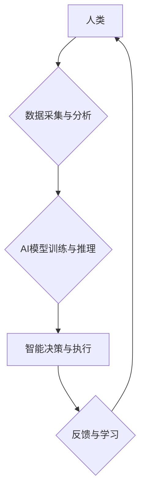

                 

## 人类计算：在AI时代增强人类能力

> 关键词：人工智能、人类计算、协同智能、增强现实、深度学习、自然语言处理

### 1. 背景介绍

人工智能（AI）的快速发展正在深刻地改变着我们的世界。从自动驾驶汽车到智能语音助手，AI技术已经渗透到我们生活的方方面面。然而，AI的发展并非意味着人类将被取代，而是将与人类协同工作，共同创造更加美好的未来。

人类计算是指利用人工智能技术来增强人类的认知能力和创造力，从而实现更高效、更智能的计算。它强调人机协同，将人类的智慧和经验与AI的计算能力相结合，发挥各自的优势，共同解决复杂问题。

### 2. 核心概念与联系

**2.1 人类计算的本质**

人类计算的核心概念是将人类的智慧和经验融入到计算过程中，从而提升计算效率和解决问题的能力。它不仅仅是利用AI技术辅助人类完成任务，而是更深层次地融合人机交互，共同构建一个智能化计算环境。

**2.2 人类计算与协同智能**

协同智能是人类计算的重要组成部分，它强调人机之间的协作和互补。AI系统可以提供数据分析、模式识别等方面的支持，而人类则负责提供创意、决策和伦理判断。通过这种协同工作模式，人机可以共同完成更复杂、更具创造性的任务。

**2.3 人类计算的架构**



**2.4 人类计算的优势**

* **增强人类认知能力:** AI可以帮助人类更快、更准确地处理信息，提升决策效率。
* **激发创造力:** 人机协作可以打破思维局限，激发新的创意和解决方案。
* **提升工作效率:** AI可以自动化重复性任务，释放人类精力，专注于更具价值的工作。
* **促进知识共享:** 人类计算平台可以促进知识的传播和共享，加速科技进步。

### 3. 核心算法原理 & 具体操作步骤

**3.1 算法原理概述**

人类计算的核心算法原理是深度学习，它是一种模仿人类大脑学习机制的机器学习算法。深度学习模型通过多层神经网络结构，从海量数据中学习特征和模式，从而实现对复杂问题的理解和解决。

**3.2 算法步骤详解**

1. **数据收集与预处理:** 收集相关数据，并进行清洗、转换、格式化等预处理工作。
2. **模型构建:** 根据任务需求，选择合适的深度学习模型架构，例如卷积神经网络（CNN）、循环神经网络（RNN）等。
3. **模型训练:** 使用训练数据，通过反向传播算法，调整模型参数，使其能够准确地预测或分类数据。
4. **模型评估:** 使用测试数据，评估模型的性能，例如准确率、召回率、F1-score等。
5. **模型部署:** 将训练好的模型部署到实际应用场景中，例如智能语音助手、图像识别系统等。

**3.3 算法优缺点**

**优点:**

* **高准确率:** 深度学习模型能够从海量数据中学习复杂的特征，实现高准确率的预测和分类。
* **自动化学习:** 深度学习模型可以自动学习特征，无需人工特征工程。
* **泛化能力强:** 深度学习模型能够对新的数据进行泛化，适应不同的应用场景。

**缺点:**

* **数据依赖:** 深度学习模型需要大量的训练数据，否则性能会下降。
* **计算资源消耗大:** 深度学习模型训练需要大量的计算资源，例如GPU等。
* **可解释性差:** 深度学习模型的决策过程较为复杂，难以解释其背后的逻辑。

**3.4 算法应用领域**

* **自然语言处理:** 语音识别、机器翻译、文本摘要、情感分析等。
* **计算机视觉:** 图像识别、物体检测、图像分割、人脸识别等。
* **医疗诊断:** 病理图像分析、疾病预测、药物研发等。
* **金融分析:** 风险评估、欺诈检测、投资预测等。

### 4. 数学模型和公式 & 详细讲解 & 举例说明

**4.1 数学模型构建**

深度学习模型的核心是神经网络，它由多个层级的神经元组成。每个神经元接收来自上一层的输入信号，并通过激活函数进行处理，输出到下一层。

**4.2 公式推导过程**

深度学习模型的训练过程基于反向传播算法，其核心公式包括：

* **损失函数:** 用于衡量模型预测结果与真实值的差距。常见的损失函数包括均方误差（MSE）、交叉熵损失等。
* **梯度下降:** 用于更新模型参数，使其朝着降低损失函数的方向进行调整。

**4.3 案例分析与讲解**

以图像识别为例，假设我们训练一个CNN模型来识别猫和狗的图片。

* **输入数据:** 一组猫和狗的图片。
* **模型架构:** 多层卷积神经网络，用于提取图像特征。
* **损失函数:** 交叉熵损失，用于衡量模型预测结果与真实标签的差距。
* **梯度下降:** 使用随机梯度下降算法，更新模型参数，使其能够准确地识别猫和狗。

### 5. 项目实践：代码实例和详细解释说明

**5.1 开发环境搭建**

* **操作系统:** Linux、macOS、Windows
* **编程语言:** Python
* **深度学习框架:** TensorFlow、PyTorch
* **硬件环境:** GPU

**5.2 源代码详细实现**

```python
import tensorflow as tf

# 定义模型架构
model = tf.keras.models.Sequential([
    tf.keras.layers.Conv2D(32, (3, 3), activation='relu', input_shape=(28, 28, 1)),
    tf.keras.layers.MaxPooling2D((2, 2)),
    tf.keras.layers.Conv2D(64, (3, 3), activation='relu'),
    tf.keras.layers.MaxPooling2D((2, 2)),
    tf.keras.layers.Flatten(),
    tf.keras.layers.Dense(10, activation='softmax')
])

# 编译模型
model.compile(optimizer='adam',
              loss='sparse_categorical_crossentropy',
              metrics=['accuracy'])

# 训练模型
model.fit(x_train, y_train, epochs=10)

# 评估模型
loss, accuracy = model.evaluate(x_test, y_test)
print('Test loss:', loss)
print('Test accuracy:', accuracy)
```

**5.3 代码解读与分析**

* **模型架构:** 该代码定义了一个简单的CNN模型，用于识别手写数字。
* **编译模型:** 使用Adam优化器、交叉熵损失函数和准确率作为评估指标。
* **训练模型:** 使用训练数据训练模型，迭代10次。
* **评估模型:** 使用测试数据评估模型的性能。

**5.4 运行结果展示**

训练完成后，可以查看模型的测试准确率，评估其识别性能。

### 6. 实际应用场景

**6.1 智能客服:** 人工智能驱动的聊天机器人可以提供24/7的客户服务，解答常见问题，提高客户满意度。

**6.2 个性化推荐:** 基于用户行为和偏好，AI系统可以提供个性化的商品、内容和服务推荐，提升用户体验。

**6.3 自动化办公:** AI可以自动化重复性办公任务，例如数据录入、文档处理等，释放人力资源，提高工作效率。

**6.4 医疗辅助诊断:** AI可以辅助医生进行疾病诊断，例如分析医学影像、预测患者风险等，提高诊断准确率和效率。

**6.5 教育辅助学习:** AI可以提供个性化的学习辅导，例如智能答疑、知识点讲解等，帮助学生更好地理解知识。

**6.6 未来应用展望**

* **增强现实:** AI可以与增强现实技术结合，提供更加沉浸式的交互体验，例如虚拟试衣间、远程协作等。
* **虚拟助手:** AI虚拟助手将更加智能化，能够理解更复杂的指令，提供更精准的服务。
* **自动驾驶:** AI将推动自动驾驶技术的进步，实现更加安全、高效的交通出行。

### 7. 工具和资源推荐

**7.1 学习资源推荐**

* **在线课程:** Coursera、edX、Udacity等平台提供丰富的AI课程。
* **书籍:** 《深度学习》、《机器学习实战》等经典书籍。
* **开源项目:** TensorFlow、PyTorch等开源深度学习框架。

**7.2 开发工具推荐**

* **编程语言:** Python
* **深度学习框架:** TensorFlow、PyTorch
* **数据可视化工具:** Matplotlib、Seaborn

**7.3 相关论文推荐**

* **《ImageNet Classification with Deep Convolutional Neural Networks》**
* **《Attention Is All You Need》**
* **《BERT: Pre-training of Deep Bidirectional Transformers for Language Understanding》**

### 8. 总结：未来发展趋势与挑战

**8.1 研究成果总结**

人类计算在人工智能领域取得了显著的进展，例如深度学习算法的突破、自然语言处理技术的飞速发展等。这些成果为人类解决复杂问题、提升生活质量提供了强大的工具。

**8.2 未来发展趋势**

* **更强大的计算能力:** 随着硬件技术的进步，AI模型将更加强大，能够处理更复杂的任务。
* **更智能的算法:** 研究人员将继续探索更智能的算法，例如强化学习、迁移学习等，提升AI的学习能力和适应性。
* **更广泛的应用场景:** AI将应用于更多领域，例如医疗、教育、金融等，改变人们的生活方式。

**8.3 面临的挑战**

* **数据安全和隐私保护:** AI模型的训练需要大量数据，如何确保数据安全和隐私保护是一个重要挑战。
* **算法可解释性和公平性:** AI模型的决策过程较为复杂，难以解释其背后的逻辑，如何确保算法的公平性和透明性是一个重要问题。
* **伦理道德问题:** AI技术的快速发展引发了伦理道德问题，例如人工智能的责任归属、人工智能的潜在风险等，需要社会各界共同探讨和解决。

**8.4 研究展望**

未来，人类计算将继续朝着更智能、更安全、更可解释的方向发展。研究人员将继续探索新的算法、新的应用场景，并将AI技术与人类智慧相结合，共同创造更加美好的未来。


### 9. 附录：常见问题与解答

**9.1 如何选择合适的深度学习模型？**

选择合适的深度学习模型需要根据具体的应用场景和数据特点进行选择。例如，图像识别任务可以使用CNN模型，自然语言处理任务可以使用RNN模型。

**9.2 如何解决过拟合问题？**

过拟合是指模型在训练数据上表现良好，但在测试数据上表现较差。解决过拟合问题的方法包括：

* 增加训练数据量
* 使用正则化技术
* 使用Dropout技术
* 使用早停策略

**9.3 如何评估深度学习模型的性能？**

常用的评估指标包括准确率、召回率、F1-score、AUC等。选择合适的评估指标需要根据具体的应用场景进行选择。


作者：禅与计算机程序设计艺术 / Zen and the Art of Computer Programming 
<end_of_turn>

