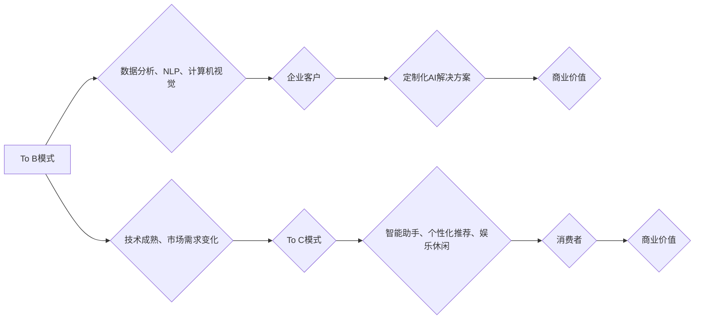

                 

## 从To B到To C：Lepton AI的商业模式演进

> 关键词：人工智能、商业模式、To B、To C、Lepton AI、深度学习、自然语言处理、计算机视觉、数据分析

### 1. 背景介绍

在人工智能（AI）蓬勃发展的时代，Lepton AI 作为一家领先的AI技术公司，一直在探索如何将其强大的技术能力转化为商业价值。早期，Lepton AI主要专注于为企业客户提供定制化的AI解决方案，即To B模式。随着技术的成熟和市场需求的变化，Lepton AI开始将目光转向面向消费者的To C市场，寻求新的增长点。

### 2. 核心概念与联系

Lepton AI的商业模式演进可以概括为以下几个核心概念：

* **To B模式：**Lepton AI为企业客户提供定制化的AI解决方案，例如：
    * **数据分析：**帮助企业分析海量数据，挖掘商业洞察，提高运营效率。
    * **自然语言处理（NLP）：**提供智能客服、文本分类、机器翻译等服务，提升客户体验和企业服务水平。
    * **计算机视觉：**应用于图像识别、视频分析等领域，帮助企业进行智能监控、产品检测等。
* **To C模式：**Lepton AI开发面向消费者的AI产品和服务，例如：
    * **智能助手：**提供语音助手、智能家居控制等功能，提升用户生活便捷度。
    * **个性化推荐：**基于用户行为和偏好，提供个性化的商品推荐、内容推荐等服务。
    * **娱乐休闲：**开发AI驱动的游戏、虚拟现实等娱乐产品，丰富用户体验。

**Lepton AI商业模式演进流程图**

### 3. 核心算法原理 & 具体操作步骤

Lepton AI在To B和To C模式中都依赖于强大的AI算法，例如深度学习、自然语言处理等。

#### 3.1  算法原理概述

* **深度学习：**深度学习是一种机器学习的子领域，利用多层神经网络来模拟人类大脑的学习过程。它能够从海量数据中自动学习特征，并进行复杂的模式识别和预测。
* **自然语言处理（NLP）：**NLP旨在使计算机能够理解和处理人类语言。Lepton AI利用NLP技术实现文本分类、情感分析、机器翻译等功能。

#### 3.2  算法步骤详解

* **数据收集和预处理：**首先，Lepton AI需要收集大量相关数据，并进行清洗、格式化等预处理工作，以确保算法的训练质量。
* **模型训练：**利用深度学习算法，将预处理后的数据输入到神经网络中进行训练。训练过程中，算法会不断调整网络参数，以最小化预测误差。
* **模型评估和优化：**训练完成后，Lepton AI会对模型进行评估，并根据评估结果进行调整和优化，以提高模型的性能。
* **模型部署和应用：**经过训练和优化的模型可以部署到实际应用场景中，例如智能客服系统、个性化推荐引擎等。

#### 3.3  算法优缺点

* **深度学习：**
    * **优点：**能够学习复杂特征，性能优异。
    * **缺点：**需要大量数据进行训练，训练时间长，解释性较差。
* **自然语言处理：**
    * **优点：**能够理解和处理人类语言，应用广泛。
    * **缺点：**语言理解和生成仍然存在挑战，需要不断改进算法和模型。

#### 3.4  算法应用领域

Lepton AI的算法应用于多个领域，例如：

* **金融：**欺诈检测、风险评估、客户服务自动化。
* **医疗：**疾病诊断、药物研发、医疗影像分析。
* **零售：**商品推荐、库存管理、个性化营销。
* **教育：**智能辅导、个性化学习、自动批改作业。

### 4. 数学模型和公式 & 详细讲解 & 举例说明

Lepton AI的算法模型通常基于数学公式和统计学原理。

#### 4.1  数学模型构建

例如，在深度学习中，神经网络的结构和参数可以通过数学公式来定义。

#### 4.2  公式推导过程

例如，反向传播算法用于更新神经网络的参数，其推导过程涉及微积分和线性代数。

#### 4.3  案例分析与讲解

例如，在自然语言处理中，词嵌入模型可以将单词映射到向量空间，通过计算向量的相似度来实现词义相似度分析。

### 5. 项目实践：代码实例和详细解释说明

Lepton AI开发的AI产品和服务通常基于开源框架和工具，例如TensorFlow、PyTorch、NLTK等。

#### 5.1  开发环境搭建

Lepton AI提供详细的开发环境搭建指南，帮助开发者快速上手。

#### 5.2  源代码详细实现

Lepton AI开源部分代码，并提供详细的注释和文档，方便开发者理解和修改。

#### 5.3  代码解读与分析

Lepton AI的工程师会定期发布博客文章和视频教程，对开源代码进行解读和分析，帮助开发者深入理解算法原理和实现细节。

#### 5.4  运行结果展示

Lepton AI会展示其AI产品的运行结果，例如智能客服系统的对话记录、个性化推荐引擎的推荐列表等，以证明其技术的有效性和实用性。

### 6. 实际应用场景

Lepton AI的AI技术已应用于多个实际场景，例如：

* **智能客服：**Lepton AI为企业客户提供智能客服系统，能够自动回答常见问题，提高客户服务效率。
* **个性化推荐：**Lepton AI为电商平台提供个性化推荐引擎，根据用户的浏览历史和购买记录，推荐相关的商品。
* **医疗诊断：**Lepton AI与医疗机构合作，开发AI辅助诊断系统，帮助医生更快、更准确地诊断疾病。

#### 6.4  未来应用展望

Lepton AI将继续探索AI技术的应用场景，例如：

* **自动驾驶：**Lepton AI将利用计算机视觉和深度学习技术，开发自动驾驶系统。
* **机器人：**Lepton AI将开发AI驱动的机器人，用于工业生产、家政服务等领域。
* **教育：**Lepton AI将开发AI驱动的教育平台，提供个性化学习和智能辅导服务。

### 7. 工具和资源推荐

#### 7.1  学习资源推荐

* **在线课程：**Coursera、edX、Udacity等平台提供丰富的AI课程。
* **书籍：**《深度学习》、《人工智能：一种现代方法》等书籍是学习AI的基础。
* **开源项目：**TensorFlow、PyTorch、OpenCV等开源项目可以帮助开发者实践AI技术。

#### 7.2  开发工具推荐

* **编程语言：**Python是AI开发最常用的编程语言。
* **深度学习框架：**TensorFlow、PyTorch、Keras等深度学习框架提供了丰富的工具和功能。
* **数据分析工具：**Pandas、NumPy、Scikit-learn等数据分析工具可以帮助开发者处理和分析数据。

#### 7.3  相关论文推荐

* **深度学习论文：**
    * 《ImageNet Classification with Deep Convolutional Neural Networks》
    * 《Attention Is All You Need》
* **自然语言处理论文：**
    * 《BERT: Pre-training of Deep Bidirectional Transformers for Language Understanding》
    * 《GPT-3: Language Models are Few-Shot Learners》

### 8. 总结：未来发展趋势与挑战

#### 8.1  研究成果总结

Lepton AI在AI技术领域取得了显著成果，其算法模型和产品服务已应用于多个领域，为企业和消费者带来了价值。

#### 8.2  未来发展趋势

Lepton AI将继续专注于以下几个方面：

* **算法创新：**开发更先进、更有效的AI算法，例如强化学习、迁移学习等。
* **场景应用拓展：**将AI技术应用于更多新的场景，例如自动驾驶、机器人、医疗等。
* **产业生态建设：**与合作伙伴共同构建AI产业生态，推动AI技术的普及和应用。

#### 8.3  面临的挑战

Lepton AI也面临着一些挑战，例如：

* **数据安全和隐私保护：**AI算法依赖于大量数据，如何确保数据安全和隐私保护是一个重要问题。
* **算法可解释性和信任度：**深度学习算法的决策过程往往难以解释，如何提高算法的可解释性和信任度是一个挑战。
* **人才短缺：**AI领域人才需求量大，如何吸引和培养更多AI人才是一个关键问题。

#### 8.4  研究展望

Lepton AI将继续投入资源，攻克这些挑战，推动AI技术的进步，为人类社会创造更多价值。

### 9. 附录：常见问题与解答

* **Lepton AI的AI技术是否安全可靠？**

Lepton AI高度重视数据安全和隐私保护，其AI技术经过严格的测试和评估，确保其安全可靠。

* **Lepton AI的AI产品和服务如何使用？**

Lepton AI提供详细的文档和教程，帮助用户轻松使用其产品和服务。

* **Lepton AI的AI技术是否适用于所有行业？**

Lepton AI的AI技术可以应用于多个行业，但具体应用场景需要根据实际需求进行评估和定制。

作者：禅与计算机程序设计艺术 / Zen and the Art of Computer Programming 
<end_of_turn>

