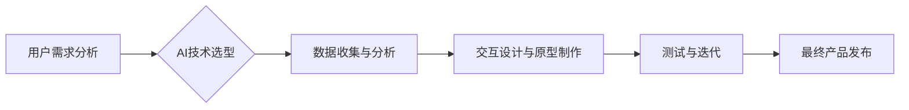

                 

## 体验设计师：AI时代的新兴职业

> 关键词：体验设计，AI，用户体验，交互设计，机器学习，自然语言处理，人机交互，未来职业

### 1. 背景介绍

随着人工智能（AI）技术的飞速发展，它正在深刻地改变着我们生活的方方面面。从智能手机的语音助手到自动驾驶汽车，AI正在逐渐融入我们的日常生活，并为我们带来更加便捷、智能化的体验。在这个AI时代，体验设计（UX Design）也迎来了新的挑战和机遇。

传统的体验设计主要关注于人类与传统软件和硬件交互的体验。然而，随着AI技术的融入，用户与系统的交互方式发生了根本性的改变。AI赋予系统了更强的智能和学习能力，使得用户体验不再局限于预设的交互模式，而是更加个性化、动态和智能化。

因此，新的体验设计角色应运而生——AI体验设计师（AI UX Designer）。他们需要具备对AI技术的理解，以及对用户体验设计的专业知识，才能有效地设计出符合用户需求、安全可靠、且能够充分利用AI技术的智能交互体验。

### 2. 核心概念与联系

AI体验设计的核心概念是将AI技术与用户体验设计相结合，以创造出更加智能、人性化和便捷的用户体验。

**AI体验设计流程图:**



**核心概念:**

* **用户需求分析:** 理解用户的需求、目标和行为模式，为AI体验设计提供基础。
* **AI技术选型:** 根据用户需求和场景选择合适的AI技术，例如自然语言处理、计算机视觉、机器学习等。
* **数据收集与分析:** 收集用户行为数据，分析用户偏好和使用模式，为AI模型的训练和优化提供数据支持。
* **交互设计与原型制作:** 设计AI系统的交互方式，例如语音交互、文本交互、视觉交互等，并制作原型进行测试和验证。
* **测试与迭代:** 通过用户测试和数据分析，不断迭代优化AI系统的交互体验，使其更加符合用户需求。
* **最终产品发布:** 将经过测试和优化的AI系统发布到市场，为用户提供智能化体验。

### 3. 核心算法原理 & 具体操作步骤

AI体验设计中常用的核心算法包括自然语言处理（NLP）和机器学习（ML）。

#### 3.1  算法原理概述

* **自然语言处理（NLP）:** NLP算法能够理解和处理人类语言，例如文本分析、语音识别、机器翻译等。
* **机器学习（ML）:** ML算法能够从数据中学习模式和规律，并根据学习到的知识进行预测和决策。

#### 3.2  算法步骤详解

* **NLP算法步骤:**
    1. **文本预处理:** 清洗和格式化文本数据，例如去除停用词、标点符号等。
    2. **词语分词:** 将文本分割成单个词语或短语。
    3. **词向量化:** 将词语映射到向量空间，以便进行语义分析。
    4. **语义分析:** 分析文本的语义内容，例如情感分析、主题提取等。
* **ML算法步骤:**
    1. **数据收集与预处理:** 收集和预处理训练数据，例如清洗、格式化、特征提取等。
    2. **模型选择:** 选择合适的ML模型，例如线性回归、决策树、支持向量机等。
    3. **模型训练:** 使用训练数据训练ML模型，使其能够学习数据中的模式和规律。
    4. **模型评估:** 使用测试数据评估模型的性能，例如准确率、召回率等。
    5. **模型优化:** 根据评估结果，调整模型参数或选择其他模型进行优化。

#### 3.3  算法优缺点

* **NLP算法:**
    * **优点:** 可以理解和处理人类语言，应用广泛。
    * **缺点:** 对于复杂语言结构和语义理解仍然存在挑战。
* **ML算法:**
    * **优点:** 可以从数据中学习模式和规律，具有强大的预测和决策能力。
    * **缺点:** 需要大量的数据进行训练，对数据质量要求较高。

#### 3.4  算法应用领域

* **NLP算法:** 语音助手、聊天机器人、机器翻译、文本摘要、情感分析等。
* **ML算法:** 个性化推荐、欺诈检测、医疗诊断、图像识别等。

### 4. 数学模型和公式 & 详细讲解 & 举例说明

AI体验设计中常用的数学模型和公式包括：

#### 4.1  数学模型构建

* **用户行为模型:** 用于描述用户在使用AI系统时的行为模式，例如用户点击、滑动、输入等操作。
* **AI模型预测模型:** 用于预测用户未来的行为，例如用户是否会购买某个商品、用户是否会点击某个广告等。

#### 4.2  公式推导过程

* **用户行为模型:** 可以使用马尔科夫链模型来描述用户在不同页面之间的跳转行为。
* **AI模型预测模型:** 可以使用逻辑回归模型来预测用户是否会点击某个广告。

#### 4.3  案例分析与讲解

* **用户行为模型:** 例如，一个电商网站可以使用马尔科夫链模型来预测用户在浏览商品页面后，下一步会进行哪些操作，例如添加购物车、查看商品详情、购买商品等。
* **AI模型预测模型:** 例如，一个社交媒体平台可以使用逻辑回归模型来预测用户是否会点击某个广告，根据用户的年龄、性别、兴趣爱好等信息进行预测。

### 5. 项目实践：代码实例和详细解释说明

#### 5.1  开发环境搭建

* **操作系统:** Windows、macOS、Linux
* **编程语言:** Python
* **开发工具:** Jupyter Notebook、VS Code
* **AI库:** TensorFlow、PyTorch

#### 5.2  源代码详细实现

```python
# 使用TensorFlow构建一个简单的文本分类模型

import tensorflow as tf

# 定义模型结构
model = tf.keras.models.Sequential([
    tf.keras.layers.Embedding(input_dim=10000, output_dim=128),
    tf.keras.layers.LSTM(units=64),
    tf.keras.layers.Dense(units=1, activation='sigmoid')
])

# 编译模型
model.compile(optimizer='adam',
              loss='binary_crossentropy',
              metrics=['accuracy'])

# 训练模型
model.fit(x_train, y_train, epochs=10)

# 评估模型
loss, accuracy = model.evaluate(x_test, y_test)
print('Loss:', loss)
print('Accuracy:', accuracy)
```

#### 5.3  代码解读与分析

* **Embedding层:** 将词语映射到向量空间，以便模型理解词语的语义关系。
* **LSTM层:** 用于处理文本序列数据，捕捉文本中的长距离依赖关系。
* **Dense层:** 全连接层，用于将LSTM层的输出映射到分类结果。
* **编译模型:** 选择优化器、损失函数和评价指标。
* **训练模型:** 使用训练数据训练模型，更新模型参数。
* **评估模型:** 使用测试数据评估模型的性能。

#### 5.4  运行结果展示

* 模型训练完成后，可以输出模型的损失值和准确率，评估模型的性能。

### 6. 实际应用场景

AI体验设计在各个领域都有着广泛的应用场景，例如：

* **智能客服:** 使用NLP算法构建聊天机器人，为用户提供24小时在线客服服务。
* **个性化推荐:** 使用ML算法分析用户行为数据，推荐个性化的商品、内容和服务。
* **智能家居:** 使用AI技术控制家居设备，例如智能灯光、智能空调等，提供更加便捷舒适的生活体验。
* **医疗诊断:** 使用ML算法分析医疗影像数据，辅助医生进行疾病诊断。

### 6.4  未来应用展望

随着AI技术的不断发展，AI体验设计将迎来更加广阔的应用前景。例如：

* **更智能的交互方式:** 使用更先进的AI技术，例如自然语言理解、计算机视觉等，实现更加自然、流畅的交互方式。
* **更加个性化的体验:** 使用AI技术分析用户的个人喜好和需求，提供更加个性化的产品和服务。
* **增强现实（AR）和虚拟现实（VR）体验:** 将AI技术融入AR和VR体验，创造更加沉浸式和交互式的虚拟世界。

### 7. 工具和资源推荐

#### 7.1  学习资源推荐

* **在线课程:** Coursera、edX、Udacity等平台提供AI体验设计相关的在线课程。
* **书籍:** 《Designing for AI》 、《The Design of Everyday Things》等书籍可以帮助你了解AI体验设计的基本原理和实践方法。
* **博客和论坛:** 关注AI体验设计领域的博客和论坛，例如UX Collective、Medium等，可以获取最新的行业资讯和最佳实践。

#### 7.2  开发工具推荐

* **设计工具:** Figma、Sketch、Adobe XD等设计工具可以帮助你设计AI系统的交互界面。
* **原型制作工具:** InVision、Proto.io等原型制作工具可以帮助你制作AI系统的交互原型。
* **AI开发平台:** Google AI Platform、Amazon SageMaker等AI开发平台可以帮助你开发和部署AI模型。

#### 7.3  相关论文推荐

* **论文数据库:** ACM Digital Library、IEEE Xplore等论文数据库可以帮助你查找AI体验设计相关的论文。

### 8. 总结：未来发展趋势与挑战

#### 8.1  研究成果总结

AI体验设计是一个新兴的领域，近年来取得了显著的进展。

* **AI技术不断发展:** AI技术的不断进步为AI体验设计提供了更强大的工具和技术支持。
* **用户体验设计理念的融合:** AI体验设计将传统的用户体验设计理念与AI技术相结合，创造出更加智能、人性化的用户体验。

#### 8.2  未来发展趋势

* **更智能的交互方式:** 使用更先进的AI技术，例如自然语言理解、计算机视觉等，实现更加自然、流畅的交互方式。
* **更加个性化的体验:** 使用AI技术分析用户的个人喜好和需求，提供更加个性化的产品和服务。
* **增强现实（AR）和虚拟现实（VR）体验:** 将AI技术融入AR和VR体验，创造更加沉浸式和交互式的虚拟世界。

#### 8.3  面临的挑战

* **数据隐私和安全:** AI体验设计需要收集和使用大量用户数据，如何保护用户数据隐私和安全是一个重要的挑战。
* **算法偏见:** AI算法可能会存在偏见，导致AI体验设计不公平或不公正。
* **伦理问题:** AI体验设计可能会引发一些伦理问题，例如AI系统是否应该具有自主决策能力，AI系统如何与人类进行道德判断等。

#### 8.4  研究展望

* **开发更安全、更可靠的AI算法:** 研究如何开发更安全、更可靠的AI算法，减少算法偏见和风险。
* **探索新的AI交互方式:** 研究新的AI交互方式，例如脑机接口、情感识别等，创造更加自然、人性化的交互体验。
* **建立AI体验设计伦理规范:** 建立AI体验设计伦理规范，指导AI体验设计的开发和应用，确保AI技术服务于人类福祉。

### 9. 附录：常见问题与解答

* **什么是AI体验设计？**

AI体验设计是指将人工智能技术与用户体验设计相结合，创造出更加智能、人性化和便捷的用户体验。

* **AI体验设计师需要具备哪些技能？**

AI体验设计师需要具备以下技能：

* 对AI技术的理解
* 对用户体验设计的专业知识
* 优秀的沟通和协作能力
* 强大的问题解决能力

* **AI体验设计有哪些应用场景？**

AI体验设计在各个领域都有着广泛的应用场景，例如智能客服、个性化推荐、智能家居、医疗诊断等。

* **如何学习AI体验设计？**

可以通过在线课程、书籍、博客和论坛等方式学习AI体验设计。

作者：禅与计算机程序设计艺术 / Zen and the Art of Computer Programming


<end_of_turn>

