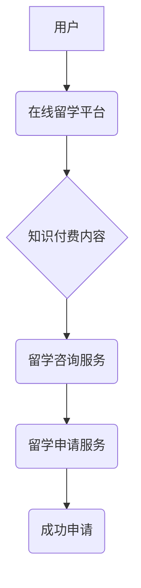

                 

## 如何利用知识付费实现在线留学咨询与申请服务？

> 关键词：知识付费、在线留学咨询、留学申请服务、人工智能、大数据、个性化推荐、机器学习、流程自动化

## 1. 背景介绍

近年来，随着全球化进程的加速和教育资源的日益开放，越来越多的人开始关注海外留学。然而，留学申请是一个复杂而充满挑战的过程，需要面对众多环节和信息，例如院校选择、专业匹配、申请材料准备、语言考试、签证办理等。传统留学咨询服务模式存在着服务成本高、信息不对称、效率低等问题，难以满足广大留学申请者的需求。

知识付费模式的兴起为在线留学咨询与申请服务提供了新的机遇。通过线上平台，留学专家可以将自身的专业知识和经验以课程、咨询、工具等形式进行付费销售，为留学申请者提供更便捷、高效、个性化的服务。

## 2. 核心概念与联系

**2.1 核心概念**

* **知识付费:** 指的是知识产权持有者将知识、技能、经验等转化为付费产品或服务，通过线上平台进行销售和传播。
* **在线留学咨询:** 通过互联网平台，留学专家为留学申请者提供咨询服务，包括院校选择、专业匹配、申请材料准备、语言考试、签证办理等方面的指导。
* **留学申请服务:** 指的是为留学申请者提供从院校选择到签证办理的全流程服务，包括申请材料准备、文书撰写、面试辅导、签证办理等。

**2.2 架构关系**



**2.3 核心技术**

* **人工智能 (AI):**  AI技术可以用于智能化推荐、个性化学习、自动化的文书审核等方面，提升服务效率和精准度。
* **大数据 (Big Data):** 大数据分析可以帮助平台了解用户需求、分析留学趋势、优化服务内容等。
* **机器学习 (Machine Learning):** 机器学习算法可以用于预测用户申请成功率、个性化推荐留学方案等。

## 3. 核心算法原理 & 具体操作步骤

**3.1 算法原理概述**

在线留学咨询与申请服务的核心算法主要包括：

* **用户画像构建算法:**  通过分析用户的个人信息、学习背景、职业目标、留学意向等数据，构建用户的个性化画像。
* **院校匹配算法:**  根据用户的专业兴趣、学习目标、语言水平、经济条件等信息，推荐匹配的院校。
* **专业匹配算法:**  根据用户的兴趣爱好、技能特长、未来职业规划等信息，推荐匹配的专业方向。
* **申请材料评估算法:**  利用自然语言处理 (NLP) 技术，自动评估申请材料的质量和完整性。
* **签证预测算法:**  根据用户的个人信息、申请材料、签证历史数据等信息，预测签证通过率。

**3.2 算法步骤详解**

以用户画像构建算法为例，具体步骤如下：

1. **数据收集:** 收集用户的个人信息、学习背景、职业目标、留学意向等数据。
2. **数据清洗:** 对收集到的数据进行清洗，去除无效数据、重复数据等。
3. **特征提取:** 从原始数据中提取用户画像的关键特征，例如年龄、性别、学历、专业、英语水平、留学预算等。
4. **模型训练:** 利用机器学习算法，对提取的特征进行训练，构建用户画像模型。
5. **用户画像生成:** 将新用户的特征输入到模型中，生成用户的个性化画像。

**3.3 算法优缺点**

* **优点:** 
    * 自动化程度高，提高效率。
    * 数据驱动，结果更精准。
    * 个性化推荐，满足用户需求。
* **缺点:** 
    * 数据依赖性强，需要大量高质量数据。
    * 模型训练复杂，需要专业技术人员。
    * 算法本身存在局限性，无法完全替代人工判断。

**3.4 算法应用领域**

* 在线留学咨询平台
* 教育机构
* 留学中介机构
* 高校招生办公室

## 4. 数学模型和公式 & 详细讲解 & 举例说明

**4.1 数学模型构建**

用户画像构建算法可以采用聚类算法，例如K-means算法，将用户分为不同的群体。

**4.2 公式推导过程**

K-means算法的目标是将n个数据点划分为k个簇，使得每个数据点到其所属簇质心的距离最小。

* **距离度量:**  常用的距离度量方法包括欧氏距离、曼哈顿距离等。
* **质心计算:**  每个簇的质心是该簇中所有数据点的平均值。
* **迭代更新:**  算法迭代地更新质心和数据点的簇分配，直到收敛。

**4.3 案例分析与讲解**

假设有100个用户，我们想要将他们分为5个簇。

1. 随机选择5个用户作为初始质心。
2. 计算每个用户到每个质心的距离。
3. 将每个用户分配到距离其最近的质心所在的簇。
4. 计算每个簇的新的质心。
5. 重复步骤2-4，直到质心不再发生变化。

## 5. 项目实践：代码实例和详细解释说明

**5.1 开发环境搭建**

* Python 3.x
* Jupyter Notebook
* scikit-learn

**5.2 源代码详细实现**

```python
from sklearn.cluster import KMeans
import pandas as pd

# 加载用户数据
data = pd.read_csv('user_data.csv')

# 选择特征变量
features = ['age', 'education', 'english_level', 'budget']
X = data[features]

# 构建K-means模型
kmeans = KMeans(n_clusters=5, random_state=0)

# 训练模型
kmeans.fit(X)

# 获取用户所属的簇
labels = kmeans.labels_

# 将簇标签添加到用户数据中
data['cluster'] = labels

# 保存结果
data.to_csv('user_data_clustered.csv', index=False)
```

**5.3 代码解读与分析**

* `KMeans(n_clusters=5, random_state=0)`: 创建K-means模型，将用户分为5个簇，随机种子设置为0。
* `kmeans.fit(X)`: 训练模型，将用户数据作为输入。
* `kmeans.labels_`: 获取每个用户所属的簇标签。
* `data['cluster'] = labels`: 将簇标签添加到用户数据中。

**5.4 运行结果展示**

运行代码后，将生成一个新的用户数据文件，其中包含了每个用户的簇标签。

## 6. 实际应用场景

在线留学咨询与申请服务可以应用于以下场景：

* **院校选择:** 根据用户的兴趣、专业、预算等信息，推荐匹配的院校。
* **专业匹配:** 根据用户的兴趣、技能、未来职业规划等信息，推荐匹配的专业方向。
* **申请材料准备:** 提供申请材料模板、写作指导、审核服务等。
* **语言考试:** 提供英语考试辅导、模拟考试、成绩预测等服务。
* **签证办理:** 提供签证流程指导、材料准备、预约服务等。

**6.4 未来应用展望**

未来，在线留学咨询与申请服务将更加智能化、个性化、便捷化。

* **更精准的推荐:** 利用大数据分析和机器学习算法，更加精准地推荐院校、专业、申请材料等。
* **更个性化的服务:** 根据用户的学习风格、性格特点等信息，提供个性化的学习方案、咨询服务等。
* **更便捷的体验:** 利用人工智能技术，实现语音、视频、聊天等多种交互方式，提供更加便捷的咨询体验。

## 7. 工具和资源推荐

**7.1 学习资源推荐**

* **在线课程:** Coursera、edX、Udemy等平台提供丰富的留学咨询与申请服务相关的课程。
* **书籍:** 《留学申请指南》、《留学规划》、《美国大学申请手册》等书籍可以帮助你了解留学申请流程和技巧。
* **博客:** 许多留学专家和机构会在博客上分享留学申请经验和资讯。

**7.2 开发工具推荐**

* **Python:**  Python是一种流行的编程语言，广泛应用于数据分析、机器学习等领域。
* **scikit-learn:** scikit-learn是一个机器学习库，提供各种算法和工具。
* **pandas:** pandas是一个数据分析库，可以方便地处理和分析数据。
* **Jupyter Notebook:** Jupyter Notebook是一个交互式编程环境，可以方便地进行代码编写、运行和调试。

**7.3 相关论文推荐**

* **Personalized Learning Recommendations Using Collaborative Filtering**
* **A Survey of Machine Learning Techniques for Educational Data Mining**
* **Deep Learning for Educational Applications: A Survey**

## 8. 总结：未来发展趋势与挑战

**8.1 研究成果总结**

知识付费模式为在线留学咨询与申请服务提供了新的发展机遇。通过人工智能、大数据、机器学习等技术的应用，在线留学咨询与申请服务可以更加智能化、个性化、便捷化。

**8.2 未来发展趋势**

* **更精准的推荐:** 利用更先进的机器学习算法，更加精准地推荐院校、专业、申请材料等。
* **更个性化的服务:**  根据用户的学习风格、性格特点等信息，提供更加个性化的学习方案、咨询服务等。
* **更便捷的体验:** 利用人工智能技术，实现语音、视频、聊天等多种交互方式，提供更加便捷的咨询体验。

**8.3 面临的挑战**

* **数据质量:** 在线留学咨询与申请服务需要大量高质量的数据进行训练和分析。
* **算法准确性:** 算法本身存在局限性，需要不断改进和优化。
* **用户隐私:**  需要保障用户数据的安全和隐私。

**8.4 研究展望**

未来，在线留学咨询与申请服务将朝着更加智能化、个性化、便捷化的方向发展。


## 9. 附录：常见问题与解答

**9.1 如何选择合适的留学咨询平台？**

选择留学咨询平台时，可以考虑以下因素：

* 平台的专业性：平台是否由经验丰富的留学专家团队运营？
* 平台的服务内容：平台提供的服务是否涵盖用户的需求？
* 平台的口碑：平台的用户评价如何？
* 平台的收费标准：平台的收费标准是否合理？

**9.2 在线留学咨询服务与传统留学咨询服务相比有哪些优势？**

在线留学咨询服务相比传统留学咨询服务具有以下优势：

* **更便捷:** 用户可以随时随地通过网络进行咨询。
* **更经济:** 在线咨询服务的价格通常比传统咨询服务更低。
* **更个性化:** 在线平台可以根据用户的需求提供个性化的服务。

**9.3 在线留学咨询服务是否可以替代传统留学咨询服务？**

在线留学咨询服务可以为用户提供很多便利，但它并不能完全替代传统留学咨询服务。对于一些复杂的留学问题，还是需要寻求专业咨询师的帮助。


作者：禅与计算机程序设计艺术 / Zen and the Art of Computer Programming 
<end_of_turn>

