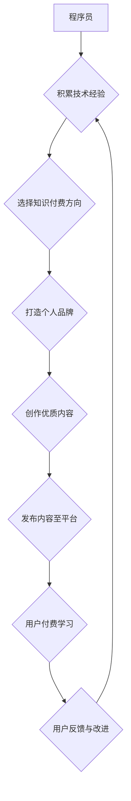

                 

## 如何打造程序员知识付费个人品牌

> 关键词：程序员，知识付费，个人品牌，技术博客，在线课程，社区运营，内容营销，付费订阅

### 1. 背景介绍

在当今科技飞速发展的时代，程序员的需求量持续增长，而优质的程序员人才却显得愈加稀缺。与此同时，互联网技术的发展为程序员提供了全新的知识分享和盈利模式——知识付费。知识付费是指通过线上平台，以付费的方式提供专业知识、技能培训等服务。

对于程序员而言，知识付费不仅可以帮助他们将自身的技术经验和技能转化为经济价值，更重要的是可以建立个人品牌，提升行业影响力，并与其他程序员和技术爱好者建立联系。

### 2. 核心概念与联系

**2.1 知识付费的核心概念**

知识付费的核心概念是将知识和技能作为商品，通过线上平台进行交易。它打破了传统教育模式的限制，让知识更加便捷、高效地传播。

**2.2 程序员知识付费的联系**

程序员拥有丰富的技术经验和技能，可以通过知识付费的方式将这些资源分享给其他人。

* **程序员自身优势:** 
    * 深入的技术理解
    * 实践经验丰富
    * 独特的解决问题思路
* **市场需求:** 
    * 程序员人才需求旺盛
    * 学习编程的人群不断增长
    * 对高质量的编程知识和技能有强烈需求

**2.3 程序员知识付费的流程图**



### 3. 核心算法原理 & 具体操作步骤

**3.1 算法原理概述**

打造程序员知识付费个人品牌，本质上是一个内容创作和传播的算法。

* **内容创作算法:** 
    * 确定目标受众
    * 分析市场需求
    * 制定内容规划
    * 创作高质量内容
* **内容传播算法:** 
    * 选择合适的平台
    * 利用社交媒体推广
    * 参与社区互动
    * 建立邮件列表

**3.2 算法步骤详解**

1. **确定目标受众:** 

    * 细分目标用户群体，例如初学者、进阶程序员、特定领域专家等。
    * 了解目标用户的学习需求、痛点和兴趣。

2. **分析市场需求:** 

    * 研究热门技术趋势和市场需求。
    * 寻找尚未被充分满足的知识需求。
    * 分析竞争对手的内容和策略。

3. **制定内容规划:** 

    * 制定内容主题、格式和发布频率。
    * 构建知识体系，将内容进行分类和组织。
    * 规划付费课程和资源的开发。

4. **创作高质量内容:** 

    * 内容要实用、易懂、有价值。
    * 使用多种形式，例如文章、视频、音频、代码示例等。
    * 注重内容的原创性和深度。

5. **选择合适的平台:** 

    * 根据目标受众和内容类型选择合适的平台，例如博客、视频网站、在线学习平台等。
    * 了解不同平台的规则和用户群体。

6. **利用社交媒体推广:** 

    * 在社交媒体平台上分享内容，并与用户互动。
    * 参与技术社区，建立个人影响力。
    * 利用付费广告推广内容。

7. **参与社区互动:** 

    * 积极参与技术论坛和社区讨论。
    * 回答用户问题，提供技术支持。
    * 建立人脉关系，拓展合作机会。

8. **建立邮件列表:** 

    * 收集用户邮箱地址，建立邮件列表。
    * 定期发送邮件，分享最新内容和优惠信息。
    * 与用户建立长期联系。

**3.3 算法优缺点**

* **优点:** 
    * 灵活、高效、可控
    * 能够精准定位目标用户
    * 持续积累用户和粉丝
* **缺点:** 
    * 需要投入时间和精力
    * 需要不断学习和更新知识
    * 需要具备一定的营销和推广能力

**3.4 算法应用领域**

* **技术博客:** 分享技术经验、教程、案例等。
* **在线课程:** 提供编程语言、框架、工具等方面的培训。
* **付费订阅:** 提供独家内容、资源和社区支持。
* **技术咨询:** 为企业和个人提供技术解决方案。

### 4. 数学模型和公式 & 详细讲解 & 举例说明

**4.1 数学模型构建**

知识付费个人品牌的成功可以看作是一个数学模型，其中涉及到多个变量和因素。

* **用户数量:**  表示个人品牌拥有的粉丝和用户数量。
* **内容质量:**  表示内容的实用性、原创性和深度。
* **传播效率:**  表示内容传播的速度和范围。
* **用户粘性:**  表示用户对个人品牌的忠诚度和复购率。
* **收入:**  表示个人品牌通过知识付费获得的收益。

**4.2 公式推导过程**

我们可以建立一个简单的数学模型来表示知识付费个人品牌的收入：

```latex
收入 = 用户数量 * 内容质量 * 传播效率 * 用户粘性 * 付费比例
```

其中，付费比例表示用户在付费内容中的转化率。

**4.3 案例分析与讲解**

假设一个程序员拥有10000个粉丝，其内容质量较高，传播效率也比较高，用户粘性为50%，付费比例为10%。那么，其潜在收入为：

```latex
收入 = 10000 * 0.8 * 1.2 * 0.5 * 0.1 = 4800
```

这个例子说明，知识付费个人品牌的收入取决于多个因素，需要综合考虑。

### 5. 项目实践：代码实例和详细解释说明

**5.1 开发环境搭建**

* **操作系统:**  Windows、macOS、Linux
* **编程语言:**  Python、JavaScript、Java等
* **开发工具:**  VS Code、Atom、Sublime Text等
* **云平台:**  AWS、Azure、GCP等

**5.2 源代码详细实现**

以下是一个简单的Python代码示例，用于创建技术博客网站：

```python
from flask import Flask, render_template

app = Flask(__name__)

@app.route('/')
def index():
    return render_template('index.html')

if __name__ == '__main__':
    app.run(debug=True)
```

**5.3 代码解读与分析**

* **Flask:**  是一个轻量级的Python Web框架。
* **render_template():**  用于渲染HTML模板。
* **index.html:**  是博客网站的主页模板。

**5.4 运行结果展示**

运行上述代码后，可以在浏览器中访问博客网站。

### 6. 实际应用场景

**6.1 技术博客:**  分享技术经验、教程、案例等。

**6.2 在线课程:**  提供编程语言、框架、工具等方面的培训。

**6.3 付费订阅:**  提供独家内容、资源和社区支持。

**6.4 未来应用展望**

* **人工智能:**  利用人工智能技术，个性化推荐内容，自动生成代码示例等。
* **虚拟现实:**  打造沉浸式的学习体验，例如虚拟编程实验室。
* **元宇宙:**  在元宇宙中构建虚拟社区，提供线上线下混合的学习模式。

### 7. 工具和资源推荐

**7.1 学习资源推荐**

* **在线学习平台:**  Coursera、Udemy、edX等
* **技术博客:**  Medium、Hacker News、Stack Overflow等
* **开源社区:**  GitHub、GitLab等

**7.2 开发工具推荐**

* **代码编辑器:**  VS Code、Atom、Sublime Text等
* **版本控制系统:**  Git、GitHub等
* **云平台:**  AWS、Azure、GCP等

**7.3 相关论文推荐**

* **程序员知识付费模式研究**
* **在线学习平台的商业模式分析**
* **人工智能在教育领域的应用**

### 8. 总结：未来发展趋势与挑战

**8.1 研究成果总结**

* 知识付费为程序员提供了新的盈利模式和个人品牌建设途径。
* 随着技术的进步，知识付费模式将更加多样化和智能化。
* 知识付费行业面临着竞争加剧、内容质量提升和用户信任等挑战。

**8.2 未来发展趋势**

* **个性化定制:**  根据用户的学习需求和风格，提供个性化的学习方案。
* **沉浸式体验:**  利用虚拟现实、增强现实等技术，打造更加沉浸式的学习体验。
* **社区化学习:**  构建线上线下结合的学习社区，促进用户之间的互动和交流。

**8.3 面临的挑战**

* **内容质量控制:**  保证知识付费内容的质量和原创性。
* **用户信任问题:**  建立用户对知识付费平台和内容的信任。
* **商业模式创新:**  探索新的商业模式，提高知识付费的盈利能力。

**8.4 研究展望**

* 研究知识付费平台的推荐算法和用户行为分析。
* 探讨人工智能在知识付费领域的应用场景和技术方案。
* 构建更加完善的知识付费生态系统，促进知识共享和价值创造。

### 9. 附录：常见问题与解答

**9.1 如何选择合适的知识付费平台？**

* 考虑目标用户群体和内容类型。
* 了解不同平台的规则、收费标准和推广方式。
* 比较不同平台的用户数量、活跃度和口碑。

**9.2 如何提高知识付费内容的质量？**

* 深入研究目标用户需求。
* 撰写原创、实用、易懂的内容。
* 使用多种形式，例如文章、视频、音频等。
* 邀请专家或行业人士进行审阅和修改。

**9.3 如何推广知识付费内容？**

* 利用社交媒体平台分享内容。
* 参与技术社区和论坛讨论。
* 与其他创作者合作推广。
* 利用付费广告进行精准推广。


作者：禅与计算机程序设计艺术 / Zen and the Art of Computer Programming 
<end_of_turn>

