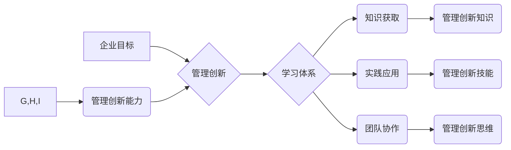

                 

## 学习体系与管理创新能力的培养

> 关键词：学习体系、管理创新、能力培养、知识获取、实践应用、团队协作、持续学习、技术发展、未来趋势

### 1. 背景介绍

在当今科技日新月异的时代，创新已成为企业发展和竞争的核心驱动力。管理创新，作为一种重要的创新形式，旨在通过优化管理流程、机制和文化，提升企业效率、效益和竞争力。然而，管理创新并非一蹴而就，它需要企业建立完善的学习体系，不断培养员工的管理创新能力。

传统的学习模式往往注重知识的传授和理论的学习，而管理创新能力的培养则需要更加注重实践应用、团队协作和持续学习。因此，企业需要构建一个能够适应快速变化的科技环境，并能够有效培养员工管理创新能力的学习体系。

### 2. 核心概念与联系

**2.1 管理创新**

管理创新是指在管理理念、组织结构、管理方法、管理技术等方面进行的创新，以提高企业效率、效益和竞争力。它包括流程创新、组织创新、文化创新、技术创新等多个方面。

**2.2 学习体系**

学习体系是指企业为员工提供学习机会和资源的系统化安排，旨在帮助员工提升专业技能、管理能力和创新能力。它包括学习目标、学习内容、学习方法、学习平台、学习评估等多个方面。

**2.3 联系**

管理创新能力的培养是学习体系的重要组成部分。通过建立完善的学习体系，企业可以为员工提供学习管理创新知识、方法和工具的机会，帮助他们提升管理创新能力。

**Mermaid 流程图**



### 3. 核心算法原理 & 具体操作步骤

**3.1 算法原理概述**

管理创新能力的培养是一个复杂的过程，需要结合多种算法和方法。其中，一些常用的算法包括：

* **知识图谱算法:** 用于构建管理创新知识的网络结构，帮助员工理解管理创新概念和关系。
* **案例分析算法:** 用于分析成功和失败的管理创新案例，帮助员工学习经验教训。
* **模拟演练算法:** 用于模拟管理创新场景，帮助员工实践管理创新技能。

**3.2 算法步骤详解**

**3.2.1 知识图谱算法**

1. 收集管理创新相关知识，包括概念、理论、方法、案例等。
2. 将知识进行结构化，构建知识图谱。
3. 利用知识图谱算法，分析知识之间的关系，发现管理创新规律。
4. 将知识图谱展示给员工，帮助他们理解管理创新知识。

**3.2.2 案例分析算法**

1. 收集成功和失败的管理创新案例。
2. 对案例进行分析，提取关键信息和经验教训。
3. 将案例分析结果整理成报告或案例库。
4. 利用案例库，帮助员工学习管理创新经验。

**3.2.3 模拟演练算法**

1. 建立管理创新场景模拟模型。
2. 设计模拟演练任务，模拟真实管理创新场景。
3. 组织员工进行模拟演练，实践管理创新技能。
4. 对模拟演练结果进行评估，帮助员工改进管理创新能力。

**3.3 算法优缺点**

* **知识图谱算法:** 优点是能够帮助员工系统地理解管理创新知识，发现知识之间的关系。缺点是需要大量的知识数据和复杂的算法模型。
* **案例分析算法:** 优点是能够帮助员工学习成功和失败的经验教训。缺点是案例的代表性可能会有限，难以适用于所有场景。
* **模拟演练算法:** 优点是能够帮助员工在安全的环境中实践管理创新技能。缺点是模拟场景可能无法完全模拟真实场景。

**3.4 算法应用领域**

* **企业管理培训:** 用于帮助员工学习管理创新知识和技能。
* **管理创新项目:** 用于模拟管理创新场景，帮助团队进行项目规划和决策。
* **管理创新研究:** 用于分析管理创新案例，发现管理创新规律。

### 4. 数学模型和公式 & 详细讲解 & 举例说明

**4.1 数学模型构建**

管理创新能力可以看作是一个多维度的复杂系统，可以用数学模型来描述其内部结构和运行机制。例如，我们可以用以下模型来描述管理创新能力的培养过程：

```
创新能力 = f(知识水平, 技能水平, 思维水平, 环境因素)
```

其中：

* 创新能力：管理创新能力的综合水平。
* 知识水平：员工对管理创新知识的掌握程度。
* 技能水平：员工运用管理创新知识解决实际问题的能力。
* 思维水平：员工进行管理创新思考和决策的能力。
* 环境因素：企业文化、组织结构、资源支持等对管理创新能力的影响因素。

**4.2 公式推导过程**

这个模型的推导过程基于以下假设：

* 管理创新能力是一个多因素综合影响的结果。
* 知识水平、技能水平和思维水平是影响管理创新能力的重要因素。
* 环境因素也会对管理创新能力产生影响。

**4.3 案例分析与讲解**

假设一家企业想要提高员工的管理创新能力，可以采取以下措施：

* **提升知识水平:** 提供管理创新相关的培训课程、学习资料和在线平台。
* **提升技能水平:** 组织模拟演练、案例分析和项目实践等活动，帮助员工运用管理创新知识解决实际问题。
* **提升思维水平:** 鼓励员工进行批判性思考、创意发想和跨界合作，培养管理创新思维。
* **优化环境因素:** 建立鼓励创新的企业文化、扁平化组织结构和完善的资源支持体系。

通过以上措施，企业可以有效提升员工的管理创新能力，从而推动企业创新发展。

### 5. 项目实践：代码实例和详细解释说明

**5.1 开发环境搭建**

为了实现管理创新能力的培养，可以开发一个基于云平台的学习平台。该平台需要具备以下功能：

* **知识库:** 收集和整理管理创新相关的知识资源，包括文章、视频、案例等。
* **学习路径:** 根据员工的学习目标和经验水平，设计个性化的学习路径。
* **互动练习:** 提供模拟演练、案例分析和项目实践等互动练习，帮助员工巩固学习成果。
* **社区论坛:** 建立员工交流学习的社区论坛，促进团队协作和知识共享。

**5.2 源代码详细实现**

由于篇幅限制，这里只提供代码框架示例，具体实现需要根据实际需求进行调整。

```python
# 知识库管理
class KnowledgeBase:
    def __init__(self):
        self.knowledge = {}

    def add_knowledge(self, key, value):
        self.knowledge[key] = value

    def get_knowledge(self, key):

        return self.knowledge.get(key)

# 学习路径管理
class LearningPath:
    def __init__(self):
        self.paths = {}

    def add_path(self, name, steps):
        self.paths[name] = steps

    def get_path(self, name):
        return self.paths.get(name)

# 互动练习管理
class InteractiveExercise:
    def __init__(self):
        self.exercises = {}

    def add_exercise(self, name, content):
        self.exercises[name] = content

    def get_exercise(self, name):
        return self.exercises.get(name)

# 社区论坛管理
class CommunityForum:
    def __init__(self):
        self.forum = {}

    def add_post(self, user, content):
        self.forum[user] = content

    def get_post(self, user):
        return self.forum.get(user)
```

**5.3 代码解读与分析**

以上代码示例展示了管理创新能力培养平台的基本功能模块。

* `KnowledgeBase` 类负责管理知识库，提供添加、获取知识资源的功能。
* `LearningPath` 类负责管理学习路径，提供添加、获取个性化学习路径的功能。
* `InteractiveExercise` 类负责管理互动练习，提供添加、获取模拟演练、案例分析等练习的功能。
* `CommunityForum` 类负责管理社区论坛，提供添加、获取员工交流学习内容的功能。

**5.4 运行结果展示**

通过运行以上代码，可以搭建一个基本的管理创新能力培养平台。平台可以提供丰富的学习资源、个性化的学习路径、互动练习和社区论坛，帮助员工提升管理创新能力。

### 6. 实际应用场景

**6.1 企业培训**

管理创新能力培养平台可以作为企业培训的重要工具，帮助员工学习管理创新知识和技能。

**6.2 管理创新项目**

管理创新能力培养平台可以为管理创新项目提供支持，帮助团队进行项目规划、决策和执行。

**6.3 管理创新研究**

管理创新能力培养平台可以为管理创新研究提供数据支持，帮助研究人员分析管理创新案例和规律。

**6.4 未来应用展望**

随着人工智能、大数据和云计算技术的不断发展，管理创新能力培养平台将更加智能化、个性化和高效化。未来，平台将能够：

* **提供更加个性化的学习路径:** 根据员工的学习目标、经验水平和学习风格，提供更加个性化的学习路径。
* **提供更加智能化的学习体验:** 利用人工智能技术，提供更加智能化的学习体验，例如智能问答、个性化推荐等。
* **提供更加丰富的互动练习:** 利用虚拟现实、增强现实等技术，提供更加丰富的互动练习，例如模拟管理创新场景、进行虚拟团队合作等。

### 7. 工具和资源推荐

**7.1 学习资源推荐**

* **书籍:** 《管理创新》、《组织变革》、《战略管理》等。
* **在线课程:** Coursera、edX、Udemy等平台提供管理创新相关的在线课程。
* **学术期刊:** 《管理世界》、《中国管理科学》、《哈佛商业评论》等。

**7.2 开发工具推荐**

* **Python:** 作为一种通用的编程语言，Python 非常适合开发管理创新能力培养平台。
* **Django/Flask:** 作为 Python 的 Web 框架，Django 和 Flask 可以帮助快速搭建 Web 应用。
* **React/Vue.js:** 作为前端框架，React 和 Vue.js 可以帮助构建用户友好的界面。

**7.3 相关论文推荐**

* **管理创新理论研究:** 《管理创新理论研究综述》、《管理创新模式的构建与实践》等。
* **管理创新案例分析:** 《案例分析：管理创新成功案例》、《案例分析：管理创新失败案例》等。
* **管理创新评估方法:** 《管理创新评估方法研究》、《管理创新绩效评价指标体系构建》等。

### 8. 总结：未来发展趋势与挑战

**8.1 研究成果总结**

通过以上分析，我们可以总结出以下研究成果：

* 管理创新能力的培养是一个复杂的过程，需要结合多种算法和方法。
* 管理创新能力培养平台可以作为企业培训、管理创新项目和管理创新研究的重要工具。
* 未来，管理创新能力培养平台将更加智能化、个性化和高效化。

**8.2 未来发展趋势**

* **人工智能技术:** 人工智能技术将被更加广泛地应用于管理创新能力培养平台，例如智能学习路径推荐、个性化学习内容生成、智能问答等。
* **大数据技术:** 大数据技术将帮助管理创新能力培养平台收集和分析更加丰富的学习数据，从而提供更加精准的学习建议和评估。
* **云计算技术:** 云计算技术将使管理创新能力培养平台更加灵活、可扩展和易于部署。

**8.3 面临的挑战**

* **数据安全:** 管理创新能力培养平台需要处理大量的用户数据，因此数据安全是一个重要的挑战。
* **算法公平性:** 管理创新能力培养平台的算法需要保证公平性，避免出现歧视或偏见。
* **平台可访问性:** 管理创新能力培养平台需要保证所有员工都能平等地访问和使用。

**8.4 研究展望**

未来，我们将继续研究管理创新能力培养平台的算法、技术和应用，努力构建一个更加智能化、个性化和高效的管理创新能力培养平台，帮助企业培养更多优秀的管理创新人才。

### 9. 附录：常见问题与解答

**9.1 如何注册使用平台？**

用户可以通过平台官网进行注册，填写个人信息并设置密码即可。

**9.2 平台支持哪些学习语言？**

平台目前支持中文和英文两种语言。

**9.3 如何获取平台的帮助？**

用户可以通过平台内的在线客服或发送邮件至平台邮箱获取帮助。


作者：禅与计算机程序设计艺术 / Zen and the Art of Computer Programming<end_of_turn>

