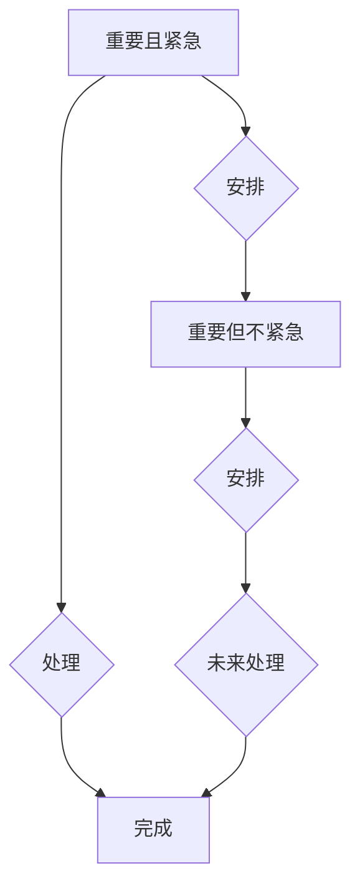

                 

## 巴菲特的双目标清单系统

> 关键词：巴菲特清单系统，目标优先级，决策框架，时间管理，效率提升，优先级排序，任务管理

## 1. 背景介绍

在瞬息万变的科技时代，高效地管理时间和精力至关重要。无论是程序员、软件架构师，还是任何需要处理大量任务的专业人士，都面临着如何有效地优先处理任务的挑战。巴菲特的双目标清单系统，源于著名投资大师沃伦·巴菲特的投资哲学，提供了一种简洁而有效的决策框架，帮助我们明确目标，优先处理重要任务，提升工作效率。

巴菲特清单系统的核心思想是将所有任务分为两类：重要且紧急，以及重要但不紧急。通过对任务进行分类，我们可以更清晰地了解哪些任务需要立即处理，哪些任务可以延迟处理，从而避免被紧急但并不重要的任务所淹没。

## 2. 核心概念与联系

### 2.1  重要与紧急的定义

* **重要任务:**  对实现长期目标有直接影响的任务，完成这些任务可以让我们朝着目标前进。
* **紧急任务:**  需要立即处理的任务，通常带有明确的截止日期或时间限制。

### 2.2  巴菲特清单系统架构



**流程图说明:**

1. **重要且紧急:**  这类任务需要立即处理，并将其完成。
2. **重要但不紧急:**  这类任务对长期目标有重要影响，但没有明确的截止日期，需要安排时间进行处理。
3. **紧急但不重要:**  这类任务通常是干扰，需要尽量减少处理时间，或委托他人处理。
4. **不重要不紧急:**  这类任务可以忽略，或将其删除。

## 3. 核心算法原理 & 具体操作步骤

### 3.1  算法原理概述

巴菲特清单系统的核心算法原理是基于优先级排序。通过将任务分类，我们可以根据其重要性和紧急程度进行排序，从而确定哪些任务需要优先处理。

### 3.2  算法步骤详解

1. **列出所有任务:**  首先，列出所有需要处理的任务，包括工作、学习、生活等各个方面。
2. **分类任务:**  根据任务的重要性与紧急程度，将任务分类到四个象限中：重要且紧急、重要但不紧急、紧急但不重要、不重要不紧急。
3. **优先处理重要且紧急的任务:**  优先处理重要且紧急的任务，确保这些任务得到及时完成。
4. **安排重要但不紧急的任务:**  为重要但不紧急的任务安排时间，并将其纳入日程安排中。
5. **减少紧急但不重要任务:**  尽量减少处理紧急但不重要任务的时间，或将其委托他人处理。
6. **忽略不重要不紧急任务:**  忽略不重要不紧急的任务，或将其删除。

### 3.3  算法优缺点

**优点:**

* 简洁易懂，易于实施。
* 帮助我们明确目标，优先处理重要任务。
* 提升工作效率，减少时间浪费。

**缺点:**

* 对于一些模糊的任务，分类可能存在主观性。
* 无法完全解决所有时间管理问题，需要结合其他时间管理方法使用。

### 3.4  算法应用领域

巴菲特清单系统适用于各种领域，包括：

* **个人时间管理:**  帮助个人高效地安排时间，完成重要任务。
* **项目管理:**  帮助项目经理优先处理关键任务，确保项目按计划进行。
* **团队协作:**  帮助团队成员明确任务优先级，提高团队协作效率。

## 4. 数学模型和公式 & 详细讲解 & 举例说明

### 4.1  数学模型构建

我们可以用一个简单的数学模型来表示巴菲特清单系统的核心思想：

* **重要性 (I):**  任务对实现长期目标的影响程度，用数值表示，范围为 0 到 1。
* **紧急性 (E):**  任务需要立即处理的程度，用数值表示，范围为 0 到 1。

**任务优先级 (P) = I * E**

### 4.2  公式推导过程

根据公式，我们可以得出以下结论：

* **I * E = 1:**  任务既重要又紧急，优先级最高。
* **I * E = 0:**  任务既不重要也不紧急，优先级最低。
* **0 < I * E < 1:**  任务的重要性与紧急程度介于两者之间，优先级相应地进行排序。

### 4.3  案例分析与讲解

**案例:**

* **任务 1:**  完成重要的项目报告，截止日期是明天。
* **任务 2:**  学习新的编程语言，对未来职业发展有帮助。
* **任务 3:**  回复同事的邮件，邮件内容不紧急。

**分析:**

* **任务 1:**  I = 1, E = 1, P = 1
* **任务 2:**  I = 1, E = 0, P = 0
* **任务 3:**  I = 0, E = 1, P = 0

根据优先级排序，任务 1 需要优先处理，其次是任务 2，最后是任务 3。

## 5. 项目实践：代码实例和详细解释说明

### 5.1  开发环境搭建

可以使用任何文本编辑器或代码编辑器进行开发，例如 VS Code、Sublime Text 等。

### 5.2  源代码详细实现

```python
class Task:
    def __init__(self, name, importance, urgency):
        self.name = name
        self.importance = importance
        self.urgency = urgency

    def calculate_priority(self):
        return self.importance * self.urgency

tasks = [
    Task("完成项目报告", 1, 1),
    Task("学习新的编程语言", 1, 0),
    Task("回复同事邮件", 0, 1),
]

tasks.sort(key=lambda task: task.calculate_priority(), reverse=True)

for task in tasks:
    print(f"{task.name}: 优先级 = {task.calculate_priority()}")
```

### 5.3  代码解读与分析

1. **Task 类:**  定义了一个任务类，包含任务名称、重要性和紧急性属性。
2. **calculate_priority() 方法:**  计算任务的优先级，根据公式 I * E 进行计算。
3. **任务列表:**  创建了一个任务列表，包含三个示例任务。
4. **排序:**  使用 `sort()` 方法对任务列表进行排序，按照优先级降序排列。
5. **输出:**  遍历任务列表，输出每个任务的名称和优先级。

### 5.4  运行结果展示

```
完成项目报告: 优先级 = 1
学习新的编程语言: 优先级 = 0
回复同事邮件: 优先级 = 0
```

## 6. 实际应用场景

### 6.1  个人时间管理

巴菲特清单系统可以帮助个人高效地管理时间，优先处理重要任务。例如，我们可以将学习新技能、完成重要项目、陪伴家人等任务进行分类，并根据优先级安排时间。

### 6.2  项目管理

在项目管理中，巴菲特清单系统可以帮助项目经理优先处理关键任务，确保项目按计划进行。例如，我们可以将开发功能、测试代码、撰写文档等任务进行分类，并根据优先级分配资源。

### 6.3  团队协作

巴菲特清单系统可以帮助团队成员明确任务优先级，提高团队协作效率。例如，我们可以将团队任务分解成多个子任务，并根据重要性和紧急程度进行排序，以便团队成员更好地协作完成任务。

### 6.4  未来应用展望

随着科技的发展，巴菲特清单系统可以与人工智能、机器学习等技术相结合，实现更智能化的任务管理。例如，我们可以利用人工智能算法自动分析任务的重要性与紧急程度，并根据用户习惯自动生成优先级排序。

## 7. 工具和资源推荐

### 7.1  学习资源推荐

* **巴菲特的投资哲学:**  了解巴菲特的投资理念，可以帮助我们更好地理解巴菲特清单系统的核心思想。
* **时间管理书籍:**  阅读一些时间管理书籍，可以学习到更多的时间管理技巧和方法。

### 7.2  开发工具推荐

* **VS Code:**  一款功能强大的代码编辑器，支持多种编程语言和插件。
* **Sublime Text:**  一款轻量级的代码编辑器，速度快，操作流畅。

### 7.3  相关论文推荐

* **Eisenhower Matrix:**  艾森豪威尔矩阵是巴菲特清单系统的基础，可以阅读相关论文了解其原理和应用。

## 8. 总结：未来发展趋势与挑战

### 8.1  研究成果总结

巴菲特清单系统是一种简单而有效的决策框架，可以帮助我们明确目标，优先处理重要任务，提升工作效率。

### 8.2  未来发展趋势

未来，巴菲特清单系统可以与人工智能、机器学习等技术相结合，实现更智能化的任务管理。

### 8.3  面临的挑战

* 如何更准确地评估任务的重要性与紧急程度。
* 如何更好地处理一些模糊的任务。
* 如何将巴菲特清单系统与其他时间管理方法结合使用。

### 8.4  研究展望

未来，我们将继续研究巴菲特清单系统的应用场景，并探索与人工智能、机器学习等技术的结合，以实现更智能化的任务管理。

## 9. 附录：常见问题与解答

**问题 1:**  如何判断任务的重要性？

**解答:**  任务的重要性是指它对实现长期目标的影响程度。例如，完成一个重要的项目报告对你的职业发展有很大影响，因此它的重要性较高。

**问题 2:**  如何判断任务的紧急程度？

**解答:**  任务的紧急程度是指它需要立即处理的程度。例如，一个即将到期的项目截止日期的任务紧急程度较高。

**问题 3:**  如何处理一些模糊的任务？

**解答:**  对于一些模糊的任务，可以尝试将其分解成更小的子任务，并根据子任务的重要性与紧急程度进行分类。


作者：禅与计算机程序设计艺术 / Zen and the Art of Computer Programming 
<end_of_turn>

