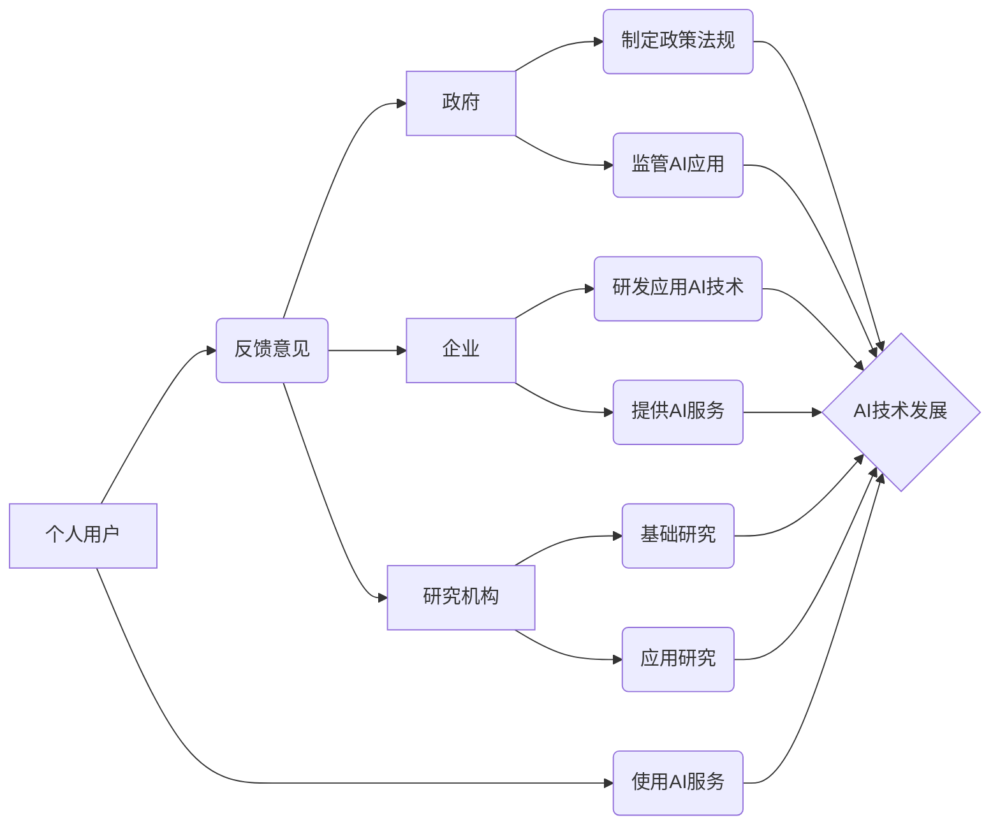

                 

## 平衡AI发展中的利益相关者权力

> 关键词：人工智能、利益相关者、权力平衡、伦理、可持续发展、透明度、问责制、监管

## 1. 背景介绍

人工智能（AI）正以惊人的速度发展，其应用领域不断扩展，深刻地改变着我们的生活和工作方式。从医疗诊断到金融交易，从自动驾驶到个性化教育，AI技术的渗透正在触及生活的方方面面。然而，AI的发展也引发了广泛的社会关注和伦理争议。

其中一个关键问题是AI发展中的利益相关者权力平衡。AI技术的研发、应用和监管涉及到政府、企业、研究机构、个人用户等多方利益相关者。如何确保各方利益得到平衡，避免权力集中，是AI发展可持续和健康的重要保障。

## 2. 核心概念与联系

**2.1 利益相关者**

在AI发展中，利益相关者是指对AI技术及其发展产生影响或受到影响的任何个体或组织。

* **政府:** 负责制定AI相关政策法规，监管AI技术应用，维护社会公共利益。
* **企业:** 作为AI技术的研发和应用主体，追求商业利益，推动AI技术创新和产业发展。
* **研究机构:** 承担AI基础研究和应用研究的任务，推动AI技术的进步和理论发展。
* **个人用户:**  作为AI技术的使用者，享受AI带来的便利和服务，同时也要关注AI带来的潜在风险和伦理问题。

**2.2 权力**

在AI发展中，权力是指影响AI技术研发、应用和监管决策的能力和资源。

* **技术权力:** 掌握AI技术核心知识和算法，能够自主研发和应用AI技术。
* **经济权力:** 拥有充足的资金和资源，能够推动AI技术研发和应用，并从中获取利益。
* **政治权力:** 能够制定和执行AI相关政策法规，影响AI技术的应用方向和发展趋势。
* **社会权力:** 拥有广泛的社会影响力和舆论引导能力，能够塑造公众对AI的认知和态度。

**2.3 权力平衡**

在AI发展中，权力平衡是指各方利益相关者在决策和行动中拥有相对平等的权利和话语权，避免任何一方的权力过度集中，从而确保AI技术的健康发展和社会可持续发展。

**2.4 利益相关者权力平衡的架构**



## 3. 核心算法原理 & 具体操作步骤

**3.1 算法原理概述**

为了实现AI发展中的利益相关者权力平衡，需要采用相应的算法和机制。其中，一种重要的算法是**多主体博弈算法**。

多主体博弈算法旨在解决多个智能体之间相互竞争和合作的问题，通过设计合理的激励机制和规则，引导各主体做出有利于整体利益的决策。

**3.2 算法步骤详解**

1. **定义博弈模型:** 首先需要明确参与博弈的各主体、每个主体的目标函数、每个主体的行动选择以及各主体之间的交互关系。
2. **设计激励机制:** 根据博弈模型，设计合理的激励机制，鼓励各主体合作，并避免任何一方获得过大的权力。
3. **制定规则:** 制定明确的规则和规范，约束各主体在博弈过程中的行为，确保博弈过程的公平性和透明度。
4. **运行博弈算法:** 利用多主体博弈算法，模拟各主体之间的交互，并根据算法结果，调整激励机制和规则，最终达到权力平衡的目标。

**3.3 算法优缺点**

* **优点:** 能够有效地解决多主体之间的权力分配问题，促进合作和共赢。
* **缺点:** 需要复杂的模型设计和算法实现，并且需要大量的计算资源。

**3.4 算法应用领域**

* **AI资源分配:**  公平地分配AI计算资源、数据资源等。
* **AI算法开发:**  促进多方合作开发AI算法，避免算法垄断。
* **AI应用监管:**  制定AI应用规则，避免滥用AI技术。

## 4. 数学模型和公式 & 详细讲解 & 举例说明

**4.1 数学模型构建**

我们可以用一个简单的数学模型来描述AI发展中的利益相关者权力平衡问题。假设有三个利益相关者：政府（G）、企业（E）和研究机构（R）。每个利益相关者的目标函数可以表示为：

*  **G:**  最大化社会福利，即AI技术带来的社会效益减去潜在风险。
*  **E:**  最大化利润，即通过AI技术开发和应用获得的经济收益。
*  **R:**  最大化知识产出，即通过AI研究获得的新知识和技术成果。

**4.2 公式推导过程**

我们可以用一个简单的线性规划模型来描述上述目标函数之间的关系：

```latex
max Z = w_G * S + w_E * P + w_R * K
```

其中：

*  **Z:**  目标函数值，代表社会福利、利润和知识产出等多方面利益的综合权重。
*  **S:**  社会福利，由AI技术带来的社会效益减去潜在风险组成。
*  **P:**  利润，由企业通过AI技术开发和应用获得的经济收益组成。
*  **K:**  知识产出，由研究机构通过AI研究获得的新知识和技术成果组成。
*  **w_G, w_E, w_R:**  权重系数，分别代表政府、企业和研究机构的利益权重。

**4.3 案例分析与讲解**

假设政府希望鼓励AI技术在医疗领域的应用，可以将权重系数w_G调整为一个较高的值，以提高社会福利的权重。同时，政府还可以通过提供补贴和税收优惠等政策措施，鼓励企业和研究机构参与医疗领域的AI技术研发和应用。

## 5. 项目实践：代码实例和详细解释说明

**5.1 开发环境搭建**

为了实现AI发展中的利益相关者权力平衡，我们可以使用Python语言和相应的库进行开发。

*  **Python:**  一种开源的编程语言，具有丰富的AI开发库和工具。
*  **TensorFlow:**  一个开源的机器学习框架，可以用于训练和部署AI模型。
*  **PyTorch:**  另一个开源的机器学习框架，具有灵活性和易用性。

**5.2 源代码详细实现**

```python
# 这是一个简单的多主体博弈算法示例
# 具体实现需要根据实际场景进行调整

# 定义博弈模型
agents = ['政府', '企业', '研究机构']
rewards = {
    '政府': 0,
    '企业': 0,
    '研究机构': 0
}

# 设计激励机制
def calculate_reward(agent, action):
    # 根据agent和action计算奖励
    pass

# 制定规则
def check_rules(agent, action):
    # 检查agent的行为是否符合规则
    pass

# 运行博弈算法
for iteration in range(num_iterations):
    for agent in agents:
        # 获取agent的策略
        action = get_agent_action(agent)
        # 计算奖励
        reward = calculate_reward(agent, action)
        # 更新奖励
        rewards[agent] += reward
        # 检查规则
        if not check_rules(agent, action):
            # 如果违反规则，则惩罚agent
            rewards[agent] -= penalty

# 输出结果
print(rewards)
```

**5.3 代码解读与分析**

*  **定义博弈模型:**  首先需要定义参与博弈的各主体和他们的目标函数。
*  **设计激励机制:**  根据博弈模型，设计合理的激励机制，鼓励各主体合作，并避免任何一方获得过大的权力。
*  **制定规则:**  制定明确的规则和规范，约束各主体在博弈过程中的行为，确保博弈过程的公平性和透明度。
*  **运行博弈算法:**  利用多主体博弈算法，模拟各主体之间的交互，并根据算法结果，调整激励机制和规则，最终达到权力平衡的目标。

**5.4 运行结果展示**

运行上述代码后，可以得到每个利益相关者的最终奖励值。通过分析奖励值的变化趋势，可以了解各主体在博弈过程中的行为模式和权力分配情况。

## 6. 实际应用场景

**6.1 AI算法开发**

在AI算法开发领域，多主体博弈算法可以用于促进多方合作开发AI算法，避免算法垄断。例如，可以建立一个开放的AI算法平台，让各方参与者可以共享算法资源和知识产权，共同推动AI算法的进步。

**6.2 AI资源分配**

AI计算资源和数据资源是AI技术发展的关键要素。多主体博弈算法可以用于公平地分配这些资源，避免资源集中在少数机构手中。例如，可以建立一个AI资源交易平台，让各方参与者可以根据自身需求和资源贡献进行资源交易，实现资源的合理配置。

**6.3 AI应用监管**

AI技术的应用需要得到有效的监管，避免滥用AI技术造成负面影响。多主体博弈算法可以用于制定AI应用规则，并确保规则的公平性和透明度。例如，可以建立一个AI应用监管委员会，由政府、企业、研究机构和个人用户代表组成，共同制定和监督AI应用规则。

**6.4 未来应用展望**

随着AI技术的不断发展，多主体博弈算法在AI发展中的应用场景将会更加广泛。例如，可以应用于AI伦理决策、AI安全保障、AI人才培养等领域，促进AI技术的可持续发展和社会共赢。

## 7. 工具和资源推荐

**7.1 学习资源推荐**

*  **书籍:**
    *  《博弈论导论》
    *  《多主体系统》
    *  《人工智能：现代方法》
*  **在线课程:**
    *  Coursera:  博弈论
    *  edX:  人工智能
    *  Udacity:  机器学习

**7.2 开发工具推荐**

*  **Python:**  Python语言和相应的库，例如TensorFlow、PyTorch等。
*  **Jupyter Notebook:**  用于编写和运行Python代码的交互式笔记本环境。
*  **Git:**  用于版本控制和代码协作的工具。

**7.3 相关论文推荐**

*  **Multi-Agent Reinforcement Learning for Resource Allocation in Cloud Computing**
*  **A Survey of Multi-Agent Reinforcement Learning**
*  **Fairness in Machine Learning**

## 8. 总结：未来发展趋势与挑战

**8.1 研究成果总结**

通过对AI发展中的利益相关者权力平衡问题进行研究，我们发现多主体博弈算法是一种有效的解决方法。该算法能够促进各方合作，避免权力集中，从而确保AI技术的健康发展和社会可持续发展。

**8.2 未来发展趋势**

未来，AI发展中的利益相关者权力平衡问题将会更加复杂和严峻。随着AI技术的不断发展，其应用范围将会更加广泛，对社会的影响将会更加深远。因此，我们需要不断完善多主体博弈算法，使其能够更好地适应复杂的AI发展环境。

**8.3 面临的挑战**

*  **算法复杂性:**  多主体博弈算法的实现需要复杂的数学模型和算法设计，并且需要大量的计算资源。
*  **数据获取和隐私保护:**  多主体博弈算法需要大量的真实数据进行训练和测试，而数据的获取和隐私保护是一个重要的伦理问题。
*  **社会接受度:**  多主体博弈算法的应用需要得到社会的广泛接受和支持，而这需要克服人们对AI技术的担忧和不信任。

**8.4 研究展望**

未来，我们需要在以下几个方面进行深入研究：

*  **开发更有效的多主体博弈算法:**  研究更灵活、更鲁棒、更易于理解的多主体博弈算法，使其能够更好地适应复杂的AI发展环境。
*  **解决数据获取和隐私保护问题:**  研究新的数据获取和隐私保护机制，确保多主体博弈算法的应用能够尊重个人的隐私权。
*  **提高社会对AI技术的理解和信任:**  通过开展科普活动、加强公众教育，提高社会对AI技术的理解和信任，为多主体博弈算法的应用创造良好的社会环境。

## 9. 附录：常见问题与解答

**9.1 如何平衡政府、企业和研究机构的利益？**

在AI发展中，政府、企业和研究机构的利益之间存在着一定的冲突。政府希望通过AI技术促进社会发展，企业希望通过AI技术获得经济利益，而研究机构希望通过AI技术获得学术成果。

为了平衡这些利益，我们需要采用多主体博弈算法，设计合理的激励机制和规则，引导各方合作，共同推动AI技术的进步和社会发展。

**9.2 如何确保AI技术的公平性和透明度？**

AI技术的公平性和透明度是其可持续发展的关键保障。

为了确保AI技术的公平性和透明度，我们需要：

*  制定明确的AI应用规则，避免算法歧视和偏见。
*  建立AI算法审计机制，定期对AI算法进行评估和监督。
*  加强公众对AI技术的教育和宣传，提高公众对AI技术的理解和监督能力。

**9.3 如何应对AI技术带来的伦理挑战？**

AI技术的快速发展带来了许多伦理挑战，例如AI算法的透明度、责任归属、数据隐私等。

为了应对这些挑战，我们需要：

*  建立健全的AI伦理规范和法律法规。
*  加强AI伦理研究和教育，培养AI伦理意识。
*  促进政府、企业、研究机构和公众之间的对话和合作，共同应对AI技术带来的伦理挑战。


作者：禅与计算机程序设计艺术 / Zen and the Art of Computer Programming<end_of_turn>

