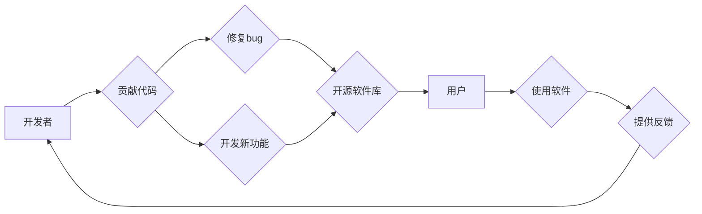

                 

## 开源技术：共享创新，加速进步

> 关键词：开源软件、社区驱动、协作创新、软件开发、技术进步

### 1. 背景介绍

在当今科技日新月异的时代，软件技术扮演着越来越重要的角色。从智能手机到云计算，从人工智能到物联网，软件无处不在，深刻地影响着我们的生活和工作。然而，软件开发是一个复杂而耗时的过程，需要大量的资源和人才投入。面对这一挑战，开源技术应运而生，成为推动软件创新和加速技术进步的重要力量。

开源软件是指源代码公开可供任何人免费使用、修改和再发布的软件。它打破了传统软件开发的封闭模式，鼓励开发者共享代码、共同改进，形成一个开放、透明、协作的软件开发生态系统。

开源软件的兴起，得益于互联网技术的普及和全球化趋势。互联网提供了便捷的平台，让开发者能够轻松地分享代码和交流经验。全球化的趋势则促进了不同文化背景和技术水平的开发者之间的合作。

### 2. 核心概念与联系

#### 2.1 开源软件的核心理念

开源软件的核心价值观是开放、共享、协作和创新。

* **开放：** 源代码公开透明，任何人都可以访问、阅读和修改。
* **共享：** 开发者可以自由地使用、修改和再发布开源软件，无需支付任何费用。
* **协作：** 开发者可以共同参与到开源软件的开发和改进中，分享经验和知识。
* **创新：** 开放的代码和协作的开发模式，激发了开发者们的创新热情，促进了软件技术的快速发展。

#### 2.2 开源软件的生态系统

开源软件的生态系统是一个庞大而复杂的网络，包括开发者、用户、企业、组织和平台。

* **开发者：** 贡献代码、修复bug、开发新功能。
* **用户：** 使用开源软件，提供反馈和建议。
* **企业：** 利用开源软件，进行商业化开发或提供服务。
* **组织：** 支持开源软件的开发和推广，提供资源和平台。
* **平台：** 提供托管开源软件代码、协作开发工具和社区平台。

**Mermaid 流程图**



### 3. 核心算法原理 & 具体操作步骤

#### 3.1 算法原理概述

开源软件的开发离不开各种算法和数据结构的支持。这些算法和数据结构是软件开发的基石，决定了软件的性能、效率和可靠性。

例如，搜索算法是开源软件中常用的算法之一。它用于在海量数据中快速查找特定信息。常见的搜索算法包括线性搜索、二分搜索和树形搜索等。

#### 3.2 算法步骤详解

以二分搜索为例，详细说明其步骤：

1. **排序：** 首先需要将待搜索的数据进行排序。
2. **确定搜索范围：** 将搜索范围限定在数据序列的中间部分。
3. **比较目标值：** 将目标值与中间元素进行比较。
4. **缩小搜索范围：** 如果目标值等于中间元素，则搜索成功。否则，根据目标值的大小，缩小搜索范围到中间元素左侧或右侧。
5. **重复步骤 3-4：** 重复步骤 3-4，直到找到目标值或搜索范围为空。

#### 3.3 算法优缺点

**二分搜索的优点：**

* **时间复杂度低：** 在有序数据中，二分搜索的时间复杂度为 O(log n)，效率很高。
* **易于实现：** 二分搜索的算法简单易懂，实现起来比较容易。

**二分搜索的缺点：**

* **数据必须有序：** 二分搜索只能应用于有序数据。
* **不适用于动态数据：** 当数据发生变化时，需要重新排序数据，才能继续使用二分搜索。

#### 3.4 算法应用领域

二分搜索广泛应用于各种领域，例如：

* **搜索引擎：** 用于快速查找网页。
* **数据库管理系统：** 用于查找数据记录。
* **排序算法：** 作为排序算法的辅助工具。

### 4. 数学模型和公式 & 详细讲解 & 举例说明

#### 4.1 数学模型构建

开源软件的开发可以抽象为一个数学模型，其中涉及到开发者数量、代码贡献量、代码质量、用户反馈等因素。

例如，我们可以用以下公式来描述开源软件的开发速度：

```latex
开发速度 = 代码贡献量 / 代码质量
```

#### 4.2 公式推导过程

这个公式的推导过程如下：

* 代码贡献量代表了开发者们投入的精力和时间。
* 代码质量代表了代码的可靠性、可维护性和可扩展性。
* 开发速度代表了开源软件的更新频率和功能迭代速度。

因此，代码贡献量越大，代码质量越高，开发速度就越快。

#### 4.3 案例分析与讲解

以 Linux 操作系统为例，它是一个典型的开源软件项目。Linux 的开发速度非常快，主要得益于以下几个因素：

* **庞大的开发者社区：** Linux 拥有来自世界各地的数万名开发者，他们积极地贡献代码和修复bug。
* **高代码质量：** Linux 的代码质量非常高，经过了严格的测试和审查。
* **完善的开发流程：** Linux 采用成熟的开发流程，包括版本控制、代码审查和测试自动化。

### 5. 项目实践：代码实例和详细解释说明

#### 5.1 开发环境搭建

开源软件的开发环境搭建通常包括以下步骤：

1. **安装操作系统：** 选择合适的操作系统，例如 Linux 或 Windows。
2. **安装开发工具：** 安装代码编辑器、编译器、版本控制系统等开发工具。
3. **配置环境变量：** 设置环境变量，方便开发工具访问必要的软件包和库。

#### 5.2 源代码详细实现

以一个简单的开源软件项目为例，例如一个文本编辑器。

**代码示例：**

```python
# 文本编辑器示例代码

def edit_text():
    text = input("请输入文本内容：")
    print("您输入的文本内容是：", text)

if __name__ == "__main__":
    edit_text()
```

**代码解读：**

* `edit_text()` 函数用于编辑文本内容。
* `input()` 函数用于获取用户输入的文本内容。
* `print()` 函数用于输出文本内容。
* `if __name__ == "__main__":` 语句用于确保代码只在直接运行脚本时执行。

#### 5.3 代码解读与分析

这段代码实现了基本的文本编辑功能。用户可以输入文本内容，程序会将其打印出来。

#### 5.4 运行结果展示

当运行这段代码时，程序会提示用户输入文本内容，用户输入的内容会被打印出来。

### 6. 实际应用场景

开源软件广泛应用于各个领域，例如：

* **操作系统：** Linux、Android
* **数据库：** MySQL、PostgreSQL
* **编程语言：** Python、Java、PHP
* **Web 服务器：** Apache、Nginx
* **云计算平台：** OpenStack、Kubernetes

#### 6.4 未来应用展望

随着技术的不断发展，开源软件的应用场景将会更加广泛。例如：

* **人工智能：** 开源人工智能框架和库，例如 TensorFlow 和 PyTorch，正在推动人工智能技术的普及。
* **物联网：** 开源物联网平台和协议，例如 OpenHAB 和 MQTT，正在连接越来越多的设备。
* **区块链：** 开源区块链平台和工具，例如 Ethereum 和 Hyperledger，正在推动区块链技术的创新。

### 7. 工具和资源推荐

#### 7.1 学习资源推荐

* **开源社区网站：** GitHub、GitLab、Bitbucket
* **在线学习平台：** Coursera、edX、Udemy
* **开源软件文档：** Apache、Linux Foundation、Mozilla

#### 7.2 开发工具推荐

* **代码编辑器：** Visual Studio Code、Sublime Text、Atom
* **版本控制系统：** Git、Mercurial
* **构建工具：** Maven、Gradle、Make

#### 7.3 相关论文推荐

* **The Cathedral and the Bazaar** by Eric S. Raymond
* **Free Software, Free Society** by Richard Stallman
* **Open Source Software Development** by Karl E. Wiegers

### 8. 总结：未来发展趋势与挑战

#### 8.1 研究成果总结

开源技术已经取得了巨大的成功，推动了软件开发的创新和进步。开源软件的广泛应用，降低了软件开发成本，提高了软件质量，促进了技术交流和合作。

#### 8.2 未来发展趋势

开源技术的发展趋势包括：

* **人工智能和机器学习：** 开源人工智能框架和库将继续推动人工智能技术的普及和发展。
* **云计算和容器化：** 开源云计算平台和容器化技术将继续推动云计算的普及和发展。
* **区块链技术：** 开源区块链平台和工具将继续推动区块链技术的创新和应用。

#### 8.3 面临的挑战

开源技术也面临着一些挑战，例如：

* **维护成本：** 开源软件的维护成本较高，需要大量的志愿者和资金支持。
* **安全问题：** 开源软件的安全问题需要得到重视，需要加强代码审查和漏洞修复。
* **商业模式：** 开源软件的商业模式需要不断探索，需要找到可持续的盈利模式。

#### 8.4 研究展望

未来，开源技术将继续发展和壮大，成为软件开发的主流模式。我们需要加强开源社区建设，鼓励更多开发者参与到开源项目中，共同推动开源技术的进步。

### 9. 附录：常见问题与解答

#### 9.1 什么是开源软件？

开源软件是指源代码公开可供任何人免费使用、修改和再发布的软件。

#### 9.2 开源软件的优势是什么？

开源软件的优势包括：

* **免费使用：** 用户可以免费使用开源软件，无需支付任何费用。
* **透明度高：** 源代码公开透明，用户可以查看代码，了解软件的内部工作原理。
* **社区驱动：** 开源软件由开发者社区共同维护和改进，可以获得更快速的技术支持和更新。

#### 9.3 如何参与开源项目？

参与开源项目的方法有很多，例如：

* **贡献代码：** 编写新的代码或修复bug。
* **提供文档：** 撰写软件文档或翻译文档。
* **测试软件：** 测试软件的功能和性能。
* **参与社区讨论：** 在论坛或邮件列表上参与讨论，分享经验和知识。


作者：禅与计算机程序设计艺术 / Zen and the Art of Computer Programming 
<end_of_turn>

