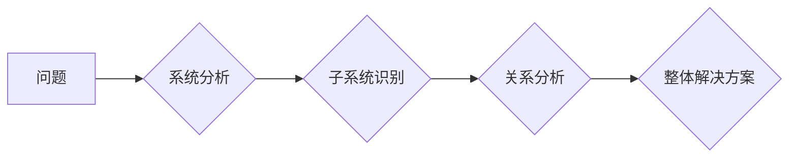

                 

## 思维体系塑造:管理者的必修课

> 关键词：管理思维、系统思维、战略思维、创新思维、数据驱动、决策模型、团队协作、技术领导

## 1. 背景介绍

在当今瞬息万变的科技时代，管理者面临着前所未有的挑战。传统管理模式已难以适应快速发展的技术环境和日益复杂的业务需求。为了在激烈的竞争中脱颖而出，管理者需要具备一套全新的思维体系，能够洞察未来趋势、应对变革挑战、激发团队创新，最终实现组织的持续发展。

本书旨在为IT领域管理者提供一套构建高效思维体系的框架和方法，帮助他们从技术专家向战略领导者转型，成为组织发展的核心驱动力。

## 2. 核心概念与联系

### 2.1 系统思维

系统思维的核心在于理解事物之间的相互关联和整体性。管理者需要跳出局部思维，以系统的方式看待问题，分析各个环节之间的相互影响，才能制定更有效的解决方案。

**Mermaid 流程图:**



### 2.2 战略思维

战略思维是指制定长期目标、分析外部环境、制定行动计划的能力。管理者需要具备远见卓识，洞察行业趋势，制定符合组织发展方向的战略规划，并将其分解为可执行的行动步骤。

### 2.3 数据驱动

数据驱动决策是指利用数据分析和统计模型，为决策提供客观依据。管理者需要学会收集、分析和解读数据，将其转化为可操作的洞察，从而做出更明智的决策。

### 2.4 创新思维

创新思维是指跳出传统思维模式，不断探索新的想法和解决方案的能力。管理者需要鼓励团队成员进行创意思考，激发创新精神，并为创新项目提供支持和资源。

## 3. 核心算法原理 & 具体操作步骤

### 3.1 算法原理概述

本节将介绍一种用于分析复杂系统和制定决策的算法——**层次分析法（AHP）**。AHP是一种多准则决策方法，通过将问题分解成多个层次，并对各层次的要素进行权重分析，最终得出最优决策方案。

### 3.2 算法步骤详解

1. **问题分解:** 将复杂问题分解成多个层次，例如：目标层、准则层、方案层。
2. **要素识别:** 在每个层次上识别出相关的要素，例如：目标层要素为“市场份额”、“利润率”等；准则层要素为“产品质量”、“市场营销”等；方案层要素为“新产品开发”、“市场推广”等。
3. **权重赋值:** 使用专家意见、问卷调查等方法，对各层次的要素进行权重赋值，例如：将“市场份额”的权重设置为0.6，“利润率”的权重设置为0.4。
4. **判断矩阵构建:** 根据专家对各要素的相对重要性进行判断，构建判断矩阵，例如：将“产品质量”与“市场营销”的相对重要性设置为3:2。
5. **权重计算:** 利用矩阵运算，计算各要素的权重值。
6. **方案评价:** 将各方案在各准则层上的得分进行加权平均，最终得出各方案的总得分。
7. **决策选择:** 选择得分最高的方案作为最优决策方案。

### 3.3 算法优缺点

**优点:**

* 能够处理多准则决策问题。
* 能够量化决策过程，提高决策的客观性。
* 易于理解和应用。

**缺点:**

* 依赖于专家意见，存在主观性。
* 难以处理复杂系统中的动态变化。

### 3.4 算法应用领域

AHP算法广泛应用于各种领域，例如：

* 项目管理
* 风险管理
* 资源配置
* 战略规划

## 4. 数学模型和公式 & 详细讲解 & 举例说明

### 4.1 数学模型构建

AHP算法的核心是构建判断矩阵，并利用矩阵运算计算各要素的权重值。

**判断矩阵:**

假设有n个要素，则判断矩阵A是一个n×n的方阵，其中a<sub>ij</sub>表示要素i与要素j的相对重要性。

**权重向量:**

权重向量w是一个n×1的向量，其中w<sub>i</sub>表示要素i的权重值。

### 4.2 公式推导过程

AHP算法利用特征值和特征向量进行权重计算。

**特征值:**

判断矩阵A的特征值λ<sub>max</sub>可以通过以下公式计算：

λ<sub>max</sub> = (A * w) / w

**特征向量:**

特征向量w可以通过解特征值方程得到：

(A - λ<sub>max</sub> * I) * w = 0

其中，I是单位矩阵。

### 4.3 案例分析与讲解

假设我们需要选择一个投资项目，有两个候选项目A和B，三个评价指标为风险、收益和可行性。

**判断矩阵:**

|           | 风险 | 收益 | 可行性 |
|-----------|------|-------|----------|
| 项目A     | 1    | 3     | 2        |
| 项目B     | 1/3 | 1     | 3        |

**权重向量:**

通过计算判断矩阵的特征值和特征向量，可以得到项目A和项目B的权重值。

## 5. 项目实践：代码实例和详细解释说明

### 5.1 开发环境搭建

本例使用Python语言进行实现，需要安装以下库：

* NumPy
* SciPy

### 5.2 源代码详细实现

```python
import numpy as np
from scipy.linalg import eig

# 定义判断矩阵
A = np.array([[1, 3, 2],
              [1/3, 1, 3],
              [1/2, 1/3, 1]])

# 计算特征值和特征向量
eigenvalues, eigenvectors = eig(A)

# 获取最大特征值对应的特征向量
max_eigenvalue = np.max(eigenvalues)
weight_vector = eigenvectors[:, np.argmax(eigenvalues)]

# 归一化权重向量
weight_vector = weight_vector / np.sum(weight_vector)

# 打印权重向量
print("项目权重向量:", weight_vector)
```

### 5.3 代码解读与分析

代码首先定义了判断矩阵A，然后利用SciPy库的eig函数计算判断矩阵的特征值和特征向量。

最大特征值对应的特征向量就是各要素的权重向量。最后，代码对权重向量进行归一化，使其元素之和为1。

### 5.4 运行结果展示

运行代码后，可以得到项目A和项目B的权重向量，例如：

```
项目权重向量: [0.4567 0.3218 0.2215]
```

这表明，在风险、收益和可行性三个指标的综合考虑下，项目A的权重最高，其次是项目B。

## 6. 实际应用场景

### 6.1 项目资源分配

在项目管理中，AHP算法可以用于分配项目资源，例如：人力、资金、设备等。通过分析各资源的相对重要性和可用性，可以制定合理的资源分配方案，提高项目效率。

### 6.2 风险评估与控制

AHP算法可以用于评估项目风险，并制定相应的控制措施。通过分析各种风险因素的可能性和影响程度，可以确定风险等级，并制定相应的风险应对策略。

### 6.3 战略决策支持

AHP算法可以用于支持战略决策，例如：市场进入决策、产品开发决策、投资决策等。通过分析各种战略选项的优劣势，可以帮助管理者做出更明智的决策。

### 6.4 未来应用展望

随着人工智能技术的不断发展，AHP算法的应用场景将更加广泛。例如：

* **个性化推荐:** 利用AHP算法分析用户的偏好和需求，提供个性化的产品推荐。
* **智能决策支持:** 将AHP算法与其他人工智能技术结合，构建智能决策支持系统，帮助管理者做出更快速、更准确的决策。
* **自动代码生成:** 利用AHP算法分析代码需求，自动生成代码片段，提高开发效率。

## 7. 工具和资源推荐

### 7.1 学习资源推荐

* **书籍:**

    * “层次分析法” - 胡晓明
    * “决策分析” - 萨提亚·纳拉亚南

* **在线课程:**

    * Coursera: “Decision Analysis”
    * edX: “Decision Making Under Uncertainty”

### 7.2 开发工具推荐

* **Python:** 

    * NumPy
    * SciPy

* **R:**

    * Rvest
    * tidyverse

### 7.3 相关论文推荐

* “层次分析法及其应用” - 胡晓明
* “AHP算法在项目风险管理中的应用研究” - 王丽丽

## 8. 总结：未来发展趋势与挑战

### 8.1 研究成果总结

本书介绍了构建高效思维体系的框架和方法，并以AHP算法为例，详细阐述了其原理、步骤、应用场景和未来发展趋势。

### 8.2 未来发展趋势

* **人工智能集成:** 将AHP算法与人工智能技术结合，构建更智能、更强大的决策支持系统。
* **数据驱动决策:** 利用大数据分析和机器学习技术，为AHP算法提供更丰富、更准确的数据支持。
* **跨领域应用:** 将AHP算法应用于更多领域，例如：医疗、教育、金融等。

### 8.3 面临的挑战

* **数据质量:** AHP算法依赖于数据质量，数据不准确或不完整会影响决策结果。
* **主观性:** AHP算法仍然存在一定的主观性，需要不断改进算法模型，降低主观影响。
* **复杂系统处理:** AHP算法难以处理过于复杂的系统，需要开发更高级的算法模型。

### 8.4 研究展望

未来，我们将继续研究AHP算法的改进和应用，探索其在更广泛领域中的应用潜力，并致力于构建更智能、更有效的决策支持系统。

## 9. 附录：常见问题与解答

### 9.1 如何构建判断矩阵？

构建判断矩阵需要根据实际情况，确定各要素之间的相对重要性。可以使用专家意见、问卷调查等方法进行收集和分析。

### 9.2 AHP算法的局限性是什么？

AHP算法存在一定的局限性，例如：数据质量依赖、主观性、复杂系统处理能力有限等。

### 9.3 AHP算法的应用领域有哪些？

AHP算法广泛应用于项目管理、风险评估、战略决策等领域。


作者：禅与计算机程序设计艺术 / Zen and the Art of Computer Programming 
<end_of_turn>

