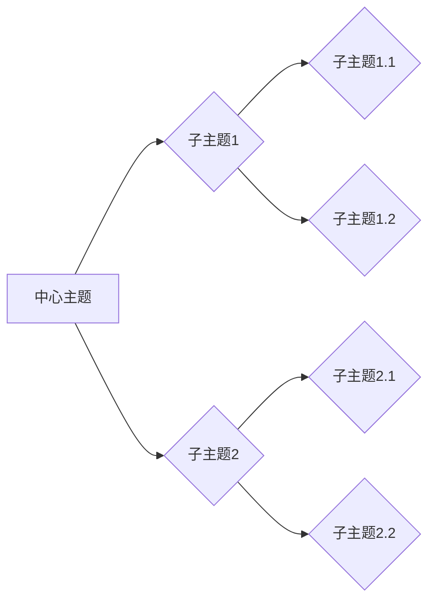

                 

## 思维导图：知识组织的视觉化工具

> 关键词：思维导图、知识组织、视觉化、脑力激荡、学习效率、项目管理、创新

## 1. 背景介绍

在信息爆炸的时代，我们每天接触的海量信息让人感到不知所措。如何有效地组织和处理这些信息，成为了一个亟待解决的问题。思维导图作为一种视觉化的知识组织工具，凭借其独特的结构和易于理解的特点，逐渐成为人们学习、工作和生活中的重要辅助手段。

思维导图的起源可以追溯到20世纪60年代，由美国教育学家托马斯·罗宾斯（Tony Buzan）提出。他认为，人类的大脑天生就喜欢以图形化的方式进行思考和记忆。思维导图正是基于这一认知，利用中心主题和分支结构，将知识点以清晰、直观的视觉方式呈现出来，帮助人们更好地理解、记忆和应用知识。

## 2. 核心概念与联系

思维导图的核心概念是**中心主题**和**分支结构**。中心主题是思维导图的核心思想或概念，通常用一个关键词或短语来表示。分支结构则将中心主题扩展成多个子主题，并通过层次结构和连接线来展示它们之间的关系。

**Mermaid 流程图**



思维导图的优势在于：

* **清晰直观：** 视觉化的结构能够帮助人们快速理解和记忆信息。
* **逻辑清晰：** 分支结构能够清晰地展示知识点之间的关系，帮助人们建立逻辑思维。
* **灵活多样：** 思维导图可以根据不同的需求进行调整和扩展，适应各种场景。
* **脑力激荡：** 思维导图可以帮助人们进行头脑风暴，激发新的想法和灵感。

## 3. 核心算法原理 & 具体操作步骤

思维导图的构建本质上是一个**树状结构的构建过程**，并不涉及复杂的算法。

### 3.1  算法原理概述

思维导图的构建过程可以概括为以下几个步骤：

1. **确定中心主题：** 首先要明确思维导图的主题，并用一个关键词或短语来表示。
2. **生成分支主题：** 根据中心主题，列出相关的子主题，并将其作为分支节点。
3. **建立层次结构：** 将子主题进一步细化，形成多层次的结构，以展示知识点的层次关系。
4. **添加连接线：** 使用连接线来展示分支主题之间的关系，例如父子关系、兄弟关系等。
5. **添加关键词和图像：** 在分支节点上添加关键词或短语，并可以使用图像或符号来增强记忆和理解。

### 3.2  算法步骤详解

1. **确定中心主题：** 

   * 选择一个能够概括整个思维导图主题的关键词或短语。
   * 将中心主题写在思维导图的中心位置。

2. **生成分支主题：**

   * 从中心主题出发，列出与之相关的子主题。
   * 将每个子主题作为分支节点，并用线条连接到中心主题。

3. **建立层次结构：**

   * 将子主题进一步细化，形成多层次的结构。
   * 使用不同的颜色、字体或符号来区分不同层次的主题。

4. **添加连接线：**

   * 使用连接线来展示分支主题之间的关系。
   * 可以使用不同的线型或颜色来表示不同的关系类型。

5. **添加关键词和图像：**

   * 在分支节点上添加关键词或短语，以简明扼要地描述主题内容。
   * 可以使用图像或符号来增强记忆和理解。

### 3.3  算法优缺点

**优点：**

* **易于理解和记忆：** 视觉化的结构能够帮助人们快速理解和记忆信息。
* **逻辑清晰：** 分支结构能够清晰地展示知识点之间的关系，帮助人们建立逻辑思维。
* **灵活多样：** 思维导图可以根据不同的需求进行调整和扩展，适应各种场景。

**缺点：**

* **结构复杂：** 对于复杂的主题，思维导图可能会变得过于复杂，难以管理。
* **缺乏细节：** 思维导图主要侧重于结构和关系，对于细节内容的描述可能不够充分。

### 3.4  算法应用领域

思维导图的应用领域非常广泛，包括：

* **学习和教育：** 帮助学生理解和记忆知识，提高学习效率。
* **工作和项目管理：** 规划项目、分解任务、管理时间、协同工作。
* **创意和创新：** 进行头脑风暴、激发新想法、解决问题。
* **个人成长和自我反思：** 记录想法、整理经验、规划目标。

## 4. 数学模型和公式 & 详细讲解 & 举例说明

思维导图的构建过程可以抽象成一个**树形结构的建模过程**。

### 4.1  数学模型构建

我们可以用树形结构来表示思维导图，其中：

* **节点：** 代表思维导图中的主题或概念。
* **边：** 代表主题之间的关系，例如父子关系、兄弟关系等。

树形结构可以用数学公式来表示：

```
T = (N, E)
```

其中：

* **T** 代表树形结构。
* **N** 代表节点集合。
* **E** 代表边集合。

### 4.2  公式推导过程

我们可以根据树形结构的性质，推导出一些关于思维导图的数学公式，例如：

* **节点数量：**  N(T) 代表树形结构 T 中的节点数量。
* **边数量：** E(T) 代表树形结构 T 中的边数量。
* **深度：**  D(T) 代表树形结构 T 的深度，即从根节点到最深节点的路径长度。
* **高度：**  H(T) 代表树形结构 T 的高度，即从根节点到最高节点的路径长度。

### 4.3  案例分析与讲解

例如，一个简单的思维导图，中心主题为“学习编程”，分支主题包括“编程语言”、“数据结构”、“算法”等。我们可以用树形结构来表示这个思维导图：

```
T = (N, E)
N = {“学习编程”, “编程语言”, “数据结构”, “算法”, “Python”, “Java”, “C++”, “链表”, “栈”, “队列”, “排序算法”, “搜索算法”}
E = {("学习编程", "编程语言"), ("学习编程", "数据结构"), ("学习编程", "算法"), ("编程语言", "Python"), ("编程语言", "Java"), ("编程语言", "C++"), ("数据结构", "链表"), ("数据结构", "栈"), ("数据结构", "队列"), ("算法", "排序算法"), ("算法", "搜索算法")}
```

在这个例子中，节点数量为11，边数量为10。

## 5. 项目实践：代码实例和详细解释说明

以下是一个使用Python语言实现简单思维导图的代码实例：

### 5.1  开发环境搭建

* Python 3.x 环境
* 安装必要的库，例如 `graphviz`

### 5.2  源代码详细实现

```python
from graphviz import Digraph

def create_mind_map(center_topic, branches):
    """
    创建思维导图

    Args:
        center_topic: 中心主题
        branches: 分支主题列表
    """
    dot = Digraph(comment='Mind Map')
    dot.node(center_topic, center_topic)
    for branch in branches:
        dot.node(branch, branch)
        dot.edge(center_topic, branch)
    return dot

# 示例使用
center_topic = '学习编程'
branches = ['编程语言', '数据结构', '算法']
mind_map = create_mind_map(center_topic, branches)
mind_map.render('mind_map', view=True)
```

### 5.3  代码解读与分析

* `graphviz` 库用于生成图形。
* `Digraph` 类用于创建有向图。
* `node()` 方法用于添加节点。
* `edge()` 方法用于添加边。
* `render()` 方法用于将图渲染成文件。

### 5.4  运行结果展示

运行代码后，会生成一个名为 `mind_map.png` 的思维导图文件。

## 6. 实际应用场景

思维导图在各个领域都有广泛的应用场景：

### 6.1  学习和教育

* **知识梳理：** 将学习内容整理成思维导图，帮助学生理解知识之间的关系，记忆更牢固。
* **笔记整理：** 将课堂笔记或阅读笔记转化为思维导图，方便回顾和复习。
* **考试复习：** 利用思维导图进行知识点梳理和记忆，提高考试效率。

### 6.2  工作和项目管理

* **项目规划：** 将项目分解成子任务，并用思维导图展示任务之间的关系，帮助项目经理进行项目规划和管理。
* **会议记录：** 将会议内容整理成思维导图，方便记录和回顾会议要点。
* **决策分析：** 利用思维导图分析问题，列出各种方案，并评估方案的优缺点，帮助决策者做出更明智的决策。

### 6.3  创意和创新

* **头脑风暴：** 利用思维导图进行头脑风暴，激发新的想法和灵感。
* **问题解决：** 将问题分解成子问题，并用思维导图分析问题根源，寻找解决方案。
* **产品设计：** 利用思维导图进行产品功能设计和用户体验设计。

### 6.4  未来应用展望

随着人工智能和机器学习技术的不断发展，思维导图的应用场景将会更加广泛。例如：

* **自动生成思维导图：** 利用自然语言处理技术，自动从文本中提取关键词和关系，生成思维导图。
* **智能思维导图分析：** 利用机器学习算法，分析思维导图中的结构和内容，提供 insights 和建议。
* **交互式思维导图：** 开发基于 Web 的交互式思维导图平台，方便用户在线协作和分享。

## 7. 工具和资源推荐

### 7.1  学习资源推荐

* **书籍：**
    * 《思维导图：高效学习、工作和生活的秘密》
    * 《思维导图：用图解思维，提升学习效率》
* **网站：**
    * Tony Buzan 的官方网站：https://www.tonybuzan.com/
    * Mind Mapping Software Comparison：https://www.mindmapping.com/software/

### 7.2  开发工具推荐

* **XMind:** https://www.xmind.net/
* **MindManager:** https://www.mindmanager.com/
* **FreeMind:** https://freemind.sourceforge.io/wiki/index.php/Main_Page

### 7.3  相关论文推荐

* **Mind Mapping: A Review of Literature and Applications**
* **The Use of Mind Mapping in Education: A Systematic Review**

## 8. 总结：未来发展趋势与挑战

### 8.1  研究成果总结

思维导图作为一种有效的知识组织工具，在学习、工作、生活等各个领域都取得了显著的应用成果。

### 8.2  未来发展趋势

未来，思维导图的发展趋势将更加注重智能化、交互性和个性化。

* **智能化：** 利用人工智能技术，实现自动生成思维导图、智能分析思维导图内容、提供个性化建议等功能。
* **交互性：** 开发基于 Web 的交互式思维导图平台，方便用户在线协作、分享和讨论。
* **个性化：** 根据用户的不同需求和学习风格，提供个性化的思维导图模板和工具。

### 8.3  面临的挑战

* **算法复杂度：** 智能化思维导图的算法复杂度较高，需要进一步研究和优化。
* **数据隐私：** 用户数据安全和隐私保护是需要关注的问题。
* **用户体验：** 如何设计更直观、易用、人性化的思维导图工具，提升用户体验。

### 8.4  研究展望

未来，我们将继续深入研究思维导图的理论和应用，探索其在不同领域的新应用场景，并致力于开发更智能、更便捷、更个性化的思维导图工具，帮助人们更高效地组织和利用知识。

## 9. 附录：常见问题与解答

### 9.1  如何选择合适的思维导图工具？

选择思维导图工具时，需要考虑以下因素：

* **功能：** 是否满足您的需求，例如是否支持自动生成思维导图、智能分析等功能。
* **易用性：** 是否操作简单，易于上手。
* **价格：** 是否符合您的预算。
* **平台：** 是否支持您常用的平台，例如 Windows、Mac、Linux、Web 等。

### 9.2  思维导图的应用范围有哪些？

思维导图的应用范围非常广泛，包括学习、工作、生活等各个领域。

### 9.3  如何有效地使用思维导图？

* **明确目标：** 在开始构建思维导图之前，要明确您的目标是什么。
* **简洁明了：** 使用关键词和短语来描述主题，避免使用冗长的句子。
* **层次分明：** 将主题按照层次结构排列，清晰地展示主题之间的关系。
* **灵活调整：** 思维导图不是一成不变的，可以根据需要进行调整和扩展。


作者：禅与计算机程序设计艺术 / Zen and the Art of Computer Programming 
<end_of_turn>

