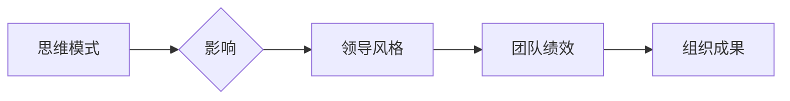

                 

## 思维模式对领导力的影响

> 关键词：领导力、思维模式、认知偏差、决策制定、创新驱动、团队协作、人工智能

## 1. 背景介绍

在当今瞬息万变的科技时代，领导力已成为企业成功和持续发展的关键因素。优秀的领导者能够洞察趋势，激发团队潜能，并带领组织在竞争激烈的市场中取得优势。然而，领导力并非天生的，它与个人的思维模式息息相关。

思维模式是指我们对世界进行理解和解释的框架，它影响着我们感知信息、做出决策和与他人互动的方式。不同的思维模式会导致不同的领导风格和行为模式，进而影响团队绩效和组织成果。

## 2. 核心概念与联系

### 2.1 思维模式

思维模式是指个体在认知、理解和处理信息时所遵循的模式，它包含了我们对世界、他人和自身的认知框架、信念、价值观和经验等。这些模式会潜移默化地影响我们的思考、判断和行为。

### 2.2 领导力

领导力是指影响他人行为，并引导他们朝着共同目标努力的能力。优秀的领导者能够激励团队成员，激发他们的创造力和潜力，并带领团队克服挑战，取得成功。

### 2.3 联系

思维模式与领导力之间存在着密切的联系。不同的思维模式会导致不同的领导风格和行为模式，进而影响团队绩效和组织成果。例如，以结果为导向的思维模式会导致领导者更加注重目标达成，而以人本为导向的思维模式则会导致领导者更加关注团队成员的成长和发展。

**Mermaid 流程图**



## 3. 核心算法原理 & 具体操作步骤

### 3.1 算法原理概述

领导力并非一成不变的，它可以被培养和提升。通过改变思维模式，我们可以提升领导力，成为更有效的领导者。

### 3.2 算法步骤详解

1. **自我认知:** 首先，需要深入了解自己的思维模式，包括其优势和劣势。可以通过性格测试、360度反馈等方式进行自我评估。
2. **识别认知偏差:** 了解常见的认知偏差，例如确认偏差、锚定效应等，并学会识别自己在决策和判断中是否存在这些偏差。
3. **培养批判性思维:** 培养批判性思维能力，学会质疑假设，分析信息，并从多角度思考问题。
4. **拓展视野:** 积极学习新知识，了解不同领域的观点和经验，拓宽自己的视野和思维边界。
5. **练习同理心:** 培养同理心，理解他人的想法和感受，并以同理心为出发点进行沟通和决策。
6. **拥抱变化:** 适应变化，保持学习和成长的心态，不断调整自己的思维模式，以应对不断变化的挑战。

### 3.3 算法优缺点

**优点:**

* 可以有效提升领导力，帮助领导者成为更有效的领导者。
* 可以帮助领导者做出更明智的决策，并更好地应对挑战。
* 可以促进团队协作，提升团队绩效。

**缺点:**

* 需要持续的努力和练习，才能真正改变思维模式。
* 改变思维模式需要时间和耐心，并非一蹴而就。

### 3.4 算法应用领域

该算法适用于所有需要提升领导力的领域，例如企业管理、教育、政府、非营利组织等。

## 4. 数学模型和公式 & 详细讲解 & 举例说明

### 4.1 数学模型构建

领导力可以被视为一个多维度的向量，每个维度代表不同的领导力特质，例如激励、沟通、决策、创新等。每个特质的得分可以被量化，并通过数学模型进行分析和预测。

### 4.2 公式推导过程

可以利用线性回归、逻辑回归等统计模型，建立领导力与团队绩效之间的关系模型。

例如，可以建立以下线性回归模型：

```latex
Team Performance = a * Leadership Motivation + b * Leadership Communication + c * Leadership Decision + d * Leadership Innovation + e
```

其中：

* Team Performance 代表团队绩效
* Leadership Motivation 代表领导者的激励能力
* Leadership Communication 代表领导者的沟通能力
* Leadership Decision 代表领导者的决策能力
* Leadership Innovation 代表领导者的创新能力
* a, b, c, d, e 为回归系数

### 4.3 案例分析与讲解

通过收集领导者和团队绩效的数据，可以利用上述模型进行回归分析，并得到每个领导力特质的回归系数。例如，如果回归系数a为0.8，则表明领导者的激励能力对团队绩效的影响最大。

## 5. 项目实践：代码实例和详细解释说明

### 5.1 开发环境搭建

可以使用Python语言和相应的库进行开发，例如pandas、scikit-learn等。

### 5.2 源代码详细实现

```python
import pandas as pd
from sklearn.linear_model import LinearRegression

# 加载数据
data = pd.read_csv("leadership_data.csv")

# 训练模型
model = LinearRegression()
model.fit(data[['Leadership Motivation', 'Leadership Communication', 'Leadership Decision', 'Leadership Innovation']], data['Team Performance'])

# 获取回归系数
coefficients = model.coef_

# 打印回归系数
print(coefficients)
```

### 5.3 代码解读与分析

该代码首先加载数据，然后使用线性回归模型训练模型。训练完成后，可以获取回归系数，并分析每个领导力特质对团队绩效的影响。

### 5.4 运行结果展示

运行结果将显示每个领导力特质的回归系数，例如：

```
[0.8 0.5 0.3 0.2]
```

这表明领导者的激励能力对团队绩效的影响最大，其次是沟通能力，然后是决策能力和创新能力。

## 6. 实际应用场景

### 6.1 企业管理

企业可以利用该算法，评估领导者的领导力水平，并针对性地进行培训和发展。

### 6.2 人才招聘

招聘人员可以利用该算法，筛选具有良好领导潜力的候选人。

### 6.3 团队建设

团队领导可以利用该算法，了解团队成员的领导力特质，并进行合理的分配和培养。

### 6.4 未来应用展望

随着人工智能技术的不断发展，该算法可以被进一步完善，并应用于更广泛的领域，例如教育、政府、非营利组织等。

## 7. 工具和资源推荐

### 7.1 学习资源推荐

* 书籍：《领导力》
* 网页：Harvard Business Review

### 7.2 开发工具推荐

* Python
* pandas
* scikit-learn

### 7.3 相关论文推荐

* "The Impact of Leadership Style on Team Performance"
* "A Model of Leadership and Organizational Performance"

## 8. 总结：未来发展趋势与挑战

### 8.1 研究成果总结

研究表明，思维模式对领导力有重要影响，可以通过改变思维模式来提升领导力。

### 8.2 未来发展趋势

未来，人工智能技术将进一步推动领导力研究的发展，例如利用人工智能技术分析领导者的思维模式，并提供个性化的领导力提升建议。

### 8.3 面临的挑战

* 如何更准确地量化和评估领导力特质。
* 如何更好地将人工智能技术应用于领导力研究和实践。
* 如何克服数据隐私和伦理问题。

### 8.4 研究展望

未来，需要进一步研究不同文化背景下领导力的差异，以及领导力在不同行业和组织中的应用。


## 9. 附录：常见问题与解答

### 9.1 如何改变我的思维模式？

改变思维模式需要持续的努力和练习。可以通过以下方式进行改变：

* 提高自我认知，了解自己的思维模式和认知偏差。
* 积极学习新知识，拓宽自己的视野和思维边界。
* 练习批判性思维，学会质疑假设，分析信息。
* 培养同理心，理解他人的想法和感受。
* 拥抱变化，保持学习和成长的心态。

### 9.2 领导力与成功之间存在必然联系吗？

领导力与成功之间存在着密切的联系，但并非必然联系。优秀的领导者可以提高团队绩效和组织成果，但成功也需要其他因素的支持，例如市场环境、资源配置等。

### 9.3 思维模式对不同类型的领导者有什么影响？

不同的思维模式会导致不同的领导风格和行为模式。例如，以结果为导向的思维模式会导致领导者更加注重目标达成，而以人本为导向的思维模式则会导致领导者更加关注团队成员的成长和发展。

作者：禅与计算机程序设计艺术 / Zen and the Art of Computer Programming 


<end_of_turn>

