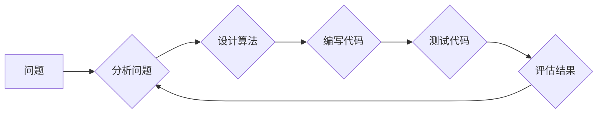

                 

## 思维的元认知：对自己思考过程的反思

> 关键词：元认知、思考过程、算法设计、编程思维、问题解决、学习策略、效率提升

### 1. 背景介绍

在当今科技飞速发展的时代，高效的思维和解决问题的能力显得尤为重要。作为程序员、软件架构师，我们每天都在面对各种各样的技术挑战，需要不断地思考、分析和解决问题。然而，许多人往往陷于思维的局限性，缺乏对自身思考过程的反思和提升。

元认知，顾名思义，就是对自身认知过程的认识。它涉及到我们对自己的学习策略、知识结构、思维模式等方面的理解和控制。元认知能力的培养可以帮助我们更好地理解自己的思维方式，识别思维的盲点，并制定更有效的学习和解决问题策略。

### 2. 核心概念与联系

元认知的核心概念包括：

* **自我监控：** 意识到自己的认知过程，例如：理解自己的学习目标、识别自己的知识盲点、评估自己的学习进度等。
* **计划与策略：** 根据任务需求和自身情况，制定合理的学习计划和策略，例如：选择合适的学习方法、分配学习时间、制定复习计划等。
* **评估与调整：** 持续评估学习效果，根据实际情况调整学习策略，例如：发现学习方法不适合，及时更换；遇到困难，寻求帮助等。

**元认知与编程思维的联系：**

元认知能力对于程序员来说尤为重要，因为它可以帮助我们更好地理解和解决编程问题。

* **问题分析：** 元认知可以帮助我们更深入地分析问题，识别问题的本质，并将其分解成更小的子问题。
* **算法设计：** 元认知可以帮助我们选择更合适的算法和数据结构，并进行算法的优化和改进。
* **代码调试：** 元认知可以帮助我们更有效地定位和解决代码中的错误，并进行代码的重构和优化。

**Mermaid 流程图：**



### 3. 核心算法原理 & 具体操作步骤

#### 3.1 算法原理概述

元认知算法的核心原理是通过对自身思考过程的记录和分析，来识别思维模式的局限性，并制定更有效的学习和解决问题策略。

#### 3.2 算法步骤详解

1. **记录思考过程：** 在学习或解决问题时，记录下自己的思考过程，包括：遇到的问题、思考的思路、使用的知识点、最终的解决方案等。
2. **分析思考过程：** 对记录的思考过程进行分析，识别自己的思维模式，例如：跳跃式思维、线性思维、联想思维等。
3. **识别思维盲点：** 分析思考过程，识别自己的思维盲点，例如：容易陷入局部，缺乏全局视野；容易被固有思维模式所限制等。
4. **制定学习策略：** 根据分析结果，制定更有效的学习策略，例如：针对思维盲点进行针对性的训练；尝试不同的学习方法；寻求他人帮助等。
5. **评估学习效果：** 持续评估学习效果，根据实际情况调整学习策略。

#### 3.3 算法优缺点

**优点：**

* 可以帮助我们更好地理解自己的思维方式，识别思维的盲点。
* 可以帮助我们制定更有效的学习和解决问题策略。
* 可以帮助我们提高学习效率和解决问题的能力。

**缺点：**

* 需要花费时间和精力记录和分析思考过程。
* 需要具备一定的自我反思能力和分析能力。

#### 3.4 算法应用领域

元认知算法可以应用于各个领域，例如：

* 教育领域：帮助学生提高学习效率和解决问题的能力。
* 医疗领域：帮助医生诊断疾病和制定治疗方案。
* 商业领域：帮助企业员工提高工作效率和解决问题的能力。

### 4. 数学模型和公式 & 详细讲解 & 举例说明

元认知过程可以抽象为一个数学模型，其中涉及到信息获取、信息处理和知识更新等环节。

#### 4.1 数学模型构建

我们可以用以下数学模型来描述元认知过程：

```
K(t+1) = f(K(t), I(t), S(t))
```

其中：

* K(t) 表示t时刻的知识状态。
* I(t) 表示t时刻获取的新信息。
* S(t) 表示t时刻使用的学习策略。
* f() 表示知识更新函数，它将知识状态、新信息和学习策略作为输入，输出更新后的知识状态。

#### 4.2 公式推导过程

知识更新函数f()可以根据不同的学习策略和信息处理方式进行设计。例如，如果使用基于规则的学习策略，则f()可以是一个规则匹配和应用的函数。如果使用基于案例的学习策略，则f()可以是一个案例相似度计算和知识迁移的函数。

#### 4.3 案例分析与讲解

假设一个学生学习编程，他需要学习一个新的算法。

* K(t) = 学生当前对算法的理解。
* I(t) = 学生学习到的算法的代码和解释。
* S(t) = 学生使用的学习策略，例如：阅读代码、运行代码、编写代码练习等。

通过学习新的算法代码和解释，学生可以更新自己的知识状态K(t+1)。

### 5. 项目实践：代码实例和详细解释说明

#### 5.1 开发环境搭建

为了演示元认知算法的应用，我们可以使用Python语言开发一个简单的元认知学习助手。

#### 5.2 源代码详细实现

```python
class MetacognitiveLearningAssistant:
    def __init__(self):
        self.knowledge_base = {}

    def record_thought_process(self, problem, solution):
        self.knowledge_base[problem] = solution

    def analyze_thought_process(self):
        # 分析思考过程，识别思维模式和盲点
        pass

    def suggest_learning_strategy(self):
        # 根据分析结果，建议学习策略
        pass

# 使用示例
assistant = MetacognitiveLearningAssistant()
assistant.record_thought_process("如何计算斐波那契数列", "使用递归算法")
assistant.analyze_thought_process()
assistant.suggest_learning_strategy()
```

#### 5.3 代码解读与分析

这个简单的代码示例展示了元认知学习助手的基本功能。

* `record_thought_process()` 方法用于记录用户的思考过程，包括问题和解决方案。
* `analyze_thought_process()` 方法用于分析记录的思考过程，识别思维模式和盲点。
* `suggest_learning_strategy()` 方法根据分析结果，建议用户采取更有效的学习策略。

#### 5.4 运行结果展示

运行这个代码示例，用户可以输入问题和解决方案，并根据分析结果获得学习建议。

### 6. 实际应用场景

元认知算法可以应用于各种实际场景，例如：

* **个性化学习平台：** 根据用户的学习情况和思维模式，提供个性化的学习内容和学习策略建议。
* **编程学习辅助工具：** 帮助程序员分析代码、识别错误、优化算法和提高编程效率。
* **问题解决训练平台：** 通过模拟真实场景的问题，帮助用户训练元认知能力，提高解决问题的能力。

### 6.4 未来应用展望

随着人工智能技术的不断发展，元认知算法的应用场景将会更加广泛。未来，元认知算法可以应用于：

* **自动生成学习计划：** 根据用户的学习目标和知识结构，自动生成个性化的学习计划。
* **智能辅导系统：** 提供智能化的学习辅导，帮助用户克服学习困难。
* **认知增强技术：** 通过元认知算法，帮助用户提升认知能力，例如记忆力、注意力、创造力等。

### 7. 工具和资源推荐

#### 7.1 学习资源推荐

* **书籍：**
    * 《Thinking, Fast and Slow》 by Daniel Kahneman
    * 《Metacognition: Knowing About Knowing》 by John Flavell
* **在线课程：**
    * Coursera: Metacognition and Learning
    * edX: Cognitive Science

#### 7.2 开发工具推荐

* **Python:** 
    * TensorFlow
    * PyTorch
* **自然语言处理工具:**
    * NLTK
    * spaCy

#### 7.3 相关论文推荐

* **Metacognitive Learning: A Review** by John Flavell
* **The Role of Metacognition in Learning and Instruction** by John Bransford

### 8. 总结：未来发展趋势与挑战

元认知算法作为一种新兴的学习和解决问题方法，具有巨大的潜力。未来，元认知算法将会在教育、医疗、商业等各个领域得到更广泛的应用。

#### 8.1 研究成果总结

* 元认知算法可以帮助我们更好地理解自己的思维方式，识别思维的盲点。
* 元认知算法可以帮助我们制定更有效的学习和解决问题策略。
* 元认知算法可以提高学习效率和解决问题的能力。

#### 8.2 未来发展趋势

* **更精准的思维模式识别：** 利用人工智能技术，更精准地识别用户的思维模式和盲点。
* **更个性化的学习策略建议：** 根据用户的学习情况和目标，提供更个性化的学习策略建议。
* **更智能化的学习辅导系统：** 开发更智能化的学习辅导系统，提供更有效的学习指导和帮助。

#### 8.3 面临的挑战

* **数据获取和分析：** 元认知算法需要大量的用户数据进行训练和分析，获取高质量的数据是一个挑战。
* **算法复杂度：** 元认知算法的复杂度较高，需要不断改进算法效率和准确性。
* **伦理问题：** 元认知算法涉及到用户的隐私和个人信息，需要解决伦理问题。

#### 8.4 研究展望

未来，元认知算法的研究将继续深入，探索更有效的学习和解决问题方法，并应用于更多领域，为人类社会带来更大的价值。

### 9. 附录：常见问题与解答

* **什么是元认知？** 元认知是指对自身认知过程的认识，包括对自己的学习策略、知识结构、思维模式等方面的理解和控制。
* **元认知算法有什么用？** 元认知算法可以帮助我们更好地理解自己的思维方式，识别思维的盲点，并制定更有效的学习和解决问题策略。
* **如何使用元认知算法？** 可以使用一些元认知学习助手工具，记录自己的思考过程，并根据分析结果获得学习建议。

作者：禅与计算机程序设计艺术 / Zen and the Art of Computer Programming


<end_of_turn>

