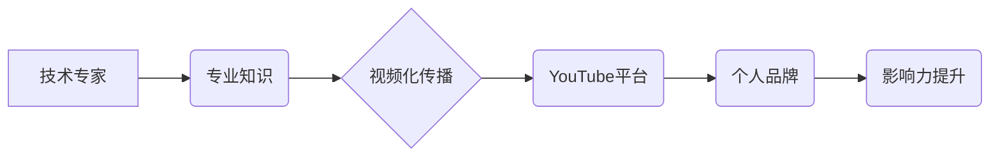

                 

## 打造个人YouTube频道：视频化传播你的专业知识

> 关键词：YouTube, 知识分享, 视频制作, 技术传播, 个人品牌, 编程, 软件开发,  在线教育

### 1. 背景介绍

在当今信息爆炸的时代，知识的传播和获取变得越来越便捷。作为一名技术专家，你积累了丰富的专业知识和经验，但如何将这些宝贵资源有效地传递给更多人，并建立个人品牌影响力，成为了一个重要的课题。传统的博客文章和技术文档虽然有效，但面对碎片化的信息时代，视频化传播方式逐渐成为主流趋势。YouTube作为全球最大的视频平台，为技术专家提供了绝佳的舞台，可以将你的专业知识以更生动、更直观的方式呈现给全球观众。

### 2. 核心概念与联系

**2.1  视频化知识传播的优势**

* **更易于理解和记忆:** 视频内容结合了文字、图像、声音等多种元素，能够更直观地传达信息，更容易被观众理解和记忆。
* **更具吸引力和互动性:** 相比于静态的文字内容，视频更具吸引力和趣味性，能够更好地抓住观众的注意力，并激发他们的互动。
* **更广泛的受众群体:** YouTube拥有庞大的用户群体，覆盖了全球各个年龄段和地域，可以帮助你触达更广泛的受众。
* **更有效的个人品牌建设:** 通过定期发布高质量的视频内容，你可以建立个人品牌形象，提升专业声誉，并吸引更多潜在客户或雇主。

**2.2  YouTube平台的特性**

* **海量用户:** YouTube拥有超过20亿月活跃用户，是全球最大的视频平台。
* **强大的搜索引擎:** YouTube拥有强大的搜索引擎，可以帮助你的视频被更多人发现。
* **丰富的创作工具:** YouTube提供丰富的创作工具，可以帮助你制作高质量的视频内容。
* **完善的社区生态:** YouTube拥有完善的社区生态，可以帮助你与其他创作者和观众互动交流。

**2.3  核心概念关系图**



### 3. 核心算法原理 & 具体操作步骤

**3.1  算法原理概述**

视频化知识传播的核心算法原理在于将复杂的专业知识分解成易于理解的片段，并通过视觉化、音频化等手段进行呈现。

**3.2  算法步骤详解**

1. **知识梳理:** 首先，你需要对自己的专业知识进行梳理，将复杂的知识点分解成一个个独立的主题，并确定每个主题的核心内容。
2. **脚本撰写:**  根据知识梳理的结果，撰写详细的视频脚本，包括视频开头、中间部分和结尾，以及每个知识点的讲解内容。
3. **画面设计:**  根据脚本内容，设计相应的画面素材，包括演示画面、图表、动画等，以增强视频的视觉效果。
4. **音频录制:**  录制清晰、流畅的音频讲解，并进行必要的后期处理，例如降噪、均衡等。
5. **视频剪辑:**  将画面素材和音频讲解进行剪辑，并添加必要的过渡效果和字幕，以提高视频的观赏性。
6. **视频优化:**  对视频进行必要的优化，例如调整分辨率、码率、标题、描述等，以提高视频的搜索排名和用户体验。
7. **发布与推广:** 将优化后的视频上传到YouTube平台，并进行必要的推广，例如分享到社交媒体、论坛等，以吸引更多观众观看。

**3.3  算法优缺点**

* **优点:** 视频化知识传播能够更直观、更生动地传达信息，更容易被观众理解和记忆，并具有更强的吸引力和互动性。
* **缺点:** 视频制作需要投入更多的时间和精力，需要一定的视频制作技巧和工具，以及对后期剪辑和优化等方面的了解。

**3.4  算法应用领域**

视频化知识传播适用于各个领域，例如技术培训、教育教学、产品演示、行业分析等。

### 4. 数学模型和公式 & 详细讲解 & 举例说明

**4.1  数学模型构建**

视频化知识传播可以抽象为一个信息传递模型，其中包括以下几个关键要素：

* **信息源:** 专业知识专家
* **信息载体:** 视频内容
* **信息接收者:** 观众
* **信息传递路径:** YouTube平台

**4.2  公式推导过程**

我们可以用以下公式来描述信息传递的效率：

```latex
效率 = 信息传递量 / 信息传递时间
```

其中：

* 信息传递量 = 观众理解和记忆的知识量
* 信息传递时间 = 观众观看视频的时间

**4.3  案例分析与讲解**

假设一位技术专家制作了一段关于编程基础知识的视频，视频时长为30分钟，观众观看后能够理解并记忆视频中的80%内容，那么该视频的效率可以计算为：

```latex
效率 = 0.8 / 0.5 = 1.6
```

这个结果表明，该视频的知识传递效率较高。

### 5. 项目实践：代码实例和详细解释说明

**5.1  开发环境搭建**

为了制作高质量的视频内容，你需要搭建一个合适的开发环境，包括以下几个方面：

* **电脑硬件:**  一台性能良好的电脑，配备足够的内存和存储空间。
* **视频录制设备:**  一台高清摄像头和麦克风，用于录制视频和音频。
* **视频编辑软件:**  一款专业的视频编辑软件，例如Adobe Premiere Pro、Final Cut Pro等。
* **屏幕录制软件:**  一款屏幕录制软件，用于录制演示画面。

**5.2  源代码详细实现**

由于视频制作涉及多个步骤和工具，无法用代码直接实现。

**5.3  代码解读与分析**

N/A

**5.4  运行结果展示**

N/A

### 6. 实际应用场景

**6.1  技术培训**

技术专家可以通过制作视频教程，将自己的专业知识传授给更多人，例如编程语言、软件开发、网络安全等。

**6.2  教育教学**

教师可以利用视频制作工具，将课堂内容进行录制和编辑，制作成更生动、更易于理解的教学视频，提高学生的学习兴趣和效果。

**6.3  产品演示**

企业可以制作产品演示视频，向潜在客户展示产品的功能和优势，提高产品的销售转化率。

**6.4  未来应用展望**

随着人工智能技术的不断发展，视频化知识传播将会更加智能化和个性化。例如，AI可以根据用户的学习进度和偏好，自动生成个性化的学习视频，并提供实时反馈和指导。

### 7. 工具和资源推荐

**7.1  学习资源推荐**

* **YouTube Creator Academy:**  YouTube官方提供的视频制作教程和资源平台。
* **Skillshare:**  提供各种视频制作课程和教程的在线学习平台。
* **Udemy:**  提供各种技术和创意领域的在线课程，包括视频制作课程。

**7.2  开发工具推荐**

* **Adobe Premiere Pro:**  专业的视频编辑软件，功能强大，操作灵活。
* **Final Cut Pro:**  苹果公司出品的视频编辑软件，界面简洁，操作方便。
* **DaVinci Resolve:**  功能强大的免费视频编辑软件，支持多平台使用。

**7.3  相关论文推荐**

* **The Impact of Video on Learning:**  研究了视频对学习效果的影响。
* **Video-Based Learning in Higher Education:**  探讨了高等教育中视频学习的应用。
* **The Future of Video in Education:**  展望了未来视频在教育中的发展趋势。

### 8. 总结：未来发展趋势与挑战

**8.1  研究成果总结**

视频化知识传播已经成为一种重要的知识传播方式，具有显著的优势，并得到了广泛的应用。

**8.2  未来发展趋势**

未来，视频化知识传播将会更加智能化、个性化和互动化。

* **智能化:**  AI技术将被广泛应用于视频制作、内容推荐和学习评估等环节，提高视频制作效率和学习效果。
* **个性化:**  根据用户的学习进度和偏好，生成个性化的学习视频，提供更精准的学习指导。
* **互动化:**  视频内容将更加注重互动，例如加入问答环节、实时评论等，提高用户的参与度和学习兴趣。

**8.3  面临的挑战**

* **内容质量:**  保证视频内容的质量和准确性，避免传播错误信息。
* **版权问题:**  尊重知识产权，避免侵犯他人版权。
* **平台竞争:**  面对众多视频平台的竞争，需要不断提升视频内容的吸引力和竞争力。

**8.4  研究展望**

未来，我们需要继续研究视频化知识传播的最佳实践，探索新的技术和方法，以更好地服务于知识传播和学习需求。

### 9. 附录：常见问题与解答

**9.1  如何提高视频的观看量？**

* **制作高质量的视频内容:**  内容是王道，只有制作出高质量、有价值的视频内容，才能吸引观众观看。
* **优化视频标题和描述:**  使用吸引人的标题和描述，并添加相关的关键词，以便更容易被搜索引擎发现。
* **推广视频到社交媒体:**  将视频分享到社交媒体平台，例如Facebook、Twitter、LinkedIn等，扩大视频的传播范围。
* **与其他创作者合作:**  与其他创作者进行合作，例如联合制作视频或互相宣传，可以帮助你触达更广泛的观众。

**9.2  如何处理视频版权问题？**

* **使用原创素材:**  尽量使用自己创作的素材，避免使用他人版权作品。
* **获得授权许可:**  如果需要使用他人的素材，请务必获得授权许可，并注明出处。
* **遵守版权协议:**  上传视频到YouTube平台时，请遵守平台的版权协议，避免侵犯他人版权。


作者：禅与计算机程序设计艺术 / Zen and the Art of Computer Programming 
<end_of_turn>

