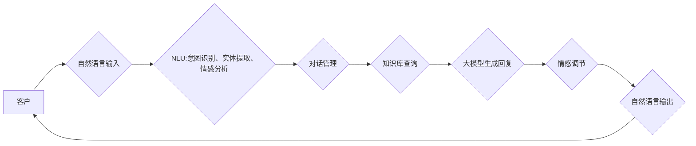

                 

## 探索基于大模型的电商智能客户服务情感调节系统

> 关键词：大模型、电商、智能客服、情感调节、自然语言处理、深度学习、Transformer

## 1. 背景介绍

随着电商行业的蓬勃发展，客户服务需求量不断增加，传统人工客服模式面临着效率低下、成本高昂等挑战。智能客服系统应运而生，利用人工智能技术，自动化处理客户咨询、解决问题，提高服务效率和客户满意度。

近年来，大模型技术取得了突破性进展，其强大的语言理解和生成能力为智能客服的升级提供了新的机遇。基于大模型的电商智能客服系统能够更精准地理解客户的情感，并提供更加个性化、人性化的服务体验。

## 2. 核心概念与联系

### 2.1  电商智能客服

电商智能客服是指利用人工智能技术，自动处理电商平台客户咨询、解决问题，提供个性化服务的一类系统。其核心功能包括：

* **自然语言理解 (NLU):**  理解客户的自然语言输入，识别意图、实体和情感。
* **对话管理:**  根据客户意图，引导对话流程，提供相关信息和解决方案。
* **知识库管理:**  存储电商平台相关知识，例如商品信息、订单查询、退换货政策等，为客服提供知识支持。
* **情感分析:**  识别客户的语气和情感，并根据情感进行相应的服务调整。

### 2.2  大模型

大模型是指在海量数据上训练的深度学习模型，拥有强大的泛化能力和语言理解能力。常见的电商智能客服大模型包括：

* **BERT:**  Bidirectional Encoder Representations from Transformers，用于理解上下文信息，提升文本理解能力。
* **GPT:**  Generative Pre-trained Transformer，能够生成流畅自然的文本，用于客服对话回复。
* **LaMDA:**  Language Model for Dialogue Applications，专门针对对话设计的模型，能够进行更自然、更人性化的对话。

### 2.3  情感调节

情感调节是指根据客户的情感状态，调整客服的语言风格和服务策略，以引导客户情绪，提升服务体验。

**核心架构图:**



## 3. 核心算法原理 & 具体操作步骤

### 3.1  算法原理概述

基于大模型的电商智能客服情感调节系统主要基于以下算法原理：

* **自然语言处理 (NLP):**  利用NLP技术，对客户的自然语言输入进行分析，识别意图、实体和情感。
* **深度学习:**  采用深度学习模型，例如BERT、GPT等，对文本进行语义理解和情感分析。
* **情感分类:**  利用机器学习算法，对客户的文本进行情感分类，识别其正面、负面或中性情绪。
* **对话策略:**  根据客户的情感状态，调整对话策略，提供相应的服务建议和解决方案。

### 3.2  算法步骤详解

1. **数据收集与预处理:**  收集电商平台客户服务数据，包括聊天记录、评价文本等，并进行清洗、标注和格式化处理。
2. **模型训练:**  利用深度学习模型，例如BERT，对预处理后的数据进行训练，学习文本语义和情感表达模式。
3. **情感分类模型构建:**  基于训练好的模型，构建情感分类模型，能够对客户文本进行情感分类，识别其情绪倾向。
4. **对话策略设计:**  根据情感分类结果，设计不同的对话策略，例如：
    * **正面情绪:**  提供积极的回复，表达感谢和认可。
    * **负面情绪:**  进行情感化安慰，积极解决客户问题，并提供补偿措施。
    * **中性情绪:**  提供客观的信息和建议，引导客户完成需求。
5. **系统部署与测试:**  将训练好的模型部署到电商平台，并进行测试和优化，不断提升系统性能和服务质量。

### 3.3  算法优缺点

**优点:**

* **精准情感识别:**  基于大模型的算法能够更精准地识别客户的情感，理解其真实需求。
* **个性化服务:**  根据客户的情感状态，提供个性化的服务建议和解决方案，提升客户满意度。
* **自动化处理:**  能够自动化处理大量客户咨询，提高服务效率，降低人工成本。

**缺点:**

* **数据依赖:**  大模型训练需要海量数据，数据质量直接影响模型性能。
* **计算资源:**  训练和部署大模型需要大量的计算资源，成本较高。
* **伦理风险:**  情感调节算法可能存在偏差和误判，需要谨慎设计和使用，避免造成负面影响。

### 3.4  算法应用领域

* **电商客服:**  提供个性化、情感化的客户服务体验。
* **金融服务:**  识别客户情绪，提供精准的金融建议和服务。
* **医疗保健:**  辅助医生理解患者情绪，提供更有效的医疗服务。
* **教育培训:**  根据学生情绪，提供个性化的学习建议和辅导。

## 4. 数学模型和公式 & 详细讲解 & 举例说明

### 4.1  数学模型构建

情感分析模型通常基于深度学习框架，例如TensorFlow或PyTorch。常用的模型架构包括：

* **Recurrent Neural Networks (RNN):**  RNN能够处理序列数据，例如文本，并捕捉文本中的上下文信息。
* **Convolutional Neural Networks (CNN):**  CNN擅长提取文本中的特征，例如词语和短语。
* **Transformer:**  Transformer是一种新型的深度学习架构，能够更有效地处理长文本序列，并具有强大的语言理解能力。

### 4.2  公式推导过程

由于篇幅限制，此处不详细推导情感分析模型的数学公式。但可以概括为以下步骤：

1. **词嵌入:** 将文本中的词语映射到低维向量空间，例如Word2Vec或GloVe。
2. **特征提取:**  利用RNN、CNN或Transformer等模型，提取文本的语义特征。
3. **情感分类:**  利用全连接层或softmax函数，将提取的特征映射到情感类别，例如正面、负面或中性。

### 4.3  案例分析与讲解

假设我们训练了一个情感分析模型，能够识别文本的情感类别。

**输入文本:**  “这个产品太棒了，非常满意！”

**模型输出:**  正面

**解释:**  模型根据文本中的词语“太棒了”、“非常满意”等，判断其情感类别为正面。

## 5. 项目实践：代码实例和详细解释说明

### 5.1  开发环境搭建

* **操作系统:**  Linux或Windows
* **编程语言:**  Python
* **深度学习框架:**  TensorFlow或PyTorch
* **其他工具:**  Git、Jupyter Notebook

### 5.2  源代码详细实现

由于篇幅限制，此处仅提供代码框架，具体实现细节请参考相关开源项目或文档。

```python
# 导入必要的库
import tensorflow as tf

# 定义情感分类模型
model = tf.keras.models.Sequential([
    tf.keras.layers.Embedding(input_dim=vocab_size, output_dim=embedding_dim),
    tf.keras.layers.LSTM(units=128),
    tf.keras.layers.Dense(units=3, activation='softmax')
])

# 编译模型
model.compile(optimizer='adam',
              loss='sparse_categorical_crossentropy',
              metrics=['accuracy'])

# 训练模型
model.fit(x_train, y_train, epochs=10)

# 评估模型
loss, accuracy = model.evaluate(x_test, y_test)
print('Loss:', loss)
print('Accuracy:', accuracy)

# 使用模型进行预测
predictions = model.predict(new_text)
```

### 5.3  代码解读与分析

* **词嵌入:**  将文本中的词语映射到低维向量空间，例如Word2Vec或GloVe。
* **LSTM:**  利用LSTM网络捕捉文本中的上下文信息。
* **全连接层:**  将提取的特征映射到情感类别。
* **softmax函数:**  将输出结果转换为概率分布，表示每个情感类别的置信度。

### 5.4  运行结果展示

训练完成后，可以利用模型对新的文本进行情感分类，并展示预测结果。

## 6. 实际应用场景

### 6.1  电商平台客服

* **自动回复常见问题:**  例如退换货、物流查询等，提高客服效率。
* **情感分析与个性化服务:**  根据客户情绪，提供相应的服务建议和解决方案，提升客户满意度。
* **实时监控客户情绪:**  及时发现客户负面情绪，并采取措施进行引导和解决。

### 6.2  社交媒体客服

* **自动回复用户评论:**  例如感谢、回复问题等，提高服务效率。
* **识别用户情绪:**  了解用户对产品的评价和反馈，及时改进产品和服务。
* **引导用户行为:**  根据用户情绪，引导用户进行购买、分享等行为。

### 6.3  金融服务客服

* **识别客户情绪:**  了解客户对金融产品的需求和风险偏好，提供个性化的金融建议。
* **自动处理客户咨询:**  例如账户查询、交易记录等，提高客服效率。
* **风险预警:**  识别客户情绪异常，及时进行风险预警和处理。

### 6.4  未来应用展望

随着大模型技术的不断发展，基于大模型的电商智能客服情感调节系统将拥有更强大的功能和更广泛的应用场景，例如：

* **多模态情感分析:**  结合文本、语音、图像等多模态数据，更精准地识别客户情绪。
* **个性化对话体验:**  根据客户的个人喜好和需求，提供更加个性化的对话体验。
* **跨语言支持:**  支持多种语言，为全球客户提供服务。

## 7. 工具和资源推荐

### 7.1  学习资源推荐

* **书籍:**
    * 《深度学习》 - Ian Goodfellow, Yoshua Bengio, Aaron Courville
    * 《自然语言处理入门》 - Jacob Eisenstein
* **在线课程:**
    * Coursera: 深度学习 Specialization
    * Udacity: 自然语言处理 Nanodegree
* **开源项目:**
    * Hugging Face Transformers: https://huggingface.co/transformers/
    * TensorFlow: https://www.tensorflow.org/
    * PyTorch: https://pytorch.org/

### 7.2  开发工具推荐

* **Jupyter Notebook:**  用于代码编写、实验和可视化。
* **Git:**  用于代码版本控制和协作。
* **TensorBoard:**  用于可视化训练过程和模型结构。

### 7.3  相关论文推荐

* **BERT: Pre-training of Deep Bidirectional Transformers for Language Understanding**
* **GPT: Generative Pre-trained Transformer**
* **LaMDA: Language Model for Dialogue Applications**

## 8. 总结：未来发展趋势与挑战

### 8.1  研究成果总结

基于大模型的电商智能客服情感调节系统取得了显著的进展，能够更精准地识别客户情绪，提供更加个性化和人性化的服务体验。

### 8.2  未来发展趋势

* **多模态情感分析:**  结合文本、语音、图像等多模态数据，提升情感分析的准确性和鲁棒性。
* **个性化对话体验:**  根据客户的个人喜好和需求，提供更加个性化的对话体验。
* **跨语言支持:**  支持多种语言，为全球客户提供服务。
* **伦理与安全:**  加强对情感调节算法的伦理和安全评估，避免造成负面影响。

### 8.3  面临的挑战

* **数据质量:**  大模型训练需要海量高质量数据，数据标注和清洗工作量大。
* **计算资源:**  训练和部署大模型需要大量的计算资源，成本较高。
* **模型解释性:**  大模型的决策过程难以解释，需要开发更可解释的模型。
* **伦理风险:**  情感调节算法可能存在偏差和误判，需要谨慎设计和使用。

### 8.4  研究展望

未来，基于大模型的电商智能客服情感调节系统将朝着更加智能、个性化、安全的方向发展，为电商行业和客户提供更优质的服务体验。


## 9. 附录：常见问题与解答

### 9.1  Q1: 如何选择合适的深度学习模型？

**A1:**  选择合适的深度学习模型取决于具体应用场景和数据特点。

* **文本长度较短:**  可以使用CNN模型。
* **文本长度较长:**  可以使用RNN或Transformer模型。

### 9.2  Q2: 如何处理情感分类模型的偏差？

**A2:**  可以通过以下方法处理情感分类模型的偏差：

* **使用更均衡的数据集:**  确保训练数据中不同情感类别的样本数量均衡。
* **使用正则化技术:**  例如Dropout或L2正则化，防止模型过拟合。
* **进行公平性评估:**  评估模型在不同群体上的性能，并采取措施减少偏差。

### 9.3  Q3: 如何保证情感调节系统的安全性和隐私性？

**A3:**  可以通过以下方法保证情感调节系统的安全性和隐私性：

* **数据加密:**  对客户数据进行加密，防止数据泄露。
* **匿名化处理:**  对客户数据进行匿名化处理，保护客户隐私。
* **安全审计:**  定期进行安全审计，发现和修复安全漏洞。


作者：禅与计算机程序设计艺术 / Zen and the Art of Computer Programming 
<end_of_turn>

