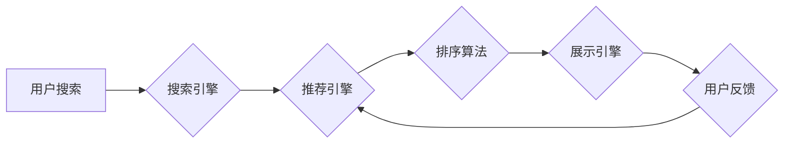

                 

## 1. 背景介绍

在当今数据爆炸的时代，电商平台面临着激烈的竞争。用户在海量商品中寻找所需产品，效率和精准度成为关键。搜索推荐系统作为电商平台的核心功能之一，直接影响着用户体验和商业转化率。传统搜索推荐系统主要依赖于基于规则和特征工程的方法，但随着用户行为的复杂化和商品信息的爆炸式增长，这些方法逐渐难以满足需求。

近年来，人工智能（AI）技术蓬勃发展，特别是大模型的出现，为搜索推荐系统的升级带来了新的机遇。大模型具备强大的学习能力和泛化能力，能够从海量数据中学习用户偏好、商品特征和潜在关系，从而提供更精准、个性化的推荐结果。

## 2. 核心概念与联系

### 2.1 搜索推荐系统

搜索推荐系统旨在根据用户的搜索意图和历史行为，推荐相关商品或信息。它通常由以下几个模块组成：

* **搜索引擎:** 处理用户搜索词，并返回相关商品列表。
* **推荐引擎:** 基于用户画像、商品信息和交互数据，推荐个性化商品列表。
* **排序算法:** 对推荐结果进行排序，将最相关的商品排在前面。
* **展示引擎:** 将排序后的结果以用户友好的方式展示给用户。

### 2.2 大模型

大模型是指参数量巨大的人工智能模型，通常拥有数十亿甚至数千亿个参数。它们通过大量的训练数据学习复杂的模式和关系，能够在自然语言处理、图像识别、语音合成等多个领域展现出强大的能力。

### 2.3 AI 大模型融合

AI 大模型融合是指将大模型技术应用于搜索推荐系统，以提升推荐效果和用户体验。具体来说，大模型可以用于以下方面：

* **用户画像构建:** 利用大模型分析用户的搜索历史、浏览记录、购买行为等数据，构建更精准的用户画像。
* **商品特征提取:** 利用大模型提取商品的文本描述、图片信息等特征，构建更丰富的商品表示。
* **推荐模型训练:** 利用大模型训练更强大的推荐模型，例如基于Transformer的推荐模型，能够更好地捕捉用户和商品之间的复杂关系。

**Mermaid 流程图**



## 3. 核心算法原理 & 具体操作步骤

### 3.1 算法原理概述

大模型融合的搜索推荐系统通常基于深度学习算法，例如Transformer模型。Transformer模型通过自注意力机制能够捕捉用户和商品之间的长距离依赖关系，从而实现更精准的推荐。

### 3.2 算法步骤详解

1. **数据预处理:** 收集用户搜索历史、浏览记录、购买行为等数据，以及商品信息、文本描述、图片等数据。对数据进行清洗、转换和编码，使其适合大模型训练。
2. **模型训练:** 利用大模型训练推荐模型，例如BERT、GPT或其变体。训练过程中，模型会学习用户和商品之间的关系，并生成推荐结果。
3. **模型评估:** 使用测试数据评估模型的性能，例如准确率、召回率和NDCG指标。根据评估结果，调整模型参数和训练策略，不断优化模型性能。
4. **线上部署:** 将训练好的模型部署到线上环境，实时为用户提供个性化推荐结果。

### 3.3 算法优缺点

**优点:**

* **精准度提升:** 大模型能够捕捉用户和商品之间的复杂关系，从而提供更精准的推荐结果。
* **个性化推荐:** 大模型可以根据用户的历史行为和偏好，提供个性化的推荐，提升用户体验。
* **泛化能力强:** 大模型经过海量数据的训练，具有较强的泛化能力，能够适应不同的用户群体和商品类型。

**缺点:**

* **训练成本高:** 大模型训练需要大量的计算资源和时间，成本较高。
* **数据依赖性强:** 大模型的性能依赖于训练数据的质量和数量，数据不足或质量低劣会导致模型性能下降。
* **解释性差:** 大模型的决策过程较为复杂，难以解释其推荐结果背后的逻辑，这可能导致用户对推荐结果的信任度降低。

### 3.4 算法应用领域

大模型融合的搜索推荐系统广泛应用于电商平台、社交媒体、内容平台等领域，例如：

* **商品推荐:** 根据用户的搜索历史、浏览记录和购买行为，推荐相关的商品。
* **内容推荐:** 根据用户的阅读历史、点赞记录和关注内容，推荐相关的文章、视频和音频。
* **广告推荐:** 根据用户的兴趣爱好和行为特征，推荐相关的广告。

## 4. 数学模型和公式 & 详细讲解 & 举例说明

### 4.1 数学模型构建

大模型融合的搜索推荐系统通常基于深度学习模型，例如Transformer模型。Transformer模型的核心是自注意力机制，它能够捕捉用户和商品之间的长距离依赖关系。

**自注意力机制**

自注意力机制可以计算每个词与所有其他词之间的相关性，并根据相关性赋予每个词不同的权重。公式如下：

$$
Attention(Q, K, V) = softmax(\frac{QK^T}{\sqrt{d_k}})V
$$

其中：

* $Q$：查询矩阵
* $K$：键矩阵
* $V$：值矩阵
* $d_k$：键向量的维度
* $softmax$：softmax函数

**举例说明:**

假设我们有一个句子“我喜欢吃苹果”，我们想要计算“吃”这个词与所有其他词之间的相关性。

* $Q$：将“吃”这个词转换为查询向量。
* $K$：将所有词转换为键向量。
* $V$：将所有词转换为值向量。

通过计算 $QK^T$，我们可以得到每个词与“吃”的相似度得分。然后，使用 softmax 函数将得分归一化，得到每个词与“吃”的相关性权重。最后，将权重与值向量相乘，得到“吃”这个词的上下文表示。

### 4.2 公式推导过程

自注意力机制的公式推导过程较为复杂，涉及到线性变换、矩阵乘法和 softmax 函数等操作。详细推导过程可以参考相关文献，例如 “Attention Is All You Need”。

### 4.3 案例分析与讲解

在电商平台的商品推荐场景中，我们可以使用自注意力机制来捕捉用户和商品之间的关系。例如，我们可以将用户的搜索历史、浏览记录和购买行为作为查询向量，将商品的文本描述、图片信息和类别标签作为键向量和值向量。通过计算自注意力机制，我们可以得到每个商品与用户之间的相关性得分，并根据得分进行排序，推荐给用户相关的商品。

## 5. 项目实践：代码实例和详细解释说明

### 5.1 开发环境搭建

* **操作系统:** Linux 或 macOS
* **编程语言:** Python
* **深度学习框架:** TensorFlow 或 PyTorch
* **其他工具:** Git、Jupyter Notebook

### 5.2 源代码详细实现

以下是一个使用 TensorFlow 实现基于 Transformer 模型的商品推荐系统的代码示例：

```python
import tensorflow as tf

# 定义 Transformer 模型
class Transformer(tf.keras.Model):
    def __init__(self, vocab_size, embedding_dim, num_heads, num_layers):
        super(Transformer, self).__init__()
        self.embedding = tf.keras.layers.Embedding(vocab_size, embedding_dim)
        self.transformer_layers = tf.keras.layers.StackedRNNCells([
            tf.keras.layers.MultiHeadAttention(num_heads=num_heads, key_dim=embedding_dim)
            for _ in range(num_layers)
        ])

    def call(self, inputs):
        embedded = self.embedding(inputs)
        output = self.transformer_layers(embedded)
        return output

# 训练模型
model = Transformer(vocab_size=10000, embedding_dim=128, num_heads=8, num_layers=6)
model.compile(optimizer='adam', loss='mse')
model.fit(train_data, train_labels, epochs=10)

# 预测结果
predictions = model.predict(test_data)
```

### 5.3 代码解读与分析

* **模型定义:** 代码定义了一个名为 Transformer 的模型类，它包含嵌入层、多头注意力层和堆叠的 RNN 层。
* **数据预处理:** 需要将用户搜索历史、浏览记录和购买行为等数据转换为数字向量，并进行编码。
* **模型训练:** 使用 Adam 优化器和均方误差损失函数训练模型。
* **预测结果:** 使用训练好的模型预测用户对商品的兴趣评分。

### 5.4 运行结果展示

训练完成后，可以使用测试数据评估模型的性能，例如准确率、召回率和NDCG指标。

## 6. 实际应用场景

### 6.1 电商平台商品推荐

大模型融合的搜索推荐系统可以帮助电商平台提供更精准、个性化的商品推荐，提升用户体验和转化率。例如，淘宝、京东等电商平台都已将大模型技术应用于商品推荐系统。

### 6.2 内容平台内容推荐

大模型可以分析用户的阅读历史、点赞记录和关注内容，推荐相关的文章、视频和音频，提升用户粘性和内容消费量。例如，知乎、今日头条等内容平台都已将大模型技术应用于内容推荐系统。

### 6.3 社交媒体内容推荐

大模型可以分析用户的社交行为、兴趣爱好和好友关系，推荐相关的用户、话题和内容，提升用户互动和社交体验。例如，微博、微信朋友圈等社交媒体平台都已将大模型技术应用于内容推荐系统。

### 6.4 未来应用展望

随着大模型技术的不断发展，其在搜索推荐系统中的应用场景将更加广泛，例如：

* **跨平台推荐:** 将用户在不同平台的交互数据整合，提供更全面的用户画像和个性化推荐。
* **多模态推荐:** 将文本、图片、视频等多模态数据融合，提供更丰富的推荐结果。
* **实时推荐:** 利用实时数据流，提供更及时、更精准的推荐。

## 7. 工具和资源推荐

### 7.1 学习资源推荐

* **书籍:**
    * “深度学习” by Ian Goodfellow, Yoshua Bengio, and Aaron Courville
    * “自然语言处理” by Dan Jurafsky and James H. Martin
* **在线课程:**
    * Coursera: Deep Learning Specialization
    * Stanford CS224N: Natural Language Processing with Deep Learning
* **博客和网站:**
    * TensorFlow Blog: https://blog.tensorflow.org/
    * PyTorch Blog: https://pytorch.org/blog/

### 7.2 开发工具推荐

* **深度学习框架:** TensorFlow, PyTorch
* **数据处理工具:** Pandas, NumPy
* **代码编辑器:** VS Code, Sublime Text
* **云计算平台:** AWS, Google Cloud, Azure

### 7.3 相关论文推荐

* “Attention Is All You Need”
* “BERT: Pre-training of Deep Bidirectional Transformers for Language Understanding”
* “GPT-3: Language Models are Few-Shot Learners”

## 8. 总结：未来发展趋势与挑战

### 8.1 研究成果总结

大模型融合的搜索推荐系统取得了显著的成果，能够提供更精准、个性化的推荐结果，提升用户体验和商业转化率。

### 8.2 未来发展趋势

* **模型规模和能力提升:** 大模型的规模和能力将继续提升，能够处理更复杂的数据和任务。
* **多模态融合:** 将文本、图片、视频等多模态数据融合，提供更丰富的推荐结果。
* **个性化定制:** 根据用户的个性化需求，定制更精准的推荐策略。
* **可解释性增强:** 提高大模型的解释性，帮助用户理解推荐结果背后的逻辑。

### 8.3 面临的挑战

* **数据质量和隐私:** 大模型训练需要海量数据，数据质量和隐私保护是关键挑战。
* **计算资源和成本:** 大模型训练需要大量的计算资源和时间，成本较高。
* **模型安全和可控性:** 大模型的决策过程较为复杂，需要确保模型安全和可控性。

### 8.4 研究展望

未来，大模型融合的搜索推荐系统将朝着更智能、更个性化、更安全的方向发展。研究者将继续探索大模型的潜力，开发更强大的模型和算法，解决当前面临的挑战，为用户提供更优质的体验。

## 9. 附录：常见问题与解答

* **Q: 大模型训练需要多少数据？**

A: 大模型训练需要海量数据，通常需要数十亿甚至数千亿个数据点。

* **Q: 大模型训练需要多少计算资源？**

A: 大模型训练需要大量的计算资源，通常需要数百甚至数千个GPU。

* **Q: 如何评估大模型的性能？**

A: 大模型的性能可以评估指标，例如准确率、召回率和NDCG指标。

* **Q: 如何确保大模型的安全性和可控性？**

A: 确保大模型的安全性和可控性需要从多个方面入手，例如模型设计、数据安全、算法审核等。


作者：禅与计算机程序设计艺术 / Zen and the Art of Computer Programming<end_of_turn>

