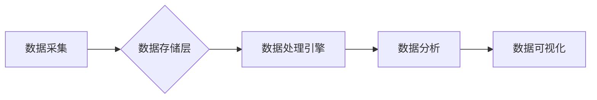

                 

## 数据湖架构：统一数据管理平台

> 关键词：数据湖，数据仓库，数据管理，数据架构，大数据，云计算，数据分析

### 1. 背景介绍

随着数字化转型加速推进，企业面临着海量数据爆炸式增长和多样化挑战。传统数据仓库架构难以应对这种快速变化的数据场景，其结构化、预定义的模式难以处理半结构化和非结构化数据。为了更好地应对数据管理的挑战，数据湖架构应运而生。

数据湖是一种新型的数据存储架构，它以其弹性、可扩展性和对多种数据类型的支持，成为企业数据管理的热门选择。数据湖的核心思想是将所有类型的数据，无论其结构化、半结构化还是非结构化，都存储在一个统一的存储层中，并通过数据治理和元数据管理来确保数据的质量和可信度。

### 2. 核心概念与联系

#### 2.1 数据湖的核心概念

* **数据存储层:** 数据湖的核心是统一的存储层，通常采用分布式文件系统，如HDFS、S3等，以提供高容量、高吞吐量和高可用性。
* **数据治理:** 数据湖需要建立完善的数据治理体系，包括数据质量管理、数据安全管理、数据访问控制等，以确保数据的准确性、完整性和安全性。
* **元数据管理:** 元数据是数据湖中数据的描述信息，包括数据类型、数据格式、数据来源等。元数据管理系统可以帮助用户理解和查找数据，并提高数据利用效率。
* **数据处理引擎:** 数据湖通常与数据处理引擎，如Spark、Hadoop等，集成在一起，以实现对数据的分析和处理。

#### 2.2 数据湖与数据仓库的关系

数据湖和数据仓库都是用于存储和管理数据的系统，但它们在架构、功能和应用场景上存在一些差异。

* **数据仓库:** 
    * 结构化数据存储
    * 预定义的结构和模式
    * 侧重于历史数据分析
    * 数据质量要求高
* **数据湖:**
    * 支持多种数据类型
    * 灵活的架构，可根据需求进行调整
    * 侧重于实时数据分析和机器学习
    * 数据质量管理更加灵活

#### 2.3 数据湖架构流程图



### 3. 核心算法原理 & 具体操作步骤

#### 3.1 算法原理概述

数据湖架构的核心算法原理主要包括数据分层、数据压缩、数据加密、数据索引等。

* **数据分层:** 将数据按照类型、时间、重要度等维度进行分层存储，提高数据访问效率。
* **数据压缩:** 使用压缩算法对数据进行压缩，节省存储空间。
* **数据加密:** 使用加密算法对数据进行加密，保障数据安全。
* **数据索引:** 建立数据索引，提高数据查询效率。

#### 3.2 算法步骤详解

1. **数据采集:** 从各种数据源收集数据，包括结构化数据、半结构化数据和非结构化数据。
2. **数据清洗:** 对采集到的数据进行清洗，去除重复数据、错误数据和无效数据。
3. **数据转换:** 将数据转换为统一的数据格式，以便于存储和处理。
4. **数据分层:** 将数据按照类型、时间、重要度等维度进行分层存储。
5. **数据压缩:** 使用压缩算法对数据进行压缩，节省存储空间。
6. **数据加密:** 使用加密算法对数据进行加密，保障数据安全。
7. **数据索引:** 建立数据索引，提高数据查询效率。
8. **数据分析:** 使用数据处理引擎对数据进行分析，提取有价值的信息。
9. **数据可视化:** 将分析结果可视化，方便用户理解和决策。

#### 3.3 算法优缺点

**优点:**

* **弹性:** 数据湖可以根据需求灵活扩展存储容量和处理能力。
* **可扩展性:** 数据湖可以轻松地处理海量数据。
* **数据类型支持:** 数据湖可以存储多种数据类型，包括结构化、半结构化和非结构化数据。
* **成本效益:** 数据湖的存储成本相对较低。

**缺点:**

* **数据治理:** 数据湖需要建立完善的数据治理体系，以确保数据的质量和可信度。
* **数据安全:** 数据湖需要采取相应的安全措施，保障数据的安全。
* **数据查询:** 对非结构化数据进行查询需要使用特定的工具和技术。

#### 3.4 算法应用领域

数据湖架构广泛应用于以下领域:

* **金融:** 风险管理、欺诈检测、客户分析
* **电商:** 商品推荐、用户画像、营销分析
* **医疗:** 疾病诊断、药物研发、患者管理
* **互联网:** 内容推荐、用户行为分析、广告投放

### 4. 数学模型和公式 & 详细讲解 & 举例说明

#### 4.1 数学模型构建

数据湖架构的构建可以抽象为一个图论模型，其中节点代表数据源、数据存储层、数据处理引擎等组件，边代表数据流向。

#### 4.2 公式推导过程

数据湖的存储成本可以根据以下公式计算:

```latex
存储成本 = 数据量 * 存储成本/GB
```

其中，数据量是指存储在数据湖中的数据大小，存储成本/GB是指每GB数据的存储成本。

#### 4.3 案例分析与讲解

假设一家电商公司需要存储100TB的商品数据，每GB的存储成本为0.01美元，那么该公司的存储成本为:

```latex
存储成本 = 100TB * 1024GB/TB * 0.01美元/GB = 10240美元
```

### 5. 项目实践：代码实例和详细解释说明

#### 5.1 开发环境搭建

数据湖的开发环境通常包括以下组件:

* **分布式文件系统:** HDFS、S3等
* **数据处理引擎:** Spark、Hadoop等
* **元数据管理系统:** Hive Metastore、Apache Atlas等
* **数据治理工具:** Apache Ranger、Data Catalog等

#### 5.2 源代码详细实现

以下是一个使用Spark进行数据湖数据处理的简单代码示例:

```python
from pyspark.sql import SparkSession

# 创建SparkSession
spark = SparkSession.builder.appName("DataLakeExample").getOrCreate()

# 读取数据
df = spark.read.parquet("data/path/to/data.parquet")

# 数据处理
df = df.filter(df.column1 > 10)

# 保存数据
df.write.parquet("data/path/to/output.parquet")

# 关闭SparkSession
spark.stop()
```

#### 5.3 代码解读与分析

这段代码首先创建了一个SparkSession，然后读取了名为"data.parquet"的Parquet文件。接着，代码过滤了column1大于10的数据，最后将处理后的数据保存到名为"output.parquet"的Parquet文件中。

#### 5.4 运行结果展示

运行这段代码后，将生成一个名为"output.parquet"的Parquet文件，其中包含了过滤后的数据。

### 6. 实际应用场景

#### 6.1 金融领域

* **风险管理:** 数据湖可以存储和分析海量金融数据，帮助金融机构识别和管理风险。
* **欺诈检测:** 数据湖可以用于检测金融欺诈行为，例如信用卡欺诈、网络钓鱼等。
* **客户分析:** 数据湖可以帮助金融机构了解客户行为和偏好，提供个性化的金融服务。

#### 6.2 电商领域

* **商品推荐:** 数据湖可以分析用户购买历史和浏览记录，推荐个性化的商品。
* **用户画像:** 数据湖可以构建用户画像，帮助电商平台了解用户的需求和行为。
* **营销分析:** 数据湖可以分析营销活动的效果，优化营销策略。

#### 6.3 医疗领域

* **疾病诊断:** 数据湖可以存储和分析患者的医疗记录，帮助医生进行疾病诊断。
* **药物研发:** 数据湖可以用于分析药物的疗效和安全性，加速药物研发。
* **患者管理:** 数据湖可以帮助医院管理患者信息，提高医疗服务效率。

#### 6.4 未来应用展望

随着人工智能、机器学习等技术的不断发展，数据湖的应用场景将更加广泛。未来，数据湖将被用于更复杂的分析任务，例如预测分析、个性化推荐等。

### 7. 工具和资源推荐

#### 7.1 学习资源推荐

* **书籍:**
    * "Data Lake Design Patterns" by  Nathan Marz
    * "Building Data Lakes" by  Michael J. Hernandez
* **在线课程:**
    * Coursera: "Data Engineering with Apache Spark"
    * Udemy: "Data Lake Architecture and Implementation"

#### 7.2 开发工具推荐

* **分布式文件系统:** HDFS、S3
* **数据处理引擎:** Spark、Hadoop
* **元数据管理系统:** Hive Metastore、Apache Atlas
* **数据治理工具:** Apache Ranger、Data Catalog

#### 7.3 相关论文推荐

* "Data Lake Architecture: A Survey" by  A. K. Singh et al.
* "Data Lake Design Patterns" by  Nathan Marz

### 8. 总结：未来发展趋势与挑战

#### 8.1 研究成果总结

数据湖架构已经成为企业数据管理的重要趋势，它为企业提供了灵活、可扩展和成本效益的数据存储和处理方案。

#### 8.2 未来发展趋势

* **云原生数据湖:** 数据湖将更加紧密地与云计算平台集成，提供更弹性和可扩展的解决方案。
* **实时数据湖:** 数据湖将支持实时数据处理和分析，满足企业对实时决策的需求。
* **人工智能驱动的数据湖:** 数据湖将与人工智能技术结合，实现自动数据分类、数据质量管理和数据分析。

#### 8.3 面临的挑战

* **数据治理:** 数据湖需要建立完善的数据治理体系，以确保数据的质量和可信度。
* **数据安全:** 数据湖需要采取相应的安全措施，保障数据的安全。
* **数据查询:** 对非结构化数据进行查询需要使用特定的工具和技术。

#### 8.4 研究展望

未来，数据湖架构的研究将更加关注以下方面:

* **数据治理和安全:** 开发更有效的解决方案来管理和保护数据湖中的数据。
* **实时数据处理:** 提高数据湖对实时数据的处理能力。
* **人工智能应用:** 将人工智能技术应用于数据湖，实现更智能的数据分析和决策。

### 9. 附录：常见问题与解答

#### 9.1 数据湖与数据仓库的区别是什么？

数据湖和数据仓库都是用于存储和管理数据的系统，但它们在架构、功能和应用场景上存在一些差异。数据仓库是结构化数据存储，预定义的结构和模式，侧重于历史数据分析。数据湖支持多种数据类型，灵活的架构，侧重于实时数据分析和机器学习。

#### 9.2 数据湖的存储成本如何计算？

数据湖的存储成本可以根据以下公式计算:

```latex
存储成本 = 数据量 * 存储成本/GB
```

其中，数据量是指存储在数据湖中的数据大小，存储成本/GB是指每GB数据的存储成本。

#### 9.3 如何选择合适的分布式文件系统？

选择合适的分布式文件系统需要考虑以下因素:

* **数据量:** 不同的文件系统支持不同的数据量。
* **数据访问模式:** 不同的文件系统支持不同的数据访问模式。
* **成本:** 不同的文件系统有不同的成本。

#### 9.4 如何保证数据湖中的数据安全？

数据湖中的数据安全可以通过以下措施保障:

* **访问控制:** 设置数据访问权限，限制非授权用户访问数据。
* **加密:** 对数据进行加密，防止数据被未授权用户读取。
* **备份和恢复:** 定期备份数据，并建立数据恢复机制。


作者：禅与计算机程序设计艺术 / Zen and the Art of Computer Programming 
<end_of_turn>

