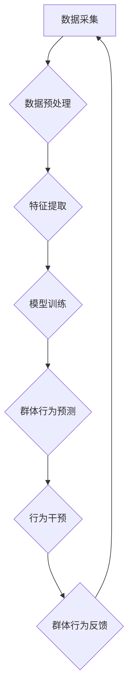

                 

## 欲望的社会化：AI驱动的群体动力学

> 关键词：人工智能、群体动力学、社会化、算法、网络效应、行为预测、数据驱动、伦理

## 1. 背景介绍

人类社会自古以来就充满了复杂的群体互动，从部落的组织结构到现代社会的网络社区，群体动力学一直是社会科学研究的热点。随着人工智能技术的飞速发展，AI开始深刻地影响着群体行为，并催生了新的群体动力学现象。

传统的群体动力学研究主要关注人类的社会心理、文化背景和认知机制等因素，而AI驱动的群体动力学则将算法、数据和计算模型引入到群体行为的分析和预测中。AI算法能够从海量数据中识别出群体行为的模式和趋势，并根据这些模式预测未来的群体行为。

## 2. 核心概念与联系

**2.1 核心概念**

* **群体动力学:** 研究群体行为的科学，包括群体形成、群体决策、群体冲突、群体领导等方面。
* **人工智能 (AI):**  模拟人类智能的计算机系统，包括机器学习、深度学习、自然语言处理等技术。
* **社会化:**  指个体在社会环境中学习、适应和融入的过程，包括价值观、信念、行为规范等方面的塑造。
* **网络效应:** 指网络平台或服务的价值随着用户数量的增加而增加的现象。

**2.2  AI驱动的群体动力学架构**



**2.3  联系**

AI驱动的群体动力学将人工智能技术应用于群体动力学的研究，通过数据分析和模型预测，揭示群体行为背后的规律，并实现对群体行为的干预和引导。

## 3. 核心算法原理 & 具体操作步骤

**3.1 算法原理概述**

AI驱动的群体动力学主要依赖于机器学习算法，例如：

* **聚类算法:** 将具有相似行为特征的个体分组，识别群体结构和内部差异。
* **分类算法:** 根据历史数据预测个体的未来行为，例如是否会参与某个活动、持有某个观点等。
* **推荐算法:** 基于个体的行为历史和群体特征，推荐相关信息或内容，影响个体的行为选择。

**3.2 算法步骤详解**

1. **数据采集:** 收集群体行为相关的数据，例如社交网络互动记录、在线论坛发言内容、投票结果等。
2. **数据预处理:** 清洗、转换和格式化数据，去除噪声和异常值，以便于算法训练。
3. **特征提取:** 从原始数据中提取有意义的特征，例如用户属性、行为模式、网络关系等。
4. **模型训练:** 使用机器学习算法对提取的特征进行训练，建立群体行为预测模型。
5. **模型评估:** 使用测试数据评估模型的预测精度和泛化能力。
6. **群体行为预测:** 将模型应用于新的数据，预测个体的未来行为和群体的整体趋势。

**3.3 算法优缺点**

* **优点:** 能够从海量数据中识别出群体行为的模式和趋势，提高预测精度，并为群体行为的干预提供依据。
* **缺点:** 依赖于高质量的数据，数据偏差会影响模型的预测结果；模型的解释性有限，难以理解算法背后的决策逻辑。

**3.4 算法应用领域**

* **社交媒体分析:** 预测用户行为、识别网络舆情、引导用户参与活动。
* **市场营销:** 针对不同群体进行个性化营销，提高广告效果。
* **公共安全:** 预警群体事件、识别潜在威胁。
* **政治选举:** 分析选民情绪、预测选举结果。

## 4. 数学模型和公式 & 详细讲解 & 举例说明

**4.1 数学模型构建**

群体行为可以抽象为一个复杂网络系统，其中每个个体都是一个节点，节点之间的连接代表着相互影响的关系。我们可以使用图论和网络分析方法来建模群体行为。

**4.2 公式推导过程**

* **节点度:**  表示节点连接的个数，反映个体的社会影响力。
* **聚类系数:**  表示节点邻居之间的连接程度，反映群体的凝聚力。
* **中心性:**  表示节点在网络中的重要性，反映个体的领导力。

这些指标可以用来量化群体结构和个体角色，并分析群体行为的演化趋势。

**4.3 案例分析与讲解**

例如，我们可以使用社交网络数据来分析用户的意见领袖群体。通过计算节点度、聚类系数和中心性等指标，可以识别出具有较高影响力的用户，并分析他们如何影响其他用户的观点和行为。

## 5. 项目实践：代码实例和详细解释说明

**5.1 开发环境搭建**

* Python 3.x
* Jupyter Notebook
* NetworkX 库
* Scikit-learn 库

**5.2 源代码详细实现**

```python
import networkx as nx
from sklearn.cluster import KMeans

# 加载社交网络数据
graph = nx.read_edgelist('social_network.txt')

# 计算节点度
degree_centrality = nx.degree_centrality(graph)

# 计算聚类系数
clustering_coefficient = nx.average_clustering(graph)

# 使用KMeans算法进行聚类
kmeans = KMeans(n_clusters=5)
features = [degree_centrality[node] for node in graph.nodes()]
kmeans.fit(features)
labels = kmeans.labels_

# 将聚类结果可视化
nx.draw(graph, with_labels=True, node_color=labels)
plt.show()
```

**5.3 代码解读与分析**

* 代码首先加载社交网络数据，并使用NetworkX库计算节点度和聚类系数。
* 然后使用Scikit-learn库的KMeans算法对节点进行聚类，并将聚类结果可视化。

**5.4 运行结果展示**

运行代码后，会生成一个网络图，其中节点的颜色代表不同的聚类类别。

## 6. 实际应用场景

**6.1 社交媒体营销**

* 识别意见领袖，进行精准营销推广。
* 分析用户兴趣和行为，定制个性化内容推荐。
* 预警负面舆情，及时进行危机公关。

**6.2 公共安全**

* 预警群体事件，例如示威游行、暴乱等。
* 识别潜在威胁，例如恐怖分子、犯罪团伙等。
* 辅助执法部门进行调查和取证。

**6.3 医疗保健**

* 分析患者群体特征，预测疾病流行趋势。
* 识别高风险患者，进行精准医疗干预。
* 辅助医生进行诊断和治疗决策。

**6.4 未来应用展望**

随着人工智能技术的不断发展，AI驱动的群体动力学将应用于更多领域，例如教育、金融、文化娱乐等。

## 7. 工具和资源推荐

**7.1 学习资源推荐**

* **书籍:**
    * 《群体心理学》
    * 《社会网络分析》
    * 《机器学习》
* **在线课程:**
    * Coursera: 人工智能
    * edX: 网络分析
* **开源工具:**
    * NetworkX
    * Scikit-learn

**7.2 开发工具推荐**

* Python
* Jupyter Notebook
* TensorFlow
* PyTorch

**7.3 相关论文推荐**

* "Social Network Analysis: Methods and Applications"
* "Machine Learning for Social Network Analysis"
* "Predicting Group Behavior with Machine Learning"

## 8. 总结：未来发展趋势与挑战

**8.1 研究成果总结**

AI驱动的群体动力学为理解和预测群体行为提供了新的视角和方法，取得了一定的研究成果。

**8.2 未来发展趋势**

* **模型复杂度提升:**  开发更复杂、更精准的群体行为预测模型。
* **跨领域融合:** 将AI驱动的群体动力学应用于更多领域，例如教育、金融、文化娱乐等。
* **解释性增强:**  提高模型的解释性，使预测结果更易理解和信任。

**8.3 面临的挑战**

* **数据质量:**  依赖于高质量的数据，数据偏差会影响模型的预测结果。
* **伦理问题:**  AI驱动的群体行为干预可能引发伦理争议，需要谨慎对待。
* **可解释性:**  模型的决策逻辑难以解释，需要开发更可解释的算法。

**8.4 研究展望**

未来，AI驱动的群体动力学将继续发展，为社会治理、公共安全、市场营销等领域提供更有效的解决方案。


## 9. 附录：常见问题与解答

**9.1 如何评估AI驱动的群体行为预测模型的精度？**

可以使用准确率、召回率、F1-score等指标来评估模型的精度。

**9.2 AI驱动的群体行为干预是否会侵犯个人隐私？**

AI驱动的群体行为干预需要谨慎对待，确保不侵犯个人隐私。

**9.3 如何提高AI驱动的群体行为预测模型的可解释性？**

可以使用可解释机器学习算法，或者结合专家知识进行模型解释。


作者：禅与计算机程序设计艺术 / Zen and the Art of Computer Programming 
<end_of_turn>

