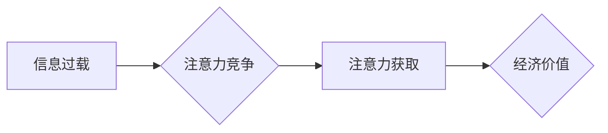

                 

## 1. 背景介绍

在当今数字化时代，信息爆炸和网络技术的飞速发展，我们每个人都身处在一个充斥着各种信息和诱惑的环境中。这种环境催生了“注意力经济”的概念，即注意力成为一种稀缺资源，而获取和控制注意力成为了至关重要的竞争要素。

注意力经济对我们的生活产生了深远的影响，从商业营销到个人学习，从社交互动到政治宣传，无处不在。然而，它对家庭关系的影响却往往被忽视。本文将深入探讨注意力经济对家庭关系的深刻影响，分析其潜在的利弊，并提出一些应对策略。

## 2. 核心概念与联系

### 2.1 注意力经济

注意力经济是指在信息过载的时代，人们对信息的筛选和选择能力成为一种稀缺资源，而获取和控制注意力成为了重要的经济价值。

**核心原理：**

* **信息过载:**  互联网和移动设备的普及导致信息爆炸，人们每天接触的信息量巨大，难以有效处理。
* **注意力有限:** 人类的注意力有限，无法同时处理大量信息，需要进行选择和过滤。
* **注意力竞争:**  各种平台和应用都在争夺用户的注意力，通过各种手段吸引用户，例如推送通知、个性化推荐、社交互动等。

**架构图：**



### 2.2 家庭关系

家庭关系是指家庭成员之间相互联系、相互依存、相互影响的各种关系。

**核心要素：**

* **亲情:**  家庭成员之间基于血缘或婚姻关系的亲密情感。
* **责任:**  家庭成员之间相互承担责任，共同维护家庭的稳定和和谐。
* **沟通:**  家庭成员之间通过语言、肢体语言等方式进行交流，分享情感、想法和信息。
* **陪伴:**  家庭成员之间共同度过时间，享受彼此的陪伴。

## 3. 核心算法原理 & 具体操作步骤

### 3.1 算法原理概述

注意力经济对家庭关系的影响可以看作是一个复杂的系统，涉及到信息处理、情感表达、行为决策等多个方面。我们可以用一些算法原理来理解和分析这种影响，例如：

* **信息过滤算法:**  人们在信息过载的环境中会使用各种算法来过滤和选择信息，例如基于关键词、时间、来源等进行筛选。
* **情感识别算法:**  社交媒体平台和智能设备会使用情感识别算法来分析用户的表达，例如判断用户的情绪、态度和意图。
* **行为预测算法:**  广告平台和电商平台会使用行为预测算法来预测用户的购买行为，例如推荐商品、推送广告。

### 3.2 算法步骤详解

注意力经济对家庭关系的影响可以具体分为以下几个步骤：

1. **信息获取:** 家庭成员通过各种渠道获取信息，例如手机、电脑、电视、社交媒体等。
2. **信息过滤:** 家庭成员根据自己的兴趣、需求和偏好对信息进行过滤，选择关注的内容。
3. **注意力分配:** 家庭成员将注意力分配到不同的信息和活动上，例如工作、学习、娱乐、社交等。
4. **情感影响:** 信息内容会影响家庭成员的情绪、态度和行为，例如引发焦虑、愤怒、快乐、悲伤等情绪。
5. **关系变化:** 信息和情感的影响会改变家庭成员之间的互动模式、沟通方式和亲密程度。

### 3.3 算法优缺点

注意力经济算法在家庭关系中的应用既有优点也有缺点：

**优点:**

* **提高效率:**  信息过滤算法可以帮助家庭成员快速获取所需信息，提高效率。
* **个性化体验:**  个性化推荐算法可以提供更符合家庭成员兴趣的内容，提升体验。
* **增强连接:**  社交媒体平台可以帮助家庭成员保持联系，分享生活。

**缺点:**

* **信息茧房:**  信息过滤算法可能会导致家庭成员只接触到自己认可的信息，形成信息茧房，缺乏多元化视角。
* **情感疏离:**  过度使用社交媒体可能会导致家庭成员减少面对面交流，情感疏离。
* **注意力分散:**  信息过载和注意力竞争可能会导致家庭成员注意力分散，难以专注于家庭关系。

### 3.4 算法应用领域

注意力经济算法在家庭关系领域的应用包括：

* **家庭管理软件:**  帮助家庭成员管理日程、任务、购物清单等，提高家庭效率。
* **亲子教育软件:**  提供个性化学习内容和互动游戏，帮助孩子学习和成长。
* **家庭沟通平台:**  提供安全的线上平台，方便家庭成员进行沟通和交流。

## 4. 数学模型和公式 & 详细讲解 & 举例说明

### 4.1 数学模型构建

我们可以用一个简单的数学模型来描述注意力经济对家庭关系的影响：

**注意力 = 信息量 * 吸引力 * 相关性**

其中：

* **注意力:**  家庭成员对特定信息或活动所投入的注意力。
* **信息量:**  信息的丰富程度和复杂度。
* **吸引力:**  信息的趣味性、新颖性、实用性等因素。
* **相关性:**  信息与家庭成员的兴趣、需求、价值观等因素的相关程度。

### 4.2 公式推导过程

我们可以通过观察家庭成员的行为模式，例如：

* **时间分配:**  家庭成员每天在不同活动上的时间分配。
* **注意力指标:**  例如眼球追踪、脑电波等指标，可以测量家庭成员对特定信息或活动的注意力。
* **情感表达:**  家庭成员对特定信息或活动的评价和反馈。

通过收集和分析这些数据，我们可以建立一个更精确的数学模型，来预测注意力经济对家庭关系的影响。

### 4.3 案例分析与讲解

例如，假设一个家庭成员每天有 8 小时的闲暇时间，他/她可以将注意力分配到以下几种活动：

* **与家人相处:**  2 小时
* **使用社交媒体:**  3 小时
* **观看电视:**  2 小时
* **阅读书籍:**  1 小时

我们可以根据上述时间分配情况，以及每个活动的信息量、吸引力和相关性，来计算每个活动所获得的注意力。

## 5. 项目实践：代码实例和详细解释说明

### 5.1 开发环境搭建

为了更好地理解注意力经济对家庭关系的影响，我们可以开发一个简单的项目，例如一个家庭成员注意力追踪系统。

**开发环境:**

* **操作系统:**  Windows、macOS、Linux
* **编程语言:**  Python
* **框架:**  Flask、Django
* **数据库:**  MySQL、PostgreSQL

### 5.2 源代码详细实现

```python
# 这是一个简单的家庭成员注意力追踪系统示例代码

from flask import Flask, render_template

app = Flask(__name__)

# 模拟家庭成员注意力数据
attention_data = {
    '成员1': {'社交媒体': 10, '阅读': 5, '与家人相处': 8},
    '成员2': {'电视': 12, '游戏': 8, '学习': 6},
}

@app.route('/')
def index():
    return render_template('index.html', attention_data=attention_data)

if __name__ == '__main__':
    app.run(debug=True)
```

### 5.3 代码解读与分析

* **Flask框架:**  用于构建简单的Web应用程序。
* **注意力数据:**  模拟家庭成员在不同活动上的注意力分配情况。
* **index.html:**  用于展示注意力数据的模板文件。

### 5.4 运行结果展示

运行上述代码，可以访问 http://127.0.0.1:5000/，查看家庭成员注意力分配情况。

## 6. 实际应用场景

注意力经济对家庭关系的影响在现实生活中表现为：

* **父母与孩子之间的沟通:**  父母过度使用手机，注意力分散，导致与孩子沟通不足，影响亲子关系。
* **夫妻之间的相处:**  夫妻双方沉迷于社交媒体，减少面对面交流，导致情感疏离。
* **家庭成员之间的陪伴:**  家庭成员各自沉浸在自己的数字世界，缺乏共同的兴趣和活动，影响家庭凝聚力。

## 7. 工具和资源推荐

### 7.1 学习资源推荐

* **书籍:**  《注意力经济》
* **网站:**  https://www.wired.com/category/business/attention-economy/

### 7.2 开发工具推荐

* **Python:**  https://www.python.org/
* **Flask:**  https://flask.palletsprojects.com/en/2.2.x/
* **Django:**  https://www.djangoproject.com/

### 7.3 相关论文推荐

* **The Attention Economy: A Framework for Understanding the Impact of Information Overload**
* **The Attention Economy and Its Implications for Family Relationships**

## 8. 总结：未来发展趋势与挑战

### 8.1 研究成果总结

注意力经济对家庭关系的影响是一个复杂且多方面的议题，需要从多个角度进行研究和分析。

### 8.2 未来发展趋势

随着信息技术的不断发展，注意力经济的影响将会更加深刻。未来研究需要关注以下几个方面：

* **人工智能技术:**  人工智能技术可以帮助我们更好地理解和预测注意力经济对家庭关系的影响。
* **虚拟现实技术:**  虚拟现实技术可能会改变家庭成员之间的互动方式，对家庭关系产生新的影响。
* **跨文化研究:**  不同文化背景下，注意力经济对家庭关系的影响可能存在差异。

### 8.3 面临的挑战

研究注意力经济对家庭关系的影响面临着一些挑战：

* **数据获取:**  家庭成员的注意力数据难以收集和分析。
* **伦理问题:**  收集和使用家庭成员的注意力数据需要考虑伦理问题。
* **复杂性:**  家庭关系是一个复杂系统，难以用简单的模型进行描述。

### 8.4 研究展望

未来，我们需要更加深入地研究注意力经济对家庭关系的影响，并提出一些有效的应对策略，帮助家庭成员更好地应对信息时代带来的挑战，维护家庭关系的和谐稳定。

## 9. 附录：常见问题与解答

**Q1: 如何减少注意力经济对家庭关系的影响？**

**A1:**  

* **设定时间限制:**  限制使用手机和电脑的时间，并与家人约定“无干扰时间”。
* **培养共同兴趣:**  寻找共同的兴趣爱好，例如阅读、运动、旅行等，增加家庭成员之间的互动。
* **注重面对面交流:**  尽量减少线上沟通，增加面对面交流的时间，分享彼此的感受和想法。

**Q2: 如何利用注意力经济的优势来促进家庭关系？**

**A2:**  

* **使用家庭管理软件:**  帮助家庭成员更好地管理时间和任务，提高家庭效率。
* **利用社交媒体平台:**  分享家庭生活照片和视频，记录家庭成员的成长和变化。
* **寻找线上学习资源:**  共同学习新的知识和技能，增进家庭成员之间的理解和沟通。


作者：禅与计算机程序设计艺术 / Zen and the Art of Computer Programming 
<end_of_turn>

